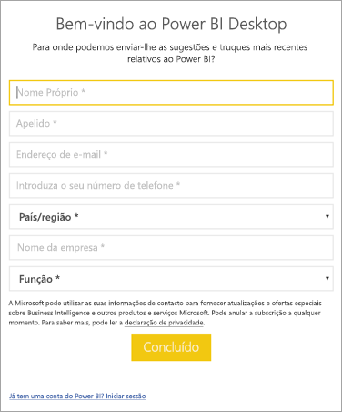

# <a name="administrators-manage-the-power-bi-desktop-sign-in-form"></a>Administradores: Gerir o formulário de início de sessão do Power BI Desktop
Na primeira vez que o Power BI Desktop é iniciado, é apresentado um formulário de início de sessão. Pode preencher as informações ou iniciar sessão no Power BI para continuar. Os administradores fazem a gestão deste formulário através de uma chave do registo. 



Os administradores utilizam a seguinte chave do registo para desativar o formulário de início de sessão. Isto também pode ser enviado para uma organização inteira através de políticas globais.

```
Key: HKEY_CURRENT_USER\SOFTWARE\Policies\Microsoft\Microsoft Power BI Desktop
valueName: ShowLeadGenDialog
```
Também pode experimentar a seguinte chave, que tem sido bem-sucedida para alguns clientes com base nas respetivas configurações:

```
Key: HKEY_CURRENT_USER\SOFTWARE\Microsoft\Microsoft Power BI Desktop
valueName: ShowLeadGenDialog
```

Um valor de 0 desativa a caixa de diálogo.


Mais perguntas? [Experimente perguntar à Comunidade do Power BI](https://community.powerbi.com/)

