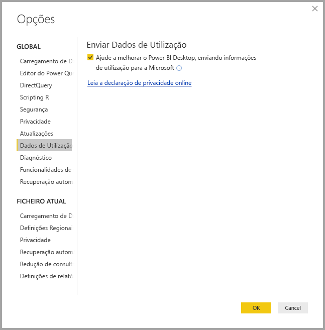
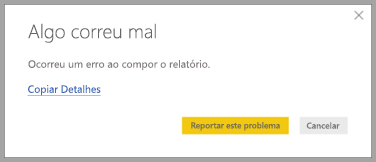

# Privacidade no Power BI Desktop

Na Microsoft, empenhamo-nos na proteção da sua privacidade, enquanto fornecemos produtos que lhe dão o desempenho, capacidade e conveniência que pretende. A Microsoft recolhe determinadas informações sobre a sua utilização do Power BI Desktop para ajudar a diagnosticar problemas e melhorar o produto. Para obter mais detalhes sobre as práticas de privacidade da Microsoft, consulte a Declaração de Privacidade da Microsoft. Esta declaração aplica-se aos dados que recolhemos quando utiliza o **Power BI Desktop**.
 
As informações que recolhemos de utilizadores do **Power BI Desktop** podem incluir dados sobre o sistema operativo, informações do Power BI Desktop e versões do Internet Explorer. 
 
Se não quiser participar nesta recolha de dados, pode aceder a **Ficheiro > Opções e Definições > Opções** e, no separador **Dados de Utilização**, desselecionar a caixa de verificação **Enviar Dados de Utilização**, conforme indicado na seguinte imagem.

## Enviar informações adicionais

Se encontrar falhas ou outros problemas, pode optar por enviar relatórios de erro e informações adicionais que podem ajudar-nos a resolver o problema numa versão futura. Também recolhemos informações sobre o estado do ficheiro do **Power BI Desktop** no qual estava a trabalhar, tais como a localização do documento, as funcionalidades de pré-visualização ativadas e o modo de armazenamento. Estas informações podem incluir capturas de ecrã, mensagens de erro e fórmulas do modelo. Estes itens podem incluir os conteúdos de ficheiros que estava a utilizar quando o erro ocorreu, pelo que deve analisá-los antes de os enviar. Lembramos que pode escolher que informações são enviadas à Microsoft.  
 
Se não quer enviar estas informações, pode clicar em **Fechar** quando ocorrer um erro ou optar por não enviar dados de utilização, conforme explicado anteriormente.

