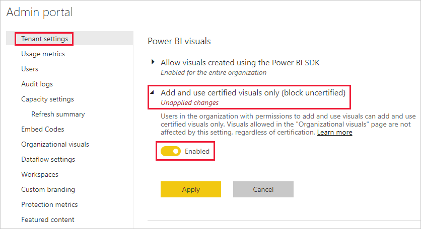
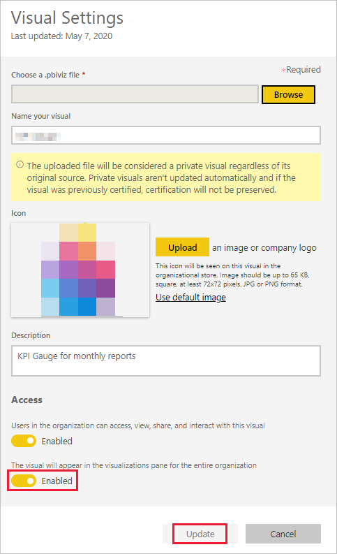

# Manage Power BI visuals admin settings (Gerir as definições de administrador de elementos visuais do Power BI)

Como administrador do Power BI da sua organização, pode controlar os tipos de elementos visuais do Power BI aos quais os utilizadores podem aceder na organização.

Para gerir os elementos visuais do Power BI, tem de ser Administrador Global no Office 365 ou ter atribuída a função de Administrador de serviço do Power BI. Para obter mais informações sobre a função de administrador do serviço Power BI, veja [Noções básicas sobre a função de administrador do Power BI](service-admin-role.md).

## Aceder ao portal de administração

Para ativar as definições descritas no artigo, terá de aceder ao portal de administração.

1. No serviço Power BI, selecione **Definições**.

2. No menu pendente de definições, selecione **Portal de administração**.

    

## Definições de inquilino dos elementos visuais do Power BI

Como administrador do Power BI da sua organização, pode controlar os tipos de elementos visuais do Power BI aos quais os utilizadores podem aceder na organização.

As definições da IU do inquilino só afetam o serviço Power BI. Se quiser que estas definições tenham efeito no Power BI Desktop, utilize políticas de grupo. No final de cada secção, há uma tabela que fornece detalhes para ativar a definição no Power BI Desktop.

>[!NOTE]
>As alterações às definições do inquilino não afetam os elementos visuais do Power BI listados no separador [Elementos visuais da organização](#organizational-visuals).

### Elementos visuais do AppSource ou de um ficheiro

Faça a gestão do acesso da organização relativamente ao seguinte tipo de elementos visuais do Power BI:

* Elementos visuais criados por programadores e guardados como um ficheiro .pbiviz.

* Elementos visuais disponíveis no AppSource.

Siga as instruções abaixo para permitir aos utilizadores da sua organização carregar ficheiros .pbiviz e adicionar elementos visuais do AppSource aos respetivos relatórios e dashboards.

1. Expanda as definições **Permitir elementos visuais criados com o Power BI SDK**.

2. Clique em **Ativadas**.

3. Escolha quem pode carregar elementos visuais do .pbiviz e do AppSource:

    * Selecione a opção **Toda a organização** para permitir que todos na sua organização possam carregar ficheiros .pbiviz e adicionar elementos visuais do AppSource.

     * Selecione a opção **Grupos de segurança específicos** para gerir o carregamento de ficheiros .pbiviz e adicionar elementos visuais do AppSource através de grupos de segurança. Adicione os grupos de segurança que pretende gerir à barra de texto *Introduzir grupos de segurança*. Os grupos de segurança que especificar são excluídos por predefinição. Se quiser incluí-los e excluir todos os outros grupos de segurança da organização, selecione a opção **Exceto grupos de segurança específicos**.

4. Clique em **Aplicar**.

As alterações da IU às definições do inquilino aplicam-se apenas ao serviço Power BI. Para permitir aos utilizadores da sua organização carregar ficheiros .pbiviz e adicionar elementos visuais do AppSource ao respetivo painel de visualização no Power BI Desktop, utilize a [Política de Grupo do Azure AD](https://docs.microsoft.com/azure/active-directory-domain-services/manage-group-policy).

|Chave  |Nome do valor  |Valor  |
|---------|---------|---------|
|Software\Policies\Microsoft\Power BI Desktop\    |EnableCustomVisuals    |0 – Desativar  1 – Ativar (predefinição)         |
|

### Elementos visuais do Power BI certificados

Quando esta definição estiver ativada, apenas os [elementos visuais do Power BI certificados](../developer/visuals/power-bi-custom-visuals-certified.md) serão apresentados nos relatórios e dashboards da sua organização. Os elementos visuais do Power BI do AppSource ou de ficheiros (que não sejam certificados) devolverão uma mensagem de erro.

1. No portal de administração, selecione **Adicionar e utilizar apenas elementos visuais certificados**.

2. Clique em **Ativadas**.

3. Clique em **Aplicar**.

As alterações da IU às definições do inquilino aplicam-se apenas ao serviço Power BI. Para gerir a definição do inquilino dos elementos visuais certificados no Power BI Desktop, utilize a [Política de Grupo do Azure Active Directory](https://docs.microsoft.com/azure/active-directory-domain-services/manage-group-policy).

|Chave  |Nome do valor  |Valor  |
|---------|---------|---------|
|Software\Policies\Microsoft\Power BI Desktop\    |EnableUncertifiedVisuals    |0 – Desativar  1 – Ativar (predefinição)         |
|

## Elementos visuais da organização

Como administrador do Power BI, pode gerir a lista de elementos visuais do Power BI disponível na [loja organizacional](../developer/visuals/power-bi-custom-visuals.md#organizational-store) da sua organização. O separador **Elementos visuais da organização** no *Portal de administração* permite-lhe adicionar e remover elementos visuais. Além disso, permite-lhe decidir que elementos visuais serão apresentados automaticamente no painel de visualização dos utilizadores da sua organização. Pode adicionar à lista qualquer tipo de elemento visual, incluindo elementos visuais não certificados e de ficheiros .pbiviz, mesmo que contradigam as [definições do inquilino](#power-bi-visuals-tenant-settings) da sua organização.

As definições dos elementos visuais da organização são automaticamente implementadas no Power BI Desktop.

>[!NOTE]
>Os elementos visuais da organização não são suportados no Power BI Report Server.

### Adicionar um elemento visual a partir de um ficheiro

Utilize este método para adicionar um novo elemento visual do Power BI a partir de um ficheiro .pbiviz.

> [!WARNING]
> Um elemento visual do Power BI carregado a partir de um ficheiro pode conter código com riscos de privacidade ou de segurança. Certifique-se de que confia no autor e na origem do elemento visual antes de implementá-lo no repositório da organização.

1. Selecione **Adicionar elemento visual** > **A partir de um ficheiro**.

    

2. Preencha os seguintes campos:

    * **Escolher um ficheiro .pbiviz** – selecione um elemento visual para carregar.

    * **Nomear elemento visual** – atribua um título curto ao elemento visual para que os autores de relatórios compreendam facilmente o que faz.

    * **Ícone** – carregue um ficheiro de ícone a ser apresentado no painel de visualização.

    * **Descrição** – forneça uma breve descrição do elemento visual para dar mais contexto e informação ao utilizador.

    * **Acesso** – esta secção tem duas opções:
    
        * Selecione se os utilizadores da sua organização podem aceder a este elemento visual. Esta definição está ativada por predefinição.

        * Selecione se este elemento visual será apresentado no painel de visualização dos utilizadores na sua organização. Esta definição está desativada por predefinição. Para obter mais informações, veja [Adicionar um elemento visual ao painel de visualização](#add-a-visual-to-the-visualization-pane).

    

3. Selecione **Adicionar** para iniciar o pedido de carregamento. Após ser carregado, o elemento visual será apresentado na lista de elementos visuais da organização.

### Adicionar um elemento visual do AppSource (pré-visualização)

Utilize este método para adicionar um novo elemento visual do Power BI a partir do AppSource.

Os elementos visuais do Power BI no AppSource são atualizados automaticamente. Os utilizadores na sua organização terão sempre a versão mais recente do elemento visual.

1. Selecione **Adicionar elemento visual** > **A partir do AppSource**.

    

2. Na janela **Elementos visuais do Power BI**, procure o elemento visual do AppSource que pretende adicionar e clique em **Adicionar**. Após ser carregado, o elemento visual será apresentado na lista de elementos visuais da organização.

### Adicionar um elemento visual ao painel de visualização

Pode escolher elementos visuais a partir da página de elementos visuais da organização para serem apresentados automaticamente no painel de visualização de todos os utilizadores da sua organização.

1. Na linha do elemento visual que pretende adicionar, clique em **definições**.

    painel-organizacional

2. Ative a definição do painel de visualização e clique em **Atualizar**.

    

### Eliminar um elemento visual carregado a partir de um ficheiro

Selecione o ícone de caixote do lixo para eliminar permanentemente um elemento visual no repositório.

> [!IMPORTANT]
> A eliminação é irreversível. Depois de eliminado, o elemento visual deixa imediatamente de ser composto nos relatórios existentes. Mesmo que carregue o mesmo elemento visual novamente, este não substitui o que foi eliminado. No entanto, os utilizadores podem importar novamente o novo elemento visual e substituir a instância presente nos seus relatórios.

### Desativar elementos visuais .pbiviz

Pode fazer com que os elementos visuais carregados a partir de ficheiros .pbiviz deixem de estar disponíveis na [loja organizacional](../developer/visuals/power-bi-custom-visuals.md#organizational-store), mas continuem na lista de elementos visuais da organização.

1. Na linha do elemento visual .pbiviz que pretende desativar, clique em **definições**.

2. Na secção **Acesso**, desative a definição: *Os utilizadores na organização podem aceder, ver, partilhar e interagir com este elemento visual*.

Depois de desativar o elemento visual .pbiviz, este não será composto nos relatórios existentes e será apresentada a seguinte mensagem de erro:

*Este elemento visual personalizado já não está disponível. Contacte o seu administrador para obter detalhes.*

>[!NOTE]
>Os elementos visuais .pbiviz adicionados aos marcadores continuam a funcionar depois de terem sido desativados.

### Atualizar um elemento visual

Os elementos visuais do AppSource são atualizados automaticamente. Quando uma nova versão estiver disponível no AppSource, esta substituirá uma versão mais antiga implementada através da lista de elementos visuais da organização.

Para atualizar um elemento visual .pbiviz, siga estes passos para substituí-lo.

1. Na linha do elemento visual que pretende adicionar, clique em **definições**.

2. Clique em **Procurar** e selecione o ficheiro .pbiviz pelo qual pretende substituir o elemento visual atual.

3. Clique em **Atualizar**.

## Próximos passos

> [!div class="nextstepaction"]
>[Administrar o Power BI no portal de administração](service-admin-portal.md)

> [!div class="nextstepaction"]
>[Visuals in Power BI](../developer/visuals/power-bi-custom-visuals.md) (Elementos visuais no Power BI)

> [!div class="nextstepaction"]
>[Elementos visuais da organização no Power BI](../developer/visuals/power-bi-custom-visuals-organization.md)