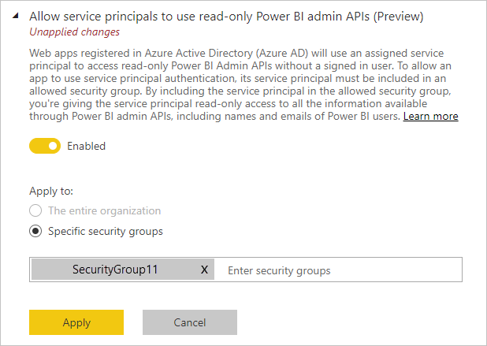

# Ativar a autenticação do principal de serviço para as APIs de administração só de leitura (pré-visualização)

O principal de serviço é um método de autenticação que pode ser utilizado para permitir que uma aplicação do Azure Active Directory (AAD) aceda aos conteúdos e às APIs do serviço Power BI.
Quando cria uma aplicação do AAD, é criado um [objeto do principal de serviço](https://docs.microsoft.com/azure/active-directory/develop/app-objects-and-service-principals#service-principal-object). O objeto do principal de serviço, também conhecido como principal de serviço, permite que o AAD autentifique a aplicação. Uma vez autenticada, a aplicação pode aceder aos recursos do inquilino do AAD.

## Método

Para ativar a autenticação do principal de serviço para as APIs só de leitura do Power BI, siga estes passos:

1. [Crie uma aplicação do AAD](https://docs.microsoft.com/azure/active-directory/develop/howto-create-service-principal-portal). Se já tiver uma aplicação do AAD, poderá ignorar este passo. Anote o ID da aplicação para utilizar em passos posteriores. 
2. Crie um novo **Grupo de Segurança** no Azure Active Directory. [Leia mais sobre como criar um grupo básico e adicionar membros com o Azure Active Directory](https://docs.microsoft.com/azure/active-directory/fundamentals/active-directory-groups-create-azure-portal). Se já tiver um grupo de segurança, poderá ignorar este passo.
    Confirme que seleciona **Segurança** como o Tipo de grupo.

    

3. Adicione o ID da aplicação como membro do grupo de segurança que criou. Para tal:
    1. Aceda ao **portal do Azure > Azure Active Directory > Grupos** e escolha o grupo de segurança criado no Passo 2.
    1. Selecione **Adicionar membros**.
    Nota: confirme que a aplicação que utiliza não tem nenhuma função de administrador do Power BI definida no portal do Azure. Para verificar isto: 
       * Inicie sessão no **portal do Azure** como Administrador Global, Administrador de Aplicações ou Administrador de Aplicações de Cloud. 
        * Selecione **Azure Active Directory** e, em seguida, **Aplicações empresariais**. 
        * Selecione a aplicação à qual quer conceder acesso ao Power BI. 
        * Selecione **Permissões**. Confirme que não existem permissões que exijam o consentimento do administrador do Power BI definidas nesta aplicação. Veja [Gerir o consentimento a aplicações e avaliar os pedidos de consentimento](https://docs.microsoft.com/azure/active-directory/manage-apps/manage-consent-requests) para obter mais informações. 
4. Ative as definições de administração do serviço Power BI. Para efetuar este procedimento:
    1. Inicie sessão no portal de administração do Power BI. Tem de ser administrador do Power BI para ver a página de definições de inquilino.
    1. Em **Definições de programador**, verá **Permitir que os principais de serviço utilizem as APIs de administração só de leitura do Power BI (pré-visualização)** . Mova o botão para Ativado e, em seguida, selecione o botão de opção **Grupos de segurança específicos** e adicione o grupo de segurança que criou no Passo 2 no campo de texto que aparece abaixo, conforme mostrado na imagem abaixo.

        

 5. Comece a utilizar as APIs de administração só de leitura. Veja a lista de APIs suportadas abaixo.

    >[!IMPORTANT]
    >Assim que ativar o principal de serviço a ser utilizado com o Power BI, as permissões do AAD da aplicação deixarão de ter efeito. Em seguida, as permissões da aplicação serão geridas através do portal de administração do Power BI.

## Considerações e limitações
* Não pode iniciar sessão no portal do Power BI com o principal de serviço.
* São necessários direitos de administrador do Power BI para ativar o principal de serviço nas definições de programador no portal de administração do Power BI.
* Atualmente, o principal de serviço suporta as APIs seguintes:
    * [GetGroupsAsAdmin](https://docs.microsoft.com/rest/api/power-bi/admin/groups_getgroupsasadmin) com $expand para dashboards, conjuntos de dados, relatórios e fluxos de dados 
    * [GetDashboardsAsAdmin](https://docs.microsoft.com/rest/api/power-bi/admin/dashboards_getdashboardsasadmin) com mosaicos $expand
    * [GetDatasourcesAsAdmin](https://docs.microsoft.com/rest/api/power-bi/admin/datasets_getdatasourcesasadmin) 
    * [GetDatasetToDataflowsLinksAsAdmin](https://docs.microsoft.com/rest/api/power-bi/admin/datasets_getdatasettodataflowslinksingroupasadmin)
    * [GetDataflowDatasourcesAsAdmin](https://docs.microsoft.com/rest/api/power-bi/admin/dataflows_getdataflowdatasourcesasadmin) 
    * [GetDataflowUpstreamDataflowsAsAdmin](https://docs.microsoft.com/rest/api/power-bi/admin/dataflows_getupstreamdataflowsingroupasadmin) 
    * [GetCapacitiesAsAdmin](https://docs.microsoft.com/rest/api/power-bi/admin/getcapacitiesasadmin)
    * [GetActivityLog](https://docs.microsoft.com/rest/api/power-bi/admin/getactivityevents)
    * [GetModifiedWorkspaces](https://docs.microsoft.com/rest/api/power-bi/admin/workspaceinfo_getmodifiedworkspaces)
    * [WorkspaceGetInfo](https://docs.microsoft.com/rest/api/power-bi/admin/workspaceinfo_postworkspaceinfo)
    * [WorkspaceScanStatus](https://docs.microsoft.com/rest/api/power-bi/admin/workspaceinfo_getscanstatus)
    * [WorkspaceScanResult](https://docs.microsoft.com/rest/api/power-bi/admin/workspaceinfo_getscanresult)
