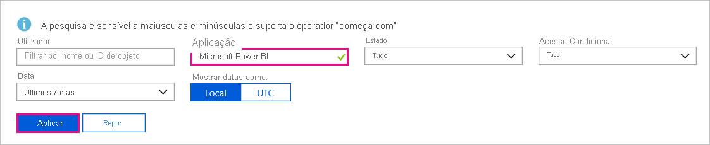

# Encontrar utilizadores do Power BI que iniciaram sessão

Se for um administrador da sua organização e quiser ver quem iniciou sessão no Power BI, utilize os [relatórios de acesso e utilização do Azure Active Directory](/azure/active-directory/reports-monitoring/concept-sign-ins).

> [!NOTE]
> O relatório de **Inícios de sessão** fornece informações úteis, mas não identifica o tipo de licença de cada utilizador. Utilize o centro de administração do Microsoft 365 para ver as licenças.

## Requirements

Qualquer utilizador pode ver um relatório dos seus próprios inícios de sessão. Para ver um relatório de todos os utilizadores, tem de ter uma das seguintes funções: Administrador Global, Administrador de Segurança, Leitor de Segurança, Leitor Global ou Leitor de Relatórios.

## Utilize o centro de administração do Azure Active Directory para ver os inícios de sessão

Para ver a atividade de início de sessão, siga estes passos.

1. Inicie sessão no [centro de administração do Azure Active Directory](https://aad.portal.azure.com)e, em seguida, selecione **Azure Active Directory** no menu do portal.

1. No menu de recursos, selecione **Monitorização** > **de Inícios de Sessão**.
   
    

1. Por predefinição, são apresentados todos os inícios de sessão das últimas 24 horas de todos os utilizadores e todas as aplicações. Para selecionar um período de tempo diferente, selecione **Data** no painel de trabalho e escolha um dos intervalos de tempo disponíveis. Somente as informações dos últimos sete dias estão disponíveis. Para ver apenas os inícios de sessão no Power BI, adicione filtros. Selecione **Adicionar filtro** > escolha **Aplicação** como o filtro pelo qual filtrar e selecione **Aplicar**. Selecione **A aplicação começa com** na parte superior do painel de trabalho e introduza o nome da aplicação. Selecione **Aplicar**.

    O **Microsoft Power BI** filtra atividade de início de sessão relacionada com o serviço. O **Power BI Gateway** filtra atividade de início de sessão específica do gateway de dados no local.
   
    

## Exportar os dados

Pode [transferir um relatório de início de sessão](/azure/active-directory/reports-monitoring/quickstart-download-sign-in-report) num de dois formatos: um ficheiro .CSV ou um ficheiro .JSON.

1. Na barra de comandos do relatório **Inícios de sessão**, selecione **Transferir** e, em seguida, selecione uma das seguintes opções:

   * **CSV** para transferir um ficheiro .CSV com os dados atualmente filtrados.

   * **JSON** para transferir um ficheiro .JSON com os dados atualmente filtrados.

2. Escreva o nome de um ficheiro e, em seguida, selecione **Transferir**.

## Retenção de dados

Os dados relacionados com os inícios de sessão ficam disponíveis durante sete dias, exceto se a sua organização tiver uma licença do Azure AD Premium. Se estiver a utilizar o Azure AD Premium P1 ou Azure AD Premium P2, pode ver os dados dos últimos 30 dias. Para obter mais informações, veja [Políticas de retenção de relatórios do Azure Active Directory](/azure/active-directory/reports-monitoring/reference-reports-data-retention).

## Próximos passos

[Auditar a atividade do utilizador](service-admin-auditing.md)

Mais perguntas? [Experimente perguntar à Comunidade do Power BI](https://community.powerbi.com/)