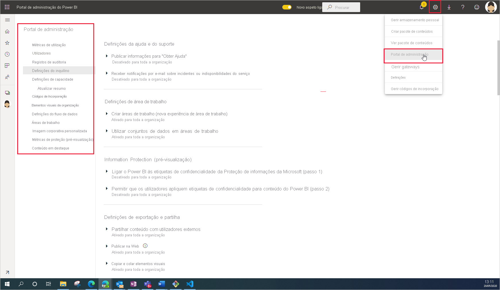

# O que é a administração do Power BI

A administração do Power BI é a gestão das definições em toda a organização que controlam a forma como o Power BI funciona. Os utilizadores a quem são atribuídas funções de administrador configuram, monitorizam e aprovisionam recursos organizacionais. Este artigo fornece uma descrição geral das funções, tarefas e ferramentas da administração para o ajudar a começar.

## Funções de administrador relacionadas com o Power BI

Existem várias funções que trabalham em conjunto para administrar o Power BI na sua organização. A maioria das funções de administrador é atribuída no centro de administração do Microsoft 365 ou com o PowerShell. As funções de administrador Capacidade do Power BI Premium e Capacidade do Power BI Embedded são atribuídas quando a capacidade é criada. Para saber mais sobre cada uma das funções de administrador, consulte [About admin roles](/microsoft-365/admin/add-users/about-admin-roles) (Sobre as funções de administrador). Para saber como atribuir funções de administrador, consulte [Assign admin roles](/microsoft-365/admin/add-users/assign-admin-roles) (Atribuir funções de administrador).

| **Tipo de administrator** | **Âmbito administrativo** | **Tarefas do Power BI** |
| --- | --- | --- |
| Administrador global | Microsoft 365 | Tem acesso ilimitado a todas as funcionalidades de gestão da organização |
| | | Atribui funções a outros utilizadores |
| Administrador de faturação | Microsoft 365 | Gerir subscrições |
| | | Comprar licenças |
| Administrador de licenças | Microsoft 365 | Atribuir ou remover licenças de utilizadores |
| Administrador de utilizadores | Microsoft 365 | Criar e gerir utilizadores e grupos |
| | | Repor palavras-passe do utilizador |
| Administração do Power BI | Serviço Power BI | Acesso total às tarefas de gestão do Power BI|
| | | Ativar e desativar funcionalidades do Power BI |
| | | Relatório sobre a utilização e o desempenho |
| | | Rever e gerir auditorias |
| Administrador de Capacidade do Power BI Premium | Uma capacidade Premium única | Atribuir áreas de trabalho à capacidade|
| | | Gerir a permissão de acesso dos utilizadores à capacidade |
| | | Gerir cargas de trabalho para configurar a utilização da memória |
| | | Reiniciar a capacidade |
| Administrador de Capacidade do Power BI Embedded | Uma capacidade Embedded única | Atribuir áreas de trabalho à capacidade|
| | | Gerir a permissão de acesso dos utilizadores à capacidade |
| | | Gerir cargas de trabalho para configurar a utilização da memória |
| | | Reiniciar a capacidade |

## Tarefas e ferramentas administrativas

Os administradores do Power BI trabalham maioritariamente no portal de administração do Power BI. No entanto, devem estar familiarizados com ferramentas e centros de administração relacionados. Observe a tabela acima para determinar que função é necessária para realizar tarefas com as ferramentas listadas aqui.

| **Ferramenta** | **Tarefas comuns** |
| --- | --- |
| [Portal de administração do Power BI](https://app.powerbi.com/admin-portal) | Adquirir e trabalhar com capacidade Premium |
| | Garantir a qualidade do serviço |
| | Gerir áreas de trabalho |
| | Publicar elementos visuais do Power BI |
| | Validar códigos que servem para incorporar o Power BI noutras aplicações |
| | Resolver problemas de acesso a dados e outros problemas |
| [Centro de administração do Microsoft 365](https://admin.microsoft.com) | Gerir utilizadores e grupos |
| | Comprar e atribuir licenças |
| | Impedir que os utilizadores acedam ao Power BI |
| [Centro de Conformidade e Segurança do Microsoft 365](https://protection.office.com) | Rever e gerir auditorias |
| | Classificação e controlo de dados |
| | Políticas de prevenção de perda de dados |
| | Governação de informações |
| [Azure Active Directory no portal do Azure](https://aad.portal.azure.com) | Configurar o acesso condicional a recursos do Power BI |
| | Aprovisionar capacidade do Power BI Embedded |
| [Cmdlets do PowerShell](/powershell/power-bi/overview) | Gerir áreas de trabalho e outros aspetos do Power BI através de scripts |
| [SDK e APIs Administrativas](service-admin-reference.md) | Criar ferramentas de administração personalizadas. Por exemplo, o Power BI Desktop pode utilizar estas APIs para criar relatórios com base nos dados relacionados com a administração. |

## Próximos passos

Agora que sabe as noções básicas da administração do Power BI, consulte estes artigos para saber mais:

- [Utilizar o portal de administração do Power BI](service-admin-portal.md)
- [Orientações sobre as definições de inquilino](../guidance/admin-tenant-settings.md)
- [Utilizar cmdlets do PowerShell](/powershell/power-bi/overview)
- [FAQ de administração do Power BI](service-admin-faq.md)
- [Licenciamento do serviço Power BI para os utilizadores na sua organização](service-admin-licensing-organization.md)
- Perguntas? [Experimente perguntar à Comunidade do Power BI](https://community.powerbi.com/)
- Sugestões? [Contribuir com ideias para melhorar o Power BI](https://ideas.powerbi.com/)