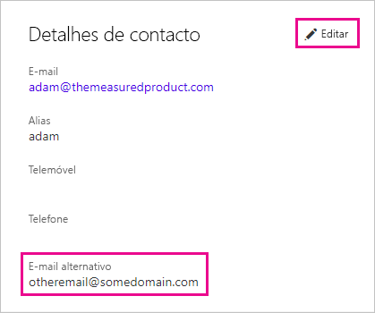

# <a name="use-an-alternate-email-address"></a>Utilizar um endereço de e-mail alternativo

Quando se inscreve no Power BI, deve fornecer um endereço de e-mail. Por predefinição, o Power BI utiliza este endereço para lhe enviar atualizações sobre a atividade no serviço. Por exemplo, um convite de partilha é enviado para este endereço.

Em alguns casos, pode querer que estes e-mails sejam entregues num endereço de e-mail alternativo em vez de serem entregues no e-mail que forneceu durante a inscrição. Este artigo explica como especificar um endereço alternativo no Microsoft 365 e no PowerShell. O artigo também explica como o Microsoft Azure Active Directory (Microsoft Azure AD) resolve um endereço de e-mail.

> [!NOTE]
> Especificar um endereço alternativo não afeta o endereço de e-mail que o Power BI utiliza para subscrições de e-mails, atualizações de serviço, newsletters e outras comunicações promocionais. Estas comunicações são sempre enviadas para o endereço de e-mail que utilizou quando se inscreveu no Power BI.

## <a name="use-microsoft-365"></a>Utilizar o Microsoft 365

Para especificar um endereço alternativo no Microsoft 365, siga estes passos.

1. Abra a página [informações pessoais](https://portal.office.com/account/#personalinfo) na sua conta. Se a aplicação lhe pedir, inicie sessão com o endereço de e-mail e a palavra-passe que utiliza no Power BI.

1. No menu esquerdo, selecione **Informações pessoais**.

1. Na secção **Detalhes de contacto**, selecione **Editar**.

    Se não conseguir editar os seus detalhes, significa que o seu administrador gere o seu endereço de e-mail. Contacte o administrador para atualizar o endereço de e-mail.

    

1. No campo **E-mail alternativo**, introduza o endereço de e-mail que pretende que o Microsoft 365 utilize para atualizações do Power BI.

## <a name="use-powershell"></a>Utilizar o PowerShell

Para especificar um endereço alternativo no PowerShell, utilize o comando [Set-AzureADUser](/powershell/module/azuread/set-azureaduser/).

```powershell
Set-AzureADUser -ObjectId john@contoso.com -OtherMails "otheremail@somedomain.com"
```

## <a name="email-address-resolution-in-azure-ad"></a>Resolução do endereços de e-mail no Microsoft Azure AD

Para capturar um token incorporado do Microsoft Azure AD para o Power BI, pode utilizar um dos três tipos de endereços de e-mail diferentes:

* O endereço de e-mail principal associado à conta do Microsoft Azure AD do utilizador

* O endereço de e-mail UPN (UserPrincipalName)

* O atributo de matriz *outro endereço de e-mail*

O Power BI seleciona o endereço de e-mail a utilizar com base na seguinte sequência:

1. Se o atributo de correio estiver presente no objeto de utilizador do Microsoft Azure AD, o Power BI utilizará esse atributo de correio para o endereço de e-mail.

1. Se o e-mail UPN *não* for um endereço de e-mail com o domínio **\*.onmicrosoft.com** (a informação apresentada após o símbolo "\@"), o Power BI utilizará esse atributo de correio para o endereço de e-mail.

1. Se o atributo de matriz do *outro endereço de e-mail* estiver presente no objeto de utilizador do Microsoft Azure AD, o Power BI utiliza o primeiro e-mail dessa lista (dado que pode existir uma lista de e-mails neste atributo).

1. Se não se verificar nenhuma das condições mencionadas acima, o Power BI utiliza o endereço UPN.

Mais perguntas? [Pergunte à Comunidade do Power BI](https://community.powerbi.com/)
