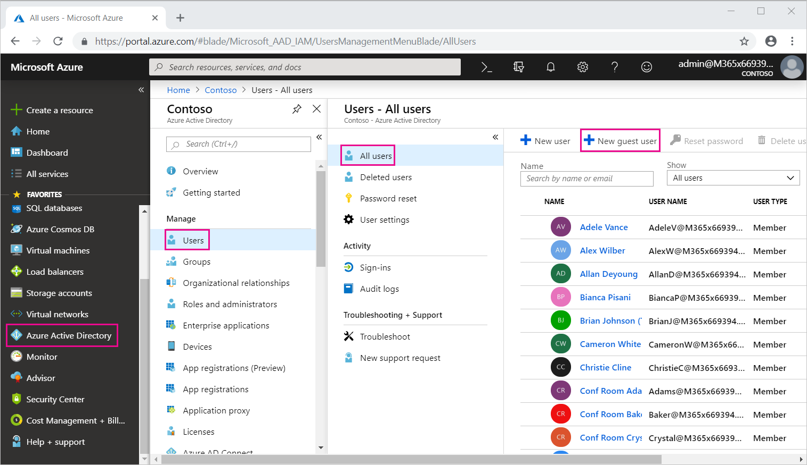
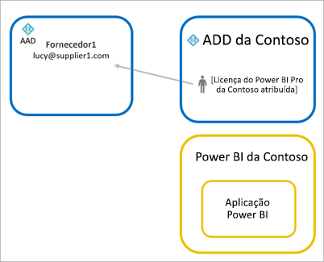

# Distribuir conteúdos do Power BI para utilizadores convidados externos com o Azure AD B2B

O Power BI permite a partilha de conteúdos com utilizadores convidados externos através do Azure Ative Directory Business-to-Business (Azure AD B2B). Ao utilizar o Azure AD B2B, a sua organização permite e rege a partilha com utilizadores externos num local central. Por predefinição, os convidados externos têm uma experiência apenas de consumo. Além disso, pode permitir que os utilizadores convidados fora da sua organização editem e façam a gestão de conteúdos na sua organização.

Este artigo fornece uma introdução básica ao Azure AD B2B no Power BI. Para obter mais informações, veja [Distribuir conteúdos do Power BI para utilizadores convidados externos com o Azure Active Directory B2B](../guidance/whitepaper-azure-b2b-power-bi.md).

## Ativar acesso

Ative a funcionalidade [Partilhar conteúdo com utilizadores externos](service-admin-portal.md#export-and-sharing-settings) no portal de administração do Power BI antes de enviar convites para utilizadores. Mesmo com esta opção ativada, tem de ser concedida a função Emitente de Convites ao utilizador no Azure Ative Directory para convidar utilizadores.

A opção para [Permitir aos utilizadores externos convidados editarem e gerirem conteúdo na organização](service-admin-portal.md#allow-external-guest-users-to-edit-and-manage-content-in-the-organization) permite-lhe dar aos utilizadores convidados a capacidade de verem e criarem conteúdos em áreas de trabalho, incluindo navegar pelo Power BI da sua organização.

> [!NOTE]
> A definição [Partilhar conteúdo com utilizadores externos](service-admin-portal.md#export-and-sharing-settings) controla se o Power BI permite convidar utilizadores externos para a sua organização. Quando um utilizador externo aceitar o convite, torna-se num utilizador convidado do Azure AD B2B na sua organização. Os utilizadores externos aparecem nos seletores de pessoas na experiência do Power BI. Se a definição estiver desativada, os utilizadores convidados existentes na sua organização continuarão a ter acesso a todos os itens aos quais já tinham acesso e continuarão a ser listados nas experiências dos seletores de pessoas. Além disso, se os convidados forem adicionados através da abordagem de [convite planeado](#planned-invites), também aparecerão nos seletores de pessoas. Para evitar que os utilizadores convidados acedam ao Power BI, utilize uma política de acesso condicional do Azure AD.

## Quem pode convidar?

A maioria dos endereços de e-mail é suportada para utilizadores convidados, incluindo contas de e-mail pessoais como gmail.com, outlook.com e hotmail.com. No Azure AD B2B, estes endereços são denominados *identidades sociais*.

Não pode convidar utilizadores associados a uma cloud para administração pública, como o [Power BI for US Government](service-govus-overview.md).

## Convidar utilizadores

Os utilizadores convidados precisam de convites apenas da primeira vez que são convidados para a sua organização. Para convidar utilizadores, utilize convites planeados ou ad-hoc.

Para utilizar convites ad-hoc, utilize as seguintes capacidades:

* Partilha de Relatório e Dashboard
* Lista de acesso da aplicação

O convites ad hoc não são suportados na lista de acesso da área de trabalho. Utilize a [abordagem de convites planeados](#planned-invites) para adicionar estes utilizadores à sua organização. Depois de o utilizador externo se tornar num convidado na sua organização, adicione-o à lista de acesso da área de trabalho.

### Convites planeados

Utilize um convite planeado caso saiba quais os utilizadores a convidar. O portal do Azure ou o PowerShell permite-lhe enviar os convites. Tem de ser-lhe atribuída a função de administrador de utilizadores para convidar pessoas.

Siga estes passos para enviar um convite no portal do Azure.

1. No [portal do Azure](https://portal.azure.com), selecione **Azure Active Directory**.

1. Em **Gerir**, selecione **Utilizadores** > **Todos os utilizadores** > **Novo utilizador convidado**.

    

1. Introduza um **endereço de e-mail** e uma **mensagem pessoal**.

    

1. Selecione **Convidar**.

Para convidar mais do que um utilizador, utilize o PowerShell ou crie um convite em massa no Azure Active Directory. Para utilizar o PowerShell no convite em massa, siga os passos no [Tutorial: Utilizar o PowerShell para convidar utilizadores da colaboração B2B do Azure Active Directory em massa](/azure/active-directory/b2b/bulk-invite-powershell/). Para utilizar o portal do Azure no convite em massa, siga os passos no [Tutorial: Convidar utilizadores da colaboração B2B do Azure Active Directory em massa](/azure/active-directory/b2b/tutorial-bulk-invite/).

O utilizador convidado tem de selecionar **Começar** no convite por e-mail que receber. Ao fazê-lo, o utilizador convidado é adicionado à organização.

### Convites ad hoc

Para convidar um utilizador externo em qualquer altura, adicione-o ao dashboard ou relatório através da funcionalidade de partilha ou à aplicação através da página de acesso. Eis um exemplo do que deve fazer ao convidar um utilizador externo para utilizar uma aplicação.

O utilizador convidado recebe um e-mail a indicar que partilhou a aplicação com ele.

O utilizador convidado terá de iniciar sessão com o respetivo endereço de e-mail da organização. Ser-lhe-á pedido que aceite o convite após iniciar sessão. Após iniciar sessão, a aplicação é aberta para o utilizador convidado. Para voltar à aplicação, o utilizador convidado deve adicionar a ligação aos marcadores ou guardar o e-mail.

## Licensing

O utilizador convidado tem de ter as devidas licenças para ver o conteúdo que partilhou. Existem três opções para garantir que o utilizador possui a devida licença: utilizar o Power BI Premium, atribuir uma licença do Power BI Pro ou utilizar a licença do Power BI Pro do convidado.

Os [utilizadores convidados que podem editar e gerir os conteúdos na organização](service-admin-portal.md#allow-external-guest-users-to-edit-and-manage-content-in-the-organization) precisam de uma licença do Power BI Pro para contribuir com conteúdos para as áreas de trabalho ou partilhar conteúdos com outras pessoas.

### Utilizar o Power BI Premium

Atribuir a área de trabalho à [capacidade do Power BI Premium](service-premium-what-is.md) permite que o utilizador convidado utilize a aplicação sem precisar de uma licença do Power BI Pro. O Power BI Premium também permite que as aplicações tirem partido de outras capacidades, como um aumento nas taxas de atualização, capacidade dedicada e tamanhos de modelos grandes.

### Atribuir uma licença do Power BI Pro ao utilizador convidado

Atribuir uma licença do Power BI Pro da sua organização a um utilizador convidado permite que esse utilizador convidado veja os conteúdos partilhados com ele. Para obter mais informações sobre atribuir licenças, veja [Atribuir licenças a utilizadores na página Licenças](/office365/admin/manage/assign-licenses-to-users#assign-licenses-to-users-on-the-licenses-page). Antes de atribuir licenças Pro a utilizadores convidados, consulte o [site de Termos do Produto](https://www.microsoft.com/licensing/terms) de forma a assegurar que se encontra em conformidade com os termos do seu contrato de licenciamento com a Microsoft.

### O utilizador convidado traz a sua própria licença do Power BI Pro

O utilizador convidado pode já ter uma licença do Power BI Pro atribuída através da organização dele.

## Utilizadores convidados que podem editar e gerir conteúdo

Ao utilizar a funcionalidade [Permitir aos utilizadores externos convidados editarem e gerirem conteúdo na organização](service-admin-portal.md#allow-external-guest-users-to-edit-and-manage-content-in-the-organization), os utilizadores convidados especificados obtêm acesso adicional ao Power BI da sua organização. Os convidados permitidos podem ver todos os conteúdos para os quais tenham permissão, aceder à Home Page, navegar em áreas de trabalho, instalar aplicações, ver onde estão na lista de acesso e contribuir com conteúdos para as áreas de trabalho. Podem criar ou ser Administradores de áreas de trabalho que utilizem a nova experiência de área de trabalho. Aplicam-se algumas limitações. A secção Considerações e Limitações apresenta uma lista dessas restrições.

Para ajudar os utilizadores convidados a iniciar sessão no Power BI, forneça-lhes o URL de Inquilino. Para encontrar o URL de inquilino, siga estes passos:

1. No serviço Power BI, no menu do cabeçalho, selecione ajuda ( **?** ) e, em seguida, **Acerca do Power BI**.

2. Procure o valor junto a **URL de Inquilino**. Partilhe o URL de inquilino com os utilizadores convidados permitidos.

    

## Considerações e Limitações

* Por predefinição, os convidados B2B Azure AD externos estão limitados apenas ao consumo de conteúdos. Os convidados B2B Azure AD externos podem ver aplicações, dashboards, relatórios, exportar dados e criar subscrições de e-mail para dashboards e relatórios. Não podem aceder a áreas de trabalho nem publicar os seus próprios conteúdos. Para remover estas restrições, pode utilizar a funcionalidade [Permitir aos utilizadores externos convidados editarem e gerirem conteúdo na organização](service-admin-portal.md#allow-external-guest-users-to-edit-and-manage-content-in-the-organization).

* Para convidar utilizadores, é necessária uma licença do Power BI Pro. Os utilizadores da Versão de Avaliação Pro não podem convidar utilizadores no Power BI.

* Algumas experiências não estão disponíveis para os [utilizadores convidados que podem editar e gerir conteúdos na organização](service-admin-portal.md#allow-external-guest-users-to-edit-and-manage-content-in-the-organization). Para atualizar ou publicar relatórios, os utilizadores convidados precisam de utilizar o serviço Power BI, incluindo Obter Dados para carregar ficheiros do Power BI Desktop.  As seguintes experiências não são suportadas:
  * A publicação direta do Power BI Desktop para o serviço Power BI
  * Os utilizadores convidados não podem utilizar o Power BI Desktop para ligar a conjuntos de dados de serviço no serviço Power BI
  * Áreas de trabalho clássicas associadas a Grupos do Microsoft 365
    * Os utilizadores convidados não podem criar ou ser Administradores destas áreas de trabalho
    * Os utilizadores convidados podem ser membros
  * O envio de convites ad hoc não é suportado para listas de acesso de áreas de trabalho
  * O Power BI Publisher para Excel não é suportado para utilizadores convidados
  * Os utilizadores convidados não podem instalar o Power BI Gateway e ligá-lo à sua organização
  * Os utilizadores convidados não podem instalar aplicações de publicações para toda a organização
  * Os utilizadores convidados não podem utilizar, criar, atualizar ou instalar pacotes de conteúdos organizacionais
  * Os utilizadores convidados não podem utilizar a funcionalidade Analisar no Excel
  * Os utilizadores convidados não podem ser @mentioned em comentários
  * Os utilizadores convidados não podem utilizar subscrições
  * Os utilizadores convidados que utilizem esta funcionalidade devem ter uma conta escolar ou profissional

* Os utilizadores convidados que utilizem identidades sociais terão mais limitações devido a restrições de início de sessão.
  * Podem utilizar experiências de consumo no serviço Power BI através de um browser
  * Não podem utilizar as aplicações do Power BI Mobile
  * Não podem iniciar sessão quando for necessária uma conta escolar ou profissional

* Esta funcionalidade não está atualmente disponível com a peça Web de relatórios do Power BI para SharePoint Online.

* Existem definições do Azure Active Directory que podem limitar as ações que os utilizadores externos convidados podem realizar em toda a sua organização. Essas definições também se aplicam ao ambiente do Power BI. A seguinte documentação aborda as definições:
  * [Gerir Definições de Colaboração Externa](/azure/active-directory/b2b/delegate-invitations#configure-b2b-external-collaboration-settings)
  * [Permitir ou bloquear convites para utilizadores B2B de organizações específicas](https://docs.microsoft.com/azure/active-directory/b2b/allow-deny-list)
  * [Utilizar o Acesso Condicional para permitir ou bloquear o acesso](/azure/active-directory/conditional-access/concept-conditional-access-cloud-apps)

* Pode partilhar conteúdo a partir de uma cloud de administração pública, como a GCC, para um utilizador da cloud comercial externo. No entanto, o utilizador convidado não pode utilizar a sua própria licença. O conteúdo tem de estar na capacidade atribuída a Premium para permitir o acesso. Também pode atribuir uma licença do Power BI Pro à conta de convidado.

* A partilha fora da sua organização não é suportada para clouds nacionais, como as instâncias de cloud da Alemanha ou China. Em vez disso, crie contas de utilizador na sua organização que os utilizadores externos possam utilizar para aceder ao conteúdo.

* Se partilhar diretamente com um utilizador convidado, o Power BI enviar-lhe-á um e-mail com a ligação. Para evitar enviar um e-mail, adicione o utilizador convidado a um grupo de segurança e partilhe através desse meio.  

## Próximos passos

Para obter informações mais detalhadas, incluindo sobre o funcionamento da segurança ao nível de linha, veja o documento técnico: [Distribute Power BI content to external guest users using Azure AD B2B](https://aka.ms/powerbi-b2b-whitepaper) (Distribuir conteúdos do Power BI para utilizadores convidados externos com o Azure AD B2B).

Para obter informações sobre o Azure AD B2B, veja [O que é a colaboração do Azure AD B2B?](/azure/active-directory/active-directory-b2b-what-is-azure-ad-b2b/).
