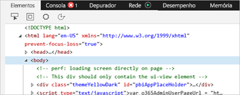
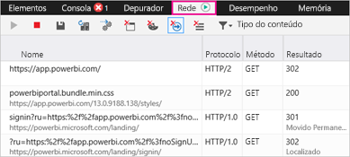
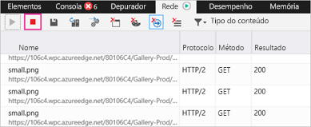
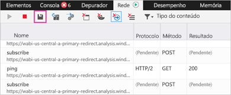

# Recolher informações de diagnóstico adicionais para o Power BI

Este artigo fornece instruções para recolher manualmente informações de diagnóstico adicionais do cliente Web do Power BI.

1. Navegue até ao [Power BI](https://app.powerbi.com) com o Microsoft Edge ou o Internet Explorer.

1. Prima **F12** para abrir as ferramentas de programador do Microsoft Edge.

   

1. Selecione o separador **Network** (Rede). Este irá listar o tráfego já capturado.

   

    Pode:

    * Procure dentro da janela e reproduza qualquer problema que possa encontrar.

    * Oculte e mostre a janela de ferramentas de programador, em qualquer altura durante a sessão, ao premir F12.

1. Para parar a criação de perfis da sessão, pode selecionar o quadrado vermelho no separador **Rede** da área de ferramentas de programador.

   

1. Selecione o ícone de disquete para exportar os dados como um ficheiro de HTTP Archive (HAR).

   

1. Escreva um nome de ficheiro e guarde o ficheiro HAR.

    O ficheiro HAR conterá todas as informações sobre pedidos de rede entre a janela do navegador e o Power BI, incluindo:

    * Os IDs de atividade para cada pedido.

    * O carimbo de data/hora preciso para cada pedido.

    * Quaisquer informações de erro devolvidas ao cliente.

    Este rastreio também conterá os dados utilizados para povoar os elementos visuais mostrados no ecrã.

1. Pode enviar o ficheiro HAR para o suporte para revisão.

Mais perguntas? [Experimente perguntar à Comunidade do Power BI](https://community.powerbi.com/)
