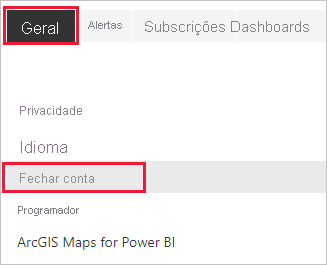
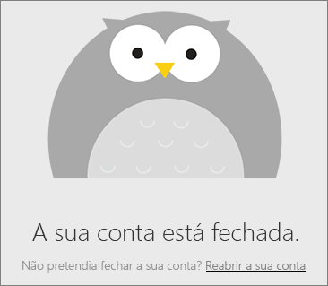

# Fechar a sua conta do Power BI

Se não quiser mais utilizar o Power BI, poderá fechar sua conta do Power BI.  Depois de fechar a sua conta, não pode iniciar sessão no Power BI. Além disso, tal como declara na política de retenção de dados nos Termos de Serviço do Power BI, este elimina quaisquer dados do cliente carregados ou criados. Não são mantidos.

## Utilizadores individuais do Power BI

Se se inscreveu no Power BI como um indivíduo, poderá fechar a sua conta no ecrã **Definições**.

1. No Power BI, selecione o ícone de engrenagem no canto superior direito e, em seguida, selecione **Definições**.

    

1. No separador **Geral**, selecione **Fechar Conta**.

    

1. Selecione um motivo para fechar a conta (1). Também pode fornecer outras informações (2). Em seguida, selecione **Fechar conta**.

    

1. Confirme que deseja fechar a sua conta.

    

    Deve ver uma confirmação de que o Power BI fechou a sua conta. Pode reabrir a conta neste ecrã, se necessário.

    

## Utilizadores de inquilino gerido

Se a sua organização o tiver inscrito no Power BI, contacte o administrador de inquilinos e peça-lhe que remova a atribuição de licença da sua conta.

Mais perguntas? [Experimente perguntar à Comunidade do Power BI](https://community.powerbi.com/)