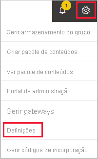

# Fechar a sua conta do Power BI

Se não quiser mais utilizar o Power BI, poderá fechar sua conta do Power BI.  Depois de fechar a sua conta, não pode iniciar sessão no Power BI. Além disso, tal como é declarado na política de retenção de dados no [Contrato de Serviço do Power BI](https://azure.microsoft.com/support/legal/subscription-agreement/), este elimina quaisquer dados de clientes criados ou carregados por si.

## Utilizadores individuais do Power BI

Se se inscreveu no Power BI como um indivíduo, poderá fechar a sua conta no ecrã **Definições**.

1. No Power BI, selecione o ícone de engrenagem no canto superior direito e, em seguida, selecione **Definições**.

    

1. No separador **Geral**, selecione **Fechar Conta**.

    

1. Selecione um motivo para fechar a conta (1). Também pode fornecer outras informações (2). Em seguida, selecione **Fechar conta**.

    

1. Confirme que deseja fechar a sua conta.

    

    Deve ver uma confirmação de que o Power BI fechou a sua conta. Pode reabrir a conta neste ecrã, se necessário.

    

## Utilizadores geridos

Se a sua organização o tiver inscrito no Power BI, contacte o administrador. peça-lhe que remova a atribuição de licença da sua conta.

Mais perguntas? [Experimente perguntar à Comunidade do Power BI](https://community.powerbi.com/)