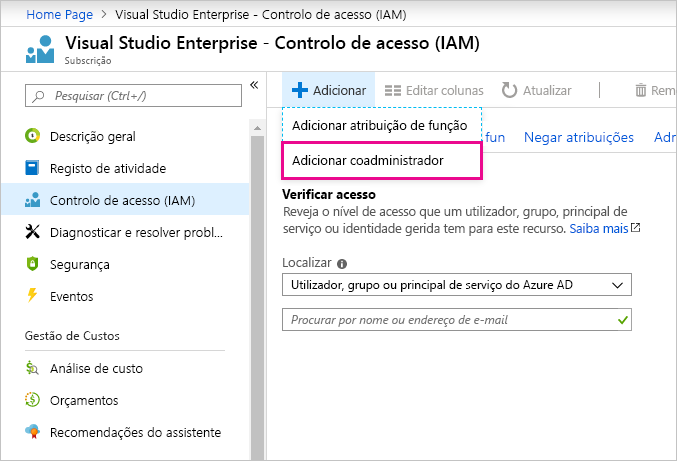

# Using the same account for Power BI and Azure (Utilizar a mesma conta para o Power BI e o Azure)

Se for um utilizador do Power BI e do Azure, convém utilizar a mesma conta para ambos os serviços para que não precise de escrever a palavra-passe duas vezes.

O Power BI liga-o com a sua conta organizacional, associada ao seu endereço de e-mail profissional ou escolar.  O Azure liga-o a uma conta da Microsoft ou conta organizacional.

Se quiser utilizar a mesmas conta para o Azure e para o Power BI, certifique-se de que inicia a sessão no Azure com a sua conta organizacional.

**E se já tiver iniciado sessão no Azure com a minha conta da Microsoft?**

Pode adicionar a sua conta organizacional como um coadministrador no Azure ao seguir estes passos:

1. Inicie sessão no [portal do Azure](https://portal.azure.com/). Se for um utilizador em vários diretórios do Azure, selecione **Subscrições** e filtre para exibir apenas o diretório e as subscrições que deseja editar.

1. No painel de navegação, selecione **Controlo de acesso (IAM)** e, em seguida, selecione **Adicionar** \> **Adicionar coadministrador**.

    

1. Escreva o endereço de e-mail associado à sua conta organizacional e selecione **Adicionar**.

1. Da próxima vez que quiser iniciar sessão no portal do Azure, utilize o seu endereço de e-mail organizacional.

Mais perguntas? [Pergunte à Comunidade do Power BI](https://community.powerbi.com/)
