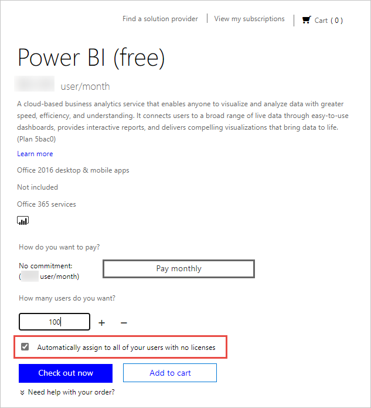

# Licenciamento do serviço Power BI para os utilizadores na sua organização

Aquilo que um utilizador pode fazer no serviço Power BI depende do tipo de licença por utilizador que o mesmo possui. O nível de acesso fornecido pela respetiva licença varia consoante a área de trabalho a que está a aceder esteja ou não atribuída a uma capacidade Premium do Power BI. Todos os utilizadores do serviço Power BI têm de ter uma licença.

Existem duas formas de os utilizadores obterem uma licença. Com as capacidades de inscrição de gestão personalizada e as contas de trabalho ou escolares, os utilizadores podem obter a sua própria licença gratuita ou Pro. Em alternativa, os administradores podem obter uma subscrição do Power BI e atribuir licenças aos utilizadores.

Este artigo aborda a compra de serviços e o licenciamento por utilizador numa perspetiva de administrador. Para obter mais informações sobre como os utilizadores podem obter a sua própria licença, veja [Inscrever-se no Power BI como um indivíduo](../fundamentals/service-self-service-signup-for-power-bi.md).

## Quem pode comprar e atribuir licenças?

Deve ser-lhe atribuída uma função de administrador para comprar ou atribuir licenças para a sua organização. As funções de administrador são atribuídas através do centro de administração do Azure Active Directory ou o centro de administração do Microsoft 365. A seguinte tabela mostra qual a função necessária para realizar tarefas relacionadas com a compra e o licenciamento. Para obter mais informações sobre as funções de administrador no Azure Active Directory, veja [Ver e atribuir funções de administrador no Azure Active Directory](/azure/active-directory/users-groups-roles/directory-manage-roles-portal). Para saber mais sobre as funções de administrador no Microsoft 365, incluindo as melhores práticas, veja [About admin roles](/microsoft-365/admin/add-users/about-admin-roles?view=o365-worldwide) (Acerca das funções de administrador).

| Quem pode comprar serviços e licenças? | Quem pode gerir licenças de utilizador? |
| --------------- | --------------- |
| Administrador de faturação | Administrador de licenças |
| Administrador global | Administrador de utilizadores |
|  | Administrador global |

Estas funções permitem gerir a organização. Para obter mais informações sobre as funções de administrador do serviço Power BI, veja [Compreender as funções de administrador do serviço Power BI](service-admin-role.md).

## Get Power BI for your organization (Obter o Power BI para a sua organização)

Para obter informações sobre preços, veja [Preços e Comparação de Produtos](https://powerbi.microsoft.com/pricing/).

Um administrador global ou um administrador de faturação pode inscrever-se no serviço Power BI e comprar licenças para os utilizadores na sua organização. Se ainda não estiver pronto para comprar, selecione a versão de avaliação do Power BI Pro. Obterá 25 licenças para utilizar durante um mês. Para obter instruções passo a passo sobre como se inscrever, veja [Obter uma subscrição do Power BI para a sua organização](service-admin-org-subscription.md).

## Acerca da inscrição de gestão personalizada

Os utilizadores individuais podem obter a sua própria licença do Power BI. Para tal, devem inscrever-se com a conta de trabalho ou escolar. Com uma licença gratuita, os utilizadores podem explorar o Power BI para a visualização e análise dos dados pessoais com A Minha Área de Trabalho, mas não podem partilhar com outros utilizadores. É necessária uma licença do Power BI Pro para partilhar conteúdos. Os utilizadores podem atualizar o tipo de licença para Pro ou inscrever-se diretamente na capacidade Pro se a organização estiver a utilizar a cloud comercial. A compra direta ou a atualização para a capacidade Pro não está disponível para organizações educacionais ou organizações implementadas em clouds do Azure Government, do Azure Alemanha ou do Azure China 21Vianet.

Se não quiser que os utilizadores na sua organização utilizem o serviço de gestão personalizada, veja [Ativar ou desativar a inscrição de gestão personalizada](service-admin-disable-self-service.md) para saber como a desativar.

Desativar a inscrição self-service impede os utilizadores de explorar o Power BI para visualização e análise de dados. Se bloquear a inscrição individual, poderá querer obter licenças do Power BI (gratuito) para a sua organização e atribuí-las a todos os utilizadores. Siga estes passos para atribuir automaticamente uma licença do Power BI (gratuito) a todos os utilizadores existentes:

1. Inicie sessão no [Centro de administração do Microsoft 365](https://admin.microsoft.com) com as credenciais de administrador de faturação ou administrador global.
1. No menu lateral esquerdo, selecione **Faturação** > **Comprar serviços**.
1. Procure ou percorra para localizar a oferta do Power BI (gratuito). Selecione a oferta e, em seguida, **Obter agora**.
1. Introduza o número de licenças necessárias para abranger todos os utilizadores.
1. Selecione **Atribuir automaticamente a todos os utilizadores sem licença** e, em seguida, saia.

  

Se quiser ver quais os utilizadores da sua organização já possuem uma licença, veja [Ver e gerir licenças de utilizador](service-admin-manage-licenses.md) para saber como.

## Capacidades e tipos de licença

Existem dois tipos de licenças do Power BI por utilizador: gratuita e Pro. O tipo de licença que um utilizador precisa é determinado pelo local onde o conteúdo é armazenado e pela forma como os utilizadores interagem com esse conteúdo. Onde o conteúdo pode ser armazenado é determinado pelo [tipo de subscrição](#subscription-types) da sua organização.

Um tipo de subscrição, [Power BI Premium](service-admin-premium-purchase.md), permite aos utilizadores com uma licença gratuita agirem sobre conteúdos em áreas de trabalho atribuídas à capacidade Premium. Fora da capacidade Premium, os utilizadores com uma licença gratuita só podem utilizar o serviço Power BI para se ligarem aos dados e criarem relatórios e dashboards em **A Minha Área de Trabalho**. Não podem partilhar conteúdos com outros utilizadores nem publicar conteúdos noutras áreas de trabalho. Para saber mais sobre os tipos de áreas de trabalho, veja [Tipos de áreas de trabalho](../consumer/end-user-workspaces.md#types-of-workspaces).

Uma subscrição Standard do Power BI utiliza a capacidade partilhada. Se os conteúdos forem armazenados numa capacidade partilhada, os utilizadores a quem foi atribuída uma licença do Power BI Pro só poderão colaborar com outros utilizadores do Power BI Pro. Estes podem consumir os conteúdos partilhados com outros utilizadores, publicar conteúdos em áreas de trabalho de aplicações, partilhar dashboards e subscrever dashboards e relatórios.  Quando as áreas de trabalho estão na capacidade Premium, os utilizadores Pro podem distribuir conteúdos a utilizadores que não possuam uma licença do Power BI Pro.

A tabela abaixo resume as capacidades básicas de cada tipo de licença. Para obter uma discriminação detalhada da disponibilidade das funcionalidades por tipo de licença, veja [Funcionalidades por tipo de licença](../fundamentals/service-features-license-type.md).

| Tipo de licença | Capacidades quando a área de trabalho está numa capacidade partilhada | Capacidades adicionais quando a área de trabalho está na capacidade Premium |
| --------- | ----------- | ----------- |
| Power BI (gratuito) | Acesso ao conteúdo em A Minha Área de Trabalho | Consumo de conteúdo partilhado com eles |
| Power BI Pro | Publicação de conteúdos noutras áreas de trabalho, partilha de dashboards, subscrição de dashboards e relatórios, partilha com utilizadores que têm uma licença Pro | Distribuição de conteúdo a utilizadores que possuem licenças gratuitas |

## Tipos de subscrição

Todas as subscrições de licenças comerciais baseadas em utilizadores da Microsoft se baseiam em identidades do Azure Active Directory, Para utilizar o serviço Power BI com licenças comerciais, tem de iniciar sessão com uma identidade que o Azure Ative Directory suporte. Pode adicionar o Power BI a qualquer subscrição da Microsoft que utilize o Azure Active Directory para os serviços de identidade. Algumas subscrições, como o Office 365 E5, incluem uma licença do Power BI Pro, pelo que não é necessária uma inscrição separada do Power BI.

Existem dois tipos de subscrições do Power BI para organizações: Standard e Premium.

Com uma subscrição de gestão personalizada Standard do Power BI Pro, os administradores atribuem licenças por utilizador. Existe uma taxa mensal por utilizador para as licenças do Power BI Pro. Este tipo de licença permite colaboração, publicação, partilha e análise ad hoc. Os conteúdos são guardados numa capacidade de armazenamento partilhada que é totalmente gerida pela Microsoft.

Uma subscrição do Power BI Premium aloca capacidade dedicada a uma organização. Adequada para a BI empresarial, a análise de macrodados e os relatórios na cloud e no local, a capacidade Premium proporciona controlos de implementação e administração avançados. Os recursos de armazenamento e de computação dedicados são geridos pelos administradores das capacidades na sua organização. Existe um custo mensal para este ambiente dedicado. Para além das outras vantagens da capacidade Premium, o conteúdo armazenado nesta pode ser acedido e distribuído pelos utilizadores que não possuem licenças do Power BI Pro. Pelo menos um utilizador tem de possuir uma licença do Power BI Pro atribuída para utilizar a capacidade Premium. Os criadores e programadores de conteúdo continuam a precisar de uma licença do Power BI Pro.

Os dois tipos de subscrição não são mutuamente exclusivos. Pode possuir o Power BI Premium e o Power BI Pro. Nesta configuração, o conteúdo armazenado na capacidade Premium pode ser partilhado com todos os utilizadores e a capacidade partilhada também está disponível. Para obter mais informações sobre os limites de capacidade, veja [Gerir o armazenamento de dados nas áreas de trabalho do Power BI](service-admin-manage-your-data-storage-in-power-bi.md).

Para comparar as funcionalidades e os preços dos produtos, veja [Preços do Power BI](https://powerbi.microsoft.com/pricing).

## Acesso de utilizador convidado

Pode querer distribuir conteúdo a utilizadores que estejam fora da sua organização. É possível partilhar conteúdo com utilizadores externos através de um convite para visualizarem o conteúdo como convidado. O Azure Ative Directory Business-to-Business (Azure AD B2B) permite a partilha com utilizadores externos convidados. Devem ser cumpridos os seguintes pré-requisitos para partilhar conteúdo com utilizadores externos:

- A capacidade para partilhar conteúdo com utilizadores externos deve estar ativada

- O utilizador convidado deve ter as devidas licenças em vigor para ver conteúdo partilhado

Para obter mais informações sobre o acesso de utilizador convidado, veja [Distribuir conteúdos do Power BI para utilizadores externos convidados com o Azure AD B2B](service-admin-azure-ad-b2b.md).

## Comprar licenças do Power BI Pro

Como administrador, compra licenças do Power BI Pro através do Microsoft 365 ou de um parceiro Microsoft. Depois de comprar as licenças, atribui-as aos utilizadores individuais. Para obter mais informações, veja [Comprar e atribuir licenças Power BI Pro](service-admin-purchasing-power-bi-pro.md).

### Expiração da licença do Power BI Pro

Depois de a licença do Power BI Pro expirar, existe um período de tolerância. Para licenças que façam parte da compra de licenciamento de volume, o período de tolerância é de 90 dias. Se tiver comprado diretamente a licença, o período de tolerância será de 30 dias.

O Power BI Pro tem o mesmo ciclo de vida de subscrição que o Microsoft 365. Para obter mais informações, veja [O que acontece aos meus dados e acesso quando a minha subscrição do Microsoft 365 para empresas termina?](/microsoft-365/commerce/subscriptions/what-if-my-subscription-expires)

## Próximos passos

- [Comprar e atribuir licenças Power BI Pro](service-admin-purchasing-power-bi-pro.md)
- [Subscrição para empresas e documentação de faturação](/microsoft-365/commerce/?view=o365-worldwide)
- [Encontrar utilizadores do Power BI que iniciaram sessão](service-admin-access-usage.md)
- Mais perguntas? [Experimente perguntar à Comunidade do Power BI](https://community.powerbi.com/)