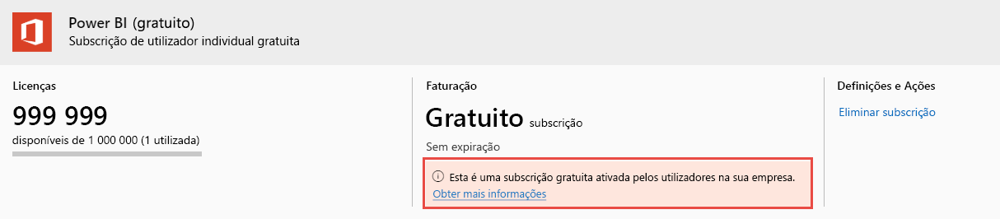

# Ver e gerir licenças de utilizador do Power BI

Este artigo explica como os administradores podem utilizar o centro de administração do Microsoft 365 ou o portal do Azure para ver e gerir as licenças de utilizador do serviço Power BI.

> [!NOTE]
>
>É possível que um utilizador tenha uma licença do Power BI (gratuito) e uma do Power BI Pro atribuída. Esta situação pode ocorrer quando um utilizador se inscreve numa licença gratuita e, em seguida, lhe é atribuída uma licença do Power BI Pro. Neste caso, o nível de licenciamento mais elevado é o que entra em vigor.
>

## Ver as subscrições

Para ver quais as subscrições do Power BI que a sua organização possui, siga estes passos.

1. Inicie sessão no [centro de administração do Microsoft 365](https://admin.microsoft.com).
2. No menu de navegação, selecione **Faturação** > **Produtos e serviços**.

As subscrições do Power BI ativas estão listadas juntamente com quaisquer outras subscrições que possua. Pode ver uma subscrição inesperada do Power BI (gratuito), como mostrado aqui.

  

Este tipo de subscrição é criado quando os utilizadores beneficiam da inscrição de gestão personalizada. Para saber mais, veja [Power BI na sua organização](https://docs.microsoft.com/microsoft-365/admin/misc/power-bi-in-your-organization?view=o365-worldwide).

## Gerir licenças de utilizador no Microsoft 365

Para utilizar o centro de administração do Microsoft 365 para gerir as licenças de utilizador, veja [Subscrição para empresas e documentação de faturação](https://docs.microsoft.com/microsoft-365/commerce/?view=o365-worldwide).

## Gerir licenças de utilizador no portal do Azure

Siga estes passos para visualizar e atribuir licenças do Power BI com o portal do Azure.

1. Inicie sessão no [portal do Azure](https://portal.azure.com).

2. Procure e selecione **Azure Active Directory**.

3. Em **Gerir** no menu de recursos do Azure Ative Directory, selecione **Licenças**.

4. Selecione **Todos os produtos** no menu de recursos e, em seguida, selecione um tipo de licença do Power BI para apresentar a lista de utilizadores licenciados.

5. Para atribuir uma licença, na barra de comandos, selecione **+ Atribuir**. Na página **Atribuir licença**, escolha um utilizador e, em seguida, selecione **Opções de atribuição** para ativar uma licença do Power BI para a conta de utilizador selecionada.

6. Para remover uma licença, selecione a caixa de verificação ao lado do nome do utilizador e, em seguida, selecione **Remover licença**.

## Próximos passos

- [Comprar o Power BI Pro](service-admin-purchasing-power-bi-pro.md)
- [Licenciamento para a sua organização](service-admin-licensing-organization.md)
