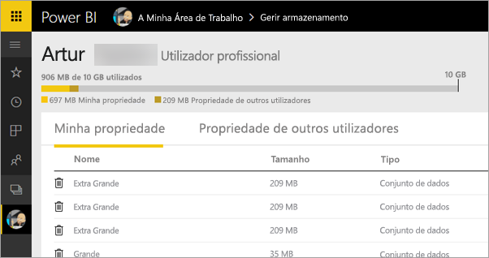

# Gerir o armazenamento de dados nas áreas de trabalho do Power BI

Saiba como pode gerir o armazenamento de dados na sua área de trabalho individual para que possa continuar a publicar relatórios e conjuntos de dados.

## Limites de capacidade

Os limites de armazenamento das áreas de trabalho, sejam para A Minha Área de trabalho ou uma área de trabalho de aplicação, dependem de se a área de trabalho está numa [capacidade Premium ou partilhada](../fundamentals/service-basic-concepts.md#capacities).

### Limites de capacidade partilhada
Para áreas de trabalho numa capacidade partilhada: 

- Existe um limite de armazenamento de 100 GB por área de trabalho.
- Em áreas de trabalho de aplicações, a utilização total não pode exceder o limite de armazenamento do inquilino de 10 GB multiplicado pelo número de licenças Pro no inquilino.

### Limites de capacidade Premium
Para áreas de trabalho na capacidade Premium:
- Existe um limite de 100 TB por capacidade Premium.
- Não existe um limite de armazenamento por utilizador.

Leia sobre outras funcionalidades do [modelo de preços do Power BI](https://powerbi.microsoft.com/pricing).

## O que está incluído no armazenamento

São incluídos no armazenamento de dados os seus próprios conjuntos de dados e relatórios do Excel, assim como os itens que foram partilhados consigo. Os conjuntos de dados são as origens de dados que carregou ou às quais se ligou. Estas origens de dados incluem os ficheiros do Power BI Desktop e os livros do Excel que está a utilizar. O exemplo seguinte também está incluído na capacidade de dados.

* Intervalos do Excel afixados a um dashboard.
* Visualizações locais dos Reporting Services afixadas a um dashboard do Power BI.
* Imagens carregadas.

O tamanho de um dashboard que partilha varia consoante o que está afixado ao mesmo. Por exemplo, se afixar itens de dois relatórios que fazem parte de dois conjuntos de dados diferentes, o tamanho inclui ambos os conjuntos de dados.

## Gerir itens dos quais é proprietário

Veja a quantidade de armazenamento de dados que está a utilizar na sua conta do Power BI e faça a gestão da sua conta.

1. Para gerir o seu próprio armazenamento, aceda a **A Minha Área de Trabalho** no painel de navegação.
   
    

2. Selecione o ícone de engrenagem  no canto superior direito **Gerir armazenamento pessoal**.
   
    A barra superior mostra o limite de armazenamento utilizado.
   
    
   
    Os conjuntos de dados e os relatórios são separados em dois separadores:
   
    **Minha propriedade:** carregou estes relatórios e conjuntos de dados para a sua conta do Power BI, incluindo conjuntos de dados de serviços como o Salesforce e o Dynamics CRM.  

    **Propriedade de outros utilizadores:** outras pessoas partilharam os relatórios e conjuntos de dados consigo.
1. Para eliminar um conjunto de dados ou um relatório, selecione o ícone de caixote do lixo .

Tenha em atenção que tanto o utilizador como outra pessoa podem ter relatórios e dashboards com base num conjunto de dados. Se eliminar o conjunto de dados, os relatórios e dashboards deixarão de funcionar.

## Gerir a sua área de trabalho
1. Selecione a seta junto a **Áreas de trabalho** e selecione o nome da área de trabalho.
   
    
2. Selecione o ícone de engrenagem  no canto superior direito **Gerir armazenamento do grupo**.
   
    A barra superior mostra o limite de armazenamento de grupo utilizado.
   
    
   
    Os conjuntos de dados e os relatórios são separados em dois separadores:
   
    **Nossa propriedade:** você ou outra pessoa carregou estes relatórios e conjuntos de dados para a conta do Power BI do grupo, incluindo conjuntos de dados de serviços como o Salesforce e o Dynamics CRM.

    **Propriedade de outros utilizadores:** outras pessoas partilharam os relatórios e conjuntos de dados com o seu grupo.

3. Para eliminar um conjunto de dados ou um relatório, selecione o ícone de caixote do lixo .
   
   > [!NOTE]
   > Tenha em mente que você ou outra pessoa do grupo pode ter relatórios e dashboards com base em um conjunto de dados. Se eliminar o conjunto de dados, os relatórios e dashboards deixarão de funcionar.
   
   Qualquer membro numa área de trabalho com a função de administrador, membro ou contribuidor tem permissões para eliminar conjuntos de dados e relatórios da área de trabalho.

## Limites do conjunto de dados
Existe um limite de 1 GB por conjunto de dados importado para o Power BI. Se tiver optado por manter a experiência do Excel, em vez de importar os dados, existe um limite de 250 MB para o conjunto de dados.

## O que acontece quando atinge um limite
Quando atinge o limite da capacidade de dados do que é possível fazer, são apresentados avisos dentro do serviço. 

Ao selecionar o ícone de engrenagem , verá uma barra vermelha que indica que ultrapassou o limite da capacidade de dados.

Este limite também é indicado em **Gerir armazenamento pessoal**.

 

 Ao tentar executar uma ação que atingirá um dos limites, verá uma mensagem a indicar que está acima do limite. Pode [gerir o seu armazenamento](#manage-items-you-own) para reduzir a quantidade de armazenamento e ultrapassar o limite.

 

 ## Próximos passos

 Mais perguntas? [Experimente perguntar à Comunidade do Power BI](https://community.powerbi.com/)
