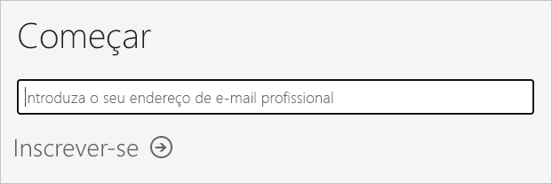
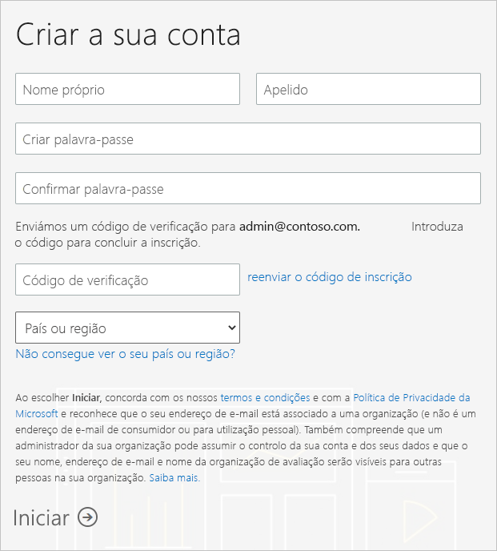

# Obter uma subscrição do Power BI para a sua organização

Como administrador, pode inscrever-se no Power BI através do [site do Power BI](https://powerbi.microsoft.com). Também se pode inscrever na página dos serviços de compra no centro de administração do Microsoft 365. Quando um administrador se inscreve no Power BI, pode atribuir licenças aos utilizadores que devem ter acesso.

Além disso, os utilizadores individuais na sua organização podem inscrever-se no Power BI através do site do Power BI. Quando um utilizador na sua organização se inscreve no Power BI, é atribuída automaticamente uma licença do Power BI a esse utilizador. Se quiser desativar esta capacidade, siga os passos em [Ativar ou desativar a compra e inscrição de gestão personalizada](service-admin-disable-self-service.md).

## Inscrever-se através do Power BI

Precisará de uma conta de trabalho ou escolar para se inscrever numa subscrição do Power BI. O nosso serviço não suporta endereços de e-mail de serviços de e-mail de consumidores nem de fornecedores de telecomunicações.

Siga estes passos para se inscrever:

1. Aceda ao [site do Power BI](https://powerbi.microsoft.com). Selecione **Experimente gratuitamente**.
2. Introduza o endereço de e-mail de trabalho e, em seguida, selecione **Inscrição**.

   

3. Confirme a identidade. Vamos contactar telefonicamente ou enviar uma mensagem com o código de verificação a utilizar.
4. Selecione **Sim** para confirmar que está a utilizar um endereço de e-mail que obteve da empresa.
5. Crie a conta. Enviamos um código de verificação para o seu endereço de e-mail para concluir a inscrição.

   

## Inscrever-se através do Microsoft 365

Se for um administrador de faturação ou um administrador global do Microsoft 365, poderá obter uma subscrição do Power BI para a sua organização. Para obter mais informações, veja [Quem pode comprar e atribuir licenças?](service-admin-licensing-organization.md#who-can-purchase-and-assign-licenses)

> [!NOTE]
>
> Uma subscrição do Microsoft 365 E5 já inclui as licenças do Power BI Pro. Para saber como gerir licenças, veja [Ver e gerir licenças de utilizador](service-admin-manage-licenses.md).
>
>

Siga estes passos para comprar licenças do Power BI Pro no centro de administração do Microsoft 365:

1. Inicie sessão no [centro de administração do Microsoft 365](https://admin.microsoft.com).

2. No menu de navegação, selecione **Faturação** > **Comprar serviços**.
  
   

3. Procure ou percorra para encontrar a subscrição que quer comprar. Encontrará o **Power BI** em **Outras categorias que possam interessar-lhe** perto da parte inferior da página. Selecione a ligação para visualizar as subscrições do Power BI disponíveis para a sua organização.

4. Selecione uma oferta, como o Power BI Pro.

5. Na página **Serviços de compra**, selecione **Comprar**. Se ainda não a tiver utilizado anteriormente, poderá iniciar uma subscrição de avaliação gratuita do Power BI Pro, que inclui 25 licenças e expira no prazo de um mês.

   

6. Selecione **Pagar mensalmente** ou **Pagar o ano completo** de acordo com a forma que quer pagar.

7. Em **Quantos utilizadores quer?** , introduza o número de licenças que quer comprar e, em seguida, selecione **Finalizar compra agora** e conclua a transação.

8. Para verificar a sua compra, vá para **Faturação** > **Produtos e serviços** e procure **Power BI Pro**.

Para obter mais informações sobre como a sua organização pode adquirir o serviço Power BI, veja [Power BI na sua organização](https://docs.microsoft.com/microsoft-365/admin/misc/power-bi-in-your-organization?view=o365-worldwide).

## Próximos passos

- [Ver e gerir licenças de utilizador](service-admin-manage-licenses.md)
- [Ativar ou desativar a compra e inscrição de gestão personalizada](service-admin-disable-self-service.md)
- [Subscrição para empresas e documentação de faturação](https://docs.microsoft.com/microsoft-365/commerce/?view=o365-worldwide)
