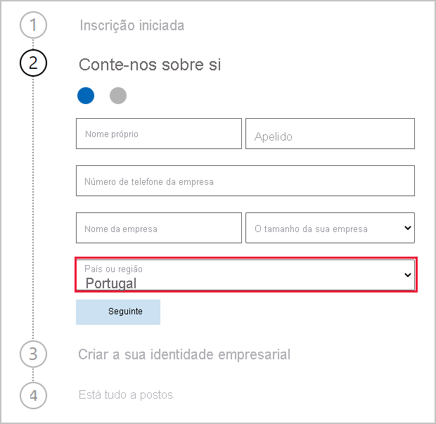

# Obter uma subscrição do serviço Power BI para a sua organização

Os administradores podem inscrever-se no serviço Power BI na página **Comprar serviços** do centro de administração do Microsoft 365. Quando um administrador se inscreve no Power BI, pode atribuir licenças aos utilizadores que devem ter acesso.

Os utilizadores na sua organização podem inscrever-se no Power BI através do site do Power BI. Quando um utilizador na sua organização se inscreve no Power BI, é atribuída automaticamente uma licença do Power BI a esse utilizador. Se quiser desativar a capacidade de gestão personalizada, siga os passos em [Ativar ou desativar a compra e inscrição de gestão personalizada](service-admin-disable-self-service.md).

## Inscrever-se através do Microsoft 365

Se for administrador de faturação ou administrador global, pode obter uma subscrição do Power BI para a sua organização. Para obter mais informações, veja [Quem pode comprar e atribuir licenças?](service-admin-licensing-organization.md#who-can-purchase-and-assign-licenses)

> [!NOTE]
>
> Uma subscrição do Microsoft 365 E5 já inclui as licenças do Power BI Pro. Para saber como gerir licenças, veja [Ver e gerir licenças de utilizador](service-admin-manage-licenses.md).
>
>

Siga estes passos para comprar licenças do Power BI Pro no centro de administração do Microsoft 365:

1. Inicie sessão no [centro de administração do Microsoft 365](https://admin.microsoft.com).

2. No menu de navegação, selecione **Faturação** > **Comprar serviços**.
  
   

3. Procure ou percorra para encontrar a subscrição que quer comprar. Encontrará o **Power BI** em **Outras categorias que possam interessar-lhe** perto da parte inferior da página. Selecione a ligação para visualizar as subscrições do Power BI disponíveis para a sua organização.

4. Selecione uma oferta, como o Power BI Pro.

5. Na página **Serviços de compra**, selecione **Comprar**. Se ainda não a tiver utilizado anteriormente, poderá iniciar uma subscrição de avaliação gratuita do Power BI Pro, que inclui 25 licenças e expira no prazo de um mês.

   

6. Selecione **Pagar mensalmente** ou **Pagar o ano completo** de acordo com a forma que quer pagar.

7. Em **Quantos utilizadores quer?** , introduza o número de licenças que quer comprar e, em seguida, selecione **Finalizar compra agora** e conclua a transação.

8. Para verificar a sua compra, vá para **Faturação** > **Produtos e serviços** e procure **Power BI Pro**.

Para ler mais sobre como a sua organização pode controlar e adquirir o serviço Power BI, veja [O Power BI na sua organização](/microsoft-365/admin/misc/power-bi-in-your-organization?view=o365-worldwide).

## Mais formas de obter o Power BI para a sua organização

Se ainda não for um subscritor do Microsoft 365, siga os passos abaixo para obter uma versão de avaliação do Power BI Pro para a sua organização. Em alternativa, pode [Inscrever-se numa nova versão de avaliação do Microsoft 365](service-admin-signing-up-for-power-bi-with-a-new-office-365-trial.md) e adicionar o Power BI ao seguir os passos na secção anterior.

Precisará de uma conta de trabalho ou escolar para se inscrever numa subscrição do Power BI. O nosso serviço não suporta endereços de e-mail de serviços de e-mail de consumidores nem de fornecedores de telecomunicações. Se não tiver uma conta escolar ou profissional, pode criar uma durante a inscrição.

Siga estes passos para se inscrever:

1. Aceda à [inscrição do Power BI Pro](https://signup.microsoft.com/create-account/signup?OfferId=d59682f3-3e3b-4686-9c00-7c7c1c736085&ali=1&products=d59682f3-3e3b-4686-9c00-7c7c1c736085). 

2. Introduza o seu endereço de e-mail escolar ou profissional e selecione **Seguinte**. Pode introduzir um endereço de e-mail que não seja considerado um endereço de e-mail escolar ou profissional. Configuraremos uma nova conta para si, quando criar a sua identidade empresarial.

   

3. Efetuamos uma verificação rápida para ver se precisa de criar uma nova conta. Selecione **Configurar conta** para continuar o processo de inscrição.

   > [!NOTE]
   >Em alternativa, se o seu endereço de e-mail já estiver a ser utilizado noutro serviço Microsoft, pode **Iniciar sessão** ou **Criar uma nova conta**. Se optar por criar uma nova conta, continue a seguir estes passos para a configurar.
>
>
 
4. Preencha o formulário para nos dar informações sobre si. Certifique-se de que seleciona o país ou região correta. O país/região que selecionar determinará o local em que os seus dados são armazenados, tal como explicado em [Como determinar onde está localizado o inquilino do Power BI](service-admin-where-is-my-tenant-located.md#how-to-determine-where-your-power-bi-tenant-is-located).

   

5. Selecione **Seguinte**. Precisamos de enviar um código de verificação para confirmar a sua identidade. Forneça um número de telefone para o qual possamos telefonar ou enviar uma mensagem SMS. Em seguida, selecione **Enviar Código de Verificação**.

6. Introduza o código de verificação e continue para o passo **Criar a sua identidade empresarial**.

   

    Introduza um nome abreviado para a sua empresa e iremos confirmar se está disponível. Utilizaremos este nome abreviado para criar o nome da sua organização no datacenter, como um subdomínio de onmicrosoft.com. Pode adicionar o seu próprio domínio da empresa mais tarde. Se o nome abreviado que pretende já estiver a ser utilizado, não se preocupe. É provável que alguém com um nome de empresa semelhante tenha escolhido o mesmo nome abreviado. Experimente outra alternativa. Selecione **Seguinte**.
    
7. Crie o seu ID de utilizador e palavra-passe para iniciar sessão na sua conta. Selecione **Inscrever-se** e já está.

A conta que criou é agora o administrador global de um novo inquilino da versão de avaliação do Power BI Pro. Pode iniciar sessão no [centro de administração do Microsoft 365](https://admin.microsoft.com) para adicionar mais utilizadores, configurar um domínio personalizado, comprar mais serviços e gerir a sua subscrição do Power BI.

## Próximos passos

- [Ver e gerir licenças de utilizador](service-admin-manage-licenses.md)
- [Ativar ou desativar a compra e inscrição de gestão personalizada](service-admin-disable-self-service.md)
- [Subscrição para empresas e documentação de faturação](/microsoft-365/commerce/?view=o365-worldwide)