# Administrar o Power BI no portal de administração

O portal de administração permite-lhe gerir as definições do Power BI para a sua organização. O portal inclui itens como métricas de utilização, acesso ao centro de administração do Microsoft 365 e definições de inquilino.

O portal de administração completo está acessível para administradores globais e utilizadores com a função Administrador de serviço do Power BI. Se não estiver numa destas funções, verá apenas as **Definições de capacidade** no portal. Para obter mais informações sobre a função de administrador do serviço Power BI, veja [Noções básicas sobre a função de administrador do Power BI](service-admin-role.md).

## Como aceder ao portal de administração

Tem de ser um administrador global ou um administrador de serviço do Power BI para aceder ao portal de administração do Power BI. Para obter mais informações sobre a função de administrador do serviço Power BI, veja [Noções básicas sobre a função de administrador do Power BI](service-admin-role.md). Para aceder ao portal de administração do Power BI, siga estes passos:

1. Inicie sessão no [Power BI](https://app.powerbi.com) com as credenciais da sua conta de administrador.

1. No cabeçalho da página, selecione **Definições** > **Portal de administração**.

    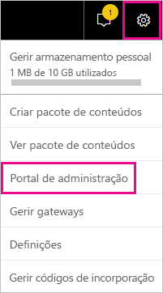

O Portal de administração tem várias secções. O resto deste artigo disponibiliza informações sobre cada um dessas secções.

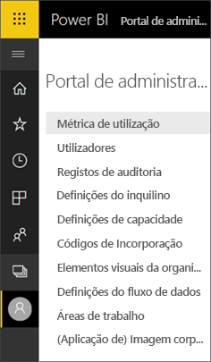

* [Métricas de utilização](#usage-metrics)
* [Utilizadores](#users)
* [Registos de auditoria](#audit-logs)
* [Definições de inquilino](#tenant-settings)
* [Definições de capacidade](#capacity-settings)
* [Códigos de incorporação](#embed-codes)
* [Elementos visuais da organização](organizational-visuals.md#organizational-visuals)
* [Ligações do Azure (pré-visualização)](#azure-connections-preview)
* [Áreas de trabalho](#workspaces)
* [Imagem corporativa personalizada](#custom-branding)
* [Métricas de proteção](#protection-metrics)
* [Conteúdo em destaque](#featured-content)

## Métricas de utilização

As **Métricas de utilização** permitem-lhe monitorizar a utilização do Power BI da sua organização. Também mostram quais os utilizadores e os grupos da sua organização mais ativos no Power BI.

> [!NOTE]
> Quando aceder ao dashboard pela primeira vez ou depois de voltar após um período longo em que não visualizou o dashboard, provavelmente verá um ecrã de carregamento enquanto carregamos o dashboard.

Após o carregamento do dashboard, verá duas secções de mosaicos. A primeira secção inclui os dados de utilização dos utilizadores individuais e a segunda secção tem informações semelhantes dos grupos.

Segue-se uma análise detalhada do que pode ver em cada mosaico:

* Contagem distinta de todos os dashboards, relatórios e conjuntos de dados na área de trabalho do utilizador.
  
    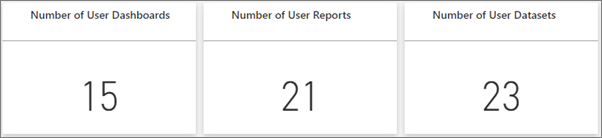

* O dashboard mais consumido pelo número de utilizadores que podem aceder ao mesmo. Por exemplo: Tem um dashboard que partilhou com três utilizadores. Também adicionou o dashboard a um pacote de conteúdos ao qual dois utilizadores diferentes se ligaram. A contagem do dashboard seria 6 (1 + 3 + 2).
  
    

* Os utilizadores de conteúdo mais populares ligados ao mesmo. O conteúdo será qualquer item a que os utilizadores possam aceder através do processo Obter Dados, como pacotes de conteúdos SaaS, pacotes de conteúdos Organizacionais, ficheiros ou bases de dados.

  
    

* Uma vista dos principais utilizadores com base no número de dashboards que têm, tanto os dashboards que criaram como os dashboards partilhados com eles.
  
    

* Uma vista dos principais utilizadores com base no número de relatórios que têm.
  
    

A segunda secção apresenta o mesmo tipo de informação, mas com base em grupos. Esta secção permite-lhe ver quais os grupos mais ativos na sua organização e o tipo de conteúdo que estão a consumir.

Com estes dados, pode obter informações reais sobre como as pessoas estão a utilizar o Power BI na sua organização.

## Controlar métricas de utilização

Os relatórios de métrica de utilização são uma funcionalidade que o administrador do Power BI ou global pode ativar ou desativar. Os administradores têm controlo granular sobre quais utilizadores têm acesso às métricas de utilização. As métricas estão **Ativadas** por predefinição para todos os utilizadores na organização.

Os administradores também podem determinar se os criadores de conteúdo podem ver dados por utilizador nas métricas de utilização. 

Veja [Monitorizar as métricas de utilização para dashboards e relatórios do Power BI](../collaborate-share/service-usage-metrics.md) para obter detalhes sobre os relatórios.

### Métricas de utilização para criadores de conteúdo

1. No Portal de administração, selecione **Definições de inquilino** > **Definições de auditoria e utilização** > **Métricas de utilização para criadores de conteúdo**.

    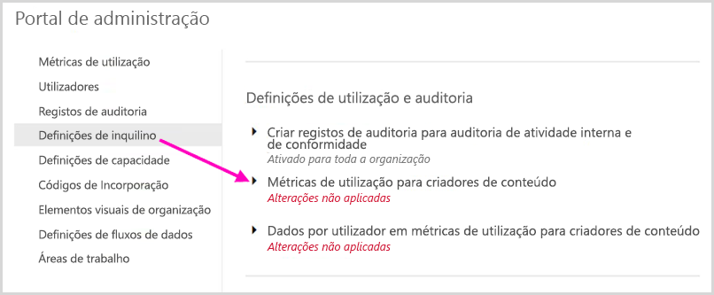

1. Ative (ou desative) as métricas de utilização > **Aplicar**.

    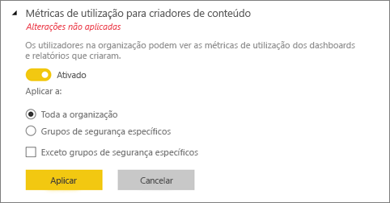

### Dados por utilizador em métricas de utilização para criadores de conteúdo

Por predefinição, os dados por utilizador estão ativados para métricas de utilização e as informações da conta estão incluídas no relatório de métricas. Se não quiser incluir informações da conta para alguns ou para todos os utilizadores, desative a funcionalidade para grupos de segurança específicos ou para toda a organização. As informações da conta são apresentadas no relatório como *Sem nome*.

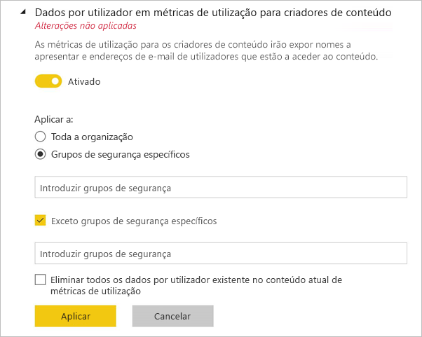

### Eliminar todo o conteúdo das métricas de utilização existente

Ao desativar as métricas de utilização para toda a respetiva organização, os administradores também podem escolher uma ou ambas as opções para:

- **Eliminar todo o conteúdo das métricas de utilização existente** para eliminar todos os relatórios e mosaicos de dashboard existentes que foram criados com os conjuntos de dados e relatórios de métricas de utilização. Esta opção remove todo o acesso a dados da métrica de utilização por parte de todos os utilizadores na organização que possam estar a utilizá-lo.
- **Eliminar todos os dados por utilizador existentes no conteúdo de métricas de utilização atual**; esta opção remove todo o acesso a dados das métricas de utilização por parte de todos os utilizadores na organização que possam estar a utilizá-los. 

Tenha cuidado, uma vez que eliminar o conteúdo das métricas de utilização por utilizador existente é irreversível.

## Utilizadores

Os utilizadores, grupos e administradores do Power BI são geridos no centro de administração do Microsoft 365. O separador **Utilizadores** disponibiliza uma ligação para o centro de administração.

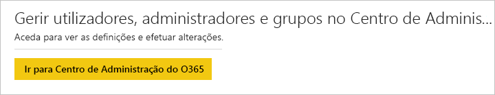

## Registos de auditoria

Os registos de auditoria do Power BI são geridos no centro de Segurança e Conformidade do Office 365. O separador **Registos de auditoria** proporciona uma ligação para o centro de Segurança e Conformidade. Para saber mais, veja [Controlar as atividades dos utilizadores no Power BI](service-admin-auditing.md).

Para utilizar os registos de auditoria, verifique se a definição [**Criar registos de auditoria para auditoria de atividade interna e de conformidade**](#create-audit-logs-for-internal-activity-auditing-and-compliance) está ativada.

## Definições do inquilino

As **Definições de inquilino** permitem um controlo refinado sobre as funcionalidades que são disponibilizadas à sua organização. Se tiver problemas com dados confidenciais, algumas das nossas funcionalidades poderão não ser adequadas para a sua organização ou poderá querer apenas uma determinada funcionalidade disponível para um grupo específico.

> [!NOTE]
> As definições de inquilino que controlam a disponibilidade das funcionalidades na interface do utilizador do Power BI podem ajudar a estabelecer políticas de governação, mas não são uma medida de segurança. Por exemplo, a definição **Exportar dados** não restringe as permissões de um utilizador do Power BI num conjunto de dados. Os utilizadores do Power BI com acesso de leitura a um conjunto de dados têm permissão para consultar este conjunto de dados e poderão conseguir fazer persistir os resultados sem utilizar a funcionalidade **Exportar dados** na interface do utilizador do Power BI.

A seguinte imagem apresenta várias definições no separador **Definições de inquilino**.

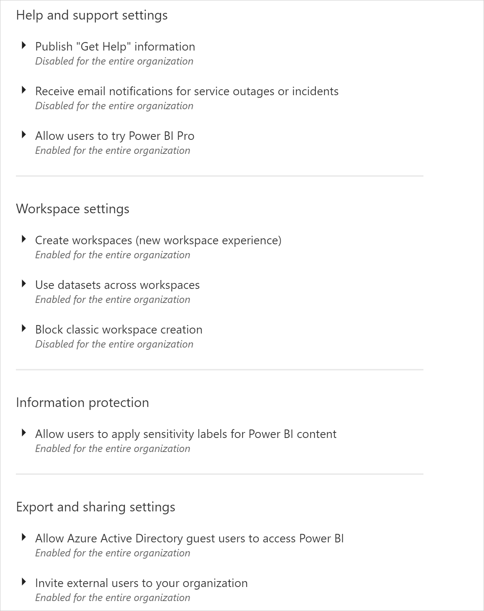

> [!NOTE]
> Pode demorar até 15 minutos para a alteração à definição ter efeito para todos os utilizadores na sua organização.

As definições podem ter um de três estados:

* **Desativado para toda a organização**: Ninguém na sua organização pode utilizar esta funcionalidade.

    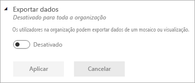

* **Ativado para toda a organização**: Todas as pessoas na sua organização podem utilizar esta funcionalidade.

    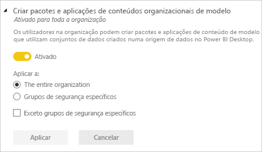

* **Ativado para um subconjunto da organização**: Em vez de ativar a funcionalidade para toda a organização, pode aplicar a definição a **Grupos de segurança específicos** na sua organização que têm permissão para utilizar esta funcionalidade.

    Também pode ativar uma funcionalidade para toda a organização, **Exceto grupos de segurança específicos**.

    

    Pode também combinar definições para ativar a funcionalidade apenas para um grupo específico de utilizadores ou desativá-la para um grupo de utilizadores. Utilizar esta abordagem assegura que determinados utilizadores não tenham acesso à funcionalidade mesmo que estejam no grupo permitido. Aplica-se a definição mais restritiva para um utilizador.

    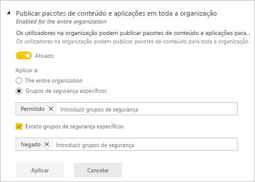

As próximas secções fornecem uma descrição geral dos diferentes tipos de definições de inquilino.

## Definições de ajuda e suporte

### Publicar informações para "Obter Ajuda"

Os administradores podem especificar URLs internos para substituir o destino de ligações no menu de ajuda do Power BI e para atualizações de licença. Se forem definidos URLs personalizados, os utilizadores da organização acedem a recursos de ajuda e suporte internos em vez de acederem aos destinos predefinidos. Os seguintes destinos de recursos podem ser personalizados:

* **Learn**. Por predefinição, esta ligação do menu de ajuda tem como destino uma [lista de todos os nossos módulos e percursos de aprendizagem do Power BI](https://docs.microsoft.com/learn/browse/?products=power-bi). Para direcionar esta ligação para os recursos de preparação internos, defina um URL personalizado para a **Documentação de preparação**.

* **Comunidade**. Para direcionar os utilizadores para um fórum interno a partir do menu de ajuda em vez da [Comunidade do Power BI](https://community.powerbi.com/), defina um URL personalizado para um **Fórum de debate**.

* **Atualizações de licenciamento**. Os utilizadores com uma licença do Power BI (gratuito) podem ter a oportunidade de atualizar a respetiva conta para o Power BI Pro ao utilizar o serviço. Se especificar um URL interno para **Pedidos de licenciamento**, redireciona os utilizadores para um fluxo de pedido e compra interno e impede que estes façam uma compra de gestão personalizada. Se quiser impedir os utilizadores de comprarem licenças, mas não de iniciarem uma avaliação do Power BI Pro, veja [Permitir que os utilizadores experimentem o Power BI Pro](#allow-users-to-try-power-bi-pro) para separar as experiências de compra e avaliação.

* **Obter ajuda**. Para direcionar os utilizadores para o suporte técnico interno a partir do menu de ajuda em vez do [Suporte do Power BI](https://powerbi.microsoft.com/support/), defina um URL personalizado para o **Suporte Técnico**.

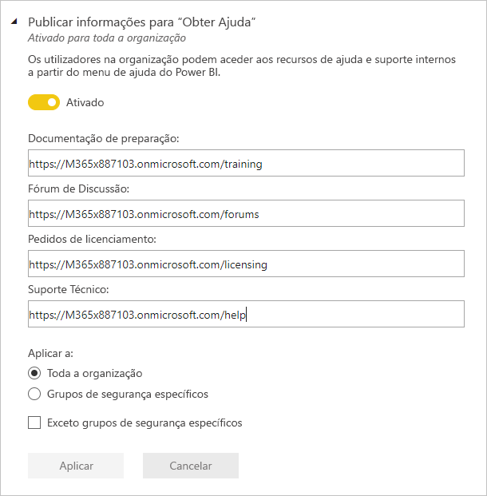

### Receber notificações por e-mail sobre incidentes ou indisponibilidades do serviço

Os grupos de segurança com capacidade de correio receberão notificações de e-mail se este inquilino for afetado por um incidente ou uma indisponibilidade do serviço. Saiba mais sobre as [Notificações de interrupção do serviço](service-interruption-notifications.md).

### Permitir que os utilizadores experimentem o Power BI Pro

A definição para **Permitir que os utilizadores experimentem o Power BI Pro** está ativada por predefinição e dá-lhe mais controlo sobre a forma como os utilizadores adquirem licenças do Power BI Pro. Nos cenários em que bloqueou a compra de gestão personalizada, esta definição permite que os utilizadores iniciem uma avaliação do Power BI Pro. A experiência do utilizador final depende da forma como combina as definições de licença. A tabela abaixo mostra como diferentes combinações de definições afetam a experiência de atualização do Power BI (gratuito) para o Power BI Pro:

| Definição Compra de gestão personalizada | Definição Permitir que os utilizadores experimentem o Power BI Pro | Experiência de utilizador final |
| ------ | ------ | ----- |
| Ativado | Desativado | O utilizador pode comprar uma licença do Pro, mas não pode iniciar uma avaliação |
| Ativado | Ativado | O utilizador pode iniciar uma avaliação gratuita do Pro e atualizar para uma licença paga |
| Desativado | Desativado | O utilizador vê uma mensagem para contactar o administrador de TI para pedir uma licença |
| Desativado | Ativado | O utilizador pode iniciar uma avaliação do Pro, mas tem de contactar o administrador de TI para obter uma licença paga |

> [!NOTE]
> Pode adicionar um URL interno para pedidos de licenciamento nas [Definições de ajuda e suporte](#help-and-support-settings). Se definir o URL, este substitui a experiência de compra predefinida. Os utilizadores que podem comprar uma licença nos cenários descritos na tabela acima são redirecionados para o URL interno.

Para saber mais, veja [Ativar ou desativar a compra e inscrição de gestão personalizada](service-admin-disable-self-service.md)

## Definições de área de trabalho

Em **Definições de inquilino**, o portal de administração possui três secções para controlar áreas de trabalho:

- [Criar as novas experiências de área de trabalho](#create-the-new-workspaces).
- [Utilizar conjuntos de dados em áreas de trabalho](#use-datasets-across-workspaces).
- [Impedir a criação de áreas de trabalho clássicas](#block-classic-workspace-creation).

### Criar as novas áreas de trabalho

As áreas de trabalho são locais onde os utilizadores podem colaborar em dashboards, relatórios e outros conteúdos. Os administradores utilizam a definição **Criar áreas de trabalho (nova experiência de área de trabalho)** para indicar quais são os utilizadores na organização que podem criar áreas de trabalho. Os administradores podem permitir que todos os utilizadores ou nenhum utilizador numa organização crie novas áreas de trabalho de experiências de área de trabalho. Também podem limitar a criação a membros de grupos de segurança específicos. Saiba mais sobre as [áreas de trabalho](../collaborate-share/service-new-workspaces.md).

:::image type="content" source="media/service-admin-portal/power-bi-admin-workspace-settings.png" alt-text="Criar as novas experiências de área de trabalho":::

No caso das áreas de trabalho clássicas com base em Grupos do Microsoft 365, a administração continua a ocorrer no portal de administração do Microsoft 365 e no Azure Active Directory.

> [!NOTE]
> Por predefinição, a definição **Criar áreas de trabalho (nova experiência de área de trabalho)** permite que apenas os utilizadores que podem criar Grupos do Microsoft 365 possam criar novas áreas de trabalho no Power BI. Confirme que define um valor no portal de administração do Power BI para garantir que os utilizadores apropriados os podem criar.

**Lista de áreas de trabalho**

O portal de administração tem outra secção de definições sobre as áreas de trabalho no seu inquilino. Nesta secção, pode ordenar e filtrar a lista de áreas de trabalho e ver os detalhes de cada área de trabalho. Veja a secção [Áreas de trabalho](#workspaces) neste artigo para obter mais detalhes.

**Publicar pacotes de conteúdo e aplicações**

No portal de administração, também controla quais os utilizadores que têm permissão para distribuir aplicações para a organização. Veja [Publicar pacotes de conteúdo e aplicações em toda a organização](#publish-content-packs-and-apps-to-the-entire-organization) neste artigo para obter detalhes.

### Utilizar conjuntos de dados em áreas de trabalho

Os administradores podem controlar quais os utilizadores na organização que podem utilizar conjuntos de dados em áreas de trabalho. Quando esta definição está ativada, os utilizadores ainda precisam da Permissão de compilação para um conjunto de dados específico.

:::image type="content" source="media/service-admin-portal/power-bi-admin-datasets-workspaces.png" alt-text="Utilizar conjuntos de dados em áreas de trabalho":::

Veja [Introdução aos conjuntos de dados em áreas de trabalho](../connect-data/service-datasets-across-workspaces.md) para obter mais informações.

### Impedir a criação de áreas de trabalho clássicas

Os administradores podem controlar se a organização pode criar áreas de trabalho clássicas. Quando esta definição está ativada, os utilizadores que criam uma área de trabalho só podem criar áreas de trabalho da nova experiência. 

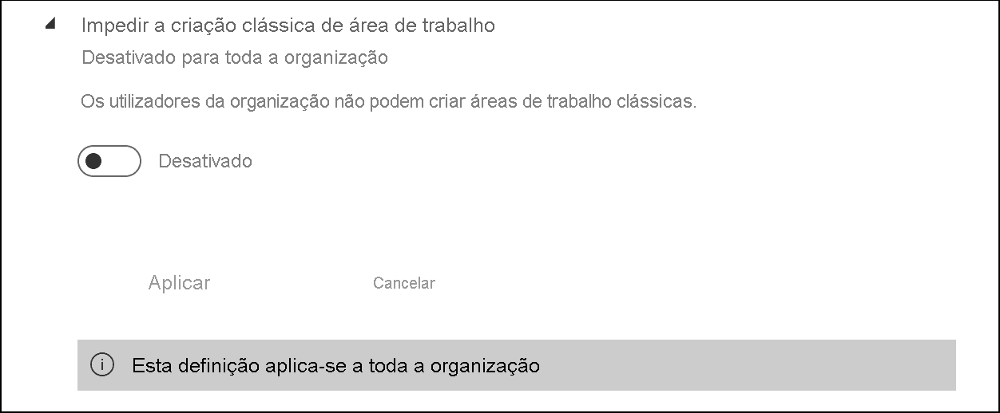

Quando estiver ativada, os Grupos do Office 365 criados recentemente não serão apresentados na lista de áreas de trabalho do Power BI. As áreas de trabalho clássicas existentes continuarão a ser apresentadas na lista. Quando a definição estiver desativada, todos os Grupos do Office 365 dos quais o utilizador é membro aparecerão na lista de áreas de trabalho. Leia mais sobre as [áreas de trabalho da nova experiência](../collaborate-share/service-new-workspaces.md).

## Definições de exportação e partilha

### Permitir que utilizadores convidados do Azure Active Directory acedam ao Power BI

Ao ativar esta definição, permite que os utilizadores do Azure AD B2B (Azure Active Directory Business-to-Business) acedam ao Power BI. Ao desativar esta definição, os utilizadores convidados veem um erro ao tentar aceder ao Power BI. Quando desativa esta definição para toda a organização, também está a impedir que os utilizadores convidem pessoas para a sua organização. Utilize a opção de grupos de segurança específicos para controlar que utilizadores convidados podem aceder ao Power BI.

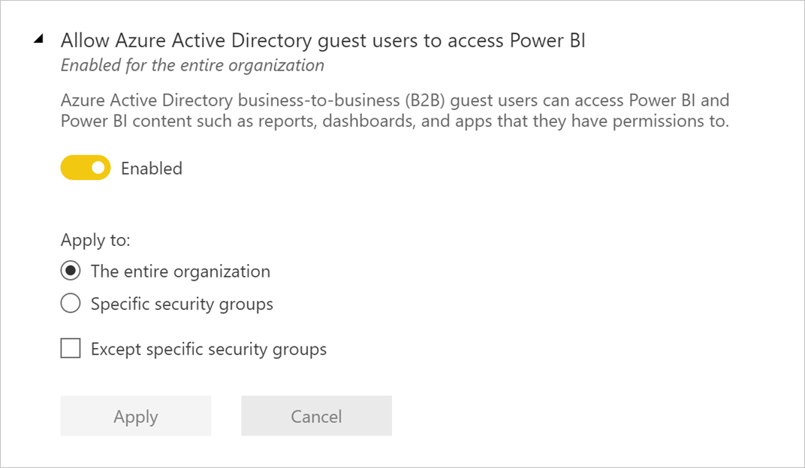

### Convidar utilizadores externos para a sua organização 

A definição **Convidar utilizadores externos para a sua organização** ajuda as organizações a decidir se os novos utilizadores externos podem ser convidados para a organização através das experiências de partilha e permissões do Power BI. Quando desativada, se um utilizador externo ainda não for um utilizador convidado na organização, não poderá ser adicionado à organização através do Power BI. 

> [!IMPORTANT]
> Esta definição chamava-se anteriormente "Partilhar conteúdos com utilizadores externos". O novo nome reflete com mais precisão o que a definição faz.

Para convidar utilizadores externos para a sua organização, um utilizador também precisa da função Emitente de Convites do Azure Active Directory. Esta definição só controla a capacidade de convidar através do Power BI. 

### Publicar na Web

Como administrador de um inquilino do Power BI, a definição **Publicar na Web** permite-lhe escolher os utilizadores que podem criar códigos de incorporação para publicar relatórios na Web. Esta funcionalidade permite-lhe disponibilizar o relatório e os dados que contém a qualquer pessoa na Web. Saiba mais sobre como [publicar na Web](../collaborate-share/service-publish-to-web.md).

> [!NOTE]
> Apenas o administrador do Power BI pode permitir a criação de novos códigos de incorporação de publicação na Web. As organizações poderão já ter códigos de incorporação. Veja a secção [Códigos de incorporação](service-admin-portal.md#embed-codes) do portal de administração para consultar os relatórios atualmente publicados.

A imagem seguinte mostra o menu **Mais opções (...)** de um relatório quando a definição **Publicar na Web** está ativada.

A definição **Publicar na Web** no portal de administração permite escolher os utilizadores que podem criar códigos de incorporação.

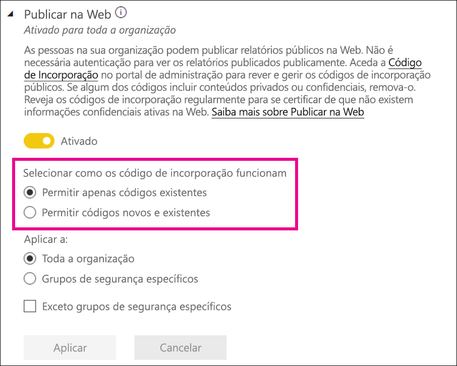

Os administradores podem definir **Publicar na Web** como **Ativada** e **Escolha como funcionam os códigos de incorporação** como **Permitir apenas códigos de incorporação existentes**. Nesse caso, os utilizadores podem criar códigos de incorporação, mas têm de contactar o administrador do Power BI para lhes permitir isso.

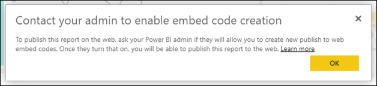

Os utilizadores veem opções diferentes na IU consoante a definição **Publicar na Web**.

|Funcionalidade |Ativada para toda a organização |Desativada para toda a organização |Grupos de segurança específicos   |
|---------|---------|---------|---------|
|**Publicar na Web** no menu **Mais opções (...)** do relatório|Ativada para todos|Não visível para todos|Visível apenas para utilizadores ou grupos autorizados.|
|**Gerir códigos de incorporação**, em **Definições**|Ativada para todos|Ativada para todos|Ativada para todos  * A opção **Eliminar** está ativada apenas para utilizadores e grupos autorizados. * A opção **Obter códigos** está ativada para todos.|
|**Incorporar códigos** no portal de administração|O estado é um dos seguintes: * Ativo * Não suportado * Bloqueado|O estado apresenta **Desativado**|O estado é um dos seguintes: * Ativo * Não suportado * Bloqueado  Se um utilizador não tiver autorizações com base na definição do inquilino, o estado é apresentado como **Em violação**.|
|Relatórios publicados existentes|Todos ativados|Todos desativados|Os relatórios continuam a ser compostos para todos.|

### Exportar dados

Os utilizadores na organização podem exportar dados de um mosaico ou visualização. Isto controla a funcionalidade Analisar no Excel, a exportação para .csv, as transferências de conjuntos de dados (.pbix) e o Live Connect do Serviço Power BI. Saiba mais sobre como [exportar dados a partir de um mosaico ou elemento visual](../visuals/power-bi-visualization-export-data.md).

>[!NOTE]
> Antes da introdução da definição Exportar para o Excel, esta definição também controlava a exportação dos dados para ficheiros do Excel. Consulte a [nota em Exportar para o Excel](#export-to-excel) para obter detalhes.

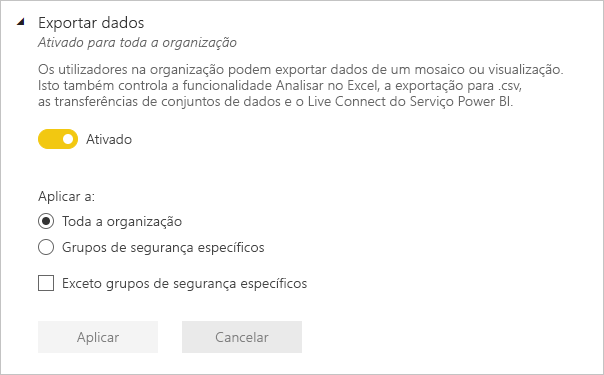

A imagem seguinte mostra a opção para exportar os dados de um mosaico.

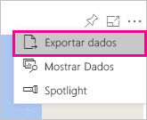

> [!NOTE]
> Desativar a opção **Exportar Dados** também impede os utilizadores de usarem a funcionalidade [Analisar no Excel](../collaborate-share/service-analyze-in-excel.md), bem como a ligação em direto do serviço Power BI.

### Exportar para o Excel

Os utilizadores da organização podem exportar os dados de uma visualização para um ficheiro do Excel.

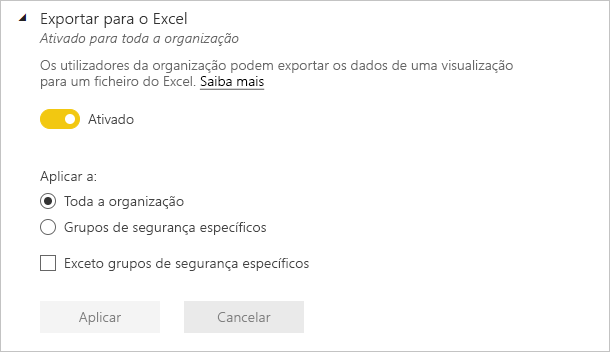

>[!IMPORTANT]
> Antes da introdução da definição Exportar para o Excel, a exportação para o Excel era controlada pela definição Exportar dados. Como tal, nos inquilinos que existiam antes da introdução da definição Exportar para o Excel, na primeira vez que os administradores de inquilinos observarem a definição Exportar para o Excel, verão que tem *Alterações não aplicadas*. Têm de aplicar estas alterações para que a nova definição entre em vigor. Caso contrário, a exportação para um ficheiro do Excel continuará a ser controlada pela definição Exportar dados.

### Exportar relatórios como apresentações do PowerPoint ou documentos PDF

Os utilizadores na organização podem exportar relatórios do Power BI como ficheiros do PowerPoint ou documentos PDF. [Saiba mais](../consumer/end-user-powerpoint.md)

A seguinte imagem mostra o menu **Ficheiro** de um relatório quando a definição **Exportar relatórios como apresentações do PowerPoint ou documentos PDF** está ativada.

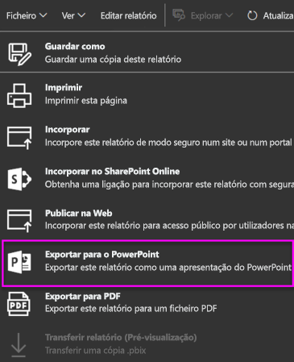

### Imprimir dashboards e relatórios

Os utilizadores na organização podem imprimir dashboards e relatórios. [Saiba mais](../consumer/end-user-print.md)

A imagem seguinte mostra a opção para imprimir um dashboard.

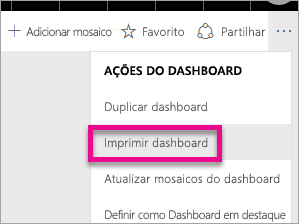

A imagem seguinte mostra o menu **Ficheiro** de um relatório quando a definição **Imprimir dashboards e relatórios** está ativada.

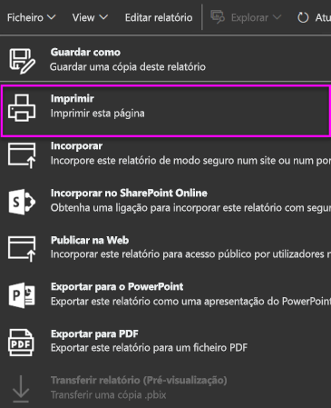

### Permitir aos utilizadores externos convidados editarem e gerirem conteúdo na organização

Os utilizadores convidados do Azure AD B2B podem editar e gerir o conteúdo na organização. [Saiba mais](service-admin-azure-ad-b2b.md)

A seguinte imagem mostra a opção Permitir aos utilizadores externos convidados editarem e gerirem conteúdo na organização.

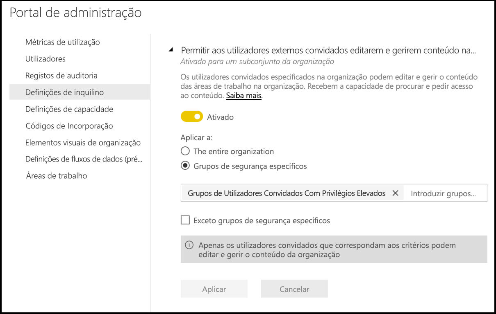

No portal de administração, também controla quais os utilizadores que têm permissão para convidar utilizadores externos para a organização. Veja [Partilhar conteúdo com utilizadores externos](#export-and-sharing-settings) neste artigo para obter mais detalhes.

### Subscrições de E-mail
Os utilizadores na organização podem criar subscrições por e-mail. Saiba mais sobre as [subscrições](../collaborate-share/service-publish-to-web.md).

### Conteúdo em destaque

Permita que alguns ou todos os autores de relatórios na sua organização destaquem os respetivos conteúdos na secção Em destaque da Base do Power BI. Os novos utilizadores verão o conteúdo em destaque na parte superior da respetiva Base do Power BI. O conteúdo em destaque move-se na Base à medida que os utilizadores adicionam conteúdos **Favoritos**, **Frequentes** e **Recentes**. 

Recomendamos que comece com um pequeno conjunto de promotores. Permitir que toda a organização destaque conteúdos na Base pode dificultar a monitorização de todos os conteúdos promovidos. 

Após permitir conteúdo em destaque, também pode geri-lo no Portal de administração. Veja [Gerir conteúdo em destaque](#manage-featured-content)neste artigo para ler sobre como controlar conteúdo em destaque no seu domínio.

## Definições da aplicação e do pacote de conteúdos

### Publicar pacotes de conteúdo e aplicações em toda a organização

Os administradores podem utilizar esta definição para decidir que utilizadores podem publicar pacotes de conteúdo e aplicações em toda a organização, ao invés de grupos específicos. Saiba mais sobre como [publicar aplicações](../collaborate-share/service-create-distribute-apps.md).

A imagem seguinte mostra a opção **A minha organização inteira** durante a criação de um pacote de conteúdos.

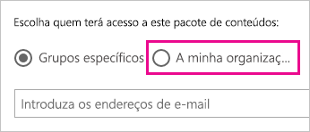

### Criar pacotes de conteúdos organizacionais e aplicações de modelo

Os utilizadores na organização podem criar pacotes de conteúdos organizacionais e aplicações de modelo que utilizam conjuntos de dados incorporados numa origem de dados no Power BI Desktop. Saiba mais sobre as [aplicações de modelo](../connect-data/service-template-apps-create.md).

### Aplicações push para utilizadores finais

Os criadores dos relatórios podem partilhar as aplicações diretamente com os utilizadores finais sem necessitar da instalação do [AppSource](https://appsource.microsoft.com). Saiba mais sobre como [instalar aplicações automaticamente para os utilizadores finais](../collaborate-share/service-create-distribute-apps.md#automatically-install-apps-for-end-users).

## Definições de integração

### Utilizar a funcionalidade Analisar no Excel com conjuntos de dados no local

Os utilizadores na organização podem utilizar o Excel para ver e interagir com conjuntos de dados no local do Power BI. [Saiba mais](../collaborate-share/service-analyze-in-excel.md)

> [!NOTE]
> Desativar a opção **Exportar Dados** também impede os utilizadores de usarem a funcionalidade **Analisar no Excel**.

### Utilizar o ArcGIS Maps for Power BI

Os utilizadores na organização podem utilizar a visualização dos ArcGIS Maps for Power BI fornecida pela Esri. [Saiba mais](../visuals/power-bi-visualization-arcgis.md)

### Utilizar a pesquisa global para o Power BI (Pré-visualização)

Os utilizadores na organização podem utilizar as funcionalidades de pesquisa externa que dependem do Azure Search.

## Definições das tabelas em destaque

Em **Definições do inquilino**, a definição do inquilino **Permitir ligações a tabelas em destaque** permite que os administradores do Power BI controlem que pessoas na organização podem utilizar tabelas em destaque na Galeria de Tipos de Dados do Excel. 

:::image type="content" source="media/service-admin-portal/admin-allow-connections-featured-tables.png" alt-text="Todas as ligações a tabelas em destaque":::

As ligações a tabelas em destaque também estão desativadas se a definição do inquilino **Exportar dados** estiver definida como **Desativado**.

Leia mais sobre as [tabelas em destaque do Power BI no Excel](../collaborate-share/service-excel-featured-tables.md).

## Definição do inquilino Partilhar no Teams

A definição **Partilhar no Teams** está na secção **Definições do inquilino** do portal de administração do Power BI. A definição permite que as organizações ocultem os botões **Partilhar no Teams** no serviço Power BI. Quando estiverem desativados, os utilizadores não verão os botões **Partilhar no Teams** na barra de ação ou menus de contexto quando virem relatórios e dashboards no serviço Power BI.

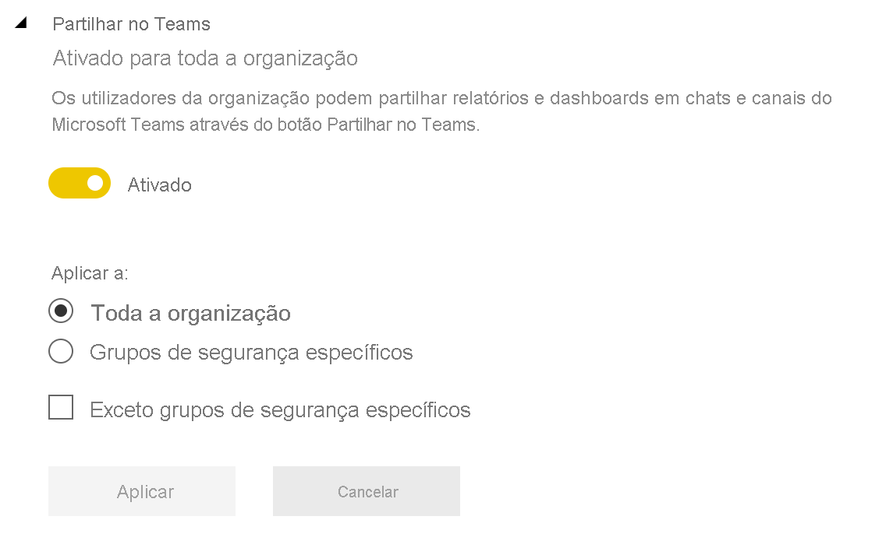

Leia mais sobre [partilhar conteúdos do Power BI no Teams](../collaborate-share/service-share-report-teams.md).

## Definições de elementos visuais R

### Interagir e partilhar visuais R

Os utilizadores na organização podem interagir e partilhar elementos visuais criados com scripts R. [Saiba mais](../visuals/service-r-visuals.md)

> [!NOTE]
> Esta definição aplica-se a toda a organização e não pode estar limitada a grupos específicos.

## Definições de utilização e auditoria

### Criar registos de auditoria para auditoria de atividade interna e de conformidade

Os utilizadores na organização podem utilizar a auditoria para monitorizar as ações executadas no Power BI por outros utilizadores na organização. [Saiba mais](service-admin-auditing.md)

Esta definição tem de estar ativada para as entradas de registo de auditoria serem registadas. Pode existir um intervalo de 48 horas entre a ativação da auditoria e a capacidade de ver os dados da mesma. Se não vir logo os seus dados, consulte os registos de auditoria mais tarde. Pode existir um intervalo de tempo semelhante entre obter a permissão para ver os registos de auditoria e ter acesso aos mesmos.

> [!NOTE]
> Esta definição aplica-se a toda a organização e não pode estar limitada a grupos específicos.

### Métricas de utilização para criadores de conteúdo

Os utilizadores na organização podem ver as métricas de utilização dos dashboards e os relatórios que criam. [Saiba mais](../collaborate-share/service-usage-metrics.md)

### Dados por utilizador em métricas de utilização para criadores de conteúdo

As métricas de utilização para os criadores de conteúdo irão expor nomes a apresentar e endereços de e-mail de utilizadores que estão a aceder ao conteúdo. [Saiba mais](../collaborate-share/service-usage-metrics.md)

Por predefinição, os dados por utilizador estão ativados para métricas de utilização e as informações da conta do criador de conteúdo estão incluídas no relatório de métricas. Se não pretender recolher estas informações para todos os utilizadores, poderá desativar a funcionalidade para grupos de segurança específicos ou para toda a organização. As informações da conta dos utilizadores excluídos serão apresentadas no relatório como *Sem nome*.

## Definições de dashboard

### Classificação de dados para dashboards

Os utilizadores na organização podem identificar os dashboards com classificações que indicam os seus níveis de segurança. [Saiba mais](../create-reports/service-data-classification.md)

> [!NOTE]
> Esta definição aplica-se a toda a organização e não pode estar limitada a grupos específicos.

## Definições de programador

### Incorporar conteúdo em aplicações

Os utilizadores na organização podem incorporar dashboards e relatórios do Power BI em aplicações Software como Serviço (SaaS). Desativar esta definição impede os utilizadores de usarem as APIs REST para incorporar conteúdo do Power BI na respetiva aplicação. [Saiba mais](../developer/embedded/embedding.md)

### Permitir que os principais de serviço utilizem as APIs do Power BI

As aplicações Web registadas no Azure Active Directory (Azure AD) utilizarão um principal de serviço atribuído para aceder às APIs do Power BI que não tenham um utilizador com sessão iniciada. Para que uma aplicação possa utilizar a autenticação do principal de serviço, o respetivo principal de serviço tem de ser incluído num grupo de segurança permitido. [Saiba mais](../developer/embedded/embed-service-principal.md)

> [!NOTE]
> Os principais de serviço herdam as permissões de todas as definições do inquilino do Power BI do respetivo grupo de segurança. Para restringir as permissões, crie um grupo de segurança dedicado para os principais de serviço e adicione-o à lista "Exceto grupos de segurança específicos" para as definições do Power BI relevantes ativadas.

## Definições do fluxo de dados

### Create and use dataflows (Criar e utilizar fluxos de dados)

Os utilizadores na organização podem criar e utilizar fluxos de dados. Para obter uma descrição geral dos fluxos de dados, veja [Preparação personalizada de dados no Power BI](../transform-model/service-dataflows-overview.md). Para ativar os fluxos de dados numa capacidade Premium, veja [Configurar cargas de trabalho](service-admin-premium-workloads.md).

> [!NOTE]
> Esta definição aplica-se a toda a organização e não pode estar limitada a grupos específicos.

## Definições das aplicações de modelo

Três definições controlam a capacidade das aplicações de modelo de publicar ou instalar aplicações de modelo.

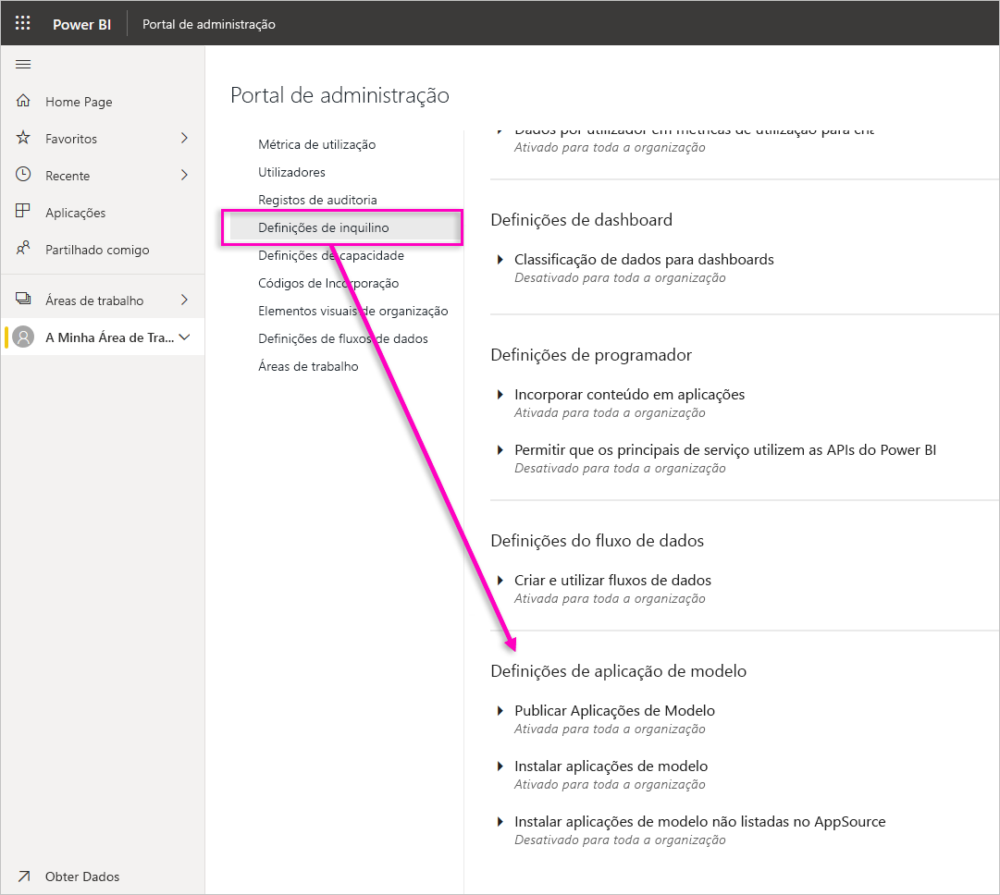

### Publicar Aplicações de Modelo

Os utilizadores na organização podem criar áreas de trabalho de aplicações de modelo. Controle quais os utilizadores que podem publicar aplicações de modelo ou distribuí-las aos clientes fora da sua organização através do [AppSource](https://appsource.microsoft.com) ou de outro método de distribuição.

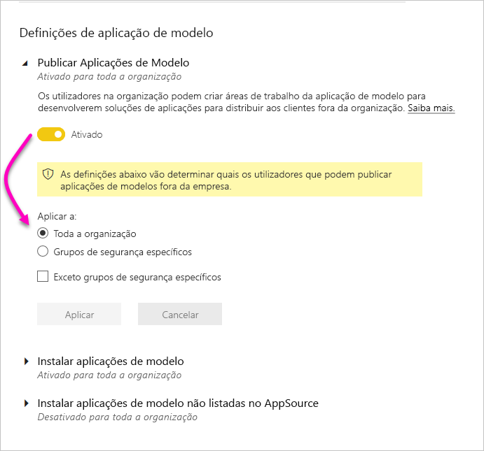

### Instalar aplicações de modelo listadas no AppSource

Os utilizadores na organização podem transferir e instalar aplicações de modelo **apenas** a partir do [AppSource](https://appsource.microsoft.com). Controle quais os utilizadores ou grupos de segurança específicos que podem instalar aplicações de modelo a partir do AppSource.

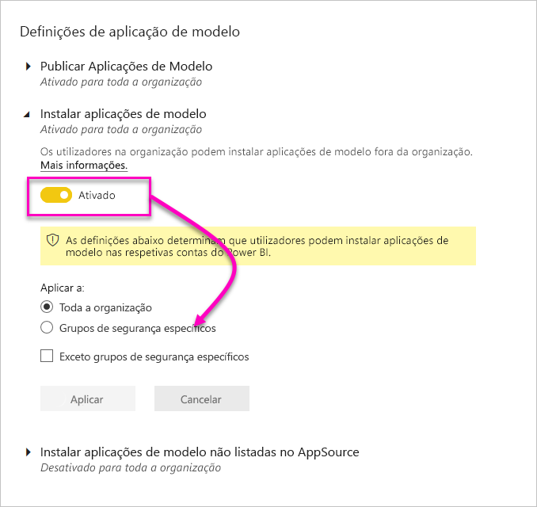

### Instalar aplicações de modelo não listadas no AppSource

Controle quais os utilizadores na organização que podem transferir e instalar aplicações de modelo **não listadas no [AppSource](https://appsource.microsoft.com)** .

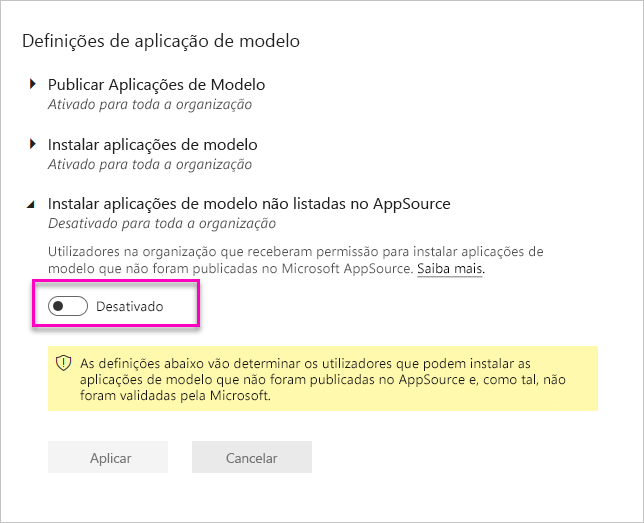

## Definições de capacidade

### Power BI Premium

O separador **Power BI Premium** permite-lhe gerir todas as capacidades do Power BI Premium (SKU EM ou P) compradas para a sua organização. Todos os utilizadores na organização podem ver o separador **Power BI Premium**, mas apenas verão os conteúdos no mesmo se estiverem atribuídos como *Administrador de capacidade* ou como um utilizador com permissões de atribuição. Se um utilizador não tiver nenhuma permissão, será apresentada a mensagem seguinte.

### Power BI Embedded

O separador **Power BI Embedded** permite-lhe ver as capacidades do Power BI Embedded (SKU A) que comprou para o seu cliente. Uma vez que apenas pode comprar SKUs A no Azure, vai [gerir as capacidades incorporadas no Azure](../developer/embedded/azure-pbie-create-capacity.md) no **Portal do Azure**.

Para obter mais informações sobre como gerir as definições do Power BI Embedded (SKU A), veja [O que é o Power BI Embedded?](../developer/embedded/azure-pbie-what-is-power-bi-embedded.md)

## Códigos de incorporação

Enquanto administrador, pode ver os códigos de incorporação gerados para o seu inquilino para partilhar relatórios publicamente. Também pode revogar ou eliminar códigos. [Saiba mais](../collaborate-share/service-publish-to-web.md)

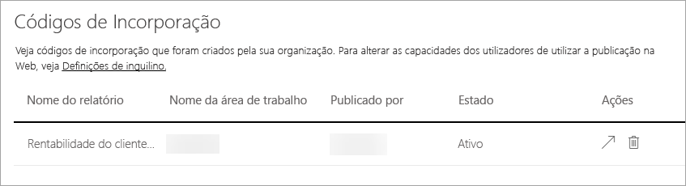

## Elementos visuais da organização

Todas as definições de administrador de elementos visuais do Power BI, incluindo as definições de inquilino dos elementos visuais do Power BI, são descritas em [Gerir as definições de administrador de elementos visuais do Power BI](organizational-visuals.md).

## Ligações do Azure (pré-visualização)

### Armazenamento ao nível do inquilino (pré-visualização)

Por predefinição, os dados utilizados com o Power BI são armazenados no armazenamento interno fornecido pelo Power BI. Com a integração dos fluxos de dados e do Azure Data Lake Storage Gen2 (ADLS Gen2), pode armazenar os seus fluxos de dados na conta do Azure Data Lake Storage Gen2 da sua organização. Para obter mais informações, veja [Fluxos de dados e integração do Azure Data Lake (Pré-visualização)](../transform-model/service-dataflows-azure-data-lake-integration.md).

### Permissões de armazenamento ao nível da área de trabalho (pré-visualização)

Por predefinição, os administradores de áreas de trabalho não podem ligar a sua própria conta de armazenamento. Com esta funcionalidade de pré-visualização, pode ativar uma definição que permite que os administradores de áreas de trabalho liguem a sua própria conta de armazenamento.

## Áreas de trabalho

Enquanto administrador, pode ver as áreas de trabalho existentes no seu inquilino no separador **Áreas de trabalho**. Neste separador, pode realizar estas ações:

- Atualizar a lista de áreas de trabalho e os respetivos detalhes.
- Exportar os dados sobre as áreas de trabalho para um ficheiro .csv. 
- Ver detalhes acerca de uma área de trabalho, incluindo o respetivo ID, utilizadores e respetivas funções, dashboards, relatórios e conjuntos de dados.
- Editar a lista de pessoas que têm acesso. Tal significa que pode eliminar a área de trabalho. Pode adicionar-se a si próprio a uma área de trabalho como administrador e, em seguida, abrir e eliminar a área de trabalho.
- Editar os campos Nome e Descrição.

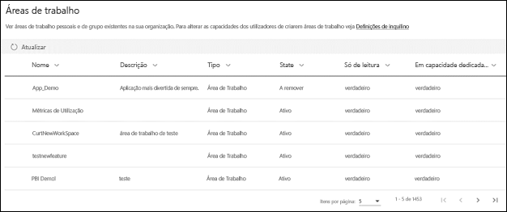

Os administradores também podem controlar a capacidade dos utilizadores de criar áreas de trabalho na nova experiência e áreas de trabalho clássicas. Veja a secção [Definições da área de trabalho](#workspace-settings) neste artigo para obter mais detalhes. 

As colunas da tabela no separador **Áreas de trabalho** correspondem às propriedades devolvidas pela [API Rest do administrador do Power BI](/rest/api/power-bi/admin) das áreas de trabalho. As áreas de trabalho pessoais são do tipo **GrupoPessoal**, as áreas de trabalho clássicas são do tipo **Grupo** e as novas experiências de área de trabalho são do tipo **Área de Trabalho**. Para obter mais informações, veja [Organizar o trabalho nas novas áreas de trabalho](../collaborate-share/service-new-workspaces.md).

No separador **Áreas de trabalho**, vê o *estado* de cada área de trabalho. A tabela abaixo fornece mais detalhes sobre o significado desses estados.

|Estado  |Descrição  |
|---------|---------|
| **Ativo** | Uma área de trabalho normal. Não indica nada sobre a utilização ou os respetivos conteúdos; apenas indica que a própria área de trabalho é "normal". |
| **Isolado** | Uma área de trabalho sem utilizador administrador. |
| **Eliminado** | Uma área de trabalho eliminada. Mantemos, durante 90 dias, metadados suficientes para restaurar a área de trabalho, se desejado. |
| **A remover** | Uma área de trabalho prestes a ser eliminada, mas que ainda não foi. Os utilizadores podem eliminar as suas próprias áreas de trabalho, colocando-as em A remover e, por fim, em Eliminado. |

Os administradores também podem gerir e recuperar áreas de trabalho, através do portal de administração ou dos cmdlets do PowerShell. 

## Imagem corporativa personalizada

Como administrador, pode personalizar o aspeto do Power BI para toda a sua organização. Atualmente, existem três opções principais:

* **Carregar Logótipo**: Para obter melhores resultados, carregue um logótipo que seja guardado como. png, 10 KB ou menor e, pelo menos, 200 x 30 píxeis.

* **Carregar imagem de capa**: Para obter melhores resultados, carregue uma imagem de capa que seja guardada como .jpg ou .png, 1 MB ou menor e, pelo menos, 1920 x 160 píxeis.

* **Selecionar cor do tema**: Pode selecionar o seu tema com base num número hexadecimal, RGB, valor ou na paleta fornecida.

Para obter mais informações, veja [Custom branding for your organization](https://aka.ms/orgBranding) (Imagem corporativa personalizada para a sua organização).

## Métricas de proteção

Depois de ativar a proteção das informações para o Power BI, as métricas de proteção de dados são apresentadas no portal de administração. O relatório mostra como as etiquetas de confidencialidade ajudam a proteger o seu conteúdo.

## Gerir conteúdo em destaque

Enquanto administrador do inquilino, pode gerir todos os relatórios, dashboards e aplicações que tenham sido promovidos na secção Em destaque na Base do Power BI na sua organização.

- No portal de Administração, selecione **Conteúdo em destaque**.

Aqui pode ver uma descrição geral de quem destacou o conteúdo, quando o mesmo foi destacado e todos os respetivos metadados relevantes. Se algo parecer suspeito ou caso queira limpar a secção Em destaque, pode eliminar conteúdo promovido conforme necessário.

Veja [Conteúdo em destaque](#featured-content) neste artigo para obter informações sobre a ativação de conteúdo em destaque.

## Próximos passos

[Administrar o Power BI na sua Organização](service-admin-administering-power-bi-in-your-organization.md)  
[Compreender a função de administrador do Power BI](service-admin-role.md)  
[Fazer a auditoria do Power BI na sua organização](service-admin-auditing.md)  

Mais perguntas? [Experimente perguntar à Comunidade do Power BI](https://community.powerbi.com/)
