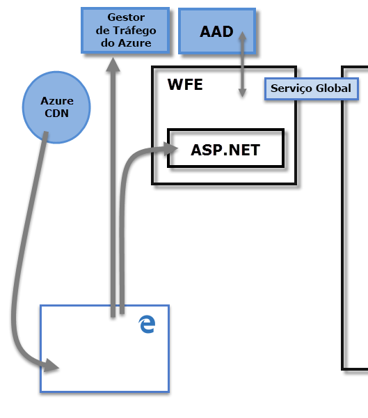
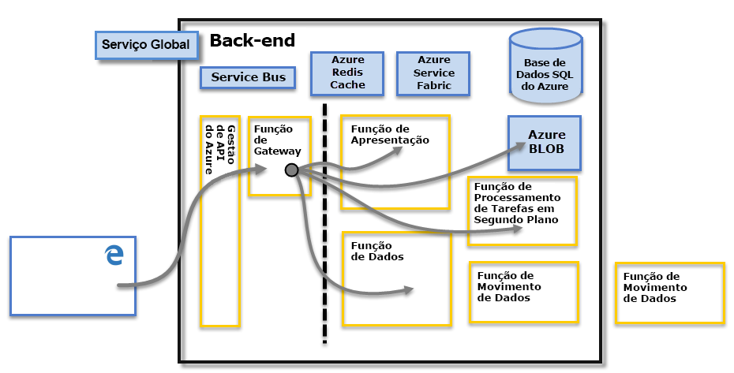

# Segurança do Power BI

Para obter uma explicação detalhada sobre a segurança do Power BI, [leia a documentação técnica de Segurança do Power BI](../guidance/whitepaper-powerbi-security.md).

O serviço Power BI baseia-se no **Azure**, que é a plataforma e infraestrutura de computação na cloud da Microsoft. A arquitetura do serviço Power BI baseia-se em dois clusters – o cluster de Front-end da Web (**WFE**) e o cluster de **Back-end**. O cluster WFE gere a ligação e autenticação inicial do serviço Power BI e, uma vez autenticado, o Back-end processa todas as interações de utilizador subsequentes. O Power BI utiliza o Azure Active Directory (AAD) para armazenar e gerir identidades de utilizador e gere o armazenamento de dados e metadados através do BLOB do Azure e da Base de Dados SQL do Azure, respetivamente.

## Arquitetura do Power BI

Cada implementação do Power BI consiste em dois clusters – um cluster de Front-end da Web (**WFE**) e um cluster de **Back-end**.

O cluster **WFE** gere o processo de ligação e autenticação inicial do Power BI, através do AAD para autenticar os clientes e fornecer tokens para ligações de cliente subsequentes ao serviço Power BI. O Power BI também utiliza o **Gestor de Tráfego do Azure** (ATM) para direcionar o tráfego de utilizador para o datacenter mais próximo, determinado pelo registo DNS do cliente que está a tentar ligar, para o processo de autenticação e transferir conteúdo e ficheiros estáticos. O Power BI utiliza a **Rede de Entrega de Conteúdos do Azure** (CDN) para distribuir de modo eficiente o conteúdo e os ficheiros estáticos necessários para os utilizadores com base na região geográfica.

O cluster de **Back-end** é como os clientes autenticados interagem com o serviço Power BI. O cluster de **Back-end** gere as visualizações, os dashboards do utilizador, os conjuntos de dados, os relatórios, o armazenamento de dados, as ligações de dados, a atualização de dados e outros aspetos da interação com o serviço Power BI. A **Função do Gateway** age como um gateway entre os pedidos de utilizador e o serviço Power BI. Os utilizadores não interagem diretamente com nenhuma função, exceto a **Função do Gateway**. A **Gestão de API do Azure** processará eventualmente a **Função do Gateway**.

> [!IMPORTANT]
> É obrigatório certificar-se de que apenas as funções de **Gestão de API do Azure** (APIM) e **Gateway** (GW) estão acessíveis através da Internet pública. Fornecem autenticação, autorização, proteção contra DDoS, Limitação, Balanceamento de Carga, Encaminhamento e outras capacidades.

## Segurança de Armazenamento de Dados

O Power BI utiliza dois repositórios principais para armazenar e gerir dados: os dados carregados pelos utilizadores são enviados normalmente para o armazenamento do **BLOB do Azure**, enquanto que todos os metadados e os artefatos do próprio sistema são armazenados na **Base de Dados SQL do Azure**.

A linha ponteada na imagem do cluster de **Back-end**, representada acima, esclarece o limite entre os dois únicos componentes que podem ser acedidos pelos utilizadores (à esquerda da linha ponteada) e as funções que só podem ser acedidas pelo sistema. Quando um utilizador autenticado se liga ao Serviço Power BI, a ligação e qualquer pedido feito pelo cliente são aceites e geridos pela **Função do Gateway** (para serem processados eventualmente pela **Gestão de API do Azure**), que interage em nome do utilizador com o resto do Serviço Power BI. Por exemplo, quando um cliente tenta ver um dashboard, a **Função do Gateway** aceita esse pedido e envia separadamente um pedido para a **Função de Apresentação** para obter os dados necessários para o browser compor o dashboard.

## Autenticação de Utilizadores

O Power BI utiliza o Azure Active Directory ([AAD](https://azure.microsoft.com/services/active-directory/)) para autenticar os utilizadores que iniciam sessão no serviço Power BI e, em seguida, utiliza as credenciais de início de sessão do Power BI sempre que um utilizador tenta aceder a recursos que requerem autenticação. Os utilizadores iniciam sessão no serviço Power BI através do endereço de e-mail utilizado na criação da conta do Power BI; o Power BI utiliza esse e-mail de início de sessão como o *nome de utilizador efetivo*, que é transmitido aos recursos sempre que um utilizador tenta ligar aos dados. O *nome de utilizador efetivo* é mapeado a um [*Nome Principal de Utilizador* (UPN)](/windows/win32/secauthn/user-name-formats) e resolvido para a conta de domínio do Windows associada, à qual a autenticação é aplicada.

Para organizações que utilizaram e-mails de trabalho para o início de sessão no Power BI (como <em>david@contoso.com</em>), o *utilizador efetivo* para o mapeamento de UPN é simples. Para organizações que não utilizaram e-mails de trabalho para iniciar sessão no Power BI (assim como <em>david@contoso.onmicrosoft.com</em>) o mapeamento entre o AAD e as credenciais locais irá exigir que a [sincronização de diretórios](/azure/active-directory-domain-services/synchronization) funcione corretamente.

A segurança da plataforma do Power BI também inclui a segurança do ambiente multi-inquilino, a segurança de rede e a capacidade de adicionar medidas de segurança adicionais baseadas no AAD.

## Segurança do Serviço e de Dados

Para obter mais informações, visite o [Centro de Confiança da Microsoft](https://www.microsoft.com/trustcenter).

Conforme descrito anteriormente neste artigo, o início de sessão de um utilizador no Power BI é utilizado pelos servidores do Active Directory no local para mapear um UPN para as credenciais. No entanto, é **importante** ter em conta que os utilizadores são responsáveis pelos dados que partilham: se um utilizador se ligar a origens de dados através das respetivas credenciais e partilhar um relatório (ou um dashboard ou conjunto de dados) com base nesses dados, os utilizadores com quem o dashboard é partilhado não são autenticados na origem de dados original e ser-lhes-á concedido acesso ao relatório.

Uma exceção ocorre em ligações ao **SQL Server Analysis Services** através do **Gateway de dados no local**. Os dashboards são armazenados em cache no Power BI, mas o acesso a relatórios ou conjuntos de dados subjacentes inicia a autenticação do utilizador que está a tentar aceder ao relatório (ou conjunto de dados). No entanto, o acesso só será concedido se o utilizador tiver credenciais suficientes para aceder aos dados. Para obter mais informações, veja a [Descrição detalhada do gateway de dados no local](../connect-data/service-gateway-onprem-indepth.md).

## Impor a utilização da versão do TLS

Os administradores de rede e de TI podem impor o requisito de utilizar o TLS (Transport Layer Security) atual para qualquer comunicação segura na sua rede. O Windows possui suporte para versões do TLS através do Microsoft Schannel Provider, como [descrito no artigo do SSP de Schannel de TLS](https://docs.microsoft.com/windows/desktop/SecAuthN/protocols-in-tls-ssl--schannel-ssp-).

Esta imposição pode ser feita ao definir chaves do Registo administrativamente. A imposição está descrita no [artigo Gerir Protocolos de SSL em AD FS](https://docs.microsoft.com/windows-server/identity/ad-fs/operations/manage-ssl-protocols-in-ad-fs). 

O **Power BI Desktop** respeita as definições das chaves do Registo descritas nesses artigos e apenas as ligações criadas com a versão de TLS permitida com base nessas definições de registo, quando presentes.

Para obter mais informações sobre como definir estas chaves do Registo, veja o artigo [Definições de Registo de TLS](https://docs.microsoft.com/windows-server/security/tls/tls-registry-settings).
