# Configurar e gerir capacidades no Power BI Premium

A gestão do Power BI Premium envolve a criação, a gestão e a monitorização de capacidades Premium. Este artigo fornece instruções passo a passo; para obter uma visão geral das capacidades, veja [Gerir as capacidades Premium](service-premium-capacity-manage.md).

Saiba como pode gerir as capacidades do Power BI Premium e do Power BI Embedded que disponibilizam recursos dedicados para os seus conteúdos.

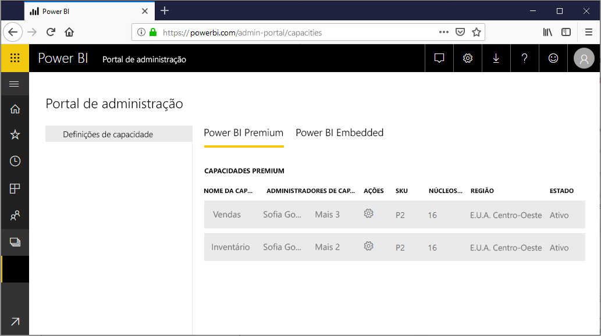

*A capacidade* está no centro das ofertas power BI Premium e [Power BI Embedded.](../developer/embedded/azure-pbie-what-is-power-bi-embedded.md) É um conjunto de recursos reservados para utilização exclusiva pela sua organização. Ter uma capacidade permite-lhe publicar dashboards, relatórios e conjuntos de dados para os utilizadores em toda a organização sem ter de comprar licenças individuais para os mesmos. Esta ação proporciona também um desempenho fiável e consistente dos conteúdos alojados na capacidade. Para obter mais informações, consulte [O que é o Power BI Premium?](service-premium-what-is.md).

> [!NOTE]
> O Power BI Premium lançou recentemente uma nova versão do Premium, denominada **Premium Gen2**, que está atualmente em pré-visualização. O Premium Gen2 irá simplificar a gestão de capacidades Premium e reduzirá a sobrecarga de gestão. Para obter mais informações, veja [Power BI Premium Generation 2 (pré-visualização)](service-premium-what-is.md#power-bi-premium-generation-2-preview).

## Gerir capacidade

Depois de comprar nós de capacidade no Microsoft 365, tem de configurar a capacidade no portal de administração do Power BI. Pode gerir as capacidades do Power BI Premium na secção **Definições de capacidade** do portal.

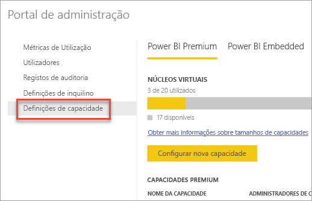

Selecione o nome de uma capacidade para gerir a mesma. Isto permite-lhe aceder ao ecrã de gestão de capacidade.

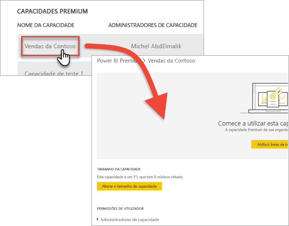

Se não tiverem sido atribuídas áreas de trabalho à capacidade, verá uma mensagem sobre como [atribuir uma área de trabalho à capacidade](#assign-a-workspace-to-a-capacity).

### Configurar uma nova capacidade (Power BI Premium)

O portal de administração mostra o número de *núcleos virtuais* que utilizou e que ainda tem disponíveis. O número total de núcleos virtuais baseia-se nos SKUs Premium que comprou. Por exemplo, a compra de um SKU P3 e de um SKU P2 resultará em 48 núcleos disponíveis – 32 do P3 e 16 do P2.

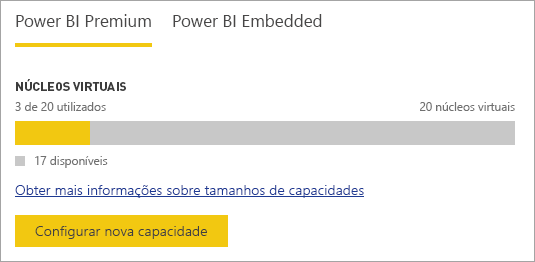

Se tiver núcleos virtuais disponíveis, configure a sua nova capacidade ao seguir estes passos.

1. Selecione **Configurar nova capacidade**.

1. Atribua um nome à sua capacidade.

1. Defina a que administrador pretende atribuir esta capacidade.

1. Selecione o tamanho da capacidade. As opções disponíveis dependem do número de núcleos virtuais disponíveis. Não pode selecionar uma opção que seja superior à que está disponível.

    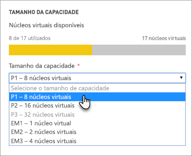

1. Selecione **Configurar**.

    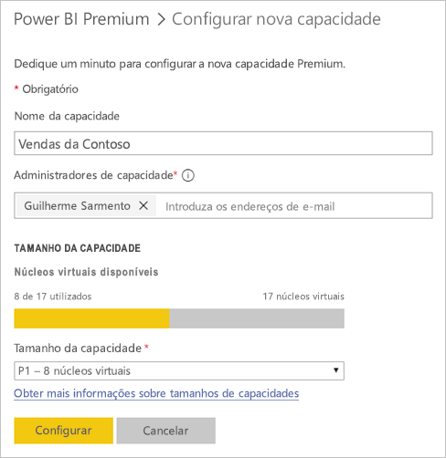

Os administradores de capacidade, bem como os administradores do Power BI e os administradores globais, verão a capacidade listada no portal de administração.

### Definições de capacidade

1. No ecrã de gestão de capacidade do Power BI Premium, em **Ações**, selecione o **ícone de engrenagem** para rever e atualizar definições. 

    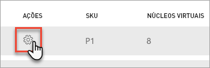

1. Pode ver quem são os administradores de serviço, o SKU/tamanho da capacidade e a região onde esta se encontra.

    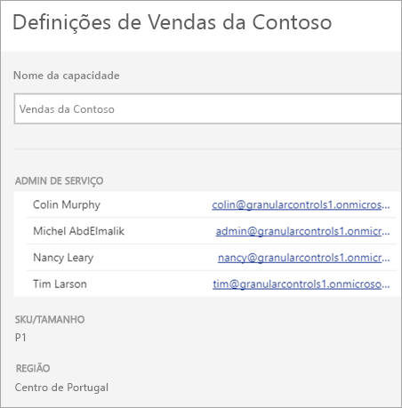

1. Também pode eliminar ou mudar o nome de uma capacidade.

    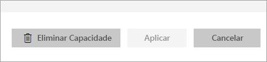

> [!NOTE]
> As definições de capacidade do Power BI Embedded são geridas no portal do Microsoft Azure.

### Alterar o tamanho da capacidade

Os administradores do Power BI e os administradores globais podem alterar a capacidade do Power BI Premium. Os administradores de capacidade que não sejam administradores do Power BI ou administradores globais não têm esta opção.

1. Selecione **Alterar o tamanho da capacidade**.

    

1. No ecrã **Alterar o tamanho da capacidade**, aumente ou diminua o tamanho da capacidade conforme adequado.

    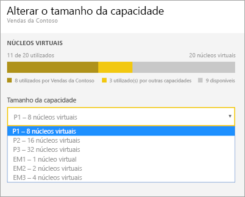

    Os administradores são livres de criar, redimensionar e eliminar nós, desde que tenham o número previsto de núcleos virtuais.

    Os SKUs P não podem ser mudados para uma versão anterior, como os SKUs EM. Pode pairar o rato sobre qualquer opção desativada para ver uma explicação.

> [!IMPORTANT]
> Se a sua capacidade do Power BI Premium tiver uma alta utilização de recursos, resultando em problemas de fiabilidade ou desempenho, pode receber e-mails de notificação para identificar e resolver o problema. Para obter mais informações, veja [notificações de fiabilidade e capacidade](service-interruption-notifications.md#capacity-and-reliability-notifications).

### Gerir permissões de utilizador

Pode atribuir administradores de capacidade adicionais e utilizadores com permissões de *atribuição de capacidade*. Se forem administradores dessa área de trabalho, os utilizadores com permissões de atribuição podem atribuir uma área de trabalho a uma capacidade. Podem também atribuir a respetiva *A minha área de trabalho* à capacidade. Os utilizadores com permissões de atribuição não têm acesso ao portal de administração.

> [!NOTE]
> Para a capacidade do Power BI Embedded, os administradores de capacidade são definidos no portal do Microsoft Azure.

Em **Permissões de utilizador**, expanda a secção **Utilizadores com permissões de atribuição** e, em seguida, adicione utilizadores ou grupos conforme adequado.

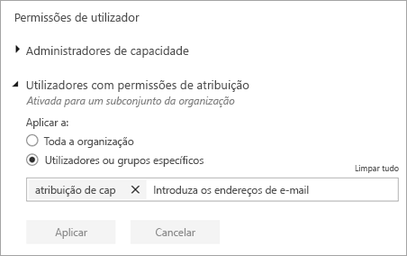

## Atribuir uma área de trabalho a uma capacidade

Existem duas formas de atribuir uma área de trabalho a uma capacidade: no portal de administração e a partir de uma área de trabalho.

### Atribuir a partir do portal de administração

Os administradores de capacidade, em conjunto com os administradores do Power BI e os administradores globais, podem atribuir áreas de trabalho em massa na secção de gestão de capacidade premium do portal de administração. Ao gerir uma capacidade, verá a secção **Áreas de trabalho**, que lhe permite atribuir áreas de trabalho.

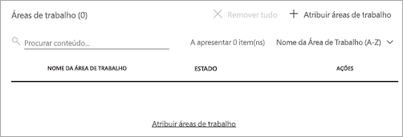

1. Selecione **Atribuir áreas de trabalho**. Esta opção esta disponível em múltiplos locais.

1. Selecione uma opção em **Aplicar a**.

    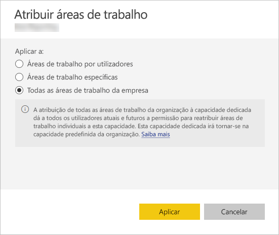

   | Seleção | Descrição |
   | --- | --- |
   | **Áreas de trabalho por utilizadores** | Quando atribui áreas de trabalho por utilizador ou grupo, todas as áreas de trabalho pertencentes a esses utilizadores são atribuídas à capacidade de Premium, incluindo a área de trabalho pessoal do utilizador. Os utilizadores referidos obtêm automaticamente permissões de atribuição de áreas de trabalho. Isto inclui áreas de trabalho já atribuídas a uma capacidade diferente. |
   | **Áreas de trabalho específicas** | Introduza o nome de uma área de trabalho específica a atribuir à capacidade selecionada. |
   | **Todas as áreas de trabalho da empresa** | A atribuição das áreas de trabalho de toda a organização à capacidade Premium atribui todas as áreas de trabalho e As Minhas Áreas de Trabalho, na sua organização, a esta capacidade Premium. Além disso, todos os utilizadores atuais e futuros terão permissão para atribuir de novo áreas de trabalho individuais a esta capacidade. |
   | | |

1. Selecione **Aplicar**.

### Atribuir a partir das definições da área de trabalho

Também pode atribuir uma área de trabalho a uma capacidade Premium a partir das definições dessa área de trabalho. Para mover uma área de trabalho para uma capacidade, tem de ter permissões de administração para essa área de trabalho, bem como permissões de atribuição de capacidade para essa capacidade. Tenha em atenção que os administradores de área de trabalho podem sempre remover uma área de trabalho da capacidade Premium.

1. Edite uma área de trabalho ao selecionar as reticências **(. . .)** e, em seguida, **Editar área de trabalho**.

    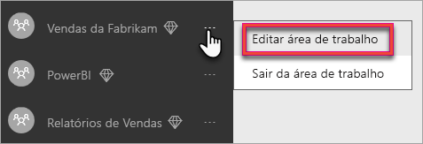

1. Em **Editar área de trabalho**, expanda a secção **Avançado**.

1. Selecione a capacidade à qual pretende atribuir esta área de trabalho.

    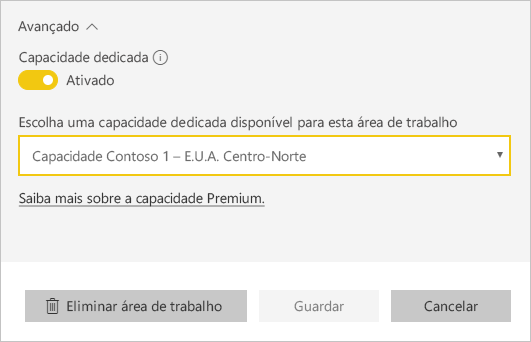

1. Selecione **Guardar**.

Depois de guardar, a área de trabalho e todos os respetivos conteúdos são movidos para a capacidade Premium sem qualquer interrupção da experiência para os utilizadores finais.

## Chave de produto do Power BI Report Server

No separador **Definições de capacidade** do portal do administração do Power BI, terá acesso à sua chave de produto do Power BI Report Server. Esta opção estará apenas disponível para administradores globais ou utilizadores com a função de administrador de serviço Power BI atribuída e se tiver adquirido uma SKI Power BI Premium.

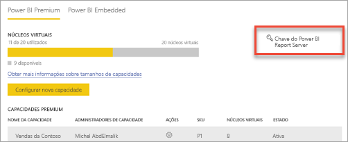

Ao selecionar **Chave do Power BI Report Server**, será apresentada uma caixa de diálogo com a sua chave de produto. Pode copiá-la e utilizá-la na instalação.

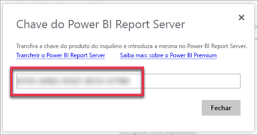

Para obter mais informações, consulte [Instalar o Power BI Report Server](../report-server/install-report-server.md).

## Próximos passos

[Gerir as capacidades Premium](service-premium-capacity-manage.md)

Mais perguntas? [Experimente perguntar à Comunidade do Power BI](https://community.powerbi.com/)

O Power BI introduziu o Power BI Premium Gen2 como uma oferta de pré-visualização, que melhora a experiência do Power BI Premium nos seguintes aspetos:
* Desempenho
* Licenciamento por utilizador
* Maior dimensionamento
* Métricas melhoradas
* Dimensionamento automático
* Sobrecarga de gestão reduzida

Para obter mais informações sobre o Power BI Premium Gen2, veja [Power BI Premium Generation 2 (pré-visualização)](service-premium-what-is.md#power-bi-premium-generation-2-preview).