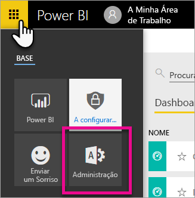
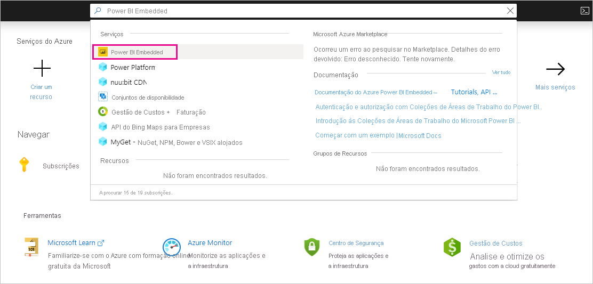
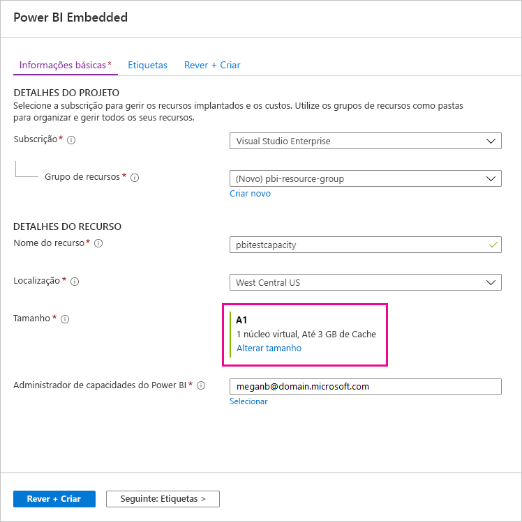
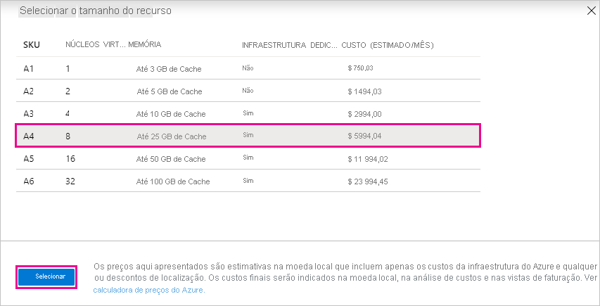
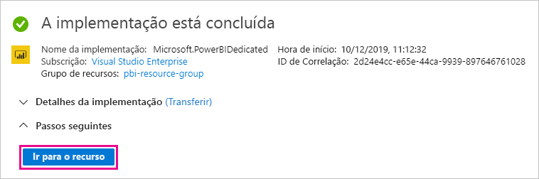

# Como comprar o Power BI Premium

Este artigo descreve como pode comprar a capacidade do Power BI Premium para a sua organização. O artigo aborda dois cenários:

- Utilizar SKUs P para cenários de produção típicos. Os SKUs P exigem um compromisso mensal ou anual e são faturados mensalmente.

- Utilizar SKUs A para cenários de teste e para casos em que não tem as permissões necessárias para comprar SKUs P (função de Administrador de Faturação ou de Administrador Global do Microsoft 365). Os SKUs A não exigem um compromisso de tempo e são faturados por hora. Pode comprar SKUs A no [portal do Azure](https://portal.azure.com).

Para obter mais informações sobre o Power BI Premium, veja [O que é o Power BI Premium?](service-premium-what-is.md). Para obter informações sobre os planos e preços atuais, veja a [Página de preços do Power BI](https://powerbi.microsoft.com/pricing/) e a [Calculadora Power BI Premium](https://powerbi.microsoft.com/calculator/). Os criadores de conteúdos continuam a precisar de uma [licença do Power BI Pro](service-admin-purchasing-power-bi-pro.md), mesmo que a sua organização utilize o Power BI Premium. Certifique-se de que compra, pelo menos, uma licença do Power BI Pro para a sua organização. Com os SKUs A, _todos os utilizadores_ que consomem conteúdos também necessitam de licenças Pro.

> [!NOTE]
> Se deixar uma subscrição Premium expirar, terá 30 dias de acesso total à sua capacidade. Depois desse período, os seus conteúdos serão revertidos para uma capacidade partilhada. Os modelos com mais de 1 GB não são suportados na capacidade partilhada.

## Comprar SKUs P para cenários de produção típicos

Pode criar um novo inquilino com um SKU P1 do Power BI Premium configurado ou pode comprar uma capacidade de Power BI Premium para uma organização existente. Em ambos os casos, pode então adicionar capacidade, se for necessário.

### Criar um novo inquilino com o Power BI Premium P1

Se não tiver um inquilino existente e pretender criar um, pode comprar o Power BI Premium ao mesmo tempo. A seguinte ligação irá orientá-lo no processo de criação de um novo inquilino e permitir que compre o Power BI Premium: [a oferta Power BI Premium P1](https://signup.microsoft.com/Signup?OfferId=b3ec5615-cc11-48de-967d-8d79f7cb0af1). Quando criar o inquilino, ser-lhe-á automaticamente atribuída a função de Administrador Global do Microsoft 365 para esse mesmo inquilino.

Após comprar capacidade, saiba como [gerir capacidades](service-admin-premium-manage.md#manage-capacity) e [atribuir áreas de trabalho](service-admin-premium-manage.md#assign-a-workspace-to-a-capacity) a uma capacidade.

### Comprar uma capacidade do Power BI Premium para uma organização existente

Se tiver uma organização existente (inquilino), tem de ter a função Administrador de Faturação ou Administrador Global do Microsoft 365 para poder comprar subscrições e licenças. Para obter mais informações, consulte [Sobre as funções de administrador do Microsoft 365](https://support.office.com/article/About-Office-365-admin-roles-da585eea-f576-4f55-a1e0-87090b6aaa9d).

Para comprar uma capacidade Premium, siga estes passos.

1. No serviço Power BI, selecione o seletor de aplicações do Microsoft 365 e, em seguida, **Administrador**.

    

    Em alternativa, pode navegar para o centro de administração do Microsoft 365.

1. Selecione **Faturação** > **Comprar serviços**.

1. Em **Outros planos**, procure ofertas do Power BI Premium. Serão listadas como P1 a P3, EM3 e P1 (mês a mês).

1. Paire o cursor pelas reticências ( **. . .** ) e, em seguida, selecione **Comprar agora**.

    

1. Siga os passos para concluir a compra.

Depois de concluir a compra, a página **Comprar serviços** vai mostrar que o item foi comprado e está ativo.

Após comprar capacidade, saiba como [gerir capacidades](service-admin-premium-manage.md#manage-capacity) e [atribuir áreas de trabalho](service-admin-premium-manage.md#assign-a-workspace-to-a-capacity) a uma capacidade.

### Comprar capacidades adicionais

Agora que possui uma capacidade, pode adicionar mais capacidades conforme as suas necessidades aumentarem. Pode utilizar uma combinação de SKUs com capacidade Premium (P1 a P3) na sua organização. Os vários SKUs oferecem-lhe diferentes capacidades de recursos.

1. No centro de administração do Microsoft 365, selecione **Faturação** > **Comprar serviços**.

1. Procure o item do Power BI Premium do qual pretende comprar mais em **Outros planos**.

1. Passe o cursor sobre **Mais opções** (...) e, em seguida, selecione **Alterar quantidade de licenças**.

    

1. Altere o número de instâncias que pretende ter para este item. Em seguida, selecione **Submeter** após concluir.

   > [!IMPORTANT]
   > Ao selecionar **Submeter**, o cartão de crédito registado será debitado.

A página **Comprar serviços** irá depois indicar o número de instâncias que tem. No portal de administração do Power BI, em **Definições de capacidades**, os núcleos virtuais disponíveis refletem a nova capacidade comprada.

### Cancelar a sua subscrição

Pode cancelar a sua subscrição no centro de administração do Microsoft 365. Para cancelar a sua subscrição Premium, faça o seguinte.

1. Navegue para o centro de administração do Microsoft 365.

1. Selecione **Faturação** > **Subscrições**.

1. Selecione a sua subscrição do Power BI Premium na lista.

1. Selecione **Mais ações** > **Cancelar subscrição**.

1. A página **Cancelar subscrição** irá indicar se é responsável por uma [taxa de cessação antecipada](https://support.office.com/article/early-termination-fees-6487d4de-401a-466f-8bc3-c0beb5cc40d3). Esta página também indica quando os dados da subscrição serão eliminados.

1. Leia as informações e, se pretender avançar, selecione **Cancelar subscrição**.

#### Quando cancelar ou a licença expirar

Quando cancelar a sua subscrição Premium, ou a licença de capacidade expirar, pode continuar a aceder às suas capacidades Premium durante um período de 30 dias a contar da data de cancelamento ou da expiração da licença. Após 30 dias, deixará de poder aceder às capacidades Premium ou áreas de trabalho nas mesmas.

## Comprar SKUs A para testes e outros cenários

Os SKUs A são disponibilizados através do serviço Power BI Embedded. Pode utilizar um SKU A das seguintes formas:

- Ativar a incorporação do Power BI em aplicações de terceiros. Para obter mais informações, veja [Power BI Embedded](../developer/embedded/azure-pbie-what-is-power-bi-embedded.md).

- Teste a funcionalidade Premium antes de comprar um SKU P.

- Crie ambientes de desenvolvimento e de teste, assim como um ambiente de produção que utilize SKUs P.

- Compre o Power BI Premium mesmo que não tenha uma função de Administrador Global Microsoft 365 ou função de Administrador de Faturação.

> [!NOTE]
> Se comprar um SKU A4 ou superior, pode tirar partido de todas as funcionalidades Premium, exceto a partilha ilimitada de conteúdos. Com os SKUs A, _todos os utilizadores_ que consomem conteúdos necessitam de licenças Pro.

Siga estes passos para comprar SKUs A no portal do Azure:

1. Inicie sessão no [portal do Azure](https://portal.azure.com) com uma conta que tenha, no mínimo, permissões de administração de capacidades no Power BI.

1. Procure _Power BI Embedded_ e selecione o serviço nos resultados da pesquisa.

    

1. Selecione **Criar Power BI Embedded**.

    

1. No ecrã de criação **Power BI Embedded**, especifique as seguintes informações:

    - A **Subscrição** na qual irá criar o serviço Power BI Embedded.

    - A **Localização** física na qual irá criar o grupo de recursos que contém o serviço. Para obter um melhor desempenho, esta localização deve estar próxima do seu inquilino do Azure Active Directory para o Power BI.

    - O **Grupo de recursos** existente a utilizar. Em alternativa, crie um novo, conforme o exemplo.

    - O **Administrador de capacidades do Power BI**. O administrador de capacidades tem de ser um utilizador membro ou um principal de serviço no seu inquilino do Azure AD.

    

1. Se quiser utilizar todas as funcionalidades do Power BI Premium (exceto a partilha ilimitada), precisa no mínimo de um SKU A4. Selecione **Alterar tamanho**.

    

1. Selecione um tamanho de capacidade de A4, A5 ou A6, que correspondem a P1, P2 e P3.

    

1. Selecione **Rever + Criar**, reveja as opções escolhidas e selecione **Criar**.

    

1. A implementação poderá demorar alguns minutos a concluir. Quando for concluída, selecione **Ir para recurso**.

    

1. No ecrã de gestão, reveja as opções que tem para gerir o serviço, incluindo colocar o mesmo em pausa quando não estiver a utilizá-lo.

    

Após comprar capacidade, saiba como [gerir capacidades](service-admin-premium-manage.md#manage-capacity) e [atribuir áreas de trabalho](service-admin-premium-manage.md#assign-a-workspace-to-a-capacity) a uma capacidade.

## Próximas etapas

[Configurar e gerir capacidades no Power BI Premium](service-admin-premium-manage.md)\
[Página de preços do Power BI](https://powerbi.microsoft.com/pricing/)\
[Calculadora do Power BI Premium](https://powerbi.microsoft.com/calculator/)\
[FAQ do Power BI Premium](service-premium-faq.md)\
[Documento técnico sobre Planear uma Implementação Empresarial do Power BI](https://aka.ms/pbienterprisedeploy)

Mais perguntas? [Experimente perguntar à Comunidade do Power BI](https://community.powerbi.com/)
