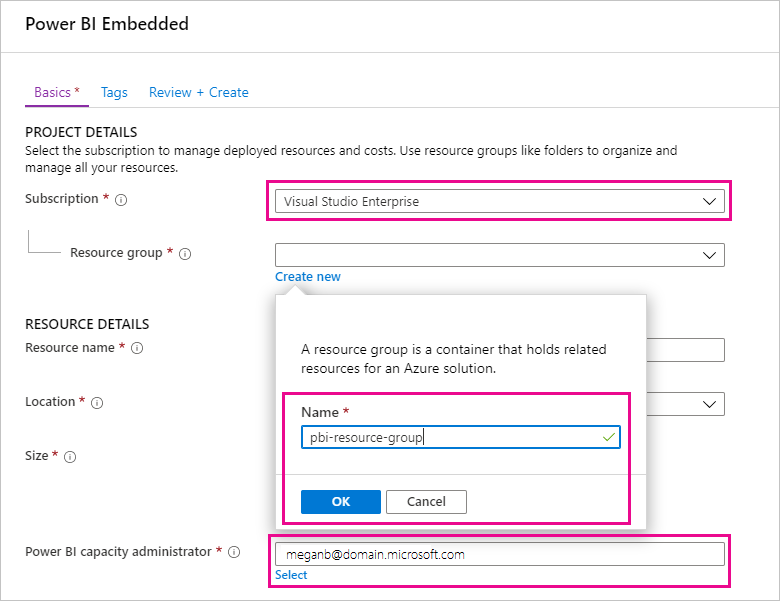

# Comprar o Power BI Premium para testes

Este artigo descreve como comprar SKUs A do Power BI Premium para cenários de teste e para casos em que não tem as permissões necessárias para comprar SKUs P (função de Administrador de Faturação ou de Administrador Global do Microsoft 365). Os SKUs A não exigem um compromisso de tempo e são faturados por hora. Pode comprar SKUs A no [portal do Azure](https://portal.azure.com).

Para obter mais informações sobre o Power BI Premium, veja [O que é o Power BI Premium?](service-premium-what-is.md). Para obter informações sobre os planos e preços atuais, veja a [Página de preços do Power BI](https://powerbi.microsoft.com/pricing/) e a [Calculadora Power BI Premium](https://powerbi.microsoft.com/calculator/). Os criadores de conteúdos continuam a precisar de uma [licença do Power BI Pro](service-admin-purchasing-power-bi-pro.md), mesmo que a sua organização utilize o Power BI Premium. Certifique-se de que compra, pelo menos, uma licença do Power BI Pro para a sua organização. Com os SKUs A, _todos os utilizadores_ que consomem conteúdos também necessitam de licenças Pro.

> [!NOTE]
> Se deixar uma subscrição Premium expirar, terá 30 dias de acesso total à sua capacidade. Depois desse período, os seus conteúdos serão revertidos para uma capacidade partilhada. Os modelos com mais de 1 GB não são suportados na capacidade partilhada.

## Comprar SKUs A para testes e outros cenários

Os SKUs A são disponibilizados através do serviço Power BI Embedded. Pode utilizar um SKU A das seguintes formas:

- Ativar a incorporação do Power BI em aplicações de terceiros. Para obter mais informações, veja [Power BI Embedded](../developer/embedded/azure-pbie-what-is-power-bi-embedded.md).

- Teste a funcionalidade Premium antes de comprar um SKU P.

- Crie ambientes de desenvolvimento e de teste, assim como um ambiente de produção que utilize SKUs P.

- Compre o Power BI Premium mesmo que não tenha uma função de Administrador Global Microsoft 365 ou função de Administrador de Faturação.

> [!NOTE]
> Se comprar um SKU A4 ou superior, pode tirar partido de todas as funcionalidades Premium, exceto a partilha ilimitada de conteúdos. Com os SKUs A, _todos os utilizadores_ que consomem conteúdos necessitam de licenças Pro.

Siga estes passos para comprar SKUs A no portal do Azure:

1. Inicie sessão no [portal do Azure](https://portal.azure.com) com uma conta que tenha, no mínimo, permissões de administração de capacidades no Power BI.

1. Procure _Power BI Embedded_ e selecione o serviço nos resultados da pesquisa.

    

1. Selecione **Criar Power BI Embedded**.

    

1. No ecrã de criação **Power BI Embedded**, especifique as seguintes informações:

    - A **Subscrição** na qual irá criar o serviço Power BI Embedded.

    - A **Localização** física na qual irá criar o grupo de recursos que contém o serviço. Para obter um melhor desempenho, esta localização deve estar próxima do seu inquilino do Azure Active Directory para o Power BI.

    - O **Grupo de recursos** existente a utilizar. Em alternativa, crie um novo, conforme o exemplo.

    - O **Administrador de capacidades do Power BI**. O administrador de capacidades tem de ser um utilizador membro ou um principal de serviço no seu inquilino do Azure AD.

    

1. Se quiser utilizar todas as funcionalidades do Power BI Premium (exceto a partilha ilimitada), precisa no mínimo de um SKU A4. Selecione **Alterar tamanho**.

    

1. Selecione um tamanho de capacidade de A4, A5 ou A6, que correspondem a P1, P2 e P3.

    

1. Selecione **Rever + Criar**, reveja as opções escolhidas e selecione **Criar**.

    

1. A implementação poderá demorar alguns minutos a concluir. Quando for concluída, selecione **Ir para recurso**.

    

1. No ecrã de gestão, reveja as opções que tem para gerir o serviço, incluindo colocar o mesmo em pausa quando não estiver a utilizá-lo.

    

Após comprar capacidade, saiba como [gerir capacidades](service-admin-premium-manage.md#manage-capacity) e [atribuir áreas de trabalho](service-admin-premium-manage.md#assign-a-workspace-to-a-capacity) a uma capacidade.

## Passos seguintes

[O que é o Power BI Premium?](service-premium-what-is.md)
[Como comprar o Power BI Premium](service-admin-premium-purchase.md)
[Configurar e gerir capacidades no Power BI Premium](service-admin-premium-manage.md)\
[Página de preços do Power BI](https://powerbi.microsoft.com/pricing/)\
[Calculadora do Power BI Premium](https://powerbi.microsoft.com/calculator/)\
[FAQ do Power BI Premium](service-premium-faq.md)\
[Documento técnico sobre Planear uma Implementação Empresarial do Power BI](https://aka.ms/pbienterprisedeploy)

Mais perguntas? [Experimente perguntar à Comunidade do Power BI](https://community.powerbi.com/)
