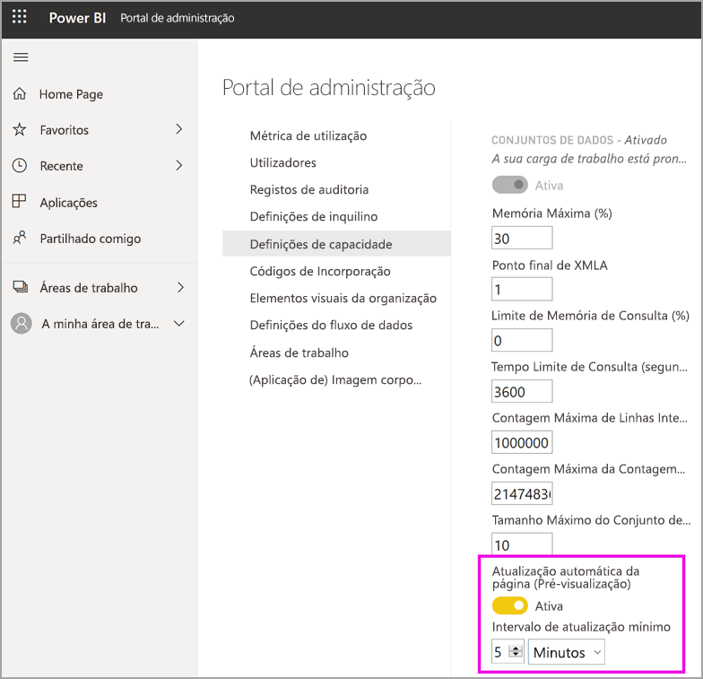

# Configurar cargas de trabalho numa capacidade Premium

Este artigo descreve como ativar e configurar cargas de trabalho para capacidades Premium do Power BI. Por predefinição, as capacidades só suportam as cargas de trabalho associadas à execução de consultas do Power BI. Também pode ativar e configurar cargas de trabalho adicionais para **[IA (Serviços Cognitivos)](../transform-model/service-cognitive-services.md)** , **[Fluxos de dados](../transform-model/service-dataflows-overview.md#dataflow-capabilities-on-power-bi-premium)** e **[Relatórios paginados](../paginated-reports/paginated-reports-save-to-power-bi-service.md)** .

## Predefinições de memória

As cargas de trabalho de consulta são otimizadas e limitadas por recursos determinados pelo SKU da capacidade Premium. As capacidades Premium também suportam cargas de trabalho adicionais que podem utilizar os recursos da sua capacidade. Os valores predefinidos da memória para estas cargas de trabalho são baseados nos nós de capacidade disponíveis para o seu SKU. As definições de memória máxima não são cumulativas. A memória até ao valor máximo especificado é alocada dinamicamente à IA e aos fluxos de dados, mas é alocada estaticamente aos relatórios paginados.

|                   | EM1/A1                  | EM2/A2                  | EM3/A3                  | P1/A4                  | P2/A5                  | P3/A6                   |
|-------------------|---------------------------|---------------------------|---------------------------|--------------------------|--------------------------|---------------------------|
| IA                | Não suportado               | 40% predefinido; 40% mínimo  | 20% predefinido; 20% mínimo  | 20% predefinido; 8% mínimo  | 20% predefinido; 4% mínimo  | 20% predefinido; 2% mínimo   |
| Conjuntos de Dados          | 100% predefinido; 67% mínimo | 100% predefinido; 40% mínimo | 100% predefinido; 20% mínimo | 100% predefinido; 8% mínimo | 100% predefinido; 4% mínimo | 100% predefinido; 2% mínimo  |
| Fluxos de Dados         | 40% predefinido; 40% mínimo  | 24% predefinido; 24% mínimo  | 20% predefinido; 12% mínimo  | 20% predefinido; 5% mínimo  | 20% predefinido; 3% mínimo  | 20% predefinido; 2% mínimo   |
| Relatórios paginados | Não suportado               | Não suportado               | Não suportado               | 20% predefinido; 10% mínimo | 20% predefinido; 5% mínimo  | 20% predefinido; 2,5% mínimo |
|                   |                           |                           |                           |                          |                          |                           |

## Definições das cargas de trabalho

### IA (Pré-visualização)

A carga de trabalho de IA permite-lhe utilizar os serviços cognitivos e a Machine Learning Automatizada no Power BI. Utilize as seguintes definições para controlar o comportamento da carga de trabalho.

| Nome da Definição | Descrição |
|---------------------------------|----------------------------------------|
| **Memória Máxima (%)** | A percentagem máxima de memória disponível que os processos de IA podem utilizar numa capacidade. |
| **Permitir a utilização a partir do Power BI Desktop** | Esta definição está reservada para utilização futura e não é apresentada em todos os inquilinos. |
| **Permitir a compilação de modelos de machine learning** | Especifica se os analistas de negócios podem preparar, validar e invocar modelos de machine learning diretamente no Power BI. Para obter mais informações, veja [Machine Learning Automatizado no Power BI (Pré-visualização)](../transform-model/service-machine-learning-automated.md). |
| **Ativar o paralelismo de pedidos de IA** | Especifica se os pedidos de IA podem ser executados em paralelo. |
|  |  |

### Conjuntos de Dados

A carga de trabalho dos conjuntos de dados está ativada por predefinição e não pode ser desativada. Utilize as seguintes definições para controlar o comportamento da carga de trabalho. Por baixo da tabela, há informações de utilização adicionais para algumas das definições.

| Nome da Definição | Descrição |
|---------------------------------|----------------------------------------|
| **Memória Máxima (%)** | A percentagem máxima de memória disponível que os conjuntos de dados podem utilizar numa capacidade. |
| **Ponto Final de XMLA** | Especifica que as ligações das aplicações cliente são feitas de acordo com a associação de grupo de segurança definida aos níveis da área de trabalho e da aplicação. Para obter mais informações, veja [Ligar aos conjuntos de dados com ferramentas e aplicações cliente](service-premium-connect-tools.md). |
| **Contagem Máxima do Conjunto de Linhas Intermediárias** | O número máximo de linhas intermediárias devolvido pelo DirectQuery. O valor predefinido é 1000000 e o intervalo de valores permitido é entre 100000 e 2147483647. |
| **Tamanho Máximo do Conjunto de Dados Offline (GB)** | O tamanho máximo do conjunto de dados offline na memória. Este valor corresponde ao tamanho comprimido em disco. O valor predefinido é 0, que é o limite mais alto definido pela SKU. O intervalo permitido é entre 0 e o limite de tamanho da capacidade. |
| **Contagem Máxima do Conjunto de Linhas de Resultados** | O número máximo de linhas devolvido numa consulta DAX. O valor predefinido é -1 (sem limite) e o intervalo de valores permitido é entre 100000 e 2147483647. |
| **Limite de Memória de Consulta (%)** | A percentagem máxima de memória disponível na carga de trabalho que pode ser utilizada para executar uma consulta MDX ou DAX. O valor predefinido é 0, o que resulta na aplicação do limite de memória da consulta automática específico da SKU. |
| **Tempo Limite de Consulta (segundos)** | O limite máximo de tempo de uma consulta. A predefinição é 3600 segundos (1 hora). O valor 0 especifica que as consultas não irão exceder o limite de tempo. |
| **Atualização automática de página** | Ative e desative esta definição para as áreas de trabalho premium terem relatórios com atualização automática de página com base em intervalos fixos. |
| **Intervalo de atualização mínimo** | Se a atualização automática de página estiver ativada, deverá definir o intervalo mínimo permitido para o intervalo de atualização da página. O valor predefinido são cinco minutos e o mínimo permitido é um segundo. |
| **Alterar medida de deteção** | Ative e desative esta definição para as áreas de trabalho premium terem relatórios com atualização automática de página com base na deteção de alterações. |
| **Intervalo mínimo de execução** | Se a opção Alterar medida de deteção estiver ativada, o intervalo mínimo de execução permitido para a pesquisa de dados é alterado. O valor predefinido são cinco segundos e o mínimo permitido é um segundo. |
|  |  |  |

#### Contagem Máxima do Conjunto de Linhas Intermediárias

Utilize esta definição para controlar o impacto de relatórios mal concebidos ou que exijam bastantes recursos. Quando uma consulta a um conjunto de dados do DirectQuery devolve um resultado muito grande da base de dados de origem, pode ocorrer um pico na utilização de memória e uma sobrecarga de processamento. Esta situação pode fazer com que outros utilizadores e relatórios fiquem com poucos recursos. Esta definição permite que o administrador da capacidade ajuste a quantidade de linhas que uma consulta individual pode obter da origem de dados.

Em alternativa, se tiver um conjunto de dados grande e a capacidade conseguir suportar mais do que a predefinição de um milhão de linhas, aumente esta definição para obter mais linhas.

Tenha em atenção que esta definição apenas afeta as consultas do DirectQuery, enquanto a [Contagem Máxima do Conjunto de Linhas de Resultados](#max-result-row-set-count) afeta as consultas do DAX.

#### Tamanho Máximo do Conjunto de Dados Offline

Utilize esta definição para impedir que os criadores de relatórios publiquem um grande conjunto de dados que possa afetar negativamente a capacidade. Tenha em atenção que o Power BI não consegue determinar o tamanho real em memória até o conjunto de dados ser carregado para a mesma. É possível que um conjunto de dados com um tamanho offline inferior tenha uma maior quantidade de memória do que um conjunto de dados com um tamanho offline superior.

Se tiver um conjunto de dados existente com tamanho superior ao especificado para esta definição, não será possível carregar o conjunto de dados quando um utilizador tentar aceder ao mesmo. O conjunto de dados também pode falhar ao carregar se for maior do que a Memória Máxima configurada para a carga de trabalho dos conjuntos de dados.

Para proteger o desempenho do sistema, é aplicado um limite rígido adicional específico do SKU ao tamanho máximo do conjunto de dados offline, independentemente do valor configurado. Este limite rígido não se aplica aos conjuntos de dados do Power BI que são otimizados para grandes tamanhos de dados. Para obter mais informações, veja [Modelos grandes no Power BI Premium](service-premium-large-models.md).

|                                           | EM1/A1 | EM2/A2 | EM3/A3 | P1/A4 | P2/A5 | P3/A6 |   
|-------------------------------------------|----------|----------|----------|---------|---------|---------|
| Limite rígido para Tamanho Máximo do Conjunto de Dados Offline | 3 GB     | 5 GB     | 6 GB     | 10 GB   | 10 GB   | 10 GB   |
|                                           |          |          |          |         |         |         |

#### Contagem Máxima do Conjunto de Linhas de Resultados

Utilize esta definição para controlar o impacto de relatórios mal concebidos ou que exijam bastantes recursos. Se este limite for alcançado numa consulta do DAX, o utilizador do relatório verá a seguinte mensagem de erro. O utilizador deve copiar os detalhes do erro e contactar um administrador.

Tenha em atenção que esta definição apenas afeta as consultas do DAX, enquanto a [Contagem Máxima do Conjunto de Linhas Intermediárias](#max-intermediate-row-set-count) afeta as consultas do DirectQuery.

#### Limite de Memória de Consulta

Utilize esta definição para controlar o impacto de relatórios mal concebidos ou que exijam bastantes recursos. Alguns cálculos e consultas podem devolver resultados intermediários que utilizam muita memória na capacidade. Esta situação pode fazer com que a execução de outras consultas seja muito lenta, provocar a expulsão de outros conjuntos de dados da capacidade e causar erros fora da memória para outros utilizadores da capacidade.

Esta definição aplica-se a todas as consultas DAX e MDX que são executadas pelos relatórios do Power BI, pelos relatórios Analisar no Excel, e por outras ferramentas que possam ligar-se através do ponto final de XMLA.

Tenha em atenção que as operações de atualização dos dados também podem executar consultas DAX como parte da atualização dos mosaicos do dashboard e das caches dos elementos visuais após os dados no conjunto de dados terem sido atualizados. Estas consultas também poderão falhar devido a esta definição, o que pode levar a que a operação de atualização dos dados seja apresentada num estado com falhas, mesmo que os dados no conjunto de dados tenham sido atualizados com êxito.

A definição predefinida é 0, o que resulta na aplicação do seguinte limite de memória da consulta automática específico da SKU.

|                              | EM1/A1 | EM2/A2 | EM3/A3 | P1/A4 | P2/A5 | P3/A6 |   
|------------------------------|----------|----------|----------|---------|---------|---------|
| Limite de Memória da Consulta Automática | 1 GB     | 2 GB     | 2 GB     | 6 GB    | 6 GB    | 10 GB   |
|                              |          |          |          |         |         |         |

Para proteger o desempenho do sistema, é aplicado um limite rígido de 10 GB a todas as consultas executadas por relatórios do Power BI, independentemente do limite de memória de consulta configurado pelo utilizador. Este limite rígido não se aplica a consultas emitidas por ferramentas que utilizam o protocolo Analysis Services (também conhecido como XMLA). Os utilizadores devem simplificar a consulta ou os cálculos se a consulta utilizar muita memória.

#### Tempo Limite de Consulta

Utilize esta definição para controlar melhor as consultas de execução longa, que podem fazer com que o carregamento dos relatórios para os utilizadores seja lento.

Esta definição aplica-se a todas as consultas DAX e MDX que são executadas pelos relatórios do Power BI, pelos relatórios Analisar no Excel, e por outras ferramentas que possam ligar-se através do ponto final de XMLA.

Tenha em atenção que as operações de atualização dos dados também podem executar consultas DAX como parte da atualização dos mosaicos do dashboard e das caches dos elementos visuais após os dados no conjunto de dados terem sido atualizados. Estas consultas também poderão falhar devido a esta definição, o que pode levar a que a operação de atualização dos dados seja apresentada num estado com falhas, mesmo que os dados no conjunto de dados tenham sido atualizados com êxito.

Esta definição aplica-se a uma consulta única e não ao tempo que demora a executar todas as consultas associadas à atualização de um conjunto de dados ou relatório. Considere o exemplo seguinte:

- A definição de **Tempo Limite da Consulta** é 1200 (20 minutos).
- Há cinco consultas para executar e cada uma é executada durante 15 minutos.

O tempo total para todas as consultas é de 75 minutos, mas o limite da definição não é alcançado, pois cada consulta é executada durante menos de 20 minutos.

Tenha em atenção que os relatórios do Power BI substituem esta predefinição por um tempo limite muito inferior para cada consulta da capacidade. Normalmente, o tempo limite de cada consulta é cerca de três minutos.

#### Atualização automática de página (pré-visualização)

Quando ativada, a atualização automática de página permite que os utilizadores na capacidade Premium atualizem as páginas no relatório num intervalo definido, para as origens do DirectQuery. Como administrador da capacidades, pode fazer o seguinte:

- Ativar/deasativar a atualização automática de página
- Definir um intervalo de atualização mínimo

A seguinte imagem mostra a localização da definição do intervalo de atualização automático:

As consultas criadas pela atualização automática de página vão diretamente para a origem de dados; assim, é importante considerar a fiabilidade e a carga nessas origens ao permitir a atualização automática de página na sua organização. 

### Fluxos de Dados

A carga de trabalho dos fluxos de dados permite-lhe utilizar a preparação personalizada de fluxos de dados para ingerir, transformar, integrar e enriquecer os dados. Utilize as seguintes definições para controlar o comportamento da carga de trabalho.

| Nome da Definição | Descrição |
|---------------------------------|----------------------------------------|
| **Memória Máxima (%)** | A percentagem máxima de memória disponível que os fluxos de dados podem utilizar numa capacidade. |
| **Motor de Computação de Fluxos de Dados Avançado (Pré-visualização)** | Ative esta opção para obter um cálculo de entidades 20 vezes mais rápido ao trabalhar com grandes volumes de dados. **Tem de reiniciar a capacidade para ativar o novo motor.** Para obter mais informações, veja [Motor de computação de fluxos de dados avançado](#enhanced-dataflows-compute-engine). |
| **Tamanho do Contentor** | O tamanho máximo do contentor utilizado para cada entidade num fluxo de dados. O valor predefinido é 700 MB. Para obter mais informações, veja [Tamanho do contentor](#container-size). |
|  |  |

#### Motor de computação de fluxos de dados avançado

Para tirar partido do novo motor de computação, divida a ingestão de dados em fluxos de dados separados e coloque a lógica de transformação em entidades calculadas em fluxos de dados diferentes. Esta abordagem é recomendada porque o motor de computação funciona em fluxos de dados que fazem referência a um fluxo de dados existente. O motor de computação não funciona em fluxos de dados de ingestão. O seguimento destas orientações garante que o novo motor de computação processa os passos de transformação, como associações e intercalações, para um desempenho ideal.

#### Tamanho do contentor

Ao atualizar um fluxo de dados, a carga de trabalho Fluxo de dados gera um contentor para cada entidade no fluxo de dados. Cada contentor pode ocupar memória até ao volume especificado na definição Tamanho do Contentor. A predefinição para todos os SKUs é 700 MB. É aconselhável alterar esta definição se:

- Os fluxos de dados demorarem muito tempo a atualizarem ou se a atualização do fluxo de dados falhar e atingir o tempo limite.
- As entidades do fluxo de dados incluírem passos de computação, por exemplo, uma associação.  

É recomendável utilizar a aplicação [Métricas de Capacidade do Power BI Premium](service-admin-premium-monitor-capacity.md) para analisar o desempenho da carga de trabalho Fluxo de dados.

Em alguns casos, aumentar o tamanho do contentor pode não melhorar o desempenho. Por exemplo, se o fluxo de dados estiver a obter dados a partir de uma única origem sem efetuar cálculos significativos, é provável que o aumento do tamanho do contentor não resolva o problema. Aumentar o tamanho do contentor pode ajudar se permitir alocar mais memória na carga de trabalho Fluxo de dados para as operações de atualização de entidades. Ao alocar mais memória, pode reduzir o tempo necessário para atualizar entidades que exijam muitos recursos de computação.

O valor em Tamanho do Contentor não pode exceder a memória máxima da carga de trabalho Fluxo de dados. Por exemplo, uma capacidade P1 tem 25 GB de memória. Se a Memória Máxima (%) da carga de trabalho Fluxo de dados (%) estiver definida para 20%, o Tamanho do Contentor (MB) não poderá exceder 5000. Em todos os casos, o Tamanho do Contentor não pode exceder a Memória Máxima, mesmo que defina um valor mais alto.

### Relatórios paginados

A carga de trabalho de relatórios paginados permite-lhe executar relatórios paginados, com base no formato padrão do SQL Server Reporting Services, no serviço Power BI. Utilize a seguinte definição para controlar o comportamento da carga de trabalho.

| Nome da Definição | Descrição |
|---------------------------------|----------------------------------------|
| **Memória Máxima (%)** | A percentagem máxima de memória disponível que os relatórios paginados podem utilizar numa capacidade. |
|  |  |

Os relatórios paginados oferecem atualmente as mesmas capacidades que os relatórios do SQL Server Reporting Services (SSRS), incluindo a capacidade de os autores do relatório adicionarem código personalizado.  Isto permite aos autores alterar dinamicamente os relatórios, como alterar as cores do texto com base em expressões de código.  Para garantir um isolamento adequado, os relatórios paginados são executados num sandbox protegido por capacidade. Os relatórios com a mesma capacidade podem causar efeitos secundários entre si. Da mesma forma que restringiria os autores que podem publicar conteúdos numa instância do SSRS, recomendamos que siga uma prática semelhante para os relatórios paginados. Certifique-se de que os autores que publicam conteúdos numa capacidade são de confiança para a organização. Pode ainda proteger o seu ambiente ao aprovisionar múltiplas capacidades e atribuir diferentes autores a cada uma delas. 

Em alguns casos, a carga de trabalho de relatórios paginados pode ficar indisponível. Neste caso, a carga de trabalho apresenta um estado de erro no Portal de administração e os utilizadores veem tempos limite para a composição do relatório. Para mitigar este problema, desative a carga de trabalho e, em seguida, ative-a novamente.

## Configurar cargas de trabalho

Maximize os recursos disponíveis da sua capacidade ao permitir cargas de trabalho apenas se forem ser utilizadas. Altere as definições de memória e outras definições apenas quando tiver determinado que as predefinições não estão a cumprir os requisitos dos recursos de capacidade.

### Para configurar cargas de trabalho no portal de administração do Power BI

1. Em **Definições de capacidade** > **CAPACIDADES PREMIUM**, selecione uma capacidade.

1. Em **MAIS OPÇÕES**, expanda **Cargas de trabalho**.

1. Ative uma ou mais cargas de trabalho e defina um valor para **Memória Máxima** e outras definições.

1. Selecione **Aplicar**.

### API REST

As cargas de trabalho podem ser ativadas e atribuídas a uma capacidade ao utilizar APIs REST de [Capacidades](https://docs.microsoft.com/rest/api/power-bi/capacities).

## Monitorizar cargas de trabalho

A [aplicação Métricas de Capacidade do Power BI Premium](service-admin-premium-monitor-capacity.md) fornece as métricas de conjunto de dados, fluxos de dados e relatórios paginados para monitorizar as cargas de trabalho permitidas para as suas capacidades. 

> [!IMPORTANT]
> Se a sua capacidade do Power BI Premium tiver uma alta utilização de recursos, resultando em problemas de fiabilidade ou desempenho, pode receber e-mails de notificação para identificar e resolver o problema. Pode ser uma forma simplificada de resolver problemas de capacidades sobrecarregadas. Para obter mais informações, veja [notificações de fiabilidade e capacidade](service-interruption-notifications.md#capacity-and-reliability-notifications).

## Próximos passos

[Otimizar as capacidades do Power BI Premium](service-premium-capacity-optimize.md)
[Preparação personalizada de dados no Power BI com Fluxos de dados](../transform-model/service-dataflows-overview.md)
[O que são relatórios paginados no Power BI Premium?](../paginated-reports/paginated-reports-report-builder-power-bi.md)
[Atualização automática de páginas no Power BI Desktop (pré-visualização)](../create-reports/desktop-automatic-page-refresh.md)

Mais perguntas? [Pergunte à Comunidade do Power BI](https://community.powerbi.com/)
