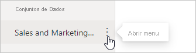

# Segurança ao nível da linha (RLS) com o Power BI

A segurança ao nível da linha (RLS) com o Power BI pode ser utilizada para restringir o acesso a dados para determinados utilizadores. Os filtros restringem o acesso aos dados ao nível da linha e pode definir filtros nas funções. No serviço Power BI, os membros de uma área de trabalho têm acesso a conjuntos de dados na área de trabalho. A RLS não restringe este acesso a dados.

Pode configurar a RLS para modelos de dados importados para o Power BI com o Power BI Desktop. Também pode configurar a RLS em conjuntos de dados que utilizem o DirectQuery, como o SQL Server. Para as ligações em direto do Azure Analysis Services ou do Analysis Services, deverá configurar a Segurança ao nível da linha no modelo, não no Power BI Desktop. A opção de segurança não vai ser apresentada para conjuntos de dados de ligação em direto.

[!INCLUDE [include-short-name](../includes/rls-desktop-define-roles.md)]

Por predefinição, a filtragem de segurança ao nível da linha utiliza filtros unidirecionais, quer as relações estejam definidas como unidirecionais ou bidirecionais. Pode ativar manualmente a filtragem cruzada bidirecional com segurança ao nível da linha ao selecionar a relação e ao marcar a caixa de verificação**Aplicar filtros de segurança em ambas as direções**. Selecione esta opção se tiver também implementado a segurança dinâmica ao nível da linha, ao nível do servidor, na qual a segurança ao nível da linha se baseia no nome de utilizador ou no ID de início de sessão.

Para obter mais informações, veja [Bidirectional cross-filtering using DirectQuery in Power BI Desktop (Filtragem cruzada bidirecional com o DirectQuery no Power BI Desktop)](../transform-model/desktop-bidirectional-filtering.md) e o artigo técnico [Securing the Tabular BI Semantic Model (Proteger o Modelo Semântico Tabular do BI)](https://download.microsoft.com/download/D/2/0/D20E1C5F-72EA-4505-9F26-FEF9550EFD44/Securing%20the%20Tabular%20BI%20Semantic%20Model.docx).

[!INCLUDE [include-short-name](../includes/rls-desktop-view-as-roles.md)]

## Gerir a segurança no modelo

Para gerir a segurança no modelo de dados, siga estes passos:

1. Na serviço Power BI, selecione o menu **Mais opções** de um conjunto de dados. Este menu é apresentado quando passa o rato sobre o nome de conjunto de dados, independentemente de o selecionar no menu de navegação ou na página da área de trabalho.

    

    

1. Selecione **Segurança**.

   

Ao selecionar Segurança, abre a página RLS, onde pode adicionar membros a uma função que criou no Power BI Desktop. Apenas os proprietários do conjunto de dados verão a opção Segurança. Se o conjunto de dados estiver num Grupo, apenas os administradores do grupo verão a opção de segurança.

Só poderá criar ou modificar funções dentro do Power BI Desktop.

## Trabalhar com membros

### Adicionar membros

Adicione um membro à função ao introduzir o endereço de e-mail, o nome do utilizador ou grupo de segurança. Não pode adicionar Grupos criados no Power BI. Pode adicionar membros [externos à sua organização](../guidance/whitepaper-azure-b2b-power-bi.md#data-security-for-external-partners).

Também pode ver quantos membros fazem parte da função pelo número entre parênteses ao lado do nome da função ou ao lado de Membros.

### Remover membros

É possível remover membros selecionando o X ao lado do nome. 

## Validar a função no serviço Power BI

Pode validar que a função que definiu está a funcionar corretamente ao testar a função.

1. Selecione **Mais opções** (...) junto à função.
2. Selecione **Testar dados como função**

Verá os relatórios que estão disponíveis para esta função. Os dashboards não são mostrados nesta vista. No cabeçalho da página, é apresentada a função que está a ser aplicada.

Teste outras funções ou combinação de funções ao selecionar **Agora ver como**.

Pode optar por ver os dados como uma pessoa específica ou pode selecionar uma combinação de funções disponíveis para validar que estão a funcionar.

Para voltar à visualização normal, selecione **Voltar à Segurança de Nível de Linha**.

[!INCLUDE [include-short-name](../includes/rls-usernames.md)]

## Utilizar a RLS com áreas de trabalho no Power BI

Se publicar o relatório do Power BI Desktop numa área de trabalho no serviço Power BI, as funções serão aplicadas aos membros só de leitura. Terá de indicar que os membros só podem ver o conteúdo do Power BI nas definições de área de trabalho.

> [!WARNING]
> Se tiver configurado a área de trabalho para que os membros tenham permissões de edição, as funções de RLS não serão aplicadas às mesmas. Os utilizadores conseguirão ver todos os dados.

[!INCLUDE [include-short-name](../includes/rls-limitations.md)]

[!INCLUDE [include-short-name](../includes/rls-faq.md)]

## Próximos passos

- [Restringir o acesso aos dados com segurança ao nível da linha (RLS) para o Power BI Desktop](../create-reports/desktop-rls.md)
- [Orientação de segurança ao nível da linha (RLS) com o Power BI Desktop](../guidance/rls-guidance.md)
- Perguntas? [Experimente perguntar à Comunidade do Power BI](https://community.powerbi.com/)
- Sugestões? [Contribuir com ideias para melhorar o Power BI](https://ideas.powerbi.com/)
