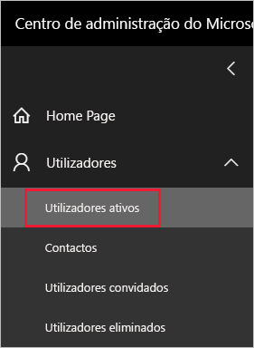
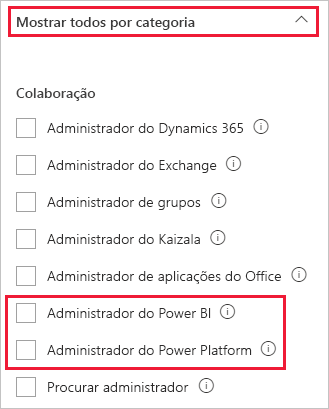

# <a name="understanding-power-bi-service-administrator-roles"></a>Compreender as funções de administrador do serviço Power BI

Para administrar um inquilino do Power BI, tem de ter uma das seguintes funções: administrador do Power BI, administrador do Power Platform ou administrador global do Microsoft 365. Os administradores de gestão de utilizadores do Microsoft 365 atribuem utilizadores às funções de administrador do Power BI ou administrador do Power Platform no centro de administração do Microsoft 365 ou através de um script do PowerShell. Para obter mais informações, veja [Assign roles to user accounts with PowerShell](/office365/enterprise/powershell/assign-roles-to-user-accounts-with-office-365-powershell) (Atribuir funções a contas de utilizadores com o PowerShell).

Os utilizadores com funções de administrador do Power BI e administrador do Power Platform têm controlo total sobre um inquilino do Power BI e sobre as suas funcionalidades administrativas, à exceção do licenciamento. Depois de serem atribuídos, os utilizadores poderão aceder ao [portal de administração do Power BI](service-admin-portal.md). No portal, têm acesso a métricas de utilização a nível do inquilino e podem controlar a utilização a nível do inquilino das funcionalidades do Power BI. Estas funções de administrador são ideais para os utilizadores que precisam de ter acesso ao portal de administração do Power BI sem conceder também a esses utilizadores acesso administrativo completo ao Microsoft 365.

> [!NOTE]
> Na documentação do Power BI, "administrador do Power BI" refere-se aos utilizadores com funções de administrador do Power BI ou de administrador do Power Platform. A documentação clarifica quando a função de administrador global do Microsoft 365 é necessária para uma tarefa.

## <a name="limitations-and-considerations"></a>Limitações e considerações

As funções de administrador do serviço Power BI e de administrador do Power Platform não disponibilizam as seguintes capacidades:

* Capacidade de modificar utilizadores e licenças no centro de administração do Microsoft 365.

* Acesso aos registos de auditoria. Para obter mais informações, veja [Controlar as atividades dos utilizadores no Power BI](service-admin-auditing.md).

Estas funcionalidades exigem a função de administrador global do Microsoft 365.

## <a name="assign-users-to-an-admin-role-in-the-microsoft-365-admin-center"></a>Atribuir uma função de administrador aos utilizadores no centro de administração do Microsoft 365

Para atribuir uma função de administrador aos utilizadores no centro de administração do Microsoft 365, siga estes passos.

1. No [centro de administração do Microsoft 365](https://portal.office.com/adminportal/home#/homepage), selecione **Utilizadores** > **Utilizadores Ativos**.

    

1. Selecione o utilizador ao qual pretende atribuir a função.

1. Em **Funções**, selecione **Gerir Funções**.

    

1. Expanda **Mostrar tudo por categoria** e, em seguida, selecione **Administrador do Power BI** ou **Administrador do Power Platform**.

    

1. Selecione **Guardar alterações**.

## <a name="assign-users-to-the-admin-role-with-powershell"></a>Atribuir utilizadores à função de administrador no PowerShell

Também pode atribuir utilizadores às funções com o PowerShell. Os utilizadores são geridos no Microsoft Azure Active Directory (Microsoft Azure AD). Se ainda não tiver o módulo Azure AD PowerShell, [transfira e instale a versão mais recente](https://www.powershellgallery.com/packages/AzureAD/).

1. Primeiro, ligue-se ao Azure AD:
   ```
   PS C:\Windows\system32> Connect-AzureAD
   ```

1. Segundo, obtenha o **ObjectId** para a função **Administrador do Serviço Power BI**. Pode executar [Get-AzureADDirectoryRole](/powershell/module/azuread/get-azureaddirectoryrole) para obter o **ObjectId**

    ```
    PS C:\Windows\system32> Get-AzureADDirectoryRole

    ObjectId                             DisplayName                        Description
    --------                             -----------                        -----------
    00f79122-c45d-436d-8d4a-2c0c6ca246bf Power BI Service Administrator     Full access in the Power BI Service.
    250d1222-4bc0-4b4b-8466-5d5765d14af9 Helpdesk Administrator             Helpdesk Administrator has access to perform..
    3ddec257-efdc-423d-9d24-b7cf29e0c86b Directory Synchronization Accounts Directory Synchronization Accounts
    50daa576-896c-4bf3-a84e-1d9d1875c7a7 Company Administrator              Company Administrator role has full access t..
    6a452384-6eb9-4793-8782-f4e7313b4dfd Device Administrators              Device Administrators
    9900b7db-35d9-4e56-a8e3-c5026cac3a11 AdHoc License Administrator        Allows access manage AdHoc license.
    a3631cce-16ce-47a3-bbe1-79b9774a0570 Directory Readers                  Allows access to various read only tasks in ..
    f727e2f3-0829-41a7-8c5c-5af83c37f57b Email Verified User Creator        Allows creation of new email verified users.
    ```

    Neste caso, o **ObjectId** da função é 00f79122-c45d-436d-8d4a-2c0c6ca246bf.

1. Em seguida, obtenha o **ObjectId** do utilizador. Para encontrá-lo, execute [Get-AzureADUser](/powershell/module/azuread/get-azureaduser).

    ```
    PS C:\Windows\system32> Get-AzureADUser -ObjectId 'tim@contoso.com'

    ObjectId                             DisplayName UserPrincipalName      UserType
    --------                             ----------- -----------------      --------
    6a2bfca2-98ba-413a-be61-6e4bbb8b8a4c Tim         tim@contoso.com        Member
    ```

1. Para adicionar o membro à função, execute [Add-AzureADDirectoryRoleMember](/powershell/module/azuread/add-azureaddirectoryrolemember).

    | Parâmetro | Descrição |
    | --- | --- |
    | ObjectId |O ObjectId da Função. |
    | RefObjectId |O ObjectId dos membros. |

    ```powershell
    Add-AzureADDirectoryRoleMember -ObjectId 00f79122-c45d-436d-8d4a-2c0c6ca246bf -RefObjectId 6a2bfca2-98ba-413a-be61-6e4bbb8b8a4c
    ```

## <a name="next-steps"></a>Próximos passos

[Administrar o Power BI na sua Organização](service-admin-administering-power-bi-in-your-organization.md)  
[Portal de administração do Power BI](service-admin-portal.md)  

Mais perguntas? [Experimente perguntar à Comunidade do Power BI](https://community.powerbi.com/)