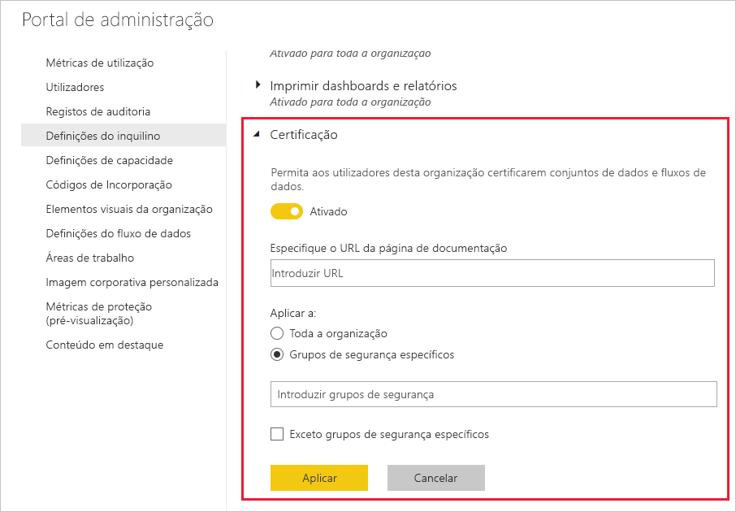

# Ativar a certificação de conteúdo

A sua organização pode certificar conteúdos selecionados para identificá-los como uma origem autorizada de informações importantes. Neste momento, é possível certificar estes tipos de conteúdos:
* Conjuntos de dados
* Fluxos de dados (pré-visualização)
* Relatórios (pré-visualização)
* Aplicações (pré-visualização)

Como administrador do Power BI, é responsável por ativar e configurar o processo de certificação para a sua organização. Isto significa:
* Ativar a certificação no seu inquilino.
* Definir uma lista de grupos de segurança cujos membros serão autorizados para certificar conteúdos.
* Fornecer um URL que aponte para a documentação do processo de certificação de conteúdos da organização, se essa documentação existir.

A certificação faz parte da funcionalidade de *endosso* do Power BI. Veja [Endosso: promover e certificar conteúdos do Power BI](../collaborate-share/service-endorsement-overview.md) para mais informações.

## Configurar a certificação

1. No portal de administração, aceda às Definições de inquilino.
1. Na secção Definições de exportação e partilha, expanda a secção Certificação.

   

1. Mova o botão para **Ligado**.
1. Se a sua organização tiver uma política de certificação publicada, forneça o URL aqui. Irá tornar-se a ligação **Saiba mais** na secção de certificação da [caixa de diálogo de definições do endosso](../collaborate-share/service-endorse-content.md#request-content-certification). Se não fornecer uma ligação, os utilizadores que quiserem pedir a certificação dos respetivos conteúdos serão aconselhados a entrar em contato com o administrador do Power BI.
1. Especifique um ou mais grupos de segurança cujos membros serão autorizados para certificar conteúdos. Estas pessoas autorizadas poderão utilizar o botão Certificação na secção de certificação da [caixa de diálogo de definições do endosso](../collaborate-share/service-endorse-content.md#certify-content).
    
    Se um grupo de segurança contiver subgrupos de segurança aos quais não pretende dar direitos de certificação, pode selecionar a caixa **Exceto grupos de segurança específicos** e introduzir os nomes desses grupos numa caixa de texto que será apresentada.
1. Clique em **Aplicar**.

## Próximos passos
* [Promover ou certificar conteúdos](../collaborate-share/service-endorse-content.md)
* [Ler mais sobre endosso no Power BI](../collaborate-share/service-endorsement-overview.md)
* Perguntas? [Experimente perguntar à Comunidade do Power BI](https://community.powerbi.com/)
