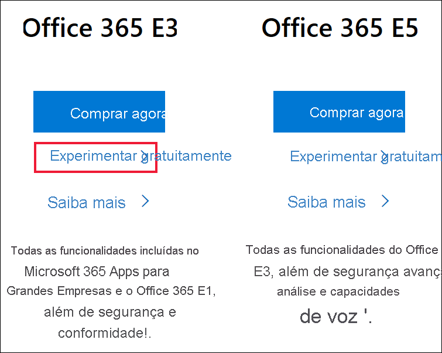
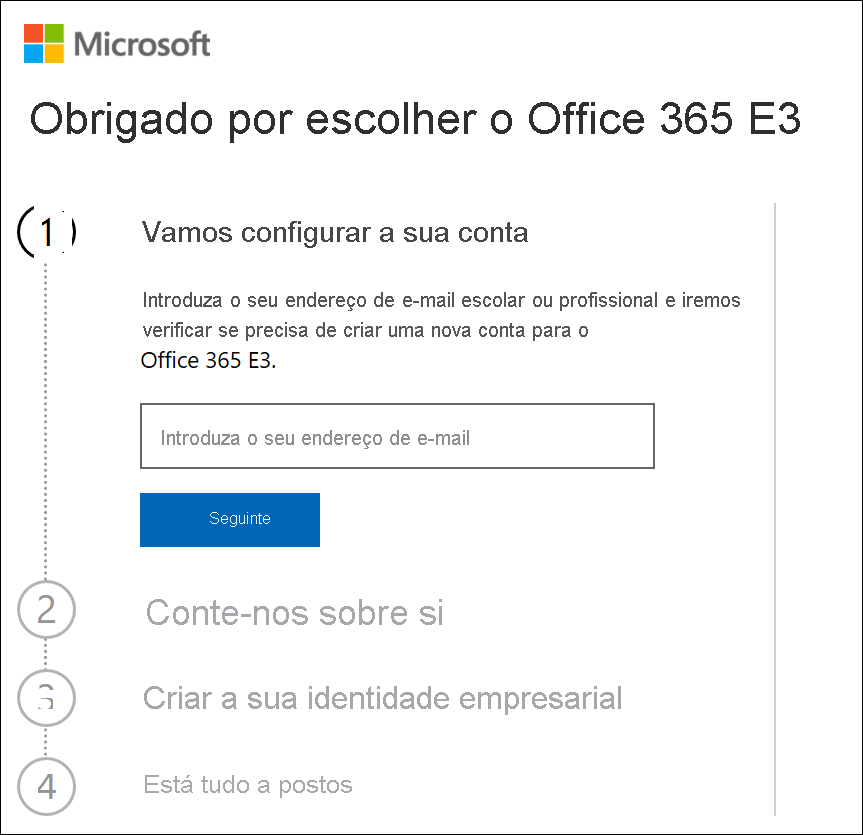
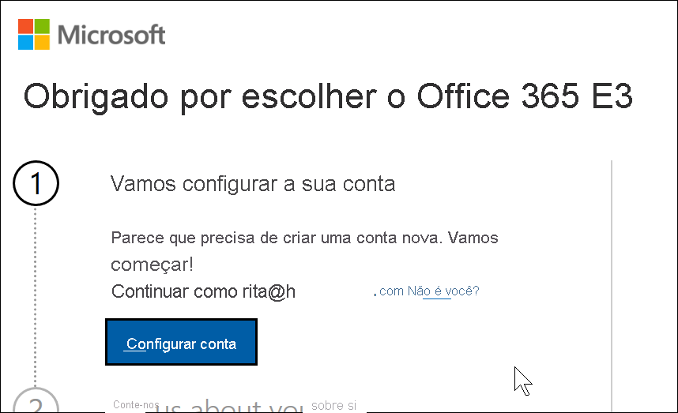
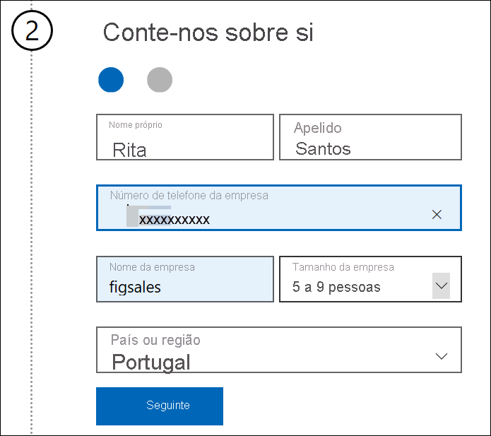
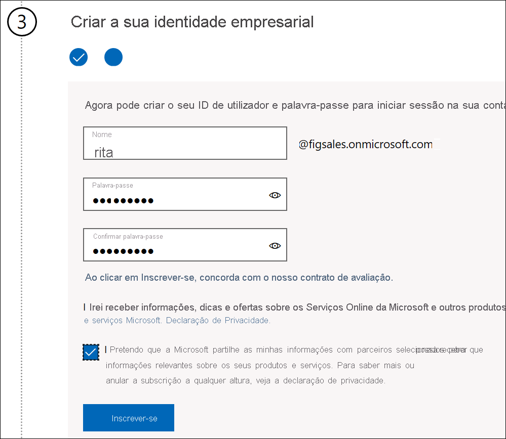
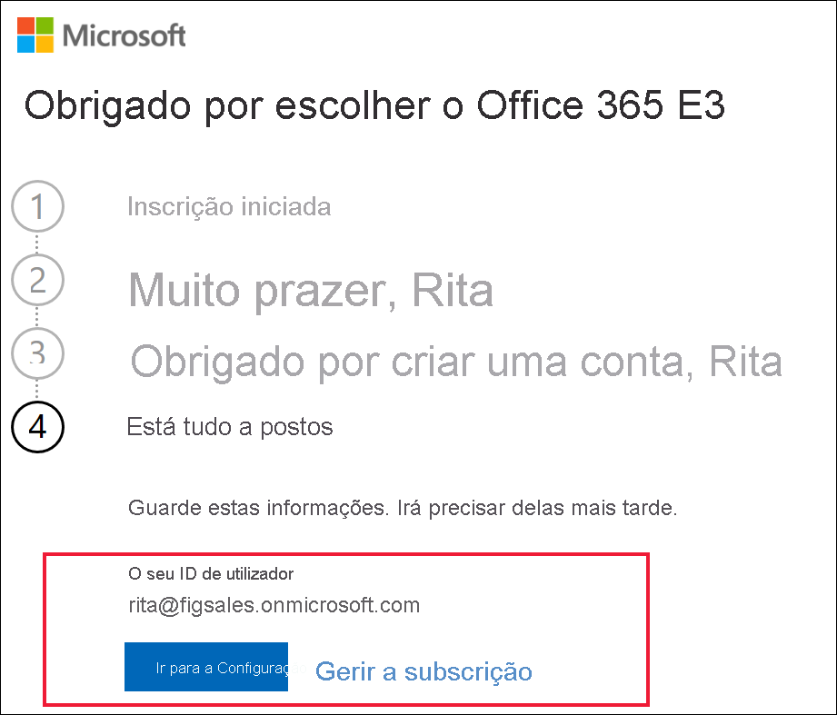

# Inscrever-se no Power BI com uma nova Versão de Avaliação do Microsoft 365

Este artigo descreve uma forma alternativa de se inscrever no Power BI se ainda não tiver uma conta escolar ou profissional.

Se tiver problemas durante a inscrição no Power BI com o endereço de e-mail, confirme primeiro que é um [endereço de e-mail que pode ser utilizado com o Power BI](../fundamentals/service-self-service-signup-for-power-bi.md#supported-email-addresses). Se não conseguir, inscreva-se numa versão de avaliação do Microsoft 365 e crie uma conta profissional. Em seguida, utilize essa nova conta profissional para se inscrever no serviço Power BI. Poderá utilizar o Power BI mesmo depois de a versão de avaliação do Microsoft 365 expirar.

> [!NOTE]
> O Office 365 mudou recentemente de nome para Microsoft 365. Até que todos os nossos artigos sejam atualizados, poderá continuar a vê-lo como Office 365.

## Inscreva-se para uma versão de avaliação do Office no Microsoft 365
Inscreva-se numa avaliação do Microsoft 365 [no site do Microsoft 365](https://www.microsoft.com/microsoft-365/business/compare-more-office-365-for-business-plans). Se ainda não tiver uma conta, a Microsoft irá ajudá-lo a seguir os passos necessários para criar uma. Dado que as contas de e-mail comerciais (como o Hotmail e Gmail) não funcionam com o Microsoft 365, irá criar uma conta nova que funcione.  Essa conta de e-mail terá um aspeto semelhante a *zalan@onmicrosoft.com* .

Se selecionar **Office 365 E5**, a sua versão de avaliação irá incluir o Power BI Pro. A versão de avaliação do Power BI Pro irá expirar ao mesmo tempo que a sua versão de avaliação do Office 365 E5, que é atualmente de 30 dias. Em alternativa, se selecionar **Office 365 E3**, poderá inscrever-se no Power BI como um utilizador *gratuito* e atualizar para uma versão de atualização de 60 dias do **Power BI Pro**. 

1. Introduza o seu endereço de e-mail. A Microsoft irá informá-lo se esse endereço de e-mail irá funcionar com o Microsoft 365 ou se terá de criar um novo endereço de e-mail.  

    Se precisar de um novo endereço de e-mail, a Microsoft irá ajudá-lo a seguir os passos necessários. O primeiro passo é criar uma conta nova. Selecione **Configurar conta**.

    

2. Introduza os detalhes da nova conta.

    

3. Crie o seu novo endereço de e-mail e palavra-passe. Crie um novo nome de início de sessão com um aspeto semelhante a you@yourcompany.onmicrosoft.com. Este é o início de sessão que irá utilizar com a sua nova conta do Office 365 e com o Power BI.

    

4. Já está.  Tem agora um endereço de e-mail que pode utilizar para se inscrever no Power BI. Aceda agora a [Inscrever-se no serviço Power BI como um indivíduo](../service-self-service-signup-for-power-bi.md)

     

    Poderá ter de aguardar até que o seu novo inquilino seja criado.

## Considerações importantes

Se tiver algum problema no início de sessão com a nova conta, experimente utilizar uma sessão de navegação privada.

Com este método de inscrição, está a criar um novo inquilino organizacional e tornar-se-á no administrador de inquilinos. Para obter mais informações, veja [O que é a administração do Power BI?](service-admin-administering-power-bi-in-your-organization.md). Pode adicionar novos utilizadores ao seu inquilino e partilhar com eles, conforme descrito na [documentação de administração do Microsoft 365](https://support.office.com/article/Add-users-individually-to-Office-365---Admin-Help-1970f7d6-03b5-442f-b385-5880b9c256ec).

## Próximos passos

[O que é a administração do Power BI?](service-admin-administering-power-bi-in-your-organization.md)  
[Licenciamento do Power BI na sua organização](service-admin-licensing-organization.md)  
[Inscrever-se no Power BI como um indivíduo](../fundamentals/service-self-service-signup-for-power-bi.md)

Mais perguntas? [Experimente perguntar à Comunidade do Power BI](https://community.powerbi.com/)
