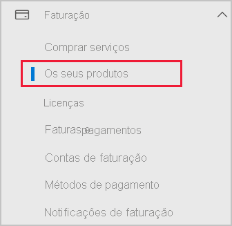
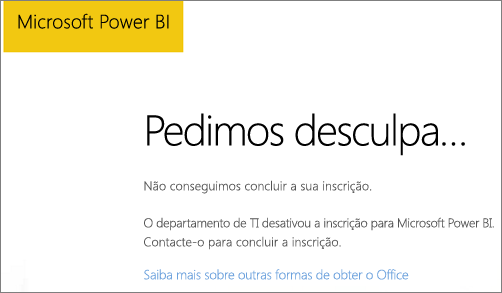

# Adicionar o Power BI a uma subscrição de parceiro Microsoft 365

O Microsoft 365 permite que as empresas o revendam acompanhado e integrado com as suas próprias soluções, ao proporcionar aos clientes um único ponto de contacto para compra, faturação e suporte.

Se estiver interessado em adicionar o Power BI à sua subscrição do Office 365, recomendamos que contacte o seu parceiro. Se o seu parceiro não oferece atualmente o Power BI, pode recorrer às opções indicadas abaixo.

## Trabalhar com o seu parceiro para comprar o Power BI

Se quiser comprar uma subscrição do Power BI Pro ou do Power BI Premium, trabalhe com o seu parceiro para considerar as opções que estão disponíveis:

* O seu parceiro concorda em adicionar o Power BI ao respetivo portefólio para que possa fazer compras através dele.

* O seu parceiro pode fazer a sua transição para um modelo a partir do qual pode comprar o Power BI diretamente à Microsoft ou a outro parceiro que ofereça o Power BI.

## Comprar na Microsoft ou através de outro canal

Consoante a relação com o parceiro, pode comprar o Power BI diretamente na Microsoft ou através de outro parceiro. Pode verificar se pode adicionar subscrições do Power BI no centro de administração do Microsoft 365 (requer a associação na função de administrador global ou administrador de faturação).

1. Aceda ao [centro de administração do Microsoft 365](https://admin.microsoft.com/AdminPortal/Home#/homepage).

1. No menu à esquerda, abra a opção **Faturação** e, em seguida, selecione **Os seus produtos**:

   

 1. Procure **Subscrições**, conforme apresentado na imagem abaixo. Se vir **Subscrições**, poderá adquirir o serviço diretamente na Microsoft ou poderá entrar em contacto com outro parceiro que ofereça o Power BI.

    

    Se não vir **Subscrições**, não poderá comprar diretamente na Microsoft ou através de outro parceiro.

Se o seu parceiro não oferecer o Power BI nem conseguir comprar diretamente na Microsoft ou através de outro parceiro, considere inscrever-se numa avaliação gratuita.

## Inscrever-se numa avaliação gratuita

Pode inscrever-se numa avaliação gratuita do Power BI. Se não comprar o Power BI Pro no final do período de avaliação, continuará a ter uma licença gratuita que disponibiliza muitas das funcionalidades do Power BI. Para obter mais informações, veja [Inscrever-se no Power BI como um indivíduo](../fundamentals/service-self-service-signup-for-power-bi.md).

### Ativar as subscrições ad-hoc

Por predefinição, as inscrições individuais (também conhecidas como subscrições ad-hoc) estão desativadas. Neste caso, é apresentada a seguinte mensagem quando se tenta inscrever: *O departamento de TI desativou a inscrição para o Microsoft Power BI*.

Para ativar as subscrições ad-hoc, contacte o seu parceiro e peça-lhe que as ative. Se for um administrador do inquilino e souber utilizar os comandos do Azure Active Directory PowerShell, poderá ativar as subscrições ad-hoc. Para obter mais informações, siga os passos em [Ativar ou desativar as compras de gestão personalizada](service-admin-disable-self-service.md).

## Próximos passos

* [Licenciamento do Power BI na sua organização](service-admin-licensing-organization.md)
* [Comprar e atribuir licenças Power BI Pro](service-admin-purchasing-power-bi-pro.md)

Mais perguntas? [Experimente perguntar à Comunidade do Power BI](https://community.powerbi.com/)