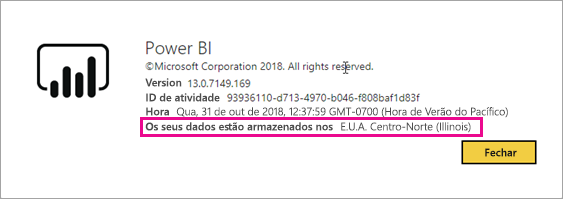
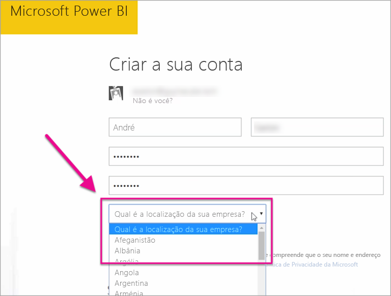

# Onde está localizado o meu inquilino do Power BI?

<iframe width="560" height="315" src="https://www.youtube.com/embed/0fOxaHJPvdM?showinfo=0" frameborder="0" allowfullscreen></iframe>

Saiba onde está localizado o seu inquilino do Power BI e como essa localização é selecionada. É importante saber a localização, uma vez que pode afetar as interações com o serviço.

## Como determinar onde está localizado o inquilino do Power BI

Para localizar a região na qual está o seu inquilino, siga estes passos.

1. No serviço Power BI, no menu superior, selecione ajuda ( **?** ) e, em seguida, **Acerca do Power BI**.

1. Procure o valor junto a **Os dados estão armazenados em**. É a região onde está localizado o seu inquilino. O valor é também a região onde os seus dados são armazenados, a menos que esteja a utilizar capacidades em regiões diferentes para as suas áreas de trabalho.

    

## Como é selecionada a região de dados

A região de dados baseia-se no país/região que selecionar ao criar o inquilino. A seleção aplica-se à inscrição no Microsoft 365 eno Power BI, uma vez que esta informação é partilhada. Caso se trate de um novo inquilino, selecione o país/região adequado na lista quando realizar a inscrição.

O Power BI escolha a região de dados mais próxima da sua seleção, que determina onde os dados são armazenados para o seu inquilino.

> [!IMPORTANT]
> Não pode alterar a seleção depois de criar o inquilino.

Mais perguntas? [Pergunte à Comunidade do Power BI](https://community.powerbi.com/)
