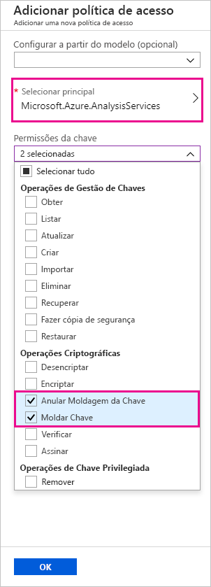
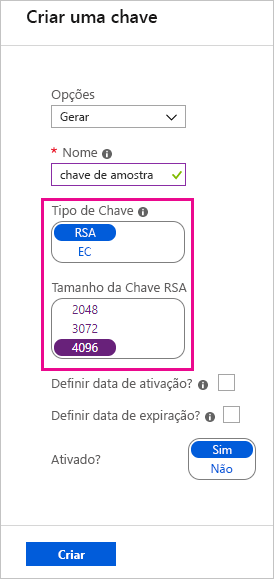
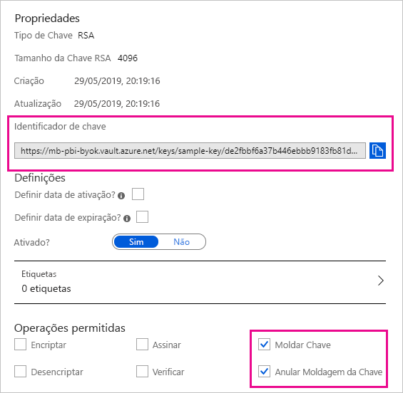

# <a name="bring-your-own-encryption-keys-for-power-bi"></a>Chaves de encriptação por BYOK (Bring Your Own Key) para o Power BI

O Power BI encripta dados _em inatividade_ e _em processamento_. Por predefinição, o Power BI utiliza chaves geridas pela Microsoft para encriptar os seus dados. No Power BI Premium, também pode utilizar as suas próprias chaves para os dados inativos que são importados para um conjunto de dados (veja a secção [Considerações sobre a origem e o armazenamento de dados](#data-source-and-storage-considerations) para obter mais informações). Esta abordagem é normalmente descrita como _Bring Your Own Key_ (BYOK).

## <a name="why-use-byok"></a>Porquê utilizar o BYOK?

O BYOK torna mais fácil de cumprir os requisitos de conformidade que especificam as gestões de chaves por parte do fornecedor de serviços cloud (neste caso, a Microsoft). Com o BYOK, pode fornecer e controlar as chaves de encriptação dos seus dados inativos do Power BI ao nível da aplicação. Deste modo, pode controlar e revogar as chaves da sua organização, caso decida desistir do serviço. Ao revogar as chaves, os dados tornam-se ilegíveis para o serviço num prazo de 30 minutos.

## <a name="data-source-and-storage-considerations"></a>Considerações sobre a origem e o armazenamento de dados

Para utilizar o BYOK, tem de carregar os dados para o serviço Power BI a partir de um ficheiro do Power BI Desktop (PBIX). Não pode utilizar o BYOK nos seguintes cenários:

- Ligação em Direto do Analysis Services
- Livros do Excel (a menos que os dados sejam importados primeiro para o Power BI Desktop)
- [Conjuntos de dados push](/rest/api/power-bi/pushdatasets)
- [Conjuntos de dados de transmissão em fluxo](../connect-data/service-real-time-streaming.md#set-up-your-real-time-streaming-dataset-in-power-bi)


O BYOK aplica-se apenas a conjuntos de dados. Os conjuntos de dados push, ficheiros do Excel e ficheiros CSV que os utilizadores podem carregar para o serviço não são encriptados com a sua chave. Para identificar os artefactos armazenados nas suas áreas de trabalho, utilize o seguinte comando do PowerShell:

```PS C:\> Get-PowerBIWorkspace -Scope Organization -Include All```

> [!NOTE]
> Este cmdlet requer o módulo de gestão v1.0.840 do Power BI. Pode ver a sua versão ao executar Get-InstalledModule -Name MicrosoftPowerBIMgmt. Instale a versão mais recente ao executar Install-Module -Name MicrosoftPowerBIMgmt. Pode obter mais informações sobre o cmdlet do Power BI e os respetivos parâmetros no [módulo do cmdlet do Power BI PowerShell](/powershell/power-bi/overview).

## <a name="configure-azure-key-vault"></a>Configurar o Azure Key Vault

Nesta secção, aprende a configurar o Azure Key Vault, uma ferramenta concebida para armazenar e aceder a segredos de forma segura, tais como chaves de encriptação. Pode utilizar um cofre de chaves existente para armazenar chaves de encriptação ou pode criar um novo para ser utilizado especificamente com o Power BI.

As instruções nesta secção pressupõem que detém conhecimentos básicos sobre o Azure Key Vault. Para obter mais informações, veja [O que é o Azure Key Vault?](/azure/key-vault/key-vault-whatis) Configure o seu cofre de chaves da seguinte forma:

1. Adicione o serviço Power BI como um principal de serviço do cofre de chaves, com permissões de moldar e anular a moldagem.

1. Crie uma chave RSA com um comprimento de 4096 bits (ou utilize uma chave existente deste tipo), com permissões de moldar ou anular a moldagem.

    > [!IMPORTANT]
    > O BYOK do Power BI apenas suporta chaves RSA com um comprimento de 4096 bits.

1. Recomendado: certifique-se de que o cofre de chaves tem a opção de _eliminação de forma recuperável_ ativada.

### <a name="add-the-service-principal"></a>Adicionar o principal de serviço

1. No portal do Azure, em **Políticas de acesso** no seu cofre de chaves, selecione **Adicionar Novo**.

1. Em **Selecionar principal**, procure e selecione Microsoft.Azure.AnalysisServices.

    > [!NOTE]
    > Se não encontrar "Microsoft.Azure.AnalysisServices", é provável que a subscrição do Azure associada ao seu Azure Key Vault nunca tenha tido um recurso do Power BI associado. Em vez disso, experimente procurar a seguinte cadeia de carateres: 00000009-0000-0000-c000-000000000000.

1. Em **Permissões da chave**, selecione **Anular a Moldagem da Chave** e **Moldar Chave**.

    

1. Selecione **OK** e, em seguida, **Guardar**.

> [!NOTE]
> Para revogar o acesso do Power BI aos seus dados no futuro, remova os direitos de acesso deste principal de serviço do Azure Key Vault.

### <a name="create-an-rsa-key"></a>Criar uma chave RSA

1. No seu cofre de chaves, em **Chaves**, selecione **Gerar/Importar**.

1. Selecione um **Tipo de Chave** RSA e um **Tamanho da Chave RSA** de 4096 bits.

    

1. Selecione **Criar**.

1. Em **Chaves**, selecione a chave que criou.

1. Selecione o GUID para a **Versão Atual** da chave.

1. Certifique-se de que as opções **Moldar Chave** e **Anular a Moldagem da Chave** estão selecionadas. Copie o **Identificador de Chave** a utilizar ao ativar o BYOK no Power BI.

    

### <a name="soft-delete-option"></a>Opção de eliminação de forma recuperável

Recomendamos que ative a [eliminação de forma recuperável](/azure/key-vault/key-vault-ovw-soft-delete) no seu cofre de chaves para evitar a perda de dados no caso de uma eliminação acidental da chave ou do cofre de chaves. Tem de utilizar o [PowerShell para ativar a propriedade "eliminação de forma recuperável"](/azure/key-vault/key-vault-soft-delete-powershell) no cofre de chaves, dado que esta opção ainda não se encontra disponível a partir do portal do Azure.

Com o Azure Key Vault devidamente configurado, estará pronto para ativar o BYOK no seu inquilino.

## <a name="enable-byok-on-your-tenant"></a>Ativar o BYOK no seu inquilino

Para ativar o BYOK ao nível do inquilino com o [PowerShell](https://www.powershellgallery.com/packages/MicrosoftPowerBIMgmt.Admin), primeiro introduza as chaves de encriptação que criou e armazenou no Azure Key Vault no seu inquilino do Power BI. Em seguida, atribua estas chaves de encriptação por capacidade Premium para encriptar conteúdos na capacidade.

### <a name="important-considerations"></a>Considerações importantes

Antes de ativar o BYOK, tenha as seguintes considerações em conta:

- Neste momento, não pode desativar o BYOK após tê-lo ativado. Dependendo de como especificar os parâmetros de `Add-PowerBIEncryptionKey`, pode controlar a forma como utiliza o BYOK para uma ou várias das suas capacidades. No entanto, não pode anular a introdução de chaves no seu inquilino. Para obter mais informações, veja a secção [Ativar o BYOK](#enable-byok).

- Não pode mover _diretamente_ uma área de trabalho que recorre a BYOK de uma capacidade dedicada no Power BI Premium para uma capacidade partilhada. Primeiro, tem de mover a área de trabalho para uma capacidade dedicada que não tenha o BYOK ativado.

- Se mover uma área de trabalho que utiliza o BYOK de uma capacidade dedicada no Power BI Premium, os relatórios e conjuntos de dados ficarão inacessíveis, pois são encriptados com a Chave. Para evitar esta situação, tem de mover a área de trabalho para uma capacidade dedicada que não tenha o BYOK ativado.

### <a name="enable-byok"></a>Ativar o BYOK

Para ativar o BYOK, tem de ser um administrador do Power BI e ter sessão iniciada com o cmdlet `Connect-PowerBIServiceAccount`. Em seguida, utilize [`Add-PowerBIEncryptionKey`](/powershell/module/microsoftpowerbimgmt.admin/Add-PowerBIEncryptionKey) para ativar o BYOK, conforme ilustrado no seguinte exemplo:

```powershell
Add-PowerBIEncryptionKey -Name'Contoso Sales' -KeyVaultKeyUri'https://contoso-vault2.vault.azure.net/keys/ContosoKeyVault/b2ab4ba1c7b341eea5ecaaa2wb54c4d2'
```

Para adicionar múltiplas chaves, execute `Add-PowerBIEncryptionKey` com valores diferentes para `-Name` e `-KeyVaultKeyUri`. 

O cmdlet aceita dois parâmetros opcionais que afetam a encriptação das atuais e futuras capacidades. Por predefinição, nenhum dos parâmetros opcionais está definido:

- `-Activate`: indica que esta chave será utilizada para todas as capacidades existentes no inquilino que ainda não foram encriptadas.

- `-Default`: indica que esta chave é a atual predefinição em todo o inquilino. Quando criar uma nova capacidade, a mesma irá herdar esta chave.

> [!IMPORTANT]
> Se especificar o parâmetro `-Default`, todas as capacidades criadas no seu inquilino a partir deste ponto serão encriptadas com a chave que especificar (ou uma chave atualizada predefinida). Não pode anular a operação predefinida, pelo que deixará de conseguir criar uma capacidade Premium no seu inquilino que não utilize o BYOK.

Após ativar o BYOK no inquilino, defina a chave de encriptação de uma ou mais capacidades do Power BI:

1. Utilize [`Get-PowerBICapacity`](/powershell/module/microsoftpowerbimgmt.capacities/get-powerbicapacity) para obter o ID da capacidade necessária para o passo seguinte.

    ```powershell
    Get-PowerBICapacity -Scope Individual
    ```

    O cmdlet devolve uma saída semelhante à seguinte:

    ```
    Id              : xxxxxxxx-xxxx-xxxx-xxxx-xxxxxxxxxxxx
    DisplayName     : Test Capacity
    Admins          : adam@sometestdomain.com
    Sku             : P1
    State           : Active
    UserAccessRight : Admin
    Region          : North Central US
    ```

1. Utilize [`Set-PowerBICapacityEncryptionKey`](/powershell/module/microsoftpowerbimgmt.admin/set-powerbicapacityencryptionkey) para definir a chave de encriptação:

    ```powershell
    Set-PowerBICapacityEncryptionKey -CapacityId xxxxxxxx-xxxx-xxxx-xxxx-xxxxxxxxxxxx -KeyName 'Contoso Sales'
    ```

Pode controlar a forma como utiliza o BYOK no seu inquilino. Por exemplo, para encriptar uma única capacidade, chame o cmdlet `Add-PowerBIEncryptionKey` sem o parâmetro `-Activate` ou `-Default`. Em seguida, chame o cmdlet `Set-PowerBICapacityEncryptionKey` para a capacidade onde pretende ativar o BYOK.

## <a name="manage-byok"></a>Gerir o BYOK

O Power BI fornece cmdlets adicionais para ajudá-lo a gerir o BYOK no seu inquilino:

- Utilize [`Get-PowerBICapacity`](/powershell/module/microsoftpowerbimgmt.capacities/get-powerbicapacity) para obter a chave que a capacidade está a utilizar atualmente:

    ```powershell
    Get-PowerBICapacity -Scope Organization -ShowEncryptionKey
    ```

- Utilize [`Get-PowerBIEncryptionKey`](/powershell/module/microsoftpowerbimgmt.admin/get-powerbiencryptionkey) para obter a chave que o seu inquilino está a utilizar atualmente:

    ```powershell
    Get-PowerBIEncryptionKey
    ```

- Utilize [`Get-PowerBIWorkspaceEncryptionStatus`](/powershell/module/microsoftpowerbimgmt.admin/get-powerbiworkspaceencryptionstatus) para ver quais são os conjuntos de dados numa área de trabalho que estão encriptados e se o respetivo estado de encriptação está sincronizado com a área de trabalho:

    ```powershell
    Get-PowerBIWorkspaceEncryptionStatus -Name'Contoso Sales'
    ```

    Tenha em atenção que a encriptação é ativada ao nível da capacidade, mas que irá obter o estado de encriptação ao nível do conjunto de dados para a área de trabalho especificada.

- Utilize [`Switch-PowerBIEncryptionKey`](/powershell/module/microsoftpowerbimgmt.admin/switch-powerbiencryptionkey) para alternar (ou _rodar_) a versão da chave que está a ser utilizada para encriptação. O cmdlet apenas atualiza o `-KeyVaultKeyUri` para o `-Name` de uma chave:

    ```powershell
    Switch-PowerBIEncryptionKey -Name'Contoso Sales' -KeyVaultKeyUri'https://contoso-vault2.vault.azure.net/keys/ContosoKeyVault/b2ab4ba1c7b341eea5ecaaa2wb54c4d2'
    ```


## <a name="next-steps"></a>Passos seguintes

* [Módulo do cmdlet do Power BI PowerShell](/powershell/power-bi/overview) 

* [Formas de partilhar o seu trabalho no Power BI](../collaborate-share/service-how-to-collaborate-distribute-dashboards-reports.md)

* [Filtrar um relatório usando parâmetros de cadeia de consulta no URL](../collaborate-share/service-url-filters.md)

* [Incorporar com peças Web de relatórios no SharePoint Online](../collaborate-share/service-embed-report-spo.md)

* [Publicar na Web do Power BI](../collaborate-share/service-publish-to-web.md)