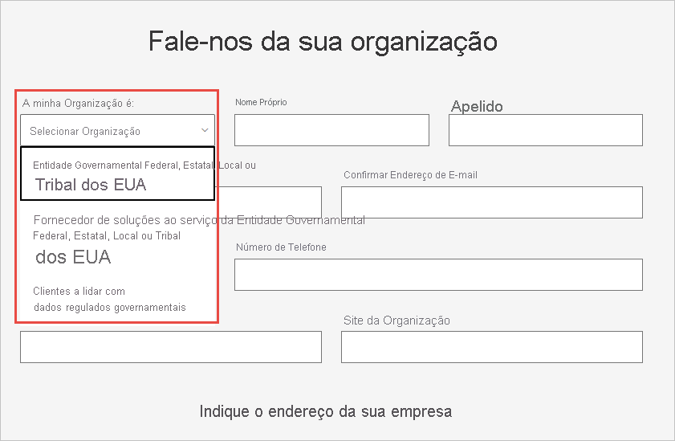

# Inscrever a organização do Governo Norte-Americano no serviço Power BI

Existe uma versão do serviço Power BI como parte dos [Planos do Microsoft 365 para o Governo Norte-Americano](https://www.microsoft.com/microsoft-365/government/compare-office-365-government-plans?rtc=1). Este artigo foi concebido para os clientes do Governo Norte-Americano e o processo de inscrição descrito aqui é diferente da versão comercial do serviço Power BI.

Para obter mais informações sobre o serviço Power BI para o Governo Norte-Americano, veja [Power BI para clientes do Governo Norte-Americano – Descrição geral](service-govus-overview.md).

> [!NOTE]
> Este artigo destina-se a administradores com autoridade para inscrever a organização do Governo Norte-Americano no Power BI. Se for um utilizador final, contacte o seu administrador para saber como obter uma subscrição do Power BI para o Governo Norte-Americano.
> 
> 

## Selecionar o processo de inscrição correto para a organização do Governo Norte-Americano

A sua organização do Governo Norte-Americano pode ser nova na Cloud da Comunidade Governamental ou pode já possuir uma subscrição. As secções seguintes detalham os passos de inscrição com base no seu nível de conhecimento dos Planos do Microsoft 365 para o Governo Norte-Americano e do Power BI. Estes passos são diferentes dependendo da sua inscrição atual.

Depois de se inscrever no Power BI para o governo dos EUA, trabalhe com a sua equipa de conta para iniciar o [processo de adição à lista de permissões](#additional-signup-information) descrito neste artigo. Este passo é necessário para ativar totalmente a sua organização na Cloud da Comunidade Governamental.

## Inscrever-se num novo Plano do Microsoft 365 para o Governo Norte-Americano

Se a sua organização for nova na cloud da comunidade governamental, siga estes passos para obter um Plano do Microsoft 365 para o Governo Norte-Americano:

> [!NOTE]
> Estes passos devem ser realizados pelo administrador global.
>

1. Aceda aos [Planos do Microsoft 365 para o Governo Norte-Americano](https://products.office.com/government/office-365-web-services-for-government).
2. Selecione **Começar a utilizar uma avaliação gratuita**.
3. Preencha este formulário para nos informar sobre a sua organização. Utilize o menu pendente para selecionar o tipo de organização.

   

4. Submeta o formulário para iniciar o processo de inclusão. O seu parceiro ou representante da Microsoft poderá ajudá-lo, em caso de dúvidas.

Após o processo estar concluído, siga os passos dos clientes existentes do Microsoft 365 para o Governo Norte-Americano para adicionar uma subscrição do Power BI.

## Adicionar o Power BI a um Plano do Microsoft 365 para o Governo Norte-Americano

Se a sua organização já possuir um plano do Microsoft 365 para o Governo Norte-Americano, siga estes passos para adicionar uma subscrição do Power BI:

> [!NOTE]
> Estes passos devem ser realizados pelo administrador global.
> 
> 

1. Inicie sessão no centro de administração do Microsoft 365, com as credenciais de administrador de faturação ou administrador global.
2. Selecione **Faturação** > **Comprar serviços**.
4. Procure ou percorra para localizar a oferta do Governo Norte-Americano do Power BI Pro e escolha **Experimentar** ou **Comprar Agora**.
5. Conclua a encomenda.
6. Atribua as licenças às contas de utilizadores.

## Informações de inscrição adicionais

Para poder utilizar os serviços do Power BI para o governo dos EUA, deve trabalhar com a equipa da conta Microsoft para adicionar a sua organização à lista de permissões. O processo de adição à lista de permissões é utilizado pela equipa de engenharia do Power BI para mover os clientes do ambiente da cloud comercial para o ambiente da Nuvem da Comunidade Governamental. Este passo garante que as funcionalidades disponíveis na cloud do Governo Norte-Americano funcionam conforme esperado. 

Para iniciar o processo de adição à lista de permissões, contacte a equipa da conta Microsoft para obter assistência. Apenas os administradores podem pedir a adição à lista de permissões. O processo demora cerca de três semanas. Durante este período, a equipa de engenharia do Power BI faz as alterações adequadas para garantir que o inquilino funciona corretamente na cloud do Governo Norte-Americano.

## Próximos passos

* [Descrição geral do Power BI para o Governo Norte-Americano](service-govus-overview.md)
- [Como posso comprar o Microsoft 365 para o Governo Norte-Americano?](https://docs.microsoft.com/office365/servicedescriptions/office-365-platform-service-description/office-365-us-government/microsoft-365-government-how-to-buy#how-do-i-buy-microsoft-365-government)