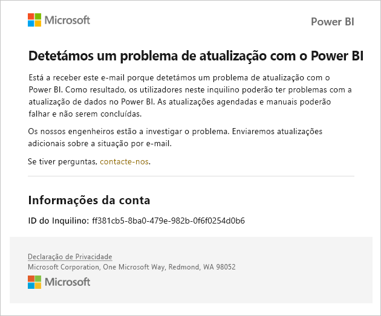
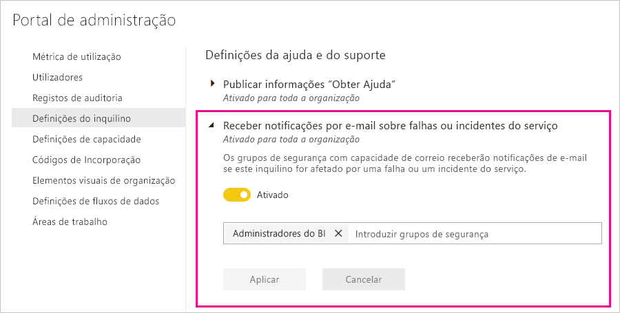

# Service interruption notifications (Notificações de interrupção do serviço)

É importante ter informações sobre a disponibilidade das aplicações empresariais essenciais para a sua atividade. O Power BI fornece notificações de incidentes para que possa, opcionalmente, receber e-mails em caso de interrupção ou degradação do serviço. Apesar de o SLA (Contrato de Nível de Serviço) de 99,9% do Power BI fazer com que estas ocorrências sejam raras, queremos garantir que se mantém informado. A seguinte captura de ecrã mostra o tipo de e-mail que receberá se ativar as notificações:

De momento, enviamos e-mails relativos aos seguintes _cenários de fiabilidade_ :

- Fiabilidade da abertura dos relatórios
- Fiabilidade das atualizações dos modelos
- Fiabilidade das atualizações das consultas

As notificações são enviadas em caso de um _atraso prolongado_ em operações como a abertura de relatórios, a atualização de conjuntos de dados ou execuções de consultas. Após a resolução de um incidente, receberá um e-mail de seguimento.

> [!NOTE]
> De momento, esta funcionalidade só está disponível para capacidades no Power BI Premium. Não está disponível para capacidade partilhada ou incorporada.

## Notificações de fiabilidade e capacidade

Quando uma capacidade do Power BI Premium tem longos períodos de alta utilização de recursos que afetam potencialmente a fiabilidade, é enviado um e-mail de notificação. Exemplos de tais impactos incluem atrasos alargados em operações como a abertura de um relatório, atualização do conjunto de dados e execuções de consultas. 

O e-mail de notificação fornece informações sobre o motivo da alta utilização de recursos, incluindo os seguintes detalhes:

* ID do conjunto de dados responsável
* Tipo de operação
* Tempo de CPU associado à alta utilização de recursos. Eis a [definição de tempo da CPU](https://wikipedia.org/wiki/CPU_time) na Wikipédia.

O Power BI também envia notificações de e-mail quando é detetada uma sobrecarga na capacidade do Power BI Premium. O e-mail explica o motivo provável da sobrecarga, que operações geraram a carga nos 10 minutos anteriores e a quantidade de carga gerada por cada operação.

Se tiver mais do que uma capacidade Premium, o e-mail incluirá informações sobre essas capacidades durante o período de sobrecarga. Estas informações ajudam-no a considerar mover as áreas de trabalho que têm itens com muitos recursos para as capacidades com menor carga.

As notificações de e-mail de sobrecarga só são enviadas quando é acionado um limiar de sobrecarga. Não receberá um segundo e-mail quando essa capacidade Premium deixar de estar sobrecarregada.

A imagem seguinte mostra um e-mail de notificação de exemplo:

## Ativar notificações

Um administrador do Power BI ativa as notificações no portal de administração:

1. Identifique ou crie o grupo de segurança com o e-mail ativado que deve receber notificações.

1. No portal de administração, selecione **Definições de inquilino**. Em **Definições de ajuda e suporte** , expanda **Receber notificações por e-mail se ocorrerem falhas ou incidentes de serviço**.

1. Ative as notificações, insira um grupo de segurança e selecione **Aplicar**.

    

> [!NOTE]
> O Power BI envia notificações da conta no-reply-powerbi@microsoft.com. Adicione esta conta à lista de remetentes seguros para que as notificações não acabem numa pasta de e-mail de lixo.

## Estado de funcionamento do serviço no Microsoft 365

Esta artigo descreve como receber notificações de serviço através do Power BI. Também pode monitorizar o estado de funcionamento do serviço Power BI através do Microsoft 365. Adira para receber notificações por e-mail sobre o estado de funcionamento do serviço do Microsoft 365. Saiba mais em [Como verificar o estado de funcionamento do serviço do Microsoft 365](/microsoft-365/enterprise/view-service-health).

## Próximos passos

[Opções de suporte para o Power BI Pro e Power BI Premium](service-support-options.md)

Mais perguntas? [Pergunte à Comunidade do Power BI](https://community.powerbi.com/)