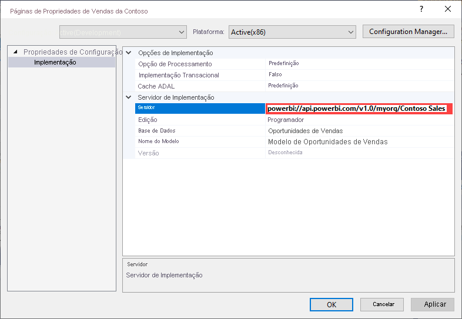
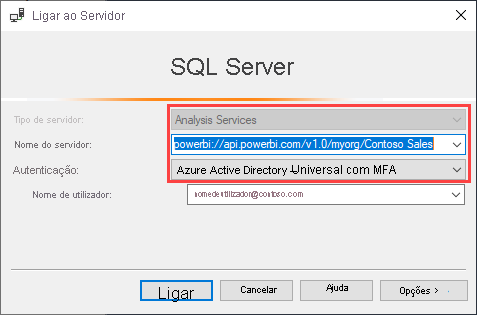
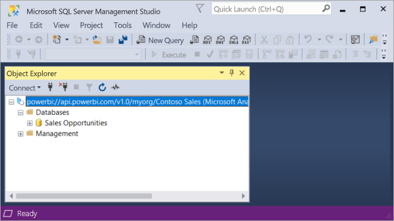
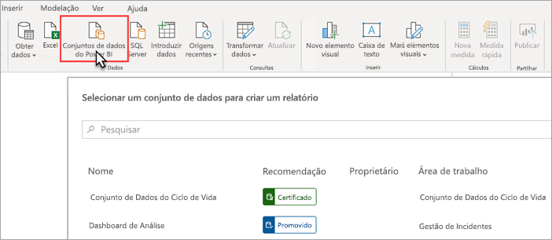
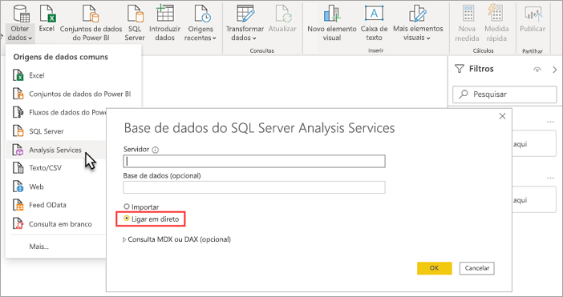

# Dataset connectivity with the XMLA endpoint (Conectividade dos conjuntos de dados com o ponto final XMLA)

As áreas de trabalho e os conjuntos de dados do Power BI Premium ao nível de compatibilidade de 1500 e superior suportam a conectividade de plataforma aberta da Microsoft e aplicações e ferramentas de cliente de terceiros através de um *ponto final XMLA*.

## O que é um ponto final XMLA?

O Power BI Premium utiliza o protocolo [XML for Analysis](/analysis-services/xmla/xml-for-analysis-xmla-reference?view=power-bi-premium-current&preserve-view=true) (XMLA) para comunicações entre as aplicações cliente e o motor que gere as áreas de trabalho e os conjuntos de dados do Power BI. Estas comunicações são geralmente feitas através daquilo a que chamamos pontos finais XMLA. O XMLA é o mesmo protocolo de comunicação utilizado pelo motor da Microsoft Analysis Services que, nos bastidores, executa a modelagem semântica, a governação, o ciclo de vida e a gestão de dados do Power BI. Os dados enviados através do protocolo XMLA estão totalmente encriptados.

Por predefinição, a conectividade *só de leitura* através do ponto final está ativada para a **carga de trabalho dos Conjunto de dados** numa capacidade. Com permissão só de leitura, as aplicações e ferramentas de visualização de dados podem consultar dados de modelos de conjuntos de dados, metadados, eventos e esquemas. As operações de *leitura/escrita* com o ponto final podem ser ativadas para permitir gestão de conjuntos de dados, governação, modelação semântica avançada, depuração e monitorização adicionais. Com as operações de leitura/escrita ativas, os conjuntos de dados do Power BI Premium têm maior paridade com as ferramentas e os processos de modelação tabular de nível empresarial do Azure Analysis Services e do SQL Server Analysis Services.

> [!NOTE]
> Recomenda-se que utilize a experiência da área de trabalho moderna, especialmente quando se liga aos seus conjuntos de dados através do ponto final XMLA. Operações como a criação ou a eliminação de conjuntos de dados não são suportadas com áreas de trabalho clássicas. Para atualizar áreas de trabalho clássicas para a experiência moderna, veja [Atualizar áreas de trabalho clássicas no Power BI](../collaborate-share/service-upgrade-workspaces.md).

## Ferramentas de modelação e gestão de dados

Abaixo, estão algumas das ferramentas mais comuns utilizadas com o Azure Analysis Services e o SQL Server Analysis Services, agora suportadas por conjuntos de dados do Power BI Premium:

**Visual Studio com projetos do Analysis Services**  – também conhecido como SQL Server Data Tools, ou simplesmente **SSDT**, esta é uma ferramenta de criação de modelos de nível empresarial para modelos tabulares do Analysis Services. As extensões dos projetos do Analysis Services são suportadas em todas as edições do Visual Studio 2017 e posteriores, incluindo a Community Edition gratuita. É necessária a extensão com a versão 2.9.14 ou superior para implementar os modelos tabulares numa área de trabalho Premium. Ao implementar numa área de trabalho Premium, o modelo tem de estar no nível de compatibilidade de 1500 ou superior. A leitura/escrita XMLA é necessária na carga de trabalho dos conjuntos de dados. Para obter mais informações, veja [Tools for Analysis Services](/analysis-services/tools-and-applications-used-in-analysis-services?view=power-bi-premium-current&preserve-view=true) (Ferramentas do Analysis Services).

**SQL Server Management Studio (SSMS)**   – suporta consultas DAX, MDX, XMLA. Execute operações de atualização detalhadas e scripting de metadados de conjuntos de dados com a [Tabular Model Scripting Language](/analysis-services/tmsl/tabular-model-scripting-language-tmsl-reference) (Linguagem TMSL). É necessária a permissão só de leitura para as operações de consulta. É necessária a permissão de leitura/escrita para o scripting de metadados. É necessário o SSMS com a versão 18.7.1 ou superior. Faça o download  [aqui](/sql/ssms/download-sql-server-management-studio-ssms).

**SQL Server Profiler**  – instalado com o SSMS, esta ferramenta permite o rastreio e a depuração de eventos de conjuntos de dados. Embora oficialmente preterido para o SQL Server, o Profiler continua a ser incluído no SSMS e continua a ser suportado para o Analysis Services e o Power BI Premium. É necessária a permissão só de leitura XMLA. Para obter mais informações, veja  [SQL Server Profiler for Analysis Services](/analysis-services/instances/use-sql-server-profiler-to-monitor-analysis-services?view=power-bi-premium-current&preserve-view=true) (SQL Server Profiler para o Analysis Services).

**Assistente de Implementação do Analysis Services**  – instalado com o SSMS, esta ferramenta permite a implementação de projetos de modelos tabulares criados pelo Visual Studio nas áreas de trabalho do Analysis Services e do Power BI Premium. Pode ser executado interativamente ou na linha de comandos da automatização. É necessária a permissão de escrita/leitura XMLA. Para obter mais informações, veja [Analysis Services Deployment Wizard](/analysis-services/deployment/deploy-model-solutions-using-the-deployment-wizard?view=power-bi-premium-current&preserve-view=true) (Assistente de Implementação do Analysis Services).

**cmdlets do PowerShell**  – os cmdlets de Analysis Services podem ser utilizados para automatizar as tarefas de gestão dos conjuntos de dados como operações de atualização. É necessária a permissão de escrita/leitura XMLA. É necessária a versão **21.1.18221** ou superior do [módulo PowerShell SqlServer](https://www.powershellgallery.com/packages/SqlServer/). Os cmdlets do Azure Analysis Services no módulo Az.AnalysisServices não são suportados no Power BI Premium. Para obter mais informações, veja [Analysis Services PowerShell Reference](/analysis-services/powershell/analysis-services-powershell-reference?view=power-bi-premium-current&preserve-view=true) (Referências do PowerShell do Analysis Services).

**Report Builder do Power BI**  – uma ferramenta para criar relatórios paginados. Crie uma definição de relatório que especifica os dados a obter, o local de obtenção e a forma como estes são apresentados. Pode pré-visualizar o relatório no Report Builder e, em seguida, publicá-lo no serviço Power BI. É necessária a permissão só de leitura XMLA. Para obter mais informações, veja  [Power BI Report Builder](../paginated-reports/report-builder-power-bi.md).

**Tabular Editor** – uma ferramenta open-source para criar, manter e gerir modelos tabulares com um editor intuitivo e leve. Uma vista hierárquica mostra todos os objetos no modelo tabular. Os objetos são organizados por pastas de apresentação com suporte para edição de propriedades de seleção múltipla e realce da sintaxe DAX. É necessária a permissão só de leitura XMLA para as operações de consulta. É necessária a permissão de leitura/escrita para as operações de metadados. Para obter mais informações, veja [tabulareditor.github.io](https://tabulareditor.github.io/).

**DAX Studio**  – uma ferramenta open-source para a criação, o diagnóstico, a otimização do desempenho e a análise DAX. As funcionalidades incluem navegação de objetos, rastreio integrado, discriminações de execução de consultas com estatísticas detalhadas, realce da sintaxe e formatação DAX. É necessária a permissão só de leitura XMLA para as operações de consulta. Para obter mais informações, veja  [daxstudio.org](https://daxstudio.org/).

**ALM Toolkit** – uma ferramenta de comparação de esquemas open-source para conjuntos de dados do Power BI, mais frequentemente utilizada para cenários de gestão de ciclos de vida das aplicações (ALM). Execute a implementação em vários ambientes e retenha dados históricos de atualizações incrementais. Diferencie e intercale ficheiros, ramos e repositórios de metadados. Reutilize definições comuns entre conjuntos de dados. É necessária a permissão só de leitura para as operações de consulta. É necessária a permissão de leitura/escrita para as operações de metadados. Para obter mais informações, veja  [alm-toolkit.com](http://alm-toolkit.com/).

**Microsoft Excel**  – as Tabelas Dinâmicas do Excel são uma das ferramentas mais comuns utilizadas para resumir, analisar, explorar e apresentar dados de resumo dos conjuntos de dados do Power BI. É necessária a permissão só de leitura para as operações de consulta. É necessária a versão “Clique-e-Use” do Office 16.0.11326.10000 ou superior.

**Terceiros**  – inclui aplicações e ferramentas de visualização de dados cliente que se podem ligara conjuntos de dados, consultá-los e consumi-los no Power BI Premium. A maioria das ferramentas exige as versões mais recentes das bibliotecas de cliente MSOLAP, mas alguns podem utilizar ADOMD. O Ponto final XMLA só de leitura ou de leitura/escrita está dependente das operações.

### Bibliotecas de cliente

As aplicações cliente não comunicam diretamente com o ponto final XMLA. Em vez disso, utilizam *bibliotecas de cliente* como camada de abstração. Estas são as mesmas bibliotecas de cliente que as aplicações utilizam para ligar ao Analysis Services e ao SQL Server Analysis Services. As aplicações da Microsoft, como o Excel, o SQL Server Management Studio (SSMS) e a extensão de projetos do Analysis Services para o Visual Studio instalam as três bibliotecas de cliente e atualizam-nas juntamente com as atualizações habituais de aplicações e extensões. Os programadores também podem utilizar as bibliotecas de cliente para criar aplicações personalizadas. Em alguns casos, especialmente com aplicações de terceiros, caso não sejam instaladas com a aplicação, poderá ter de instalar as versões mais recentes das bibliotecas de cliente. As bibliotecas de cliente são atualizadas mensalmente. Para obter mais informações, veja  [Bibliotecas de cliente para ligar ao Analysis Services](/azure/analysis-services/analysis-services-data-providers).

## Otimizar conjuntos de dados para operações de escrita ao permitir modelos grandes

Ao utilizar o ponto final XMLA para a gestão de conjuntos de dados com operações de escrita, recomenda-se que ative o conjunto de dados para modelos grandes, o que reduz a sobrecarga das operações de escrita e torná-las consideravelmente mais rápidas. Para conjuntos de dados com mais de 1 GB de tamanho (após a compressão), a diferença pode ser significativa. Para obter mais informações, veja [Modelos grandes no Power BI Premium](service-premium-large-models.md).

## Ativar a leitura/escrita XMLA

Por predefinição, uma capacidade Premium tem a definição da propriedade Ponto final XMLA ativada para só de leitura. Tal significa que as aplicações só podem consultar o conjunto de dados. Para que as aplicações possam realizar operações de escrita, a propriedade Ponto final XMLA tem de ser ativada para leitura/escrita. A definição da propriedade Ponto final XMLA para uma capacidade é configurada na **carga de trabalho de Conjuntos de dados**. A definição Ponto final XMLA aplica-se a *todas as áreas de trabalho e conjuntos de dados* atribuídos à capacidade.

### Para permitir a leitura/escrita para uma capacidade

1. No Portal de administração, selecione **Definições de capacidades** > **Power BI Premium** > nome da capacidade.
2. Expanda as **Cargas de trabalho**. Na definição **Ponto final XMLA**, selecione **Leitura/Escrita**.

    

## Ligar a uma área de trabalho Premium

As áreas de trabalho atribuídas a uma capacidade têm uma cadeia de ligação no formato URL como esta,  
`powerbi://api.powerbi.com/v1.0/[tenant name]/[workspace name]`.

As aplicações que se ligam à área de trabalho utilizam o URL como se se tratasse de um nome de servidor do Analysis Services. Por exemplo,  
`powerbi://api.powerbi.com/v1.0/contoso.com/Sales Workspace`.

Os utilizadores com UPNs no mesmo inquilino (não B2B) podem substituir o nome do inquilino por `myorg`. Por exemplo,   
`powerbi://api.powerbi.com/v1.0/myorg/Sales Workspace`.

Os utilizadores B2B têm de especificar o UPN da respetiva organização no nome do inquilino. Por exemplo,  
`powerbi://api.powerbi.com/v1.0/fabrikam.com/Sales Workspace`.

### Para obter o URL de ligação da área de trabalho

Em **Definições** > **Premium** > **Ligação da Área de Trabalho** da área de trabalho, selecione **Copiar**.

## Requisitos de ligação

### Catálogo inicial

Com algumas ferramentas, como o SQL Server Profiler, pode ter de especificar um *Catálogo Inicial*. Especifique um conjunto de dados (base de dados) na sua área de trabalho. Na caixa de diálogo **Ligar ao Servidor**, selecione **Opções** > **Propriedades da Ligação** > **Ligar à base de dados** e introduza o nome do conjunto de dados.

### Duplicar nomes da área de trabalho

As [novas áreas de trabalho](../collaborate-share/service-new-workspaces.md) (criadas com a nova experiência da área de trabalho) no Power BI impõem a validação para não permitir a criação ou alteração de nome de áreas de trabalho com nomes duplicados. As áreas de trabalho que não tenham sido migradas podem resultar em nomes duplicados. Ao ligar a uma área de trabalho com o mesmo nome de outra área de trabalho, poderá ocorrer o seguinte erro:

**Não é possível ligar a powerbi://api.powerbi.com/v1.0/[nome do inquilino]/[nome da área de trabalho].**

Para contornar este erro, além do nome de área de trabalho, especifique o ObjectIDGuid, que pode ser copiado do objectID da área de trabalho no URL. Anexe o objectID ao URL de ligação. Por exemplo,  
“powerbi://api.powerbi.com/v1.0/myorg/Contoso Sales - 9d83d204-82a9-4b36-98f2-a40099093830”.

### Duplicar o nome do conjunto de dados

Ao ligar a um conjunto de dados com o mesmo nome de outro conjunto de dados na mesma área de trabalho, anexe o GUID de conjunto de dados ao nome do conjunto de dados. Pode obter o nome do conjunto de dados e o GUID quando estiver ligado à área de trabalho no SSMS.

### Atraso nos conjuntos de dados apresentados

Ao ligar-se a uma área de trabalho, as alterações dos conjuntos de dados novos, eliminados e renomeados podem demorar alguns minutos a aparecer.

### Conjuntos de dados não suportados

Os seguintes conjuntos de dados não estão acessíveis pelo ponto final XMLA. Estes conjuntos de dados não serão apresentados na área de trabalho no SSMS ou noutras ferramentas:

- Os conjuntos de dados com base numa ligação em direto a um modelo do Azure Analysis Services ou do SQL Server Analysis Services. 
- Conjuntos de dados com base numa ligação em direto a um conjunto de dados do Power BI noutra área de trabalho. Para obter mais informações, veja [Introdução aos conjuntos de dados em áreas de trabalho](../connect-data/service-datasets-across-workspaces.md).
- Conjuntos de dados com envio de dados via Push através da API REST.
- Conjuntos de dados de livros do Excel.

## Segurança

Além da propriedade Ponto final XMLA estar ativada como leitura/escrita pelo administrador da capacidade, a definição ao nível do inquilino **Permitir pontos finais XMLA e Analisar no Excel com conjuntos de dados no local** tem de estar ativada no portal de administração. Se precisar de gerar ficheiros AIXL que liguem ao Ponto final XMLA, a definição ao nível do inquilino **Permitir ligações dinâmicas** também deve estar ativada. Ambas estas definições estão ativadas por predefinição.

**Permitir pontos finais XMLA e Analisar no Excel com conjuntos de dados no local** é uma definição de integração.

:::image type="content" source="media/service-premium-connect-tools/allow-xmla-endpoints.png" alt-text="Definição de integração Permitir pontos finais XMLA.":::

**Permitir ligações dinâmicas** é uma definição de exportação e partilha.

:::image type="content" source="media/service-premium-connect-tools/allow-live-connections.png" alt-text="Definição de exportação e partilha Permitir ligações dinâmicas.":::

O acesso através do ponto final XMLA irá respeitar a associação do grupo de segurança definida ao nível da área de trabalho/aplicação.

Os contribuidores da área de trabalho (e acima) têm acesso de escrita ao conjunto de dados e, portanto, são equivalentes aos administradores da base de dados do Analysis Services. Podem implementar novos conjuntos de dados do Visual Studio e executar scripts TMSL no SSMS.

Atualmente, as operações que requerem permissões de administrador do servidor do Analysis Services (em vez de administrador de base de dados), tais como rastreios ao nível do servidor e representação de utilizador através da propriedade cadeia-ligação [EffectiveUserName](/analysis-services/instances/connection-string-properties-analysis-services?view=power-bi-premium-current&preserve-view=true#bkmk_auth), não são suportadas no Power BI Premium.

Outros utilizadores que tenham [permissão de Criação](../connect-data/service-datasets-build-permissions.md) num conjunto de dados são equivalentes aos leitores de bases de dados do Analysis Services. Podem ligar-se e navegar por conjuntos de dados para o consumo e visualização de dados. As regras de segurança ao nível da linha (RLS) são respeitadas e não conseguem ver metadados de conjuntos de dados internos.

### Funções de modelo

Com o ponto final XMLA, as funções podem ser definidas para um conjunto de dados, a associação de funções pode ser definida para os utilizadores do Azure Active Directory (AAD) e podem ser definidos filtros de segurança ao nível da linha (RLS). As funções de modelo no Power BI são utilizadas apenas para RLS. Utilize o modelo de segurança do Power BI para controlar as permissões além da RLS.

Para projetos de modelos tabulares a serem criados no Visual Studio, as funções podem ser definidas ao utilizar o Role Manager no Model Designer. Para conjuntos de dados no Power BI, as funções podem ser definidas ao utilizar o SSMS para criar objetos de funções e definir propriedades de funções. No entanto, na maioria dos casos, as definições de objetos de funções podem ser colocadas em script ao utilizar o TMSL para criar ou modificar o [Objeto de funções](/analysis-services/tmsl/roles-object-tmsl?view=power-bi-premium-current&preserve-view=true). Os scripts do TMSL podem ser executados no SSMS ou com o cmdlet [Invoke-ASCmd](/powershell/module/sqlserver/invoke-ascmd?view=sqlserver-ps&preserve-view=true) do PowerShell.

As seguintes limitações aplicam-se ao trabalhar com funções de conjuntos de dados através do ponto final XMLA:

- A única permissão para uma *função* que pode ser definida para conjuntos de dados do Power BI é a permissão de Leitura. Outras permissões são concedidas com o modelo de segurança do Power BI.
- É necessária a autorização de criação para um conjunto de dados para o acesso de leitura através do ponto final XMLA, independentemente da existência de funções de conjunto de dados.
- As regras de segurança ao nível do objeto (OLS) não são atualmente suportadas no Power BI.

Para saber mais, veja [Funções em modelos tabulares](/analysis-services/tabular-models/roles-ssas-tabular).

### Definir credenciais de origem de dados

Os metadados especificados através do ponto final XMLA podem criar ligações a origens de dados, mas não podem definir credenciais de origem de dados. Em vez disso, as credenciais podem ser definidas na página de definições de conjuntos de dados no Serviço Power BI.

### Principais de serviço

Os principais de serviço são registos de aplicações do Azure Active Directory que pode criar no seu inquilino para efetuar operações automáticas de recursos e níveis de serviço. Trata-se de um tipo exclusivo de identidade de utilizador com um nome de aplicação, ID de aplicação, ID de inquilino e segredo de cliente ou certificado de palavra-passe. O Power BI Premium utiliza a mesma funcionalidade de principal de serviço que o Power BI Embedded.

No Power BI Premium, os principais de serviço também podem ser utilizados com o ponto final XMLA para automatizar tarefas de gestão de conjuntos de dados, tal como aprovisionar áreas de trabalho, implementar modelos e atualizar conjuntos de dados com:

- PowerShell
- Automatização do Azure
- Azure Logic Apps
- Aplicações cliente personalizadas

Para saber mais, veja [Automatizar as tarefas de conjuntos de dados e áreas de trabalho Premium com principais de serviço](service-premium-service-principal.md).

## Implementar projetos de modelos do Visual Studio (SSDT)

Implementar um projeto de modelo tabular no Visual Studio para uma área de trabalho do Power BI Premium é praticamente o mesmo que implementar para um Analysis Services do Azure ou do SQL Server. As únicas diferenças estão na propriedade Servidor de Implementação especificada para o projeto e a forma como as credenciais de origem de dados são especificadas para que as operações de processamento possam importar dados de origens de dados para o novo conjunto de dados na área de trabalho.

Para implementar um projeto de modelo tabular criado no Visual Studio, tem primeiro de definir o URL de ligação da área de trabalho na propriedade **Servidor de Implementação** do projeto. No Visual Studio, em **Explorador de Soluções**, clique com o botão direito do rato no projeto > **Propriedades**. Na propriedade **Servidor**, cole o URL da ligação da área de trabalho.

Quando a propriedade Servidor de Implementação tiver sido especificada, o projeto poderá ser implementado.

**Quando implementado pela primeira vez**, é criado um conjunto de dados na área de trabalho com metadados do model.bim. Como parte da operação de implementação, após a criação do conjunto de dados na área de trabalho a partir dos metadados de modelo, o processamento para carregar os dados para o conjunto de dados a partir de origens de dados falhará.

O processamento falha porque, ao contrário da implementação numa instância do Analysis Server do Azure ou do SQL Server, onde as credenciais de origem de dados são solicitadas como parte da operação de implementação, quando é realizada a implementação numa área de trabalho Premium, as credenciais da origem de dados não podem ser especificadas como parte da operação de implementação. Em vez disso, após a implementação de metadados ter sido bem sucedida e o conjunto de dados ter sido criado, as credenciais da origem de dados são especificadas no Serviço Power BI nas definições dos conjuntos de dados. Na área de trabalho, selecione **Conjuntos de dados** > **Definições** > **Credenciais da origem de dados** > **Editar credenciais**.

Quando as credenciais da origem de dados forem especificadas, poderá atualizar o conjunto de dados no serviço Power BI, configurar o agendamento de atualizações ou processar (atualizar) a partir do SQL Server Management Studio para carregar dados para o conjunto de dados.

Observa-se a implementação da propriedade **Opção de Processamento** especificada no projeto do Visual Studio. No entanto, se uma origem de dados ainda não tiver credenciais especificadas no serviço Power BI, mesmo que a implementação de metadados seja bem sucedida, o processamento falhará. Pode configurar a propriedade para **Não Processar**, o que impedirá uma tentativa de processamento como parte da implementação, mas aconselhamos a que defina a propriedade novamente como **Padrão**, pois uma vez especificadas as credenciais da origem de dados nas definições da origem de dados para o novo conjunto de dados, o processamento como parte das operações de implementação subsequentes terá êxito.

## Ligar com o SSMS

Utilizar o SSMS para se ligar a uma área de trabalho é semelhante a ligar-se a um servidor do Analysis Services do Azure ou do SQL Server. A única diferença é que especifica o URL da área de trabalho no nome do servidor e tem de utilizar a autenticação **Active Directory – Universal com MFA**.

### Ligar-se a uma área de trabalho com o SSMS

1. No SQL Server Management Studio, selecione **Ligar** > **Ligar ao Servidor**.

2. Em **Tipo de Servidor**, selecione **Analysis Services**. Em **Nome do servidor**, introduza o URL da área de trabalho. Em **Autenticação**, selecione **Active Directory – Universal com MFA** e, em seguida, em **Nome de utilizador**, introduza o ID do utilizador organizacional.

    

Uma vez estabelecida a ligação, a área de trabalho será apresentada como um servidor do Analysis Services e os conjuntos de dados na área de trabalho serão apresentados como bases de dados.  

Para saber mais sobre a utilização do SSMS para executar scripts para metadados, veja [Create Analysis Services scripts](/analysis-services/instances/create-analysis-services-scripts-in-management-studio?view=power-bi-premium-current&preserve-view=true) (Criar scripts do Analysis Services) e [Tabular Model Scripting Language (TMSL)](/analysis-services/tmsl/tabular-model-scripting-language-tmsl-reference?view=power-bi-premium-current&preserve-view=true) (Linguagem TMSL).

## Atualização do conjunto de dados

O ponto final XMLA permite um vasto leque de cenários para capacidades de atualização detalhada através do SSMS, automatização com o PowerShell, [Automatização do Azure](/azure/automation/automation-intro) e [Funções do Azure](/azure/azure-functions/functions-overview) com o modelo TOM. Pode, por exemplo, atualizar certas partições históricas de [atualização incremental](service-premium-incremental-refresh.md) sem ter de recarregar todos os dados históricos.

Ao contrário da configuração de atualização no serviço Power BI, as operações de atualização através do ponto final XMLA não se limitam a 48 atualizações por dia e o [horário de atualização programado](../connect-data/refresh-troubleshooting-refresh-scenarios.md#scheduled-refresh-timeout) não é imposto.

## Vistas de Gestão Dinâmica (DMV)

As [DMVs](/analysis-services/instances/use-dynamic-management-views-dmvs-to-monitor-analysis-services) do Analysis Services proporcionam a visibilidade dos metadados, linhagem e utilização de recursos dos conjuntos de dados. As DMVs disponíveis para consulta no Power BI através do ponto final XMLA estão limitadas, no máximo, às que requerem permissões de administração de base de dados. Algumas DMVs, por exemplo, não estão acessíveis porque requerem permissões de administrador de servidor do Analysis Services.

## Conjuntos de dados criados no Power BI Desktop

### Metadados melhorados

As operações de escrita XMLA nos conjuntos de dados criados no Power BI Desktop e publicados numa área de trabalho Premium requerem a ativação da opção de metadados melhorados. Para obter mais informações, veja [Metadados de conjuntos de dados otimizados](../connect-data/desktop-enhanced-dataset-metadata.md).

> [!CAUTION]
> De momento, a operação de escrita num conjunto de dados criado no Power BI Desktop impedirá que sejam transferidos como um ficheiro PBIX. Confirme que mantém o ficheiro PBIX original.

### Declaração de origem de dados

Ao ligar-se a origens de dados e dados de consulta, o Power BI Desktop utiliza expressões do Power Query M como declarações de origem de dados inline. Embora suportado em áreas de trabalho do Power BI Premium, a declaração de origem de dados inline do Power Query M não é suportada pelo Azure Analysis Services nem pelo SQL Server Analysis Services. Em vez disso, as ferramentas de modelação de dados do Analysis Services como o Visual Studio criam metadados através de declarações de origem de dados *estruturadas* e/ou de *fornecedor*. Com o ponto final XMLA, o Power BI Premium também suporta origens de dados estruturadas e de fornecedor, mas não como parte das declarações de origem de dados inline do Power Query M nos modelos do Power BI Desktop. Para obter mais informações, veja [Compreender os fornecedores](/azure/analysis-services/analysis-services-datasource#understanding-providers).

### Power BI Desktop no modo de ligação em direto

O Power BI Desktop pode ligar-se a um conjunto de dados Power BI Premium com uma ligação em direto. Ao utilizar uma ligação em direto, os dados não têm de ser replicados localmente, o que torna mais fácil para os utilizadores consumir modelos semânticos. Existem duas formas de os utilizadores se ligarem:

Ao selecionar **Conjuntos de dados do Power BI** e, em seguida, selecionar um conjunto de dados para criar um relatório. Esta é a forma **recomendada** de os utilizadores se ligarem em direto aos conjuntos. Este método constitui uma experiência de descoberta otimizada, que mostra o nível de recomendação dos conjuntos de dados. Os utilizadores não têm de localizar e acompanhar os URLs de áreas de trabalho. Para encontrar um conjunto de dados, os utilizadores precisam apenas de escrever o nome do conjunto de dados ou percorrer para localizar o conjunto de dados que procuram.

A outra forma de os utilizadores se ligarem é através da opção **Obter Dados** > **Analysis Services**. Especifique uma área de trabalho Power BI Premium como URL, selecione **Ligar em direto** e, no Navegador, selecione um conjunto de dados. Neste caso, o Power BI Desktop utiliza o ponto final XMLA para ligar em direto ao conjunto de dados como se fosse um modelo de dados do Analysis Services. 

As organizações com relatórios existentes ligados em direto aos modelos de dados do Analysis Services com intenção de os migrarem para os conjuntos de dados do Power BI Premium precisam apenas de alterar o URL do nome de servidor em **Transformar dados** > **Definições de origens de dados**.

## Registos de auditoria

Quando as aplicações se ligam a uma área de trabalho, o acesso através de pontos finais XMLA é registado nos registos de auditoria do Power BI com as seguintes operações:

|Nome amigável da operação   |Nome da operação   |
|---------|---------|
|Ligado ao conjunto de dados do Power BI a partir de uma aplicação externa      |  ConnectFromExternalApplication        |
|Atualização do conjunto de dados do Power BI pedida a partir de uma aplicação externa      | RefreshDatasetFromExternalApplication        |
|Conjunto de dados do Power BI criado a partir de uma aplicação externa      |  CreateDatasetFromExternalApplication        |
|Conjunto de dados do Power BI editado a partir de uma aplicação externa     |  EditDatasetFromExternalApplication        |
|Conjunto de dados do Power BI eliminado a partir de uma aplicação externa      |  DeleteDatasetFromExternalApplication        |

Para obter mais informações, veja  [Auditoria do Power BI](service-admin-auditing.md).

## Veja também

Mais perguntas? [Experimente perguntar à Comunidade do Power BI](https://community.powerbi.com/)
