# <a name="incremental-refresh-in-power-bi"></a>Atualização incremental no Power BI

A atualização incremental permite utilizar conjuntos de dados muito grandes no Power BI com as seguintes vantagens:

> [!div class="checklist"]
> * **As atualizações ocorrem de forma mais rápida** – apenas os dados que são alterados têm de ser atualizados. Por exemplo, atualize apenas os últimos cinco dias de um conjunto de dados de 10 anos.
> * **As atualizações são mais fiáveis** – já não é necessário manter ligações de longa duração a sistemas de origens voláteis.
> * **O consumo de recursos é reduzido** – uma quantidade menor de dados a atualizar reduz o consumo geral de memória e de outros recursos.

> [!NOTE]
> A atualização incremental está agora disponível para o Power BI Pro e Premium, bem como para conjuntos de dados e subscrições partilhadas. 

## <a name="configure-incremental-refresh"></a>Configurar a atualização incremental

As políticas de atualização incremental são definidas no Power BI Desktop e aplicadas assim que são publicadas no serviço Power BI.


### <a name="filter-large-datasets-in-power-bi-desktop"></a>Filtrar conjuntos de dados grandes no Power BI Desktop

Os conjuntos de dados grandes com potencialmente milhares de milhões de linhas poderão não ser adequados a um modelo do Power BI Desktop porque o ficheiro PBIX é limitado pelos recursos de memória disponíveis no computador. Por isso, esses conjuntos de dados são normalmente filtrados após a importação. Este tipo de filtragem aplica-se quer esteja a utilizar a atualização incremental ou não. Para a atualização incremental, o utilizador filtra ao utilizar os parâmetros de data/hora do Power Query.

#### <a name="rangestart-and-rangeend-parameters"></a>Parâmetros RangeStart e RangeEnd

Para a atualização incremental, os conjuntos de dados são filtrados ao utilizar os parâmetros de data/hora do Power Query com os nomes **RangeStart** e **RangeEnd** reservados e sensíveis às maiúsculas e minúsculas. Estes parâmetros são utilizados para filtrar os dados importados para o Power BI Desktop, bem como para particionar de forma dinâmica os dados em intervalos assim que forem publicados no serviço Power BI. Os valores do parâmetro são substituídos pelo serviço para filtrar por cada partição. Não precisa de os definir nas definições dos conjuntos de dados no serviço. Uma vez publicados, os valores de parâmetro são substituídos automaticamente pelo serviço Power BI.

Para definir os parâmetros com valores predefinidos, no Editor do Power Query, selecione **Gerir Parâmetros**.

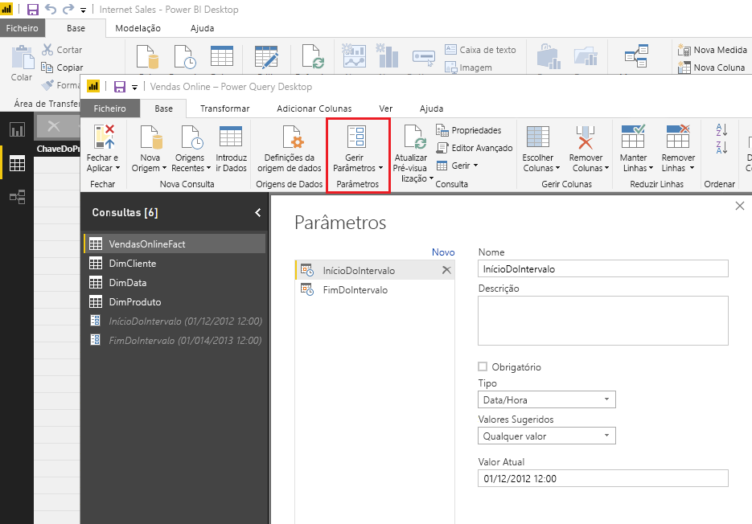

Com os parâmetros definidos, pode então aplicar o filtro ao selecionar a opção no menu **Filtro Personalizado** de uma coluna.

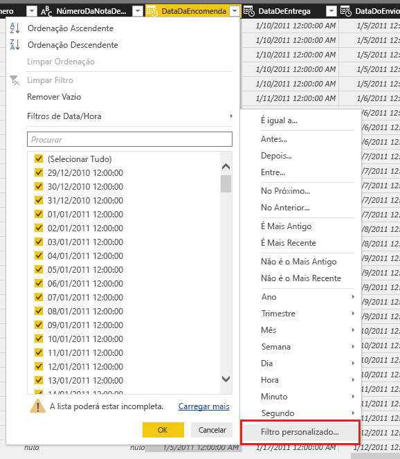

Certifique-se de que as linhas são filtradas onde o valor da coluna *é posterior ou igual a* **RangeStart** e *anterior a* **RangeEnd**. Outras combinações de filtros podem resultar na contagem duplicada de linhas.

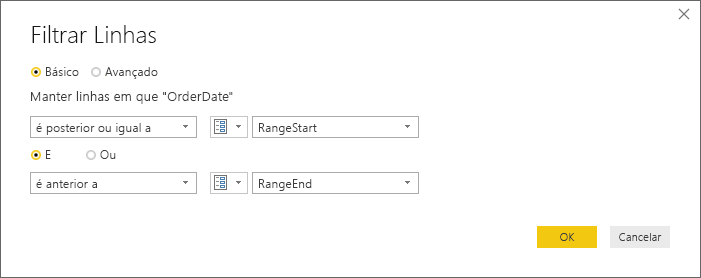

> [!IMPORTANT]
> Certifique-se de que as consultas têm um símbolo de igual (=) no parâmetro **RangeStart** ou no parâmetro **RangeEnd**, mas não em ambos. Se o símbolo de igual (=) existir em ambos os parâmetros, uma linha poderá satisfazer as condições de duas partições, o que pode levar à duplicação de dados no modelo. Por exemplo,  
> o cenário \#"Linhas Filtradas" = Table.SelectRows(dbo_Fact, cada [OrderDate] **>= RangeStart** e [OrderDate] **<= RangeEnd**) pode causar a duplicação de dados.

> [!TIP]
> Embora o tipo de dados dos parâmetros tenha de ser data/hora, é possível convertê-lo de modo a corresponder aos requisitos da origem de dados. Por exemplo, a seguinte função do Power Query converte um valor de data/hora para que se assemelhe a uma chave de substituição de número inteiro no formato *aaaammdd*, o que é comum em armazéns de dados. A função pode ser invocada pelo passo de filtragem.
>
> `(x as datetime) => Date.Year(x)*10000 + Date.Month(x)*100 + Date.Day(x)`

Selecione **Fechar e Aplicar** no Editor do Power Query. Deve ter um subconjunto do conjunto de dados no Power BI Desktop.

#### <a name="filter-date-column-updates"></a>Filtrar atualizações da coluna de datas

O filtro na coluna de datas é utilizado para particionar os dados em intervalos no serviço Power BI. A atualização incremental não foi concebida para suportar casos onde a coluna de datas filtrada é atualizada no sistema de origem. Uma atualização é interpretada como uma inserção e uma eliminação, não como uma atualização real. Se a eliminação ocorrer no intervalo histórico e não no intervalo incremental, não será registada. Isto pode causar falhas na atualização de dados devido a conflitos de chave de partição.

#### <a name="query-folding"></a>Dobragem de consultas

É importante que os filtros de partição sejam enviados para o sistema de origem quando as consultas são submetidas para as operações de atualização. Enviar a filtragem significa que a origem de dados deve suportar a dobragem de consultas. A maioria das origens de dados que suporta consultas SQL também suporta a filtragem de consultas no servidor. No entanto, as origens de dados como ficheiros simples, blobs e feeds Web normalmente não a suportam. Nos casos em que o filtro não for suportado pelo back-end da origem de dados, não poderá ser enviado. Nesses casos, o motor de mashup compensa e aplica o filtro localmente, o que poderá exigir a obtenção do conjunto de dados completo a partir da origem de dados. Isto pode tornar a atualização incremental muito lenta e o processo pode ficar sem recursos no serviço Power BI ou no gateway de dados no local, se este for utilizado.

Devido aos vários níveis do suporte da dobragem de consultas para cada origem de dados, é recomendado que a verificação seja executada para garantir que a lógica de filtro está incluída nas consultas de origem. Para facilitar, o Power BI Desktop tenta executar esta verificação automaticamente. Se não for possível verificar, será apresentado um aviso na caixa de diálogo da atualização incremental ao definir a política de atualização incremental. As origens de dados baseadas em SQL, como o SQL Oracle e o Teradata, podem depender deste aviso. Outras origens de dados poderão não conseguir verificar sem as consultas de rastreio. Se o Power BI Desktop não conseguir confirmar, será apresentado o seguinte aviso. Se vir este aviso e quiser confirmar a ocorrência da dobragem de consultas necessária, pode utilizar a funcionalidade Diagnóstico de Consultas ou rastrear as consultas recebidas pela base de dados de origem.

 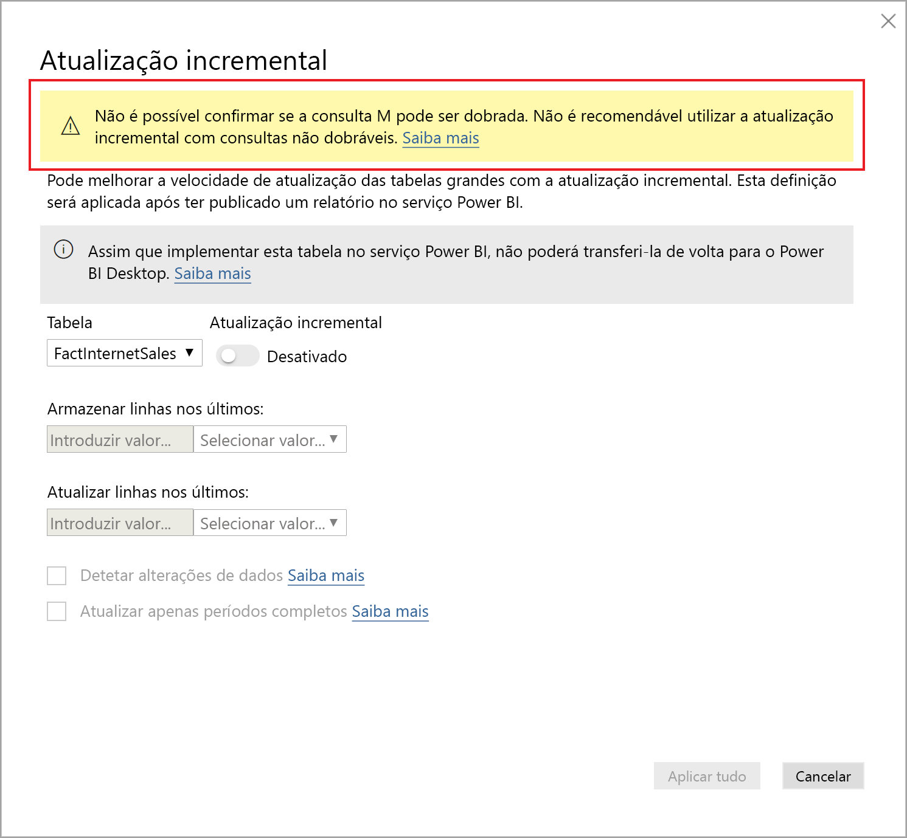

### <a name="define-the-refresh-policy"></a>Definir a política de atualização

A atualização incremental está disponível no menu de contexto para tabelas, exceto para modelos Ligação em Direto.

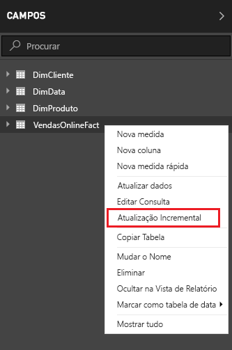

#### <a name="incremental-refresh-dialog"></a>Caixa de diálogo Atualização Incremental

A caixa de diálogo Atualização Incremental é apresentada. Utilize o botão para ativar a caixa de diálogo.


> [!NOTE]
> Se a expressão do Power Query da tabela não fizer referência aos parâmetros com nomes reservados, o botão será desativado.

O texto de cabeçalho explica o seguinte:

- As políticas de atualização são definidas no Power BI Desktop e são aplicadas por operações de atualização no serviço.

- Se conseguir transferir o ficheiro PBIX com uma política de atualização incremental a partir do serviço Power BI, o ficheiro não poderá ser aberto no Power BI Desktop. Embora esta operação possa vir a ser suportada no futuro, tenha em atenção que estes conjuntos de dados podem tornar-se muito grandes e deixarem de ser práticos para transferir e abrir num computador normal.

#### <a name="refresh-ranges"></a>Intervalos de atualização

O seguinte exemplo define uma política de atualização para armazenar dados durante cinco anos do calendário completos, bem como dados do ano atual até à data atual. Também atualiza 10 dias de dados de forma incremental. A primeira operação de atualização carrega dados de histórico. As atualizações subsequentes são incrementais e executam as seguintes operações, se as mesmas estiverem agendadas para serem executadas diariamente:

- Adicionar um novo dia de dados.

- Atualizar 10 dias até à data atual.

- Remover os anos do calendário com mais de cinco anos antes da data atual. Por exemplo, se a data atual for 1 de janeiro de 2019, o ano 2013 será removido.

A primeira atualização no serviço Power BI poderá demorar mais tempo a importar todos os cinco anos do calendário completos. As atualizações posteriores poderão ser concluídas numa fração do tempo.

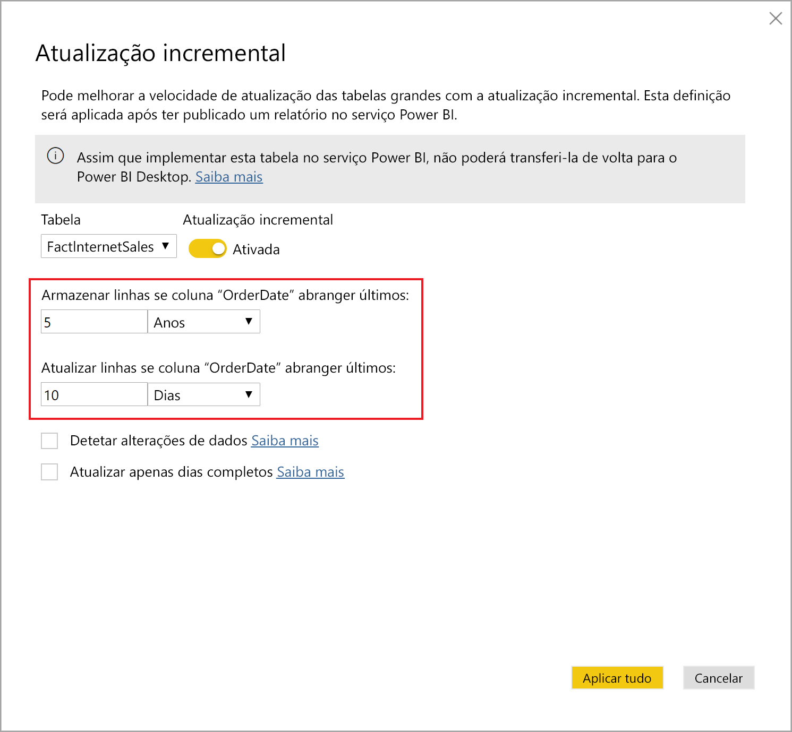


#### <a name="current-date"></a>Data atual

A *data atual* é baseada na data do sistema na altura da atualização. Se a atualização agendada estiver ativada para o conjunto de dados no serviço Power BI, o fuso horário especificado será tido em conta ao determinar a data atual. Tanto as atualizações manuais como as agendadas verificam o fuso horário, caso o mesmo esteja disponível. Por exemplo, uma atualização que ocorra às 20h na Hora do Pacífico (EUA e Canadá) com o fuso horário especificado irá determinar a data atual com base na Hora do Pacífico e não na hora GMT (que seria no dia seguinte).

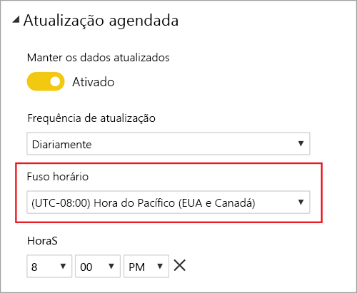

> [!NOTE]
> Poderá apenas ter de definir estes intervalos. Se for esse o caso, pode avançar para o passo de publicação abaixo. Os menus pendentes adicionais aplicam-se a funcionalidades avançadas.

### <a name="advanced-policy-options"></a>Opções de política avançadas

#### <a name="detect-data-changes"></a>Detetar alterações de dados

Uma atualização incremental de 10 dias é muito mais eficiente do que uma atualização completa de cinco anos. No entanto, é possível fazer ainda melhor. Se selecionar a caixa de verificação **Detetar alterações de dados**, pode selecionar uma coluna de data/hora utilizada para identificar e atualizar apenas os dias em que os dados foram alterados. Isto pressupõe a existência de uma coluna deste tipo no sistema de origem, que normalmente serve para efeitos de auditoria. **Não deve ser a mesma coluna utilizada para particionar os dados com os parâmetros RangeStart/RangeEnd.** O valor máximo desta coluna é avaliado para cada um dos períodos no intervalo incremental. Se não tiver sido alterado desde a última atualização, não é necessário atualizar o período. Neste exemplo, poderia reduzir os dias atualizados incrementalmente de dez para dois.

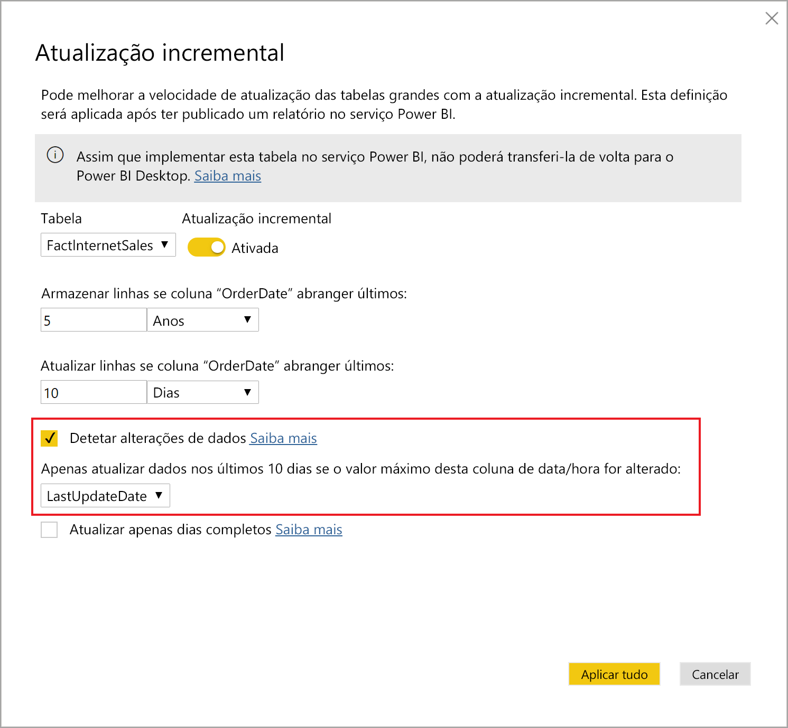

> [!TIP]
> O design atual requer que os dados da coluna onde se pretende detetar alterações sejam persistentes e estejam em cache na memória. Poderá optar por umas das seguintes técnicas para reduzir a cardinalidade e o consumo de memória.
>
> Mantenha apenas o valor máximo desta coluna no momento da atualização com, por exemplo, uma função do Power Query.
>
> Reduza a precisão a um nível aceitável, consoante os seus requisitos de frequência de atualização.
>
> Defina uma consulta personalizada para detetar alterações de dados com o ponto final XMLA e evite a persistência completa do valor da coluna. Veja as consultas personalizadas para detetar alterações de dados abaixo para obter mais informações.

#### <a name="only-refresh-complete-periods"></a>Atualizar apenas períodos completos

Imaginemos que a sua atualização foi agendada para começar todas as manhãs, às 04:00. Se os dados forem apresentados no sistema de origem durante essas 4 horas, é possível que não pretenda considerá-los. Algumas métricas de negócio (como os barris por dia no setor petrolífero) não fazem sentido com dias parciais.

Outro exemplo é a atualização de dados de um sistema financeiro em que os dados do mês anterior são aprovados no 12.º dia do mês. Pode definir o intervalo incremental para 1 mês e agendar a atualização para o 12.º dia do mês. Por exemplo, com esta opção selecionada, os dados de janeiro seriam atualizados a 12 de fevereiro.

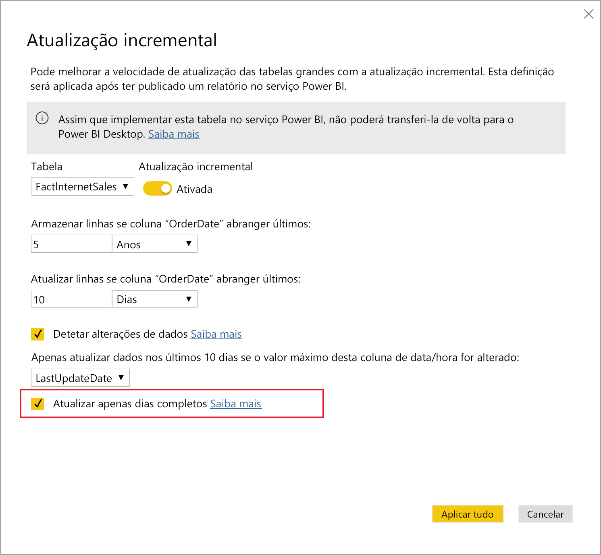

> [!NOTE]
> As operações de atualização no serviço são executadas na hora UTC. Isto pode determinar a data efetiva e afetar períodos completos. Planeamos adicionar a capacidade de substituir a data efetiva para uma operação de atualização.

## <a name="publish-to-the-service"></a>Publicar no serviço

Já pode atualizar o modelo. A primeira atualização poderá demorar mais tempo a importar os dados do histórico. As atualizações posteriores poderão ser muito mais rápidas, dado que utilizam a atualização incremental.

## <a name="query-timeouts"></a>Tempos limite de consulta

O artigo de [resolução de problemas de atualização](../connect-data/refresh-troubleshooting-refresh-scenarios.md) explica que as operações de atualização no serviço Power BI estão sujeitas a tempos limite. As consultas também podem ser limitadas pelo tempo limite predefinido da origem de dados. A maioria das origens relacionais permite a substituição de tempos limite na expressão M. Por exemplo, a expressão abaixo utiliza a [função de acesso a dados do SQL Server](https://docs.microsoft.com/powerquery-m/sql-database) para definir o tempo limite para 2 horas. Cada período definido pelos intervalos da política envia uma consulta que segue a definição de tempo limite do comando.

```powerquery-m
let
    Source = Sql.Database("myserver.database.windows.net", "AdventureWorks", [CommandTimeout=#duration(0, 2, 0, 0)]),
    dbo_Fact = Source{[Schema="dbo",Item="FactInternetSales"]}[Data],
    #"Filtered Rows" = Table.SelectRows(dbo_Fact, each [OrderDate] >= RangeStart and [OrderDate] < RangeEnd)
in
    #"Filtered Rows"
```

## <a name="xmla-endpoint-benefits-for-incremental-refresh"></a>Benefícios dos pontos finais XMLA para a atualização incremental

O [ponto final XMLA](service-premium-connect-tools.md) dos conjuntos de dados numa capacidade Premium pode ser ativado para operações de leitura/escrita, que podem proporcionar benefícios consideráveis para a atualização incremental. As operações de atualização através do ponto final XMLA não se limitam a [48 atualizações por dia](../connect-data/refresh-data.md#data-refresh) e o [horário de atualização programado](../connect-data/refresh-troubleshooting-refresh-scenarios.md#scheduled-refresh-timeout) não é imposto, o que pode ser útil em cenários de atualização incremental.

### <a name="refresh-management-with-sql-server-management-studio-ssms"></a>Gestão de atualizações com o SQL Server Management Studio (SSMS)

Com o ponto final XMLA de leitura/escrita ativado, o SSMS pode ser utilizado para visualizar e gerir partições geradas pela aplicação das políticas de atualização incremental. Esta opção permite, por exemplo, atualizar uma partição histórica específica que não está no intervalo incremental para realizar uma atualização numa data passada sem ter de atualizar todos os dados históricos. Também pode utilizar o SSMS para carregar dados históricos de conjuntos de dados muito grandes ao adicionar/atualizar as partições históricas em lotes.


#### <a name="override-incremental-refresh-behavior"></a>Substituir o comportamento de atualização incremental

Com o SSMS, também tem maior controlo sobre como invocar atualizações incrementais com a [Tabular Model Scripting Language (TMSL)](https://docs.microsoft.com/analysis-services/tmsl/tabular-model-scripting-language-tmsl-reference?view=power-bi-premium-current) (Linguagem TMSL) e de [Tabular Object Model (TOM)](https://docs.microsoft.com/analysis-services/tom/introduction-to-the-tabular-object-model-tom-in-analysis-services-amo?view=power-bi-premium-current) (Modelo TOM). Por exemplo, no Object Explorer do SSMS, clique com o botão direito do rato numa tabela e, em seguida, selecione a opção de menu **Processar Tabela**. Em seguida, clique no botão **Script** para gerar um comando de atualização TMSL.

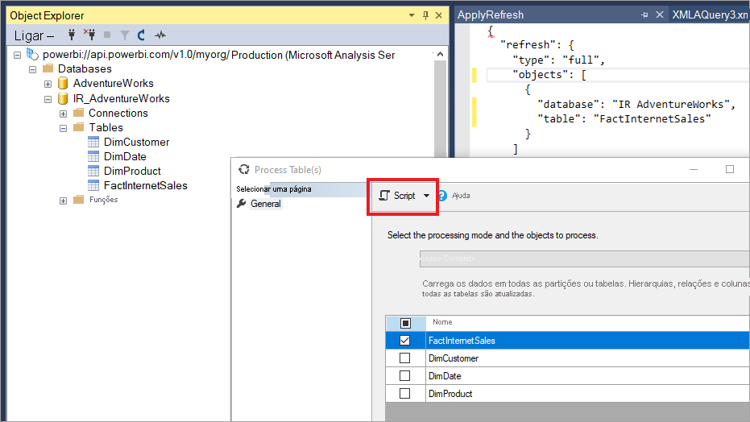

Os seguintes parâmetros podem ser inseridos no comando de atualização TMSL para substituir o comportamento de atualização incremental predefinido.

- **applyRefreshPolicy** – se uma tabela tiver uma política de atualização incremental definida, applyRefreshPolicy determinará se a política é aplicada ou não. Se a política não for aplicada, uma operação completa de processamento deixará as definições de partição inalteradas e todas as partições da tabela serão totalmente atualizadas. O valor predefinido é verdadeiro.

- **effectiveDate** – se estiver a ser aplicada uma política de atualização incremental, esta terá de saber a data atual para determinar os intervalos da janela temporal para o intervalo histórico e o intervalo incremental. O parâmetro effectiveDate permite-lhe substituir a data atual. Este parâmetro é útil para testes, demonstrações e cenários empresariais onde os dados são atualizados de forma incremental até uma data no passado ou no futuro (por exemplo, orçamentos no futuro). O valor predefinido é a [data atual](#current-date).

```json
{ 
  "refresh": {
    "type": "full",

    "applyRefreshPolicy": true,
    "effectiveDate": "12/31/2013",

    "objects": [
      {
        "database": "IR_AdventureWorks", 
        "table": "FactInternetSales" 
      }
    ]
  }
}
```

### <a name="custom-queries-for-detect-data-changes"></a>Consultas personalizadas para detetar alterações de dados

Pode utilizar a TMSL e/ou o TOM para substituir o comportamento das alterações de dados detetadas. Não só pode utilizar estas opções para evitar a persistência da coluna atualizada mais recentemente na cache em memória, como pode ativar cenários em que uma tabela de configuração/instrução é preparada pelos processos ETL para efeitos de sinalização apenas das partições que precisam de ser atualizadas. Tal pode criar um processo de atualização incremental mais eficiente, onde apenas os períodos necessários são atualizados, independentemente de há quanto tempo ocorreram as atualizações de dados.

Pretende-se que pollingExpression seja uma expressão M leve ou o nome de outra consulta M. Deve devolver um valor escalar e será executado para cada partição. Se o valor devolvido for diferente daquele que foi devolvido da última vez que ocorreu uma atualização incremental, a partição será sinalizada para um processamento completo.

O exemplo seguinte abrange a totalidade dos 120 meses no intervalo histórico para alterações em datas passadas. Especificar 120 meses em vez de 10 anos significa que a compressão de dados pode não ser tão eficiente, mas evita ter de atualizar um ano histórico completo, o que seria mais caro, enquanto um mês seria suficiente para uma alteração numa data passada.

```json
"refreshPolicy": {
    "policyType": "basic",
    "rollingWindowGranularity": "month",
    "rollingWindowPeriods": 120,
    "incrementalGranularity": "month",
    "incrementalPeriods": 120,
    "pollingExpression": "<M expression or name of custom polling query>",
    "sourceExpression": [
    "let ..."
    ]
}
```

## <a name="metadata-only-deployment"></a>Implementação apenas de metadados

Ao publicar uma nova versão de um ficheiro PBIX do Power BI Desktop numa área de trabalho no Power BI Premium, se já existir um conjunto de dados com o mesmo nome, ser-lhe-á pedido que substitua o conjunto de dados existente.

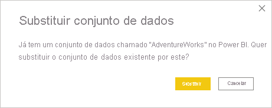

Em alguns casos, poderá não querer substituir o conjunto de dados, especialmente com a atualização incremental. O conjunto de dados no Power BI Desktop pode ser muito menor do que o do serviço. Se o conjunto de dados do serviço tiver uma política de atualização incremental aplicada, poderá ter vários anos de dados históricos que serão perdidos se o conjunto de dados for substituído. Atualizar todos os dados históricos pode levar horas e resultar em tempo de inatividade do sistema para os utilizadores.

Em vez disso, é melhor realizar uma implementação apenas de metadados. Tal permite a implementação de novos objetos sem perder os dados históricos. Por exemplo, se tiver adicionado algumas medidas, poderá implementar apenas as novas medidas sem precisar de atualizar os dados e poupará assim muito tempo.

Quando configurado para leitura/escrita, o ponto final XMLA proporciona compatibilidade com as ferramentas que fazem com que isto aconteça. Por exemplo, o ALM Toolkit é uma ferramenta de diferenciação de esquemas para conjuntos de dados do Power BI e pode ser utilizado apenas para executar a implementação de metadados.

Transfira e instale a versão mais recente do ALM Toolkit a partir do [Repositório Git do Analysis Services](https://github.com/microsoft/Analysis-Services/releases). Estão disponíveis ligações da documentação e informações sobre a capacidade de suporte através do friso Ajuda. Para realizar uma implementação apenas de metadados, execute uma comparação e selecione a instância do Power BI Desktop em execução como origem e o conjunto de dados existente no serviço como destino. Considere as diferenças apresentadas e ignore a atualização da tabela com partições de atualização incrementais ou utilize a caixa de diálogo Opções para reter partições para atualizações de tabelas. Valide a seleção para garantir a integridade do modelo de destino e, em seguida, atualize.


## <a name="see-also"></a>Veja também

[Conectividade dos conjuntos de dados com o ponto final XMLA](service-premium-connect-tools.md)   
[Resolução de problemas de cenários de atualização](../connect-data/refresh-troubleshooting-refresh-scenarios.md)   
