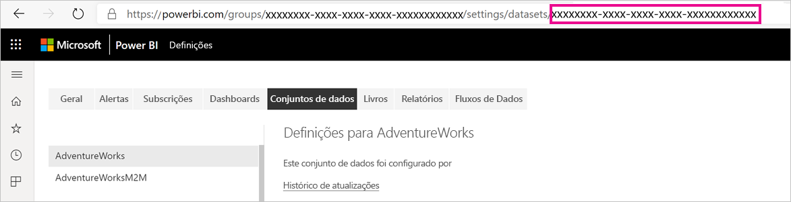
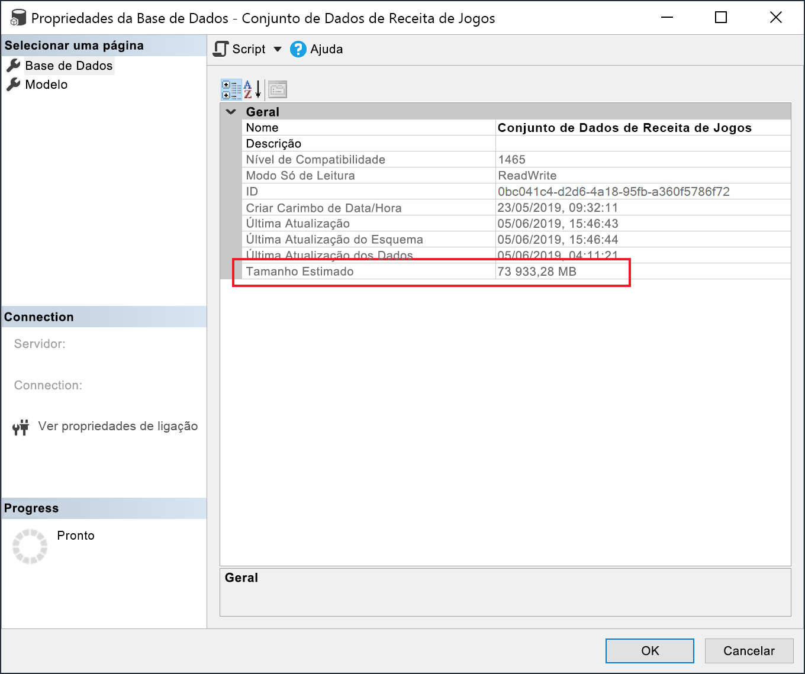

# <a name="large-datasets-in-power-bi-premium"></a>Conjuntos de dados de grandes dimensões no Power BI Premium

Os conjuntos de dados do Power BI podem armazenar dados numa cache dentro da memória altamente comprimida, para um desempenho de consultas otimizado para permitir uma rápida interatividade do utilizador. Com as capacidades Premium, os conjuntos de dados de grandes dimensões superiores ao limite predefinido de 10 GB podem ser permitidos com a definição **Formato de armazenamento de conjuntos de dados de grandes dimensões**. Quando esta definição está ativada, o tamanho dos conjuntos de dados é limitado pelo tamanho da *capacidade* Premium.

Os conjuntos de dados de grandes dimensões podem ser ativados para todos os SKUs Premium P e Embedded A. O limite de tamanho para conjuntos de dados de grandes dimensões no Premium é comparável ao Azure Analysis Services em termos das limitações de tamanho dos modelos de dados.

Embora seja necessário para permitir conjuntos de dados com mais de 10 GB, a ativação da definição "Formato de armazenamento de conjuntos de dados de grandes dimensões" tem benefícios adicionais. Se planeia utilizar ferramentas baseadas em pontos finais XMLA para operações de escrita de conjuntos de dados, certifique-se de que ativa a definição, mesmo para os conjuntos de dados que não caraterize como sendo *de grandes dimensões*. Quando esta definição está ativada, o formato de conjuntos de dados de grandes dimensões pode otimizar o desempenho das operações de escrita de XMLA.

Os conjuntos de dados de grandes dimensões no serviço não afetam o tamanho de carregamento de modelos do Power BI Desktop, que ainda tem um limite de 10 GB. Os conjuntos de dados podem expandir-se para além dos 10 GB no serviço ao atualizar.

## <a name="enable-large-datasets"></a>Permitir conjuntos de dados de grandes dimensões

Os passos aqui descritos mostram como permitir conjuntos de dados de grandes dimensões para um novo modelo publicado no serviço. Para os conjuntos de dados existentes, só é necessário seguir o passo três.

1. Criar um modelo no Power BI Desktop. Se planeia que o seu conjunto de dados se torne maior e consuma progressivamente mais memória, certifique-se de que configura a [Atualização incremental](service-premium-incremental-refresh.md).

1. Publique o modelo como um conjunto de dados no serviço.

1. No serviço > conjunto de dados > **Definições**, expanda **Formato de conjuntos de dados de grandes dimensões**, clique no controlo de deslize para que a definição fique **Ativa** e, em seguida, clique em **Aplicar**.

    :::image type="content" source="media/service-premium-large-models/enable-large-dataset.png" alt-text="Controlo de deslize Permitir conjuntos de dados de grandes dimensões":::

1. Invoque uma atualização para carregar dados históricos com base na política de atualização incremental. A primeira atualização pode demorar algum tempo para carregar o histórico. As atualizações subsequentes deverão ser mais rápidas, dependendo da sua política de atualização incremental.

## <a name="set-default-storage-format"></a>Definir formato de armazenamento predefinido

Todos os novos conjuntos de dados criados numa área de trabalho atribuída a uma capacidade Premium podem ter o formato de armazenamento de conjuntos de dados de grandes dimensões ativado por predefinição.

1. Na área de trabalho, clique em **Definições** > **Premium**.

1. Em **Formato de armazenamento predefinido**, selecione **Formato de armazenamento de conjuntos de dados de grandes dimensões** e, em seguida, clique em **Guardar**.

    :::image type="content" source="media/service-premium-large-models/default-storage-format.png" alt-text="Permitir o formato de armazenamento predefinido":::

### <a name="enable-with-powershell"></a>Permitir com o PowerShell

Também pode permitir o formato de armazenamento de conjuntos de dados de grandes dimensões através do PowerShell. Tem de ter privilégios de administrador de capacidade e administrador de áreas de trabalho para executar cmdlets do PowerShell.

1. Localize o ID de conjunto de dados (GUID). No separador **Conjuntos de dados** da área de trabalho, nas definições de conjuntos de dados, pode ver o ID no URL.

    

1. Num pedido de informação de administrador do PowerShell, instale o módulo [MicrosoftPowerBIMgmt](/powershell/module/microsoftpowerbimgmt.data/).

    ```powershell
    Install-Module -Name MicrosoftPowerBIMgmt
    ```

1. Execute os seguintes cmdlets para iniciar sessão e verificar o modo de armazenamento do conjunto de dados.

    ```powershell
    Login-PowerBIServiceAccount

    (Get-PowerBIDataset -Scope Organization -Id <Dataset ID> -Include actualStorage).ActualStorage
    ```

    A resposta deve ser a seguinte. O modo de armazenamento é ABF (ficheiro de cópia de segurança do Analysis Services), a predefinição.

    ```
    Id                   StorageMode

    --                   -----------

    <Dataset ID>         Abf
    ```

1. Execute os seguintes cmdlets para definir o modo de armazenamento. Poderão ser necessários alguns segundos para converter em Ficheiros Premium.

    ```powershell
    Set-PowerBIDataset -Id <Dataset ID> -TargetStorageMode PremiumFiles

    (Get-PowerBIDataset -Scope Organization -Id <Dataset ID> -Include actualStorage).ActualStorage
    ```

    A resposta deve ser a seguinte. O modo de armazenamento está agora definido como Ficheiros Premium.

    ```
    Id                   StorageMode
    
    --                   -----------
    
    <Dataset ID>         PremiumFiles
    ```

Pode agora verificar o estado das conversões de conjuntos de dados de e para Ficheiros Premium através do cmdlet [Get-PowerBIWorkspaceMigrationStatus](/powershell/module/microsoftpowerbimgmt.workspaces/get-powerbiworkspacemigrationstatus).

## <a name="dataset-eviction"></a>Expulsão de conjuntos de dados

O Power BI utiliza a gestão de memória dinâmica para expulsar conjuntos de dados inativos da memória. O Power BI expulsa conjuntos de dados para que possa carregar outros conjuntos de dados e dar resposta a consultas de utilizadores. A gestão de memória dinâmica permite que a soma dos tamanhos de conjuntos de dados seja significativamente superior à memória disponível na capacidade, mas é necessário que um conjunto de dados individual caiba na memória. Para mais informações sobre gestão de memória dinâmica, consulte [Como funcionam as capacidades](service-premium-what-is.md#how-capacities-function).

Deve ter em consideração o impacto da expulsão em modelos grandes. Apesar dos tempos de carregamento de conjuntos de dados relativamente rápidos, ainda pode haver um atraso percetível para os utilizadores, se tiverem de aguardar que conjuntos de dados expulsos grandes sejam atualizados. Por este motivo, na forma atual, a funcionalidade de modelos grandes é recomendada sobretudo para capacidades dedicadas a requisitos BI empresariais, e não para as capacidades misturadas com requisitos de BI de gestão personalizada. As capacidades dedicadas aos requisitos de BI empresariais têm menores probabilidades de acionar expulsões frequentemente e precisar de atualizar conjuntos de dados. As capacidades de BI de gestão personalizada, por outro lado, podem ter muitos conjuntos de dados pequenos, que são carregados mais frequentemente dentro e fora da memória.

## <a name="checking-dataset-size"></a>Verificar o tamanho de conjuntos de dados

Após carregar dados históricos, pode utilizar [SSMS](/sql/ssms/download-sql-server-management-studio-ssms) através do [ponto final XMLA](service-premium-connect-tools.md) para verificar o tamanho estimado do conjunto de dados na janela das propriedades de modelo.



Pode também verificar o tamanho do conjunto de dados ao executar as seguintes consultas DMV a partir do SSMS. Some as colunas DICTIONARY\_SIZE e USED\_SIZE do resultado para ver o tamanho do conjunto de dados em bytes.

```sql
SELECT * FROM SYSTEMRESTRICTSCHEMA
($System.DISCOVER_STORAGE_TABLE_COLUMNS,
 [DATABASE_NAME] = '<Dataset Name>') //Sum DICTIONARY_SIZE (bytes)

SELECT * FROM SYSTEMRESTRICTSCHEMA
($System.DISCOVER_STORAGE_TABLE_COLUMN_SEGMENTS,
 [DATABASE_NAME] = '<Dataset Name>') //Sum USED_SIZE (bytes)
```

## <a name="limitations-and-considerations"></a>Limitações e considerações

Tenha em conta as seguintes restrições ao utilizar conjuntos de dados de grandes dimensões:

- **São necessárias áreas de trabalho novas:** os conjuntos de dados de grandes dimensões só funcionam com [Áreas de trabalho novas](../collaborate-share/service-create-the-new-workspaces.md).

- **Transferir o Power BI Desktop**: se um conjunto de dados for armazenado em Ficheiros Premium, a [transferência como um ficheiro .pbix](../create-reports/service-export-to-pbix.md) irá falhar.
- **Regiões suportadas**: os conjuntos de dados de grandes dimensões são suportados em todas as regiões do Azure que suportam armazenamento de Ficheiros Premium. Para saber mais, veja [Produtos disponíveis por região](https://azure.microsoft.com/global-infrastructure/services/?products=storage) e consulte a tabela na secção seguinte.

## <a name="region-availability"></a>Disponibilidade de região

Os conjuntos de dados de grandes dimensões do Power BI só estão disponíveis em determinadas regiões do Azure que suportam o [Armazenamento de Ficheiros Premium do Azure](/azure/storage/files/storage-files-planning#storage-tiers).

A seguinte lista indica as regiões onde os conjuntos de dados de grandes dimensões do Power BI estão disponíveis. As regiões que não constam da seguinte lista não são suportadas para modelos grandes:

|Região do Azure  |Abreviatura da região do Azure  |
|---------|---------|
|Leste da Austrália     | australiaeast        |
|Sudeste da Austrália     | australiasoutheast        |
|E.U.A. Central     | centralus        |
|Ásia Leste     | eastasia        |
|E.U.A. Leste     | eastus        |
|E.U.A. Leste 2     | eastus2        |
|Leste do Japão     | japaneast        |
|Oeste do Japão     | japanwest        |
|Coreia do Sul Central     | koreacentral        |
|Sul da Coreia do Sul     | koreasouth        |
|E.U.A. Centro-Norte     | northcentralus        |
|Europa do Norte     | northeurope        |
|E.U.A. Centro-Sul     | southcentralus        |
|Sudeste Asiático     | southeastasia        |
|Sul do Reino Unido     | uksouth        |
|Oeste do Reino Unido     | ukwest        |
|Europa Ocidental     | westeurope        |
|E.U.A. Oeste     | westus        |
|E.U.A. Oeste 2     | westus2        |

## <a name="next-steps"></a>Passos seguintes

As seguintes ligações disponibilizam informações que podem ser úteis para trabalhar com modelos grandes:

* [Armazenamento de Ficheiros Premium do Azure](/azure/storage/files/storage-files-planning#storage-tiers)
* [Configurar o suporte da Multi-Geo para o Power BI Premium](service-admin-premium-multi-geo.md)
* [Chaves de encriptação por BYOK (Bring Your Own Key) para o Power BI](service-encryption-byok.md)
* [Como funcionam as capacidades](service-premium-what-is.md#how-capacities-function)
* [Atualização incremental](service-premium-incremental-refresh.md).

O Power BI introduziu o Power BI Premium Gen2 como uma oferta de pré-visualização, que melhora a experiência do Power BI Premium nos seguintes aspetos:
* Desempenho
* Licenciamento por utilizador
* Maior dimensionamento
* Métricas melhoradas
* Dimensionamento automático
* Sobrecarga de gestão reduzida

Para obter mais informações sobre o Power BI Premium Gen2, veja [Power BI Premium Generation 2 (pré-visualização)](service-premium-what-is.md#power-bi-premium-generation-2-preview).
