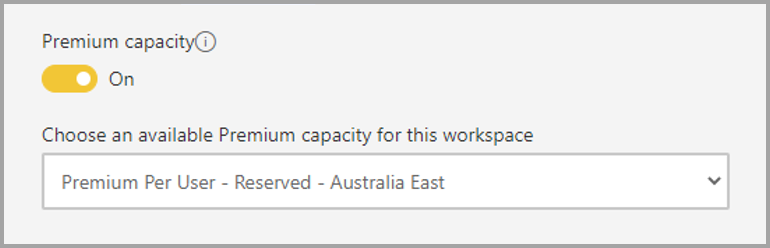
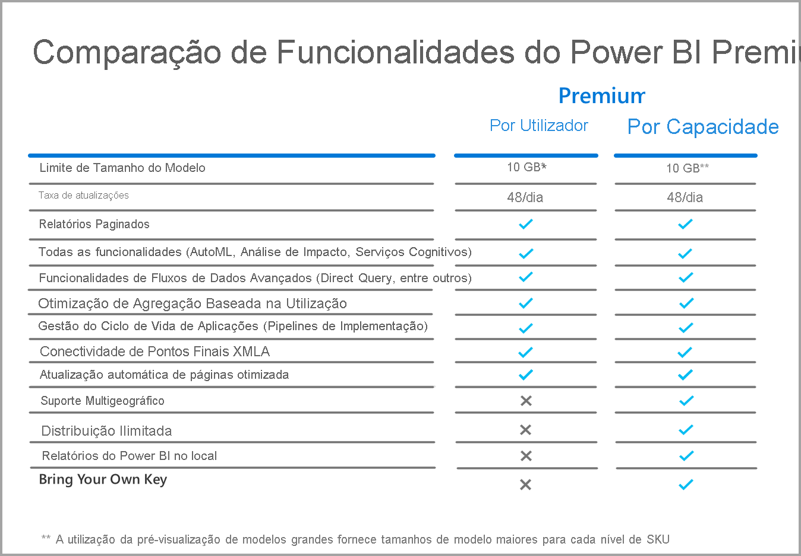

# FAQ do Power BI Premium Por Utilizador (pré-visualização)

O Power BI **Premium Por Utilizador** permite que as organizações licenciem funcionalidades Premium por utilizador. O Premium Por Utilizador (PPU) inclui todas as capacidades de licença do Power BI Pro e também adiciona funcionalidades como relatórios paginados, IA e outras capacidades que estão disponíveis apenas para subscritores Premium. 

Este artigo fornece respostas a perguntas comuns sobre o licenciamento Premium Por Utilizador. Todas as informações neste artigo estão sujeitas a alterações e melhorias, à medida que o Premium Por Utilizador percorre o respetivo período de pré-visualização e é lançado para disponibilidade geral. 

Este artigo agrupa perguntas e respostas nas seguintes categorias:
* Perguntas gerais 
* Perguntas de administração 
* Perguntas sobre a experiência do utilizador final 

## Perguntas gerais

1.  **O que é o Premium Por Utilizador (PPU)?** 

    O Premium Por Utilizador (PPU) é uma nova forma de licenciar funcionalidades premium por utilizador. Inclui todas as capacidades de licença do Power BI Pro, juntamente com funcionalidades como relatórios paginados, IA e outras capacidades disponíveis apenas no Premium.

2.  **Quando estará disponível para compra?**

    O desenvolvimento está em curso e não antecipamos o lançamento do PPU para disponibilidade geral até 2021. Até chegar à fase de disponibilidade geral, está disponível uma pré-visualização pública gratuita para todas as organizações.

3.  **Preciso de uma licença do Power BI Pro E do Premium Por Utilizador?**

    Não, obtém todas as funcionalidades do Power BI Pro com a licença Premium Por Utilizador.

4.  **Como posso obter uma versão de avaliação?**

    Existe uma experiência de avaliação no produto e uma experiência de avaliação disponível através do Microsoft 365. Qualquer utilizador, assumindo que a respetiva organização não restringiu o PPU, pode aceder à experiência de avaliação no produto ao ativar o Premium Por Utilizador para uma área de trabalho. As experiências de avaliação gratuita através do Microsoft 365 podem ser ativadas através do portal tal como as avaliações do Power BI Pro são atualmente iniciadas.  

5.  **Que funcionalidades estão disponíveis no Premium Por Utilizador?**

    A grelha de comparação de funcionalidades é a seguinte:    

    

6.  **A minha organização já tem o Power BI Premium. Preciso de uma licença do Premium Por Utilizador para publicar conteúdos na minha capacidade?**
    
    A sua organização pode optar por complementar a capacidade Premium com licenças do Premium Por Utilizador, mas não é necessário o Premium Por Utilizador para publicar conteúdos nas capacidades existentes.  

## Perguntas administrativas

1.  **Como posso ativar o Premium Por Utilizador (PPU) para o meu inquilino?**
    
    Quando for aprovisionada uma licença do PPU para o inquilino, as funcionalidades do PPU ficam disponíveis em qualquer área de trabalho para a qual as ative. Para a pré-visualização, basta ativar as funcionalidades Premium Por Utilizador na lista pendente da capacidade ao selecionar o item Premium por utilizador, conforme mostrado na imagem seguinte.

    

2.  **Isto funciona como uma capacidade Premium? Posso ativar/desativar funcionalidades?**

    Não, não existe gestão de memória ou CPU no PPU. Funciona como o Power BI Pro nesse sentido. O seu administrador de inquilinos pode gerir as definições de funcionalidades selecionadas, mas não pode desativar cargas de trabalho como relatórios paginados, assim como atualmente não pode desativar dashboards. 

3.  **Onde posso gerir as definições do Premium Por Utilizador que são expostas?**

    Uma nova opção de menu nas definições de inquilinos para o Premium Por Utilizador permitem que os administradores façam a gestão destas definições.

4.  **Posso limitar que utilizadores podem criar áreas de trabalho do PPU?**

    Sim, da mesma forma que pode atualmente limitar que utilizadores podem criar áreas de trabalho.

5.  **Os administradores de inquilinos podem ver que áreas de trabalho estão marcadas como Premium Por Utilizador?**

    Sim, estas são destacadas no item do menu das áreas de trabalho no ecrã do administrador de inquilinos, onde é apresentado que áreas de trabalho estão marcadas como Premium.

6.  **Posso mover áreas de trabalho entre capacidades Premium Por Utilizador e Premium?**

    Sim. Para a Disponibilidade Geral, terá de executar uma atualização completa de todos os conjuntos de dados ou fluxos de dados que residem na área de trabalho após movê-los novamente para a capacidade Premium. Este requisito impede o abuso por parte de empresas que pretendam contornar o mecanismo de carga da CPU do Premium Gen2.

7.  **As APIs de capacidade estão disponíveis para o Premium Por Utilizador?**

    Está disponível um conjunto limitado de APIs para permitir a movimentação de áreas de trabalho, mas não pode efetuar ações como desativar cargas de trabalho e outras atividades.  

## Perguntas sobre a experiência do utilizador final

1.  **Se tiver marcado uma área de trabalho como Premium Por Utilizador, como irão os restantes utilizadores saber disso?**
    
    Foi introduzido um novo ícone para mostrar que áreas de trabalho são Premium Por Utilizador, conforme mostrado na imagem seguinte:

        

2.  **Quem pode aceder aos conteúdos numa área de trabalho/aplicação Premium Por Utilizador?**

    Todos os utilizadores têm de ter uma licença Premium Por Utilizador para ver os conteúdos numa área de trabalho Premium Por Utilizador. Isso inclui cenários nos quais os utilizadores acedem aos conteúdos através do ponto final XMLA, da funcionalidade Analisar no Excel, de Modelos Compostos, entre outros. Pode conceder acesso à área de trabalho aos utilizadores que ainda não têm uma licença PPU, mas estes receberão uma mensagem a informar que não podem aceder aos conteúdos. Ser-lhes-á pedido que iniciem uma licença de avaliação se forem elegíveis. Se não forem elegíveis, o respetivo administrador de inquilinos tem de lhes atribuir uma licença.

3.  **Que conteúdos podem as pessoas ver com um determinado tipo de licença quando estes são partilhado com elas?**

    O gráfico seguinte descreve quem pode ver determinados tipos de conteúdos com o PPU:

       

4.  **Posso utilizar o Premium Por Utilizador para casos de utilização incorporados?**

    O Premium Por Utilizador irá funcionar da mesma forma que os casos de utilização incorporados quando utiliza uma licença Pro. Pode incorporar os conteúdos e cada utilizador precisará de uma licença PPU para vê-lo.

5.  **O que acontece à minha área de trabalho do PPU se minha avaliação expirar?**

    Os utilizadores continuarão a ter acesso à área de trabalho, mas os conteúdos que precisam desse tipo de licença ficarão indisponíveis. Tem de mover a área de trabalho para uma capacidade Premium ou simplesmente desativar o requisito. 
6.  **Quanto armazenamento total obtenho com o Premium Por Utilizador?**

    No que diz respeito ao armazenamento, todo o inquilino terá o mesmo limite de 100 TB que uma capacidade Premium tem.

7.  **A API de exportação estará disponível para o Premium Por Utilizador?**

    Atualmente, a API está disponível para relatórios paginados e está restrita a uma única chamada a cada 5 minutos.  De momento, os relatórios do Power BI não são suportados.  

8.  **Como irão funcionar as subscrições de e-mail no PPU?**

    Qualquer pessoa com uma licença PPU ou uma licença Pro pode receber a subscrição e qualquer anexo que esta inclua, desde que o anexo seja o mesmo para todos os utilizadores. Os utilizadores do Pro não poderão ver os conteúdos no portal do produto. Se forem introduzidas capacidades de subscrição adicionais que permitam vistas de dados diferentes para destinatários diferentes, será necessária uma licença PPU (ou capacidade Premium) para utilizar estas capacidades.

9.  **Posso exceder as 48 atualizações através do portal através da API de atualização?**

    Neste momento, as atualizações não são restritas.  

10. **Posso utilizar a aplicação de métricas de Capacidade do Power BI Premium para monitorizar a utilização do Premium Por Utilizador?**

    A Aplicação Power BI Premium Capacity Metrics não funciona com o Premium Gen2, pelo que não permitiria que visse nenhum item do PPU.  

11. **Posso alojar um conjunto de dados do Power BI numa área de trabalho do PPU, criar um relatório na mesma, publicar numa área de trabalho externa ao PPU e permitir que os utilizadores acedam a este relatório sem precisar de uma licença do PPU?**

    Não. Como o conjunto de dados reside numa área de trabalho Premium por utilizador, não será visível para os utilizadores sem uma licença, mesmo que eles possam aceder ao relatório na área de trabalho externa ao PPU.

12. **Posso atualizar múltiplos modelos de dados de 10 GB ao mesmo tempo?**

    Está sujeito às mesmas limitações que são impostas para atualizações paralelas no Premium Gen2.

13. **Posso partilhar conteúdos alojados no Premium Por Utilizador através da opção Publicar na Web?**

    A opção Publicar na Web comporta-se da mesma forma que se comporta atualmente com conteúdos alojados na capacidade Premium.

14. **Posso fazer com que um fluxo de dados executado numa área de trabalho Premium Por Utilizador seja importado para um conjunto de dados do Power BI noutra área de trabalho sem que os utilizadores que consomem esse conteúdo precisem de uma licença Premium Por Utilizador?**

    Desde que o autor do relatório do Power BI tenha uma licença Premium Por Utilizador, tal é possível durante o período de pré-visualização do PPU.

15. **Posso utilizar as aplicações móveis do Power BI com o Premium por utilizador?**

    Sim, as aplicações móveis do Power BI foram atualizadas para funcionarem com qualquer conteúdo publicado numa aplicação ou área de trabalho Premium por utilizador.

**Próximos passos**

* [O que é o Power BI Premium?](service-premium-what-is.md)
* [Documento técnico do Microsoft Power BI Premium](https://aka.ms/pbipremiumwhitepaper)
* [Documento técnico sobre Planear uma Implementação Empresarial do Power BI](https://aka.ms/pbienterprisedeploy)
* [Ativação da Versão de Avaliação Pro alargada](../fundamentals/service-self-service-signup-for-power-bi.md)
* [FAQ do Power BI Embedded](../developer/embedded/embedded-faq.md)

Mais perguntas? [Experimente perguntar à Comunidade do Power BI](https://community.powerbi.com/)
