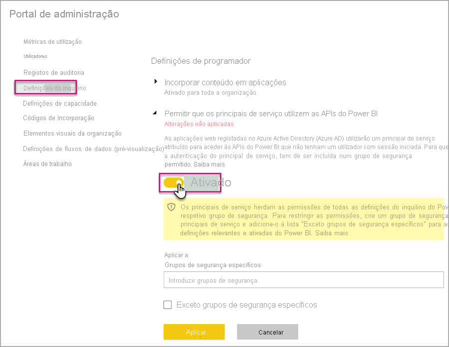
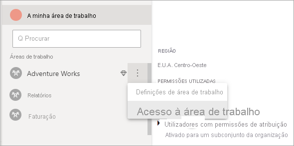

# <a name="automate-premium-workspace-and-dataset-tasks-with-service-principals"></a>Automatizar as tarefas de conjuntos de dados e áreas de trabalho Premium com principais de serviço

Os principais de serviço são *registos de aplicações* do Azure Active Directory que pode criar no seu inquilino para efetuar operações automáticas de recursos e níveis de serviço. Trata-se de um tipo exclusivo de identidade de utilizador com um nome de aplicação, ID de aplicação, ID de inquilino e *segredo de cliente* ou certificado de palavra-passe.

O Power BI Premium utiliza a mesma funcionalidade de principal de serviço que o Power BI Embedded. Para saber mais, veja [Incorporar conteúdos do Power BI com principais de serviço](../developer/embedded/embed-service-principal.md).

No **Power BI Premium**, os principais de serviço também podem ser utilizados com o [ponto final XMLA](service-premium-connect-tools.md) para automatizar tarefas de gestão de conjuntos de dados, tal como aprovisionar áreas de trabalho, implementar modelos e atualizar conjuntos de dados com:

- PowerShell
- Automatização do Azure
- Azure Logic Apps
- Aplicações cliente personalizadas

Os principais de serviço só podem ser utilizados com o ponto final XMLA em [Áreas de trabalho novas](../collaborate-share/service-new-workspaces.md). Não são suportadas áreas de trabalho clássicas. Um principal de serviço só tem as permissões necessárias para realizar tarefas nas áreas de trabalho atribuídas. As permissões são atribuídas através do acesso à área de trabalho, de modo semelhante às contas UPN.

Para executar operações de escrita, a **Carga de trabalho dos conjuntos de dados** tem de ter o [ponto final XMLA ativado para leitura/escrita](service-premium-connect-tools.md#enable-xmla-read-write). Os conjuntos de dados publicados a partir do Power BI Desktop devem ter a funcionalidade [Formato de metadados melhorado](../connect-data/desktop-enhanced-dataset-metadata.md) ativada.

> [!NOTE]
> A funcionalidade de ponto final XMLA no Power BI Premium está em **Pré-visualização**. As funcionalidades em pré-visualização não devem ser utilizadas num ambiente de produção. Algumas funcionalidades, o suporte e a documentação são limitados.  Veja os [Termos do Microsoft Online Services (OST)](https://www.microsoft.com/licensing/product-licensing/products?rtc=1) para obter mais detalhes.

## <a name="create-a-service-principal"></a>Criar um principal de serviço

Os principais de serviço são criados como um registo de aplicações no portal do Azure ou através do PowerShell. Ao criar o seu principal de serviço, certifique-se de que copia e guarda separadamente o nome da aplicação, o ID da Aplicação (cliente), o ID do Diretório (inquilino) e o segredo do cliente. Para obter instruções sobre como criar um principal de serviço, veja:

[Criar um principal de serviço – portal do Azure](https://docs.microsoft.com/azure/active-directory/develop/howto-create-service-principal-portal)   
[Criar principal de serviço - PowerShell](https://docs.microsoft.com/azure/active-directory/develop/howto-authenticate-service-principal-powershell)

## <a name="create-an-azure-ad-security-group"></a>Criar um grupo de segurança do Azure AD

Por predefinição, os principais de serviço têm acesso a todas as configurações de inquilino para os quais são ativados. Dependendo das suas definições de administração, o acesso pode incluir grupos de segurança específicos ou toda a organização.

Para restringir o acesso do principal de serviço a configurações específicas de inquilino, pode permitir o acesso apenas a grupos de segurança específicos. Em alternativa, pode criar um grupo de segurança dedicado para os principais de serviço e excluí-lo das configurações de inquilino pretendidas. Para obter instruções sobre como criar um grupo de segurança e adicionar um principal de serviço, veja [Criar um grupo básico e adicionar membros com o Azure Active Directory](https://docs.microsoft.com/azure/active-directory/fundamentals/active-directory-groups-create-azure-portal).

## <a name="enable-service-principals"></a>Ativar os principais de serviço

Antes de utilizar principais de serviço no Power BI, um administrador terá de ativar o acesso do principal de serviço no portal de administração do Power BI.

No Power BI, em **Portal de administração** > **Definições de inquilino**, expanda **Permitir que os principais de serviço utilizem as APIs do Power BI** e, em seguida, clique em **Ativado**. Para aplicar permissões a um grupo de segurança, adicione o nome do grupo a **Grupos de segurança específicos**.



## <a name="workspace-access"></a>Acesso de áreas de trabalho

Para que o seu principal de serviço tenha as permissões necessárias para executar operações em conjuntos de dados e áreas de trabalho Premium, tem de adicionar o principal de serviço como Membro ou Administrador da área de trabalho. Neste artigo, descrevemos como utilizar o acesso à área de trabalho no serviço Power BI, mas também pode utilizar uma API REST. Para tal, veja [Add Group User REST API](https://docs.microsoft.com/rest/api/power-bi/groups/addgroupuser) (Adicionar API REST Utilizador de Grupo).

1. No serviço Power BI, para uma área de trabalho, selecione **Mais** > **Acesso de áreas de trabalho**.

    

2. Procure pelo nome da aplicação e adicione o principal de serviço à área de trabalho como **Administrador** ou **Membro**.

    

## <a name="connection-strings-for-the-xmla-endpoint"></a>Cadeias de ligação para o ponto final XMLA

Depois de criar um principal de serviço, ativar os principais de serviço para o seu inquilino e adicionar o principal de serviço ao Acesso de áreas de trabalho, pode utilizá-lo como uma identidade de utilizador em cadeias de ligação com o ponto final XMLA. A diferença é que tem de especificar o ID da aplicação, o ID de inquilino e o segredo da aplicação para os parâmetros ID de Utilizador e Palavra-passe.

`Data Source=powerbi://api.powerbi.com/v1.0/myorg/<workspace name>; Initial Catalog=<dataset name>;User ID=app:<appId>@<tenantId>;Password=<app_secret>;`

### <a name="powershell"></a>PowerShell

#### <a name="using-sqlserver-module"></a>Utilizar o módulo SQLServer

No exemplo seguinte, os parâmetros AppId, TenantId e AppSecret são utilizados para autenticar uma operação de atualização de conjunto de dados:

```powershell
Param (
        [Parameter(Mandatory=$true)] [String] $AppId,
        [Parameter(Mandatory=$true)] [String] $TenantId,
        [Parameter(Mandatory=$true)] [String] $AppSecret
       )
$PWord = ConvertTo-SecureString -String $AppSecret -AsPlainText -Force

$Credential = New-Object -TypeName "System.Management.Automation.PSCredential" -ArgumentList $AppId, $PWord

Invoke-ProcessTable -Server "powerbi://api.powerbi.com/v1.0/myorg/myworkspace" -TableName "mytable" -Database "mydataset" -RefreshType "Full" -ServicePrincipal -ApplicationId $AppId -TenantId $TenantId -Credential $Credential
```

### <a name="amo-and-adomd"></a>AMO e ADOMD

Ao ligar-se a aplicações Web e aplicações cliente, os pacotes instaláveis das [bibliotecas cliente AMO e ADOMD](https://docs.microsoft.com/azure/analysis-services/analysis-services-data-providers) (versão 15.0.2 e superior) do NuGet suportam principais de serviço em cadeias de ligação através da seguinte sintaxe: `app:AppID` e palavra-passe ou `cert:thumbprint`.

No seguinte exemplo, `appID` e `password` são utilizados para executar uma operação de atualização da base de dados modelo:

```csharp
string appId = "xxx";
string authKey = "yyy";
string connString = $"Provider=MSOLAP;Data source=powerbi://api.powerbi.com/v1.0/<tenant>/<workspacename>;Initial catalog=<datasetname>;User ID=app:{appId};Password={authKey};";
Server server = new Server();
server.Connect(connString);
Database db = server.Databases.FindByName("adventureworks");
Table tbl = db.Model.Tables.Find("DimDate");
tbl.RequestRefresh(RefreshType.Full);
db.Model.SaveChanges();
```

## <a name="next-steps"></a>Próximos passos

[Conectividade dos conjuntos de dados com o ponto final XMLA](service-premium-connect-tools.md)  
[Automatização do Azure](https://docs.microsoft.com/azure/automation)  
[Azure Logic Apps](https://docs.microsoft.com/azure/logic-apps/)  
[APIs REST do Power BI](https://docs.microsoft.com/rest/api/power-bi/)
