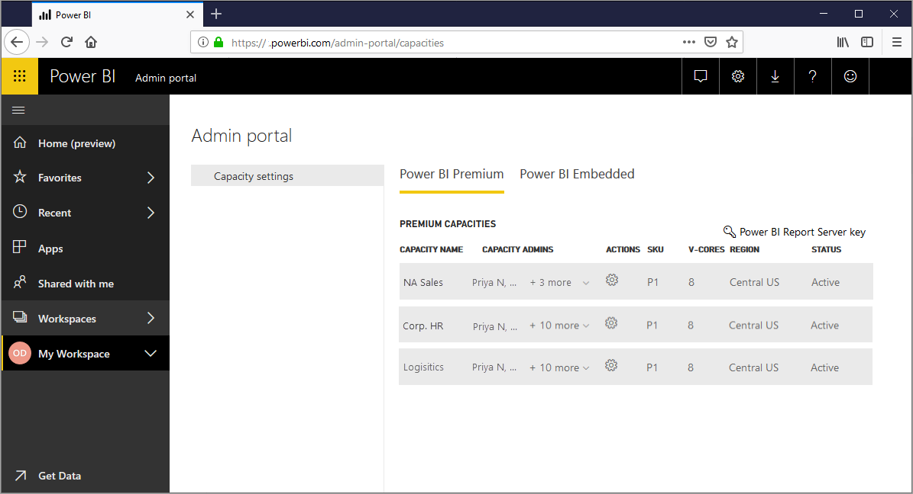
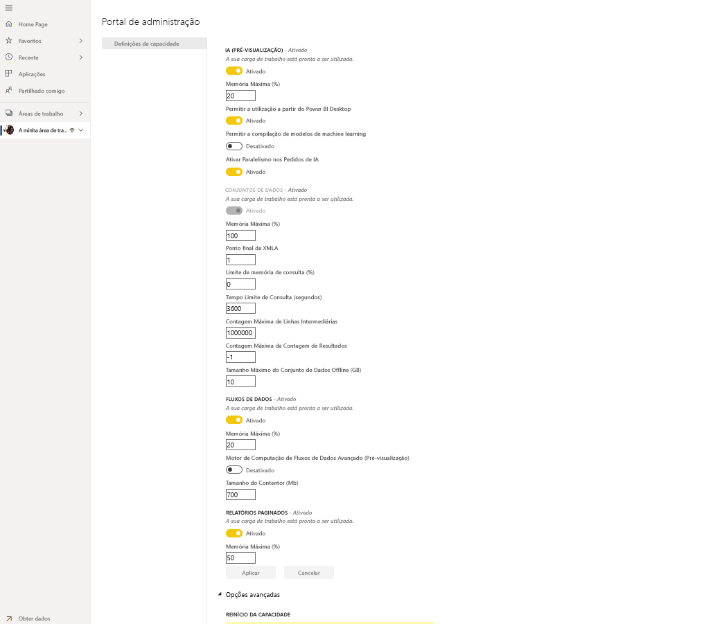
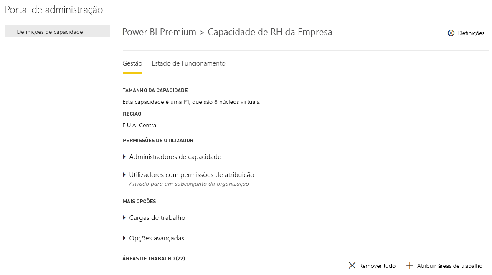
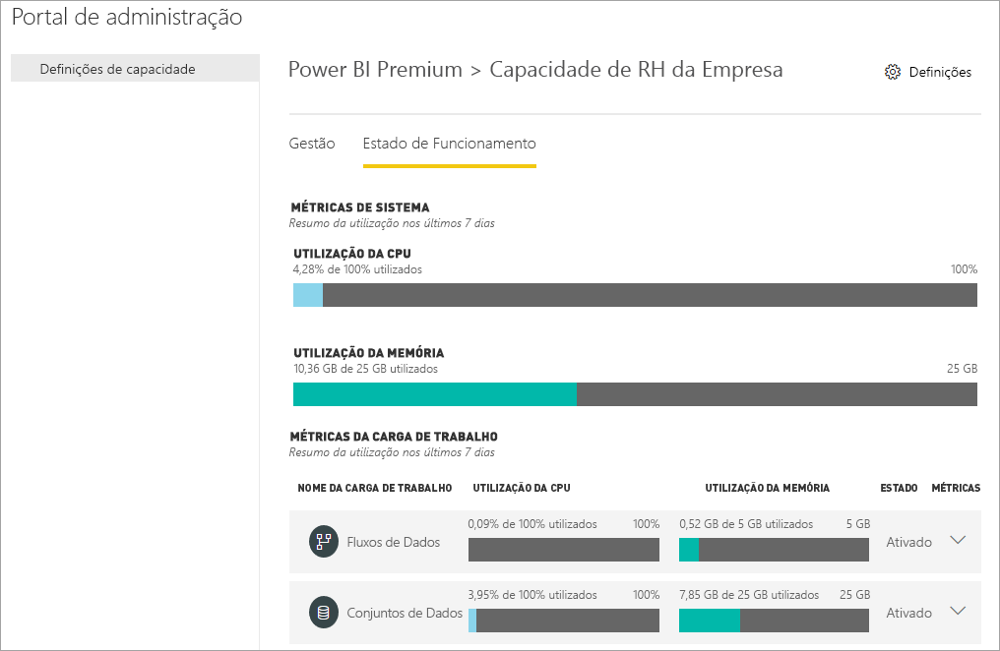
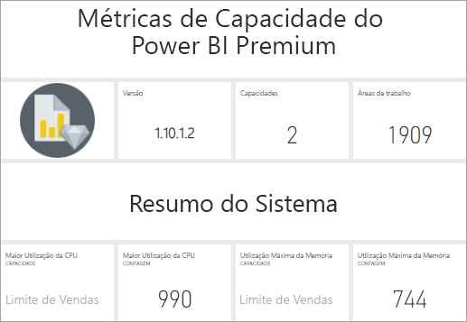
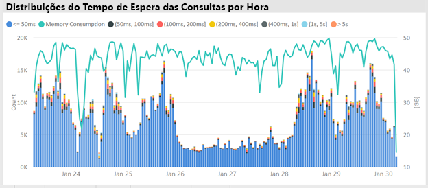
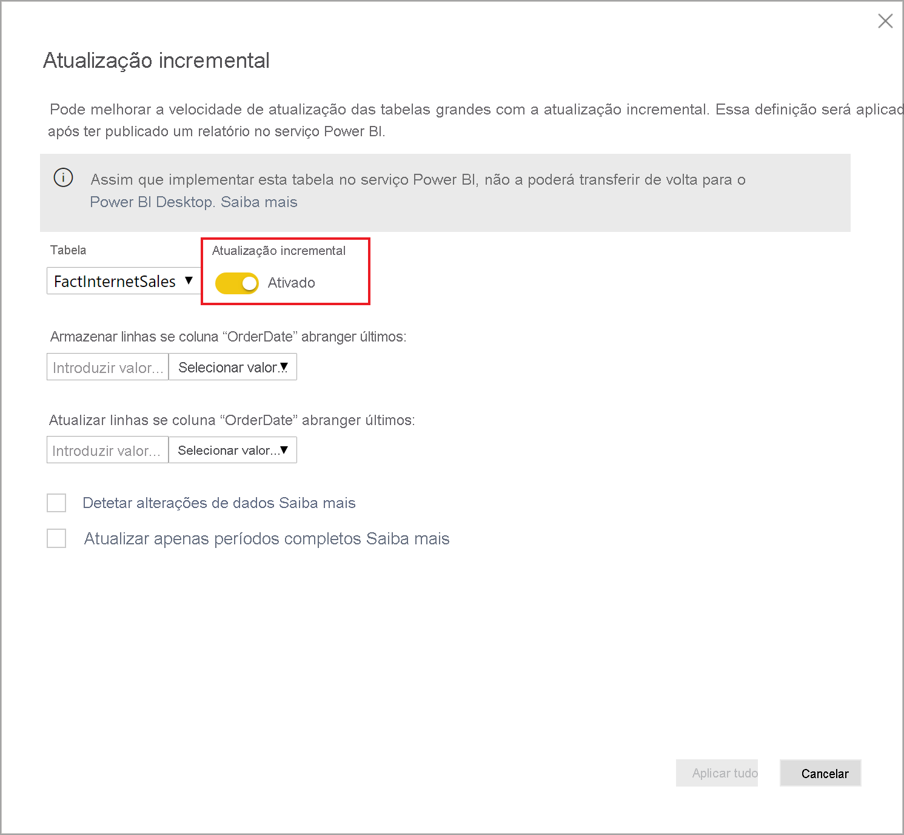
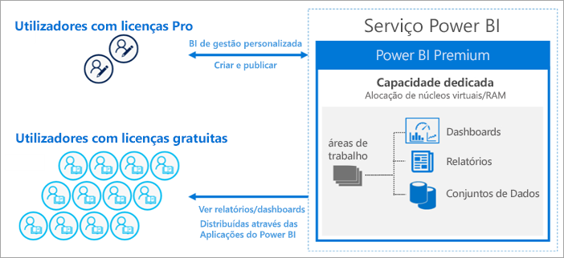
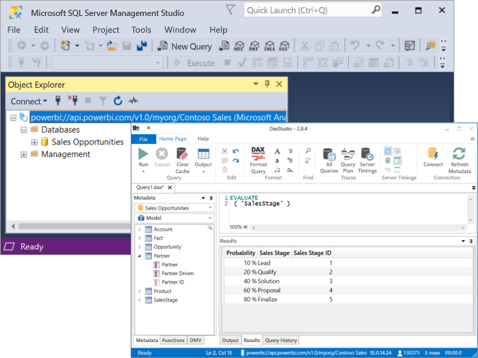

# O que é o Power BI Premium?

Pode utilizar o Power BI Premium para aceder a funcionalidades e capacidades que apenas estão disponíveis no Premium e oferecer um maior dimensionamento e desempenho para os conteúdos do Power BI na sua organização. O Power BI Premium permite que mais utilizadores na sua organização tirem o maior partido do Power BI, com melhor desempenho e capacidade de resposta. Por exemplo, com o Power BI Premium, além de si, os utilizadores da sua organização também obterão as seguintes capacidades:

> [!div class="checklist"]
> * Maior dimensionamento e desempenho para os seus relatórios do Power BI
> * Flexibilidade de licenciar por capacidade
> * As melhores funcionalidades para a visualização de dados e extração de informações, como análise orientada por IA, fluxos de dados agregáveis e reutilizáveis e relatórios paginados
> * BI empresarial e self-service unificado com uma variedade de capacidades exclusivas do Premium que suportam cargas de trabalho mais pesadas e requerem dimensionamento empresarial
> * Licença incorporada para expandir o BI no local com o Power BI Report Server
> * Suporte para residência de dados por região (Multi-Geo) e chaves de encriptação geridas pelo cliente para dados inativos (BYOK)
> * Capacidade de partilhar conteúdos do Power BI com qualquer pessoa (mesmo fora da sua organização) sem comprar uma licença por utilizador

 

Este artigo apresenta as principais funcionalidades do Power BI Premium. Sempre que necessário, são fornecidas ligações para artigos adicionais com mais informações detalhadas. Para obter mais informações acerca do Power BI Pro e do Power BI Premium, veja a secção _Comparação das funcionalidades do Power BI_ na página [Preços do Power BI](https://powerbi.microsoft.com/pricing/).

## Power BI Premium Generation 2 (pré-visualização)

O Power BI Premium lançou recentemente uma nova versão do Power BI Premium, o **Power BI Premium Generation 2**, conhecida como **Premium Gen2**. O Premium Gen2 está atualmente em pré-visualização e está disponível para os subscritores Premium utilizarem durante esta fase. Pode optar por utilizar a versão original do Premium ou mudar para o Premium Gen2. Só pode utilizar um ou o outro para a sua capacidade Premium. 

O Premium Gen2 fornece as seguintes atualizações ou experiências melhoradas:

* Capacidade de licenciar o **Premium por Utilizador** além de por capacidade.

* **Desempenho** melhorado em qualquer tamanho de capacidade, a qualquer momento: as operações de análise são executadas até 16X mais rapidamente no Premium Gen2. As operações serão sempre executadas na velocidade máxima e não irão abrandar quando a carga na capacidade se aproximar dos limites.

* **Maior dimensionamento**:
    * *Não existem limites* na simultaneidade de atualização, o que significa que deixa de ser necessário monitorizar horários para os conjuntos de dados serem atualizados na sua capacidade
    * Menos restrições de memória
    * Separação total entre a interação do relatório e as atualizações agendadas

* **Métricas melhoradas** com dados de utilização de capacidade claros e normalizados, dependentes apenas da complexidade das operações de análise que a capacidade executa e não do tamanho ou nível de carga no sistema durante a execução de análises ou outros fatores. Com as métricas melhoradas, a análise de utilização, o planeamento de orçamentos, os estornos e a necessidade de atualização são claramente visíveis com os relatórios incorporados. As métricas melhoradas serão disponibilizadas mais à frente no período de pré-visualização. Os clientes que procuram acesso às métricas de utilização dos últimos 7 dias podem fazê-lo ao entrarem em contacto com o suporte ao cliente. 

* O **Dimensionamento automático** permite *adicionar automaticamente* um núcleo virtual de cada vez em períodos de 24 horas quando a carga na capacidade exceder os limites, ao impedir os abrandamentos causados pela sobrecarga. Os núcleos virtuais são removidos automaticamente quando é detetado tempo inativo. Os núcleos virtuais adicionais são cobrados na sua subscrição do Azure, numa base de pay as you go. O dimensionamento automático será disponibilizado durante o período de pré-visualização. 

* **Sobrecarga de gestão reduzida**, com notificações de administração proativas e configuráveis sobre o nível de utilização da capacidade e o aumento de carga.

### Utilizar o Premium Gen2

Ative o Premium Gen2 para tirar partido das atualizações. Para ativar o Premium Gen2, siga os seguintes passos:

1. No portal de administração, navegue até **Definições de capacidade**.
2. Selecione **Power BI Premium**.
3. É apresentada uma secção intitulada **Geração Premium 2 (pré-visualização)** e, nessa secção, existe um controlo de deslize para ativar a Geração Premium 2 (pré-visualização). 
4. Mova o controlo de deslize para **Ativado**.

A imagem seguinte mostra como ativar o Premium Gen2. 

 

### Limitações conhecidas no Premium Gen2

As seguintes limitações conhecidas aplicam-se atualmente ao Premium Gen2:

1.    A utilização da capacidade Premium Gen2 não pode ser monitorizada na aplicação de métricas.

2.    As definições da capacidade Premium Gen2 para cargas de trabalho específicas não estão ainda visíveis na página de definições do Premium Gen2 no portal de administração. Para alterar as definições, faça a transição da capacidade para a versão original do Premium, altere as definições e configure a capacidade para utilizar novamente o Premium Gen2. As definições de alocação de memória não se aplicam às capacidades do Premium Gen2.

3.  Se estiver a utilizar XMLA no Premium Gen2, certifique-se de que está a utilizar as versões mais recentes das [ferramentas de modelação de dados e de gestão](service-premium-connect-tools.md#data-modeling-and-management-tools). 

4.  As funcionalidades do Analysis Services no Premium Gen2 só são suportadas nas bibliotecas de cliente mais recentes. Datas de lançamento estimadas das ferramentas dependentes para suportar este requisito:

    |Ferramenta|Versão mínima necessária|Data de lançamento estimada|
    |---|---|---|
    |SQL Server Management Studio (SSMS)|18.8|8 de dezembro de 2020|
    |SQL Server Data Tools (SSDT)|2.9.15|Disponibilidade geral a 30 de novembro de 2020|
    | AS PowerShell| Superior a 21.1.18229|26 de novembro de 2020|

## Subscrições e licenciamento

O Power BI Premium é uma subscrição do Microsoft 365 ao nível do inquilino, disponível em duas famílias de SKUs (Stock Keeping Unit):

- Os SKUs **P** (P1-P5) das funcionalidades empresariais e de incorporação necessitam de fidelização mensal ou anual, são faturados mensalmente e incluem uma licença para instalar o Power BI Report Server no local.

- Os SKUs **EM** (EM1-EM3) para incorporar a nível _organizacional_ necessitam de uma fidelização anual e são faturados mensalmente. Os SKUs EM1 e EM2 estão disponíveis apenas através de planos de licenciamento em volume. Não pode comprá-los diretamente.

### Atualizações para o Premium Gen2 (Pré-visualização)
Atualmente, o Premium Gen2 está disponível como uma funcionalidade de pré-visualização totalmente suportada apenas para SKUs **P** e **EM**. A capacidade das SKUs **A** ainda não oferece todos os benefícios adicionais disponibilizados pela atualização do Premium Gen2 (pré-visualização).

### Compras

As subscrições do Power BI Premium são compradas por administradores no centro de administração do Microsoft 365. Especificamente, apenas os Administradores de Faturação ou Administradores Globais podem comprar SKUs. Quando forem comprados, o inquilino recebe um número correspondente de núcleos virtuais para atribuir a capacidades, conhecido como *agrupamento de núcleos virtuais*. Por exemplo, a compra de um SKU P3 fornece ao inquilino 32 núcleos virtuais. Para saber mais, veja [Como comprar o Power BI Premium](service-admin-premium-purchase.md).

#### Power BI Premium por Utilizador (pré-visualização)

O Power BI **Premium por Utilizador** permite que as organizações licenciem funcionalidades Premium por utilizador. O Premium por Utilizador (PPU) inclui todas as capacidades da licença do Power BI Pro e adiciona funcionalidades como relatórios paginados, IA e outras capacidades que estão disponíveis apenas para subscritores Premium. Atualmente, o Premium por Utilizador está em fase de pré-visualização. Para obter mais informações sobre o Premium por Utilizador, incluindo uma comparação de funcionalidades e outras informações sobre a versão de pré-visualização, veja [Perguntas Frequentes sobre o Power BI Premium por Utilizador (pré-visualização)](service-premium-per-user-faq.md). 

## Capacidades reservadas

Com o Power BI Premium, obtém *capacidades reservadas*. Em contraste com a capacidade partilhada, em que o processamento das análises das cargas de trabalho é executado em recursos computacionais partilhados com outros clientes, uma capacidade reservada é para utilização exclusiva de uma organização. Tem recursos computacionais reservados que fornecem um desempenho consistente e fiável para os conteúdos alojados. Tenha em atenção que o processamento dos seguintes tipos de conteúdos do Power BI é armazenado numa capacidade partilhada em vez de na capacidade reservada:

* Livros do Excel (a menos que os dados sejam importados primeiro para o Power BI Desktop)
* [Conjuntos de dados push](/rest/api/power-bi/pushdatasets)
* [Conjuntos de dados de transmissão em fluxo](../connect-data/service-real-time-streaming.md#set-up-your-real-time-streaming-dataset-in-power-bi)
* [Perguntas e Repostas](../create-reports/power-bi-tutorial-q-and-a.md)

As áreas de trabalho residem nas capacidades. Cada utilizador do Power BI tem uma área de trabalho pessoal conhecida como **A Minha Área de Trabalho**. As áreas de trabalho adicionais conhecidas como **áreas de trabalho** podem ser criadas para permitir a colaboração. Por predefinição, as áreas de trabalho, incluindo as áreas de trabalho pessoais, são criadas na capacidade partilhada. Quando tem capacidades Premium, As Minhas Áreas de Trabalho e áreas de trabalho podem ser atribuídas a capacidades Premium.

Os administradores de capacidade têm as suas áreas de trabalho atribuídas automaticamente a capacidades Premium.

### Atualizações para o Premium Gen2 (Pré-visualização)

Os nós do Premium Gen 2 deixaram de utilizar a infraestrutura reservada. Em vez disso, o serviço garante a disponibilidade da capacidade de computação adequada para cada carga de trabalho em execução ao alocar recursos suficientes de um conjunto partilhado de nós de computação de alta capacidade.

### Nós de capacidade

Conforme descrito na secção [Subscrições e Licenciamento](#subscriptions-and-licensing), existem duas famílias de SKUs do Power BI Premium: **EM** e **P**. Todos os SKUs do Power BI Premium estão disponíveis como *nós* de capacidade e cada um representa uma quantidade definida de recursos que consistem no processador, memória e armazenamento. Para além dos recursos, cada SKU tem limites operacionais em relação ao número de ligações DirectQuery e Ligação em Direto por segundo, e ao número de atualizações de modelos paralelos.

O processamento é obtido por um número definido de núcleos virtuais, dividido igualmente entre o back-end e o front-end.

Os **núcleos virtuais de back-end** são responsáveis pela funcionalidade principal do Power BI, incluindo o processamento de consultas, a gestão de cache, a execução de serviços R, a atualização de modelos e a composição de relatórios e imagens no servidor. É atribuída uma quantidade fixa de memória aos núcleos virtuais de back-end, que é principalmente utilizada para alojar modelos, também conhecidos como conjuntos de dados ativos.

Os **núcleos virtuais de front-end** são responsáveis pelo serviço Web, a gestão de documentos de relatórios e dashboards, gestão de direitos de acesso, agendamento, APIs, carregamentos e transferências e, de forma geral, por tudo o que tem a ver com a experiência de utilizador.

O armazenamento está definido como **100 TB por nó de capacidade**.

Os recursos e limites de cada SKU Premium (e SKU A dimensionado de forma equivalente) são descritos na seguinte tabela:

| Nós de Capacidade | Núcleos virtuais totais | Núcleos virtuais de back-end | RAM (GB) | Núcleos virtuais de front-end | DirectQuery/Ligação em Direto (por segundo) | Paralelismo de Atualização do Modelo |
| --- | --- | --- | --- | --- | --- | --- |
| EM1/A1 | 1 | 0,5 | 3 | 0,5 | 3,75 | 1 |
| EM2/A2 | 2 | 1 | 5 | 1 | 7,5 | 2 |
| EM3/A3 | 4 | 2 | 10 | 2 | 15 | 3 |
| P1 | 8 | 4 | 25 | 4 | 30 | 6 |
| P2 | 16 | 8 | 50 | 8 | 60 | 12 |
| P3 | 32 | 16 | 100 | 16 | 120 | 24 |
| P4 [1](#limit)| 64 | 32 | 200 | 32 | 240 | 48 |
| P5 [1](#limit)| 128 | 64 | 400 | 64 | 480 | 96 |
| | | | | | | |

<a name="limit">1</a> – Apenas por pedido especial. Para modelos muito grandes, superiores a 100 GB.

>[!NOTE]
>Pode ser preferível utilizar um único SKU maior (por exemplo, um SKU P2) em vez de combinar SKUs mais pequenos (por exemplo, dois SKUs P1). Por exemplo, pode utilizar modelos maiores e obter um melhor paralelismo com o P2.

#### Atualizações para o Premium Gen2 (Pré-visualização)

Com o **Premium Gen2**, a quantidade de memória disponível em cada tamanho de nó está definida para o limite da quantidade de memória de um único artefacto e não para o consumo cumulativo de memória. Por exemplo, no Premium Gen2, apenas o tamanho de um único conjunto de dados está limitado a 25 GB, em comparação com o Premium original, em que o total da quantidade de memória dos conjuntos de dados que são manipulados ao mesmo tempo estava limitado a 25 GB.

### Cargas de trabalho de capacidade

As cargas de trabalho de capacidade são serviços disponibilizados aos utilizadores. Por predefinição, as capacidades Premium e do Azure só suportam uma carga de trabalho do conjunto de dados associada à execução de consultas do Power BI. A carga de trabalho do conjunto de dados não pode ser desativada. Pode ativar cargas de trabalho adicionais para [IA (Serviços Cognitivos)](https://powerbi.microsoft.com/blog/easy-access-to-ai-in-power-bi-preview/), [Fluxos de dados](../transform-model/dataflows/dataflows-introduction-self-service.md) e [Relatórios paginados](../paginated-reports/paginated-reports-save-to-power-bi-service.md). Estas cargas de trabalho são suportadas apenas nas subscrições Premium. 

Cada carga de trabalho adicional permite configurar a memória máxima (como uma percentagem da capacidade de memória disponível), que pode ser utilizada pela carga de trabalho. Os valores predefinidos da memória máxima são determinados pelo SKU. Pode maximizar os recursos disponíveis da sua capacidade ao ativar apenas as cargas de trabalho adicionais quando são utilizadas. Pode alterar as definições de memória apenas quando tiver determinado que as predefinições não estão a cumprir os requisitos dos recursos de capacidade. As cargas de trabalho podem ser ativadas e configuradas para uma capacidade pelos administradores de capacidade com as **Definições das capacidades** no [Portal de administração](service-admin-portal.md) ou as [APIs REST das capacidades](/rest/api/power-bi/capacities).  

Para saber mais, veja [Configurar cargas de trabalho numa capacidade Premium](service-admin-premium-workloads.md). 

### Como funcionam as capacidades

O serviço Power BI utiliza da melhor forma os recursos de capacidades e não excede os limites impostos na capacidade.

As operações de capacidades são classificadas como *interativas* ou *de segundo plano*. As operações interativas incluem compor pedidos e responder a interações de utilizadores (filtrar, consultar Perguntas e Respostas, etc.). As operações de segundo plano incluem atualizações do modelo de importação e fluxo de dados e colocação em cache de consultas do dashboard.

É importante compreender que as operações interativas têm sempre prioridade sobre as operações de segundo plano para garantir a melhor experiência de utilizador possível. Se existirem recursos insuficientes, as operações em segundo plano serão adicionadas a uma fila de espera até existirem recursos disponíveis. As operações em segundo plano, como atualizações de conjuntos de dados, podem ser interrompidas a meio do processo pelo serviço Power BI, adicionadas a uma fila e repetidas posteriormente.

Os modelos de importação têm de ser totalmente carregados para a memória para que possam ser consultados ou atualizados. O serviço Power BI utiliza algoritmos sofisticados para gerir a utilização da memória de forma equilibrada. Mas, em casos raros, a capacidade poderá ficar sobrecarregada se não existirem recursos suficientes para satisfazer as necessidade dos clientes em tempo real. Embora seja possível que uma capacidade armazene muitos modelos de importação no armazenamento persistente (até 100 TB por capacidade Premium), nem todos os modelos residem necessariamente na memória ao mesmo tempo. Caso contrário, o tamanho do conjunto de dados na memória pode facilmente exceder o limite de capacidade da memória. Para além da memória exigida para carregar os conjuntos de dados, é necessária memória adicional para a execução das consultas e das operações de atualização.

Os modelos de importação são, por isso, carregados e removidos da memória em função da utilização. Um modelo de importação é carregado quando é consultado (operação interativa) ou caso precise de ser atualizado (operação em segundo plano).

A remoção de um modelo da memória é conhecida como *expulsão*. É uma operação que o Power BI pode efetuar rapidamente, dependendo do tamanho dos modelos. Se a capacidade não estiver a sofrer pressão de memória e o modelo não estiver inativo (isto é, ativamente em utilização), o modelo poderá residir na memória sem ser expulso. Quando o Power BI determina que não existe memória suficiente para carregar um modelo, o serviço Power BI tentará libertar memória ao expulsar os modelos inativos, normalmente, definidos como modelos carregados para operações interativas que não foram utilizados nos últimos três minutos \[[1](#endnote-1)\]. Se não existirem modelos inativos a expulsar, o serviço Power BI tentará expulsar os modelos carregados das operações em segundo plano. Como último recurso, após 30 segundos de tentativas falhadas \[[1](#endnote-1)\], a operação interativa irá falhar. Neste caso, o utilizador do relatório é notificado da falha com uma sugestão para tentar novamente em breve. Em alguns casos, os modelos podem ser descarregados da memória devido a operações de serviço.

É importante sublinhar que a expulsão dos conjuntos de dados é um comportamento normal da capacidade. A capacidade esforça-se por equilibrar a utilização da memória através da gestão do ciclo de vida dos modelos de uma forma transparente para os utilizadores. Uma taxa de expulsão elevada não significa necessariamente que a capacidade não tem recursos suficientes. Poderá, no entanto, tornar-se uma preocupação se o desempenho das consultas ou das atualizações se degradar devido à sobrecarga de carregar e expulsar modelos repetidamente num breve intervalo de tempo.

As atualizações de modelos de importação exigem sempre bastantes recursos, pois os modelos têm de ser carregados para a memória. Também é necessária memória intermediária adicional para o processamento. Uma atualização completa pode utilizar aproximadamente o dobro da quantidade da memória necessária para o modelo, dado que o Power BI mantém um instantâneo existente do modelo na memória até que a operação de processamento esteja concluída. Tal permite que o modelo seja consultado, mesmo quando está a ser processado. As consultas podem ser enviadas para o instantâneo existente do modelo até que a atualização seja concluída e os novos dados de modelo estejam disponíveis.

A atualização incremental executa a atualização da partição em vez de uma atualização completa do modelo e, normalmente, será mais rápida e exigirá menos memória, o que poderá reduzir substancialmente a utilização de recursos da capacidade. As atualizações também podem exigir bastante CPU para os modelos, especialmente aquelas com transformações complexas do Power Query ou colunas ou tabelas calculadas que são complexas ou baseadas num grande volume de dados.

As atualizações, como as consultas, exigem que o modelo seja carregado para a memória. Se não existir memória suficiente, o serviço Power BI tentará expulsar os modelos inativos e se isso não for possível (dado que todos os modelos estão ativos), a tarefa de atualização será colocada em fila. Normalmente, as atualizações exigem bastante CPU, mais do que as consultas. Por este motivo, é imposto um limite sobre o número de atualizações simultâneas, calculado como o limite de 1,5 x o número de núcleos virtuais de back-end. Se existirem demasiadas atualizações em simultâneo, a atualização agendada será colocada em fila até que um intervalo de atualização esteja disponível, o que fará com a conclusão da operação seja mais demorada. As atualizações a pedido, como aquelas acionadas por um pedido de utilizador ou uma chamada à API, serão repetidas três vezes \[[1](#endnote-1)\]. Se ainda não existirem recursos suficientes, a atualização irá falhar.

#### Atualizações para o Premium Gen2 (Pré-visualização)

O Premium Gen2 não precisa de limites de memória cumulativa e, portanto, as atualizações dos conjuntos de dados simultâneas não contribuem para os limites de recursos. Não há limite ao número de atualizações em execução por núcleo virtual. No entanto, a atualização de conjuntos de dados individuais continua a ser regida pela memória de capacidade existente e pelos limites da CPU. Pode agendar e executar quantas atualizações forem necessárias a qualquer altura e o serviço do Power BI executará essas atualizações no momento agendado, como um melhor esforço.

Notas de secção:   
\[1\] Sujeito a alterações.

### Suporte regional

Ao criar uma nova capacidade, os administradores do serviço Power BI e os administradores globais podem especificar uma região na qual residirão as áreas de trabalho atribuídas à capacidade. Isto é conhecido como **Multi-Geo**. Com a funcionalidade Multi-Geo, as organizações podem cumprir os requisitos de residência dos dados ao implementar conteúdos para datacenters numa região específica, mesmo que seja diferente da região na qual a Subscrição do Microsoft 365 reside. Para saber mais, veja [Suporte da Multi-Geo para o Power BI Premium](service-admin-premium-multi-geo.md).

### Gestão de capacidades

Gerir capacidades Premium envolve criar ou eliminar capacidades, atribuir administradores, atribuir áreas de trabalho, configurar cargas de trabalho, monitorizar e fazer ajustes para otimizar o desempenho da capacidade. 

Os administradores do serviço Power BI e os administradores globais podem criar capacidades Premium a partir de núcleos virtuais disponíveis ou modificar as capacidades Premium existentes. Quando uma capacidade é criada, a região geográfica e o tamanho da capacidade são especificados e é atribuído pelo menos um administrador de capacidade. 

Quando as capacidades são criadas, a maior parte das tarefas administrativas é concluída no [Portal de Administração](service-admin-portal.md).

Os administradores de capacidade podem atribuir áreas de trabalho à capacidade, gerir permissões de utilizador e atribuir outros administradores. Os administradores de capacidade também podem configurar cargas de trabalho, ajustar alocações de memória e, se necessário, reiniciar uma capacidade ao repor as operações se esta ficar sobrecarregada.

Os administradores de capacidade também podem garantir que uma capacidade está a ser executada sem problemas. Podem monitorizar o estado de funcionamento das capacidades no Portal de Administração ou com a aplicação Métricas de Capacidade do Power BI Premium.

Para saber mais sobre como criar capacidades, atribuir administradores e atribuir áreas de trabalho, veja [Gerir as capacidades Premium](service-premium-capacity-manage.md). Para saber mais sobre as funções, veja [Funções de administrador relacionadas com o Power BI](service-admin-administering-power-bi-in-your-organization.md#administrator-roles-related-to-power-bi).

### Monitorização

A monitorização das capacidades Premium indica aos administradores o desempenho das capacidades. As capacidades podem ser monitorizadas com o Portal de Administração e com a aplicação [Métricas de Capacidade do Power BI Premium](https://app.powerbi.com/groups/me/getapps/services/capacitymetrics).

A monitorização no portal fornece uma vista rápida com métricas de alto nível a indicar os carregamentos efetuados e os recursos utilizados pela sua capacidade, em média, nos últimos sete dias. 

> [!NOTE]
> **Atualizações para o Premium Gen2 (Pré-visualização)** – o Premium Gen2 apenas precisa da monitorização de um aspeto: quanto tempo de CPU é que a capacidade requer para servir a carga a qualquer momento. Se exceder o tempo da CPU por tamanho de SKU comprado, a capacidade será dimensionada de forma automática para acomodar a necessidade ou limitará as operações interativas com base nas definições de configuração.

A aplicação **Métricas de Capacidade do Power BI Premium** fornece as informações mais detalhadas sobre o desempenho das suas capacidades. A aplicação fornece um dashboard de alto nível e relatórios mais detalhados.

No dashboard da aplicação, pode clicar na célula de uma métrica para abrir um relatório detalhado. Os relatórios proporcionam a capacidade de filtragem e métricas detalhadas para expandir as informações mais importantes de que precisa para manter as capacidades em execução sem problemas.

Para saber mais sobre capacidades de monitorização, veja [Monitorização no Portal de Administração do Power BI](service-admin-premium-monitor-portal.md) e [Monitorização com a aplicação Métricas de Capacidade do Power BI Premium](service-admin-premium-monitor-capacity.md).

#### Atualizações para o Premium Gen2 (Pré-visualização)
As capacidades **Premium Gen2** não utilizam a Aplicação de métricas, mas sim a Aplicação de Utilização das Capacidades, que ficará disponível durante a pré-visualização. Os clientes que pretendam rever a respetiva utilização podem receber uma cópia do relatório de utilização dos últimos 7 dias ao pedir um através do suporte ao cliente. O relatório será fornecido dentro de 72 horas após o pedido. A aplicação Capacity Utilization será iniciada a partir da página de gestão da capacidade no **Portal de administração** para cada capacidade e irá permitir uma análise de 30 dias de dados e mais.

### Otimizar as capacidades

Fazer a melhor utilização das suas capacidades é fundamental para garantir que os utilizadores obtêm o desempenho e que você obtém o máximo valor pelo seu investimento Premium. Ao monitorizar métricas principais, os administradores determinam a melhor forma de resolver estrangulamentos e efetuar as ações necessárias. Para saber mais, veja [Otimizar as capacidades Premium](service-premium-capacity-optimize.md) e [Cenários de capacidades Premium](service-premium-capacity-scenarios.md).

### APIs REST de capacidades

As APIs REST do Power BI incluem uma coleção de [APIs de capacidades](/rest/api/power-bi/capacities). Com as APIs, os administradores podem gerir de forma programática vários aspetos das suas capacidades Premium, incluindo ativar e desativar cargas de trabalho, atribuir áreas de trabalho a uma capacidade e muito mais.

## Conjuntos de dados de grandes dimensões

Dependendo do SKU, o Power BI Premium suporta carregar ficheiros do modelo do Power BI Desktop (.pbix) até um máximo de **10 GB**. Quando carregado, o modelo pode ser publicado numa área de trabalho atribuída a uma capacidade Premium. Em seguida, o conjunto de dados pode ser atualizado para até **12 GB**.

### Considerações sobre o tamanho

Os conjuntos de dados de grandes dimensões podem exigir bastantes recursos. Deve ter, pelo menos, um SKU P1 ou A4 para os conjuntos de dados superiores a 1 GB. Embora a publicação de conjuntos de dados de grandes dimensões em áreas de trabalho suportadas por SKUs A até ao A3 possa funcionar, não poderá atualizá-los.

A tabela seguinte mostra os SKUs recomendados para o carregamento do ficheiro .pbix ou a publicação no serviço Power BI:

   |SKU  |Tamanho do ficheiro .pbix   |
   |---------|---------|
   |P1    | < 3 GB        |
   |P2    | < 6 GB        |
   |P3, P4 e P5    | até 10 GB  |

O SKU A4 do Power BI Embedded é igual ao SKU P1, A5 = P2 e A6 = P3.

### Formato de armazenamento de conjuntos de dados de grandes dimensões

Se ativar a definição [Formato de armazenamento de conjuntos de dados de grandes dimensões](service-premium-large-models.md) para um conjunto de dados, as limitações de tamanho de ficheiros .pbix ainda se aplicarão ao carregamento ou à publicação de ficheiros. O limite de tamanho do carregamento não é afetado pelo formato de armazenamento de conjuntos de dados de grandes dimensões. Contudo, quando publicados no serviço com a atualização incremental e o formato de armazenamento de conjuntos de dados de grandes dimensões ativados, os conjuntos de dados podem ter tamanhos muito superiores a estes limites. Com o formato de armazenamento de conjuntos de dados de grandes dimensões, o tamanho dos conjuntos de dados é limitado apenas pelo tamanho da capacidade Premium do Power BI.

Os conjuntos de dados do Power BI podem armazenar dados numa cache dentro da memória altamente comprimida, para um desempenho de consultas otimizado que permite uma rápida interatividade do utilizador em grandes conjuntos de dados. Anteriormente, os conjuntos de dados no Power BI Premium eram limitados a 10 GB após a compressão. Com modelos grandes, a limitação é removida e os tamanhos dos conjuntos de dados são limitados apenas pelo tamanho da capacidade ou um tamanho máximo definido pelo administrador. Permitir tamanhos de conjuntos de dados grandes permite que os tamanhos dos conjuntos de dados do Power BI sejam alinhados com os tamanhos do modelo do Azure Analysis Services.

Os seus ficheiros .pbix representam dados num *estado altamente comprimido*. Provavelmente, os dados serão expandidos quando forem carregados na memória. A partir daí, poderão ser expandidos mais algumas vezes durante a atualização de dados.

A atualização agendada de conjuntos de dados de grandes dimensões pode demorar muito tempo e exigir bastantes recursos. É importante que não agende demasiadas atualizações sobrepostas. É recomendável configurar a [atualização incremental](service-premium-incremental-refresh.md) porque é mais rápida e fiável e consome menos recursos.

O carregamento de relatórios inicial de conjuntos de dados de grandes dimensões pode ser muito demorado, se a última utilização do conjunto de dados tiver sido feita há algum tempo. Uma barra de carregamento para relatórios de carregamento mais demorado apresenta o progresso do carregamento.

Apesar de a memória por consulta e as restrições de tempo serem muito superiores na capacidade Premium, é recomendada a utilização de filtros e segmentações de dados para limitar os elementos visuais para apresentar apenas o que é necessário.

## Atualização incremental

A atualização incremental é uma parte integrante de ter e manter conjuntos de dados de grandes dimensões no Power BI Premium e Power BI Pro. A atualização incremental tem várias vantagens, por exemplo, as atualizações são mais rápidas porque apenas os dados que foram alterados têm de ser atualizados. As atualizações são mais fiáveis porque não é necessário manter ligações de longa duração a origens de dados voláteis. O consumo de recursos é reduzido porque uma quantidade menor de dados a atualizar reduz o consumo geral de memória e de outros recursos. As políticas de atualização incremental são definidas no **Power BI Desktop** e aplicadas assim que são publicadas numa área de trabalho numa capacidade Premium. 

Para saber mais, veja [Atualização incremental no Power BI Premium](service-premium-incremental-refresh.md).

## Relatórios paginados

Os relatórios paginados, suportados por SKUs P1-P3 e A4-A6, são baseados em tecnologia de linguagem RDL (Report Definition Language) no SQL Server Reporting Services. Embora seja baseado na tecnologia RDL, não é o mesmo que o Power BI Report Server, que é uma plataforma de relatórios transferível que pode instalar no local, também incluída no Power BI Premium. Os relatórios paginados são formatados para se ajustarem a uma página que pode ser impressa ou partilhada. Os dados são apresentados numa tabela, mesmo que a tabela ocupe múltiplas páginas. Ao utilizar a aplicação gratuita [**Power BI Report Builder**](https://aka.ms/pbireportbuilder) para ambiente de trabalho do Windows, os utilizadores criam relatórios paginados e publicam-nos no serviço.

No Power BI Premium, os relatórios paginados são uma carga de trabalho que tem de ser ativada para uma capacidade com o Portal de Administração. Os administradores de capacidade podem ativar e, em seguida, especificar a quantidade de memória como uma percentagem dos recursos de memória gerais da capacidade. Ao contrário de outros tipos de cargas de trabalho, o Premium executa relatórios paginados num espaço contido dentro da capacidade. A memória máxima especificada para este espaço é utilizada, independentemente de a carga de trabalho estar ou não ativa. A predefinição é 20%. 

> [!NOTE]
> No **Premium Gen2 (pré-visualização)** , não há gestão de memória para Relatórios paginados. Com o Premium Gen2, os Relatórios paginados são suportados nos SKUs EM1-EM3.

### Relatórios paginados e o Premium Gen2

Ao utilizar o Premium Gen2, os Relatórios paginados no Power BI beneficiam das otimizações de arquitetura e engenharia refletidas no Premium Gen2. As secções seguintes descrevem os benefícios do Premium Gen2 para Relatórios paginados.

**Disponibilidade de SKU mais ampla** – os Relatórios paginados em execução no Premium Gen2 podem executar relatórios em todos os SKUs incorporados e Premium disponíveis. A faturação é calculada por hora de CPU, num período de 24 horas. Isto expande consideravelmente os SKUs que suportam os Relatórios paginados.

**Dimensionamento dinâmico** – com o Premium Gen2, os desafios associados a picos de atividade ou a necessidade de recursos podem ser tratados de forma dinâmica, conforme for necessário. 

**Colocação em cache otimizada** – antes do Premium Gen2, era necessário que os Relatórios paginados executassem muitas operações no contexto de memória alocada na capacidade para a carga de trabalho. Agora, com o Premium Gen2, as reduções na memória necessária para muitas operações irão melhorar a capacidade que os clientes têm para executar operações de execução prolongada sem afetar outras sessões de utilizador. 

**Segurança otimizada e isolamento de código** – com o Premium Gen2, o isolamento de código pode ocorrer por utilizador, em vez de por capacidade, como era o caso na oferta Premium original. 

Para saber mais, veja [Relatórios paginados no Power BI Premium](../paginated-reports/paginated-reports-report-builder-power-bi.md). Para saber mais sobre como ativar a carga de trabalho de relatórios paginados, veja [Configurar cargas de trabalho](service-admin-premium-workloads.md).

## Power BI Report Server
 
Incluído com o Power BI Premium, o Power BI Report Server é um servidor de relatórios *no local* com um portal Web. Pode criar o ambiente do Power BI no local e distribuir relatórios protegidos pela firewall da sua organização. O Report Server dá aos utilizadores acesso a capacidades de criação de relatórios empresariais, interativos e avançados do SQL Server Reporting Services. Os utilizadores podem explorar os dados visuais e detetar padrões rapidamente para tomar decisões mais acertadas e mais rápidas. O Report Server fornece gestão nos seus próprios termos. Se e quando chegar a hora, o Power BI Report Server facilita a migração para a cloud, onde a sua organização pode tirar partido de todas as funcionalidades do Power BI Premium.

Para saber mais, veja [Power BI Report Server](../report-server/get-started.md).

## Partilha ilimitada de conteúdos

Com o Premium, qualquer pessoa, quer seja da sua organização ou não, pode ver os seus conteúdos do Power BI, incluindo relatórios interativos e paginados, sem adquirir licenças individuais. 

O Premium permite uma distribuição alargada de conteúdos por utilizadores do Power BI Pro e os destinatários que veem os conteúdos sem necessitarem de licenças Pro. As licenças Pro são necessárias para criadores de conteúdo. Os criadores ligam origens de dados, modelam dados e criam relatórios e dashboards que são empacotados como aplicações de área de trabalho. Desde que tenha a função de Visualizador, um utilizador sem uma licença Pro pode ainda aceder a uma área de trabalho que se encontre na capacidade do Power BI Premium. 

Para saber mais, veja [Licenciamento do Power BI](service-admin-licensing-organization.md).

## Analysis Services no Power BI Premium

Nos bastidores, o **motor Vertipaq do Analysis Services**, comprovado pela empresa, é utilizado para as áreas de trabalho e os conjuntos de dados do Power BI Premium. O Analysis Services fornece capacidade de programação e suporte de ferramentas e aplicações cliente através de APIs e bibliotecas de cliente que suportam o protocolo XMLA de padrão aberto. Por predefinição, as cargas de trabalho de conjuntos de dados de capacidade do Power BI Premium suportam operações *só de leitura* da Microsoft e de ferramentas e aplicações cliente de terceiros através de um **ponto final XMLA**. Os administradores de capacidade também podem optar por desativar ou permitir operações de *leitura/escrita* através do ponto final.

Com o acesso só de leitura, as ferramentas da Microsoft, como o SQL Server Management Studio (SSMS) e o SQL Server Profiler, e aplicações de terceiros, como o DAX Studio e aplicações de visualização de dados, podem ligar-se e consultar conjuntos de dados Premium com eventos XMLA, DAX, MDX, DMVs e Trace. Com acesso de leitura/escrita, as ferramentas de modelação de dados empresariais como o Visual Studio com a extensão de projetos do Analysis Services ou o Tabular Editor open source podem implementar modelos em tabela como um conjunto de dados para uma área de trabalho Premium. E, com ferramentas como o SSMS, os administradores podem usar a linguagem TMSL para colocar em script alterações de metadados e cenários avançados de atualização de dados. 

Para saber mais, veja [Conectividade de conjuntos de dados com o ponto final XMLA](service-premium-connect-tools.md).

## Próximos passos

> [!div class="nextstepaction"]
> [Gerir capacidades Premium](service-premium-capacity-manage.md)
> [Documentação do Azure Power BI Embedded](https://azure.microsoft.com/services/power-bi-embedded/)

Mais perguntas? [Experimente perguntar à Comunidade do Power BI](https://community.powerbi.com/)
