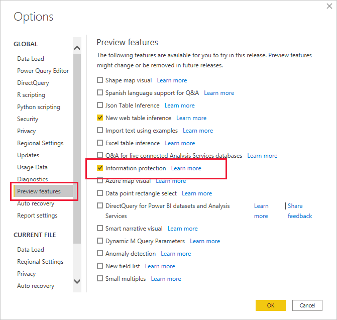

# Como aplicar etiquetas de confidencialidade no Power BI

As etiquetas de confidencialidade da Proteção de Informações da Microsoft nos relatórios, dashboards, conjuntos de dados, fluxos de dados e ficheiros .pbix podem proteger os conteúdos confidenciais contra o acesso não autorizado a dados e a fuga de dados. Se etiquetar os seus dados corretamente com etiquetas de confidencialidade, garante que apenas as pessoas autorizadas podem aceder aos seus dados. Este artigo mostra como aplicar etiquetas de confidencialidade no serviço Power BI e no Power BI Desktop.

Para obter mais informações sobre etiquetas de confidencialidade no Power BI, veja [Etiquetas de confidencialidade no Power BI](service-security-sensitivity-label-overview.md).

## Aplicar etiquetas de confidencialidade no serviço Power BI

No serviço Power BI, é possível aplicar etiquetas de confidencialidade nos relatórios, dashboards, conjuntos de dados e fluxos de dados.

Para poder aplicar etiquetas de confidencialidade no serviço Power BI:
* Tem de ter uma [licença do Power BI Pro](./service-admin-purchasing-power-bi-pro.md) e permissões de edição relativamente ao conteúdo que quer etiquetar.
* As etiquetas de confidencialidade têm de estar ativadas para a organização. Contacte o administrador do Power BI se não tiver certeza sobre isto.
* O utilizador tem de pertencer a um grupo de segurança que tenha permissões para aplicar etiquetas de confidencialidade, conforme descrito em [Ativar etiquetas de confidencialidade no Power BI](./service-security-enable-data-sensitivity-labels.md).
* Todos os [requisitos de licenciamento e de outra natureza](./service-security-enable-data-sensitivity-labels.md#licensing-and-requirements) têm de ser cumpridos.

Quando a proteção de dados estiver ativada no seu inquilino, as etiquetas de confidencialidade aparecem na coluna de confidencialidade na vista de lista dos dashboards, relatórios, conjuntos de dados e fluxos de dados.

**Para aplicar ou alterar uma etiqueta de confidencialidade num relatório ou dashboard**
1. Clique em **Mais opções (...)** .
1. Selecione **Definições**.
1. No painel lateral das definições, selecione a etiqueta de confidencialidade adequada.
1. Guarde as definições.

A imagem seguinte ilustra estes passos num relatório

**Para aplicar ou alterar uma etiqueta de confidencialidade num conjunto de dados ou fluxo de dados**

1. Clique em **Mais opções (...)** .
1. Selecione **Definições**.
1. Selecione o separador de conjuntos de dados ou fluxos de dados, consoante o que for relevante.
1. Expanda a secção das etiquetas de confidencialidade e escolha a etiqueta de confidencialidade adequada.
1. Aplique as definições.

As duas imagens seguintes ilustram estes passos num conjunto de dados.

Selecione **Mais opções (...)** e, em seguida, **Definições**.

No separador das definições dos conjuntos de dados, abra a secção da etiqueta de confidencialidade, selecione a etiqueta de confidencialidade desejada e clique em **Aplicar**.

## Aplicar etiquetas de confidencialidade no Power BI Desktop (pré-visualização)

Para utilizar etiquetas de confidencialidade no Power BI Desktop:
* Precisa de ter uma [licença do Power BI Pro](./service-admin-purchasing-power-bi-pro.md).
* As etiquetas de confidencialidade têm de estar ativadas para a organização. Contacte o administrador do Power BI se não tiver certeza sobre isto.
* O utilizador tem de pertencer a um grupo de segurança que tenha permissões para aplicar etiquetas de confidencialidade, conforme descrito em [Ativar etiquetas de confidencialidade no Power BI](./service-security-enable-data-sensitivity-labels.md).
* Todos os [requisitos de licenciamento e de outra natureza](./service-security-enable-data-sensitivity-labels.md#licensing-and-requirements) têm de ser cumpridos.
* O botão da funcionalidade de pré-visualização da proteção de informações no Power BI Desktop tem de estar ativado. Se vir o botão de confidencialidade no separador Base, significa que a funcionalidade de pré-visualização está ativa. Se não vir o botão, aceda a **Ficheiro > Opções e definições > Opções > Funcionalidades de pré-visualização** e marque a caixa junto a **Proteção de informações**.

    

    >[!Important]
    >Depois de ativar a funcionalidade de pré-visualização da proteção de informações, deve reiniciar o Desktop para começar a utilizar as etiquetas de confidencialidade.
    >
    >Se o Power BI Desktop falhar ao reiniciar, pode dever-se ao facto de o computador não possuir a versão da biblioteca de runtime do Visual C++ redistributable necessária. Caso se depare com essa falha, visite a [página de transferência da Atualização 3 do Microsoft Visual C++ 2015 Redistributable](https://www.microsoft.com/download/details.aspx?id=53587) para obter instruções sobre como transferir e instalar a atualização. Depois de instalar a atualização, tente iniciar novamente o Power BI Desktop.

    Se não vir a opção de pré-visualização da Proteção de informações, significa que a funcionalidade de pré-visualização da proteção de informações pode estar bloqueada para a organização. Neste caso, contacte o administrador do Power BI.

* Tem de ter sessão iniciada.

Para aplicar uma etiqueta de confidencialidade no ficheiro em que está a trabalhar, clique no botão de confidencialidade no separador Base e escolha a etiqueta desejada no menu apresentado.

>[!NOTE]
> Se tiver ativado a funcionalidade de etiquetas de confidencialidade em Funcionalidades de pré-visualização, mas o botão de confidencialidade ainda não for apresentado, tal poderá indicar que não tem uma licença adequada ou que não pertence ao grupo de segurança que tem permissões para aplicar etiquetas de confidencialidade, conforme descrito em [Ativar as etiquetas de confidencialidade no Power BI](./service-security-enable-data-sensitivity-labels.md).

Depois de ter aplicado a etiqueta, a mesma fica visível na barra de estado.

### Etiquetas de confidencialidade ao carregar ou transferir ficheiros .pbix de/para o serviço
* Ao publicar um ficheiro .pbix no serviço Power BI a partir do Desktop ou ao carregar um ficheiro .pbix no serviço Power BI diretamente com **Obter dados**, a etiqueta do ficheiro .pbix é aplicada ao relatório e ao conjunto de dados que são criados no serviço. Se o ficheiro .pbix que está a publicar ou a carregar substituir os recursos existentes (ou seja, os recursos que têm o mesmo nome que o ficheiro .pbix), a etiqueta do ficheiro .pbix substituirá todas etiquetas nesses recursos. Se o ficheiro .pbix não estiver rotulado, as etiquetas do serviço serão mantidas.
* Ao utilizar “Transferir para .pbix” no serviço Power BI, se o relatório e o conjunto de dados que estão a ser transferidos tiverem etiquetas e essas etiquetas forem diferentes, a etiqueta que será aplicada ao ficheiro .pbix será a mais restritiva das duas.

## Remover as etiquetas de confidencialidade

### Serviço
Para remover uma etiqueta de confidencialidade de um relatório, dashboard, conjunto de dados ou fluxo de dados, siga o [mesmo procedimento que é utilizado para aplicar etiquetas no serviço Power BI](#apply-sensitivity-labels-in-the-power-bi-service), mas selecione **(Nenhum)** quando lhe for pedido para classificar a confidencialidade dos dados.

### Ambiente de trabalho
Atualmente, a remoção de etiquetas de confidencialidade de um ficheiro .pbix após o mesmo ter sido guardado com a etiqueta não é suportada no Desktop. Nesses casos, recomenda-se publicar o ficheiro no serviço Power BI e, em seguida, no serviço, remover a etiqueta do relatório e do conjunto de relatórios subsequentes.

## Considerações e limitações

Veja [Etiquetas de confidencialidade no Power BI](service-security-sensitivity-label-overview.md#limitations) para consultar a lista de limitações de etiquetas de confidencialidade no Power BI.

## Próximos passos

Este artigo descreveu como aplicar etiquetas de confidencialidade no Power BI. Os seguintes artigos fornecem mais detalhes sobre a proteção de dados no Power BI. 

* [Descrição geral das etiquetas de confidencialidade no Power BI](./service-security-sensitivity-label-overview.md)
* [Ativar as etiquetas de confidencialidade no Power BI](./service-security-enable-data-sensitivity-labels.md)
* [Utilizar controlos do Microsoft Cloud App Security no Power BI](./service-security-using-microsoft-cloud-app-security-controls.md)