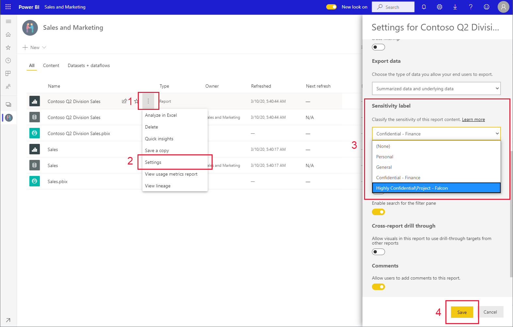
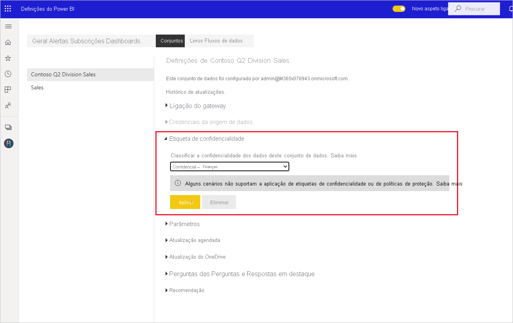

# Como aplicar etiquetas de confidencialidade no Power BI

As etiquetas de confidencialidade da Proteção de Informações da Microsoft nos seus relatórios, dashboards, conjuntos de dados e fluxos de dados podem proteger os seus conteúdos confidenciais contra o acesso não autorizado a dados e a fuga de dados. Se etiquetar os seus dados corretamente com etiquetas de confidencialidade, garante que apenas as pessoas autorizadas podem aceder aos seus dados. Este artigo mostra como pode aplicar etiquetas de confidencialidade ao seu conteúdo.

Para conseguir aplicar etiquetas de confidencialidade no Power BI:
* Tem de ter uma licença do Power BI Pro e permissões de edição em relação ao conteúdo que pretende etiquetar.
* O utilizador tem de pertencer a um grupo de segurança que tenha permissões para aplicar etiquetas de confidencialidade, conforme descrito no artigo intitulado [Ativar etiquetas de confidencialidade no Power BI](./service-security-enable-data-sensitivity-labels.md#enable-sensitivity-labels).
* Todos os [pré-requisitos](./service-security-sensitivity-label-overview.md#requirements-for-using-sensitivity-labels-in-power-bi) e os [requisitos de licenciamento](./service-security-data-protection-overview.md#licensing) têm de ser cumpridos.

Para obter mais informações sobre etiquetas de confidencialidade no Power BI, veja [Etiquetas de confidencialidade no Power BI](service-security-sensitivity-label-overview.md).

## Aplicar etiquetas de confidencialidade

Quando a proteção de dados estiver ativada no seu inquilino, as etiquetas de confidencialidade aparecem na coluna de confidencialidade na vista de lista dos dashboards, relatórios, conjuntos de dados e fluxos de dados.

**Para aplicar ou alterar uma etiqueta de confidencialidade num relatório ou dashboard**
1. Clique em **Mais opções (...)** .
1. Selecione **Definições**.
1. No painel lateral das definições, selecione a etiqueta de confidencialidade adequada.
1. Guarde as definições.

A imagem seguinte ilustra estes passos num relatório

**Para aplicar ou alterar uma etiqueta de confidencialidade num conjunto de dados ou fluxo de dados**

1. Clique em **Mais opções (...)** .
1. Selecione **Definições**.
1. No painel lateral das definições, selecione a etiqueta de confidencialidade adequada.
1. Aplique as definições.

As duas imagens seguintes ilustram estes passos num conjunto de dados.

Selecione **Mais opções (...)** e, em seguida, **Definições**.

Na página das definições, abra a secção da etiqueta de confidencialidade, selecione a etiqueta de confidencialidade pretendida e clique em **Aplicar**.

## Remover etiquetas de confidencialidade
Para remover uma etiqueta de confidencialidade de um relatório, dashboard, conjunto de dados ou fluxo de dados, siga o [mesmo procedimento que é utilizado para aplicar etiquetas](#applying-sensitivity-labels), mas selecione **(Nenhum)** quando lhe for pedido para classificar a confidencialidade dos dados. 

## Considerações e limitações

Veja [Etiquetas de confidencialidade no Power BI](service-security-sensitivity-label-overview.md#limitations) para consultar a lista de limitações de etiquetas de confidencialidade no Power BI.

## Próximos passos

Este artigo descreveu como aplicar etiquetas de confidencialidade no Power BI. Os seguintes artigos fornecem mais detalhes sobre a proteção de dados no Power BI. 

* [Descrição geral das etiquetas de confidencialidade no Power BI](./service-security-sensitivity-label-overview.md)
* [Ativar as etiquetas de confidencialidade no Power BI](./service-security-enable-data-sensitivity-labels.md)
* [Utilizar controlos do Microsoft Cloud App Security no Power BI](./service-security-using-microsoft-cloud-app-security-controls.md)