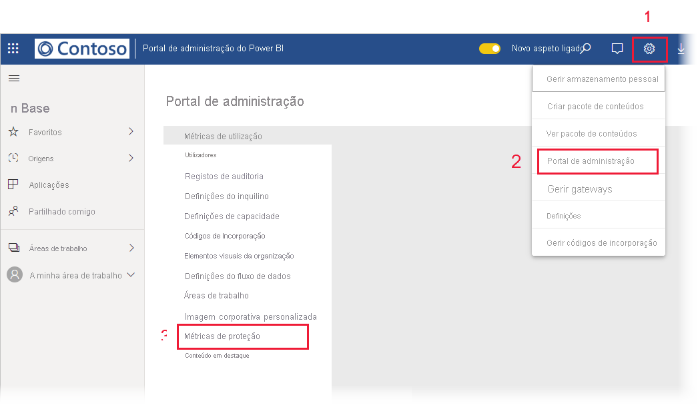

# Data protection metrics report (Relatório de métricas de proteção de dados)

## O que é o Relatório de métricas de proteção de dados?
O relatório de métricas de proteção de dados é um relatório dedicado que os [administradores do Power BI](./service-admin-role.md) podem utilizar para monitorizar e controlar a utilização e adoção de etiquetas de confidencialidade no seu inquilino.

 
O relatório inclui:
* um gráfico de coluna 100% empilhado que mostra a utilização diária de etiquetas de confidencialidade no inquilino nos últimos 7, 30 ou 90 dias. Este gráfico facilita o controlo da utilização relativa dos diferentes tipos de etiquetas ao longo do tempo.
* Os gráficos em anel que mostram o estado atual da utilização das etiquetas de confidencialidade no inquilino para dashboards, relatórios, conjuntos de dados e fluxos de dados.
* Está disponível uma ligação para o portal Cloud App Security onde o Power BI alerta, utilizadores em risco, registos de atividades e outras informações. Para obter mais informações, veja [Utilizar controlos do Microsoft Cloud App Security no Power BI](./service-security-using-microsoft-cloud-app-security-controls.md).

O relatório é atualizado a cada 24 horas.

## Visualização do Relatório de métricas de proteção de dados

Tem de ter uma [função de administrador do Power BI](./service-admin-role.md) para abrir e ver o relatório.
Para ver o relatório, aceda a **Definições > Portal de administração** e selecione **Métricas de proteção**.

 
 
A primeira vez que abrir o relatório de métricas de proteção de dados, poderá demorar alguns segundos a carregar. Um relatório e um conjunto de dados intitulado **Métricas de proteção de dados (geradas automaticamente)** serão criados no seu ambiente privado em “A Minha Área de Trabalho”. Não recomendamos a sua visualização aqui – este não é o relatório completo. Em vez disso, veja o relatório no Portal de administração como descrito acima.

> [!CAUTION]
> Não altere o relatório ou conjunto de dados de forma alguma, uma vez que serão lançadas novas versões do relatório periodicamente e quaisquer alterações que tenha feito ao relatório original serão substituídas se atualizar para a nova versão.

## Atualizações de relatórios

Versões melhoradas do relatório de métricas de proteção de dados são lançadas periodicamente. Quando abrir o relatório, se existir uma nova versão disponível, irá ser-lhe perguntado se pretende abrir a nova versão. Se disser “sim”, a nova versão será carregada e substituirá a versão antiga. Quaisquer alterações que possa ter efetuado no relatório antigo e/ou conjunto de dados irão perder-se. Pode optar por não abrir a nova versão mas, nesse caso, não irá beneficiar das melhorias da nova versão. 
## Notas e considerações
* Para que o relatório de métricas de proteção de dados seja gerado com êxito, a [proteção de informação](./service-security-enable-data-sensitivity-labels.md) tem de estar ativada no seu inquilino e as [etiquetas de confidencialidade devem ter sido aplicadas](./service-security-apply-data-sensitivity-labels.md). 
* Para aceder às informações da Cloud App Security, a sua organização tem de ter a [licença do Cloud App Security](./service-security-using-microsoft-cloud-app-security-controls.md#cloud-app-security-licensing) apropriada.
* Se decidir partilhar informações do relatório de métricas de proteção de dados com um utilizador que não é administrador do Power BI, esteja ciente de que este relatório contém informações confidenciais sobre a sua organização.
* O relatório de métricas de proteção de dados é um tipo especial de relatório e não aparece nas listas “Partilhado comigo”, “Recentes” e “Favoritos”.
* O relatório de métricas de proteção de dados não está disponível para [utilizadores externos (utilizadores convidados do Azure Active Directory B2B)](./service-admin-azure-ad-b2b.md).
## Próximos passos
* [Etiquetas de confidencialidade no Power BI](./service-security-sensitivity-label-overview.md)
* [Utilizar controlos do Microsoft Cloud App Security no Power BI](service-security-using-microsoft-cloud-app-security-controls.md)
* [Compreender a função de administrador do serviço Power BI](service-admin-role.md)
* [Ativar as etiquetas de confidencialidade no Power BI](service-security-enable-data-sensitivity-labels.md)