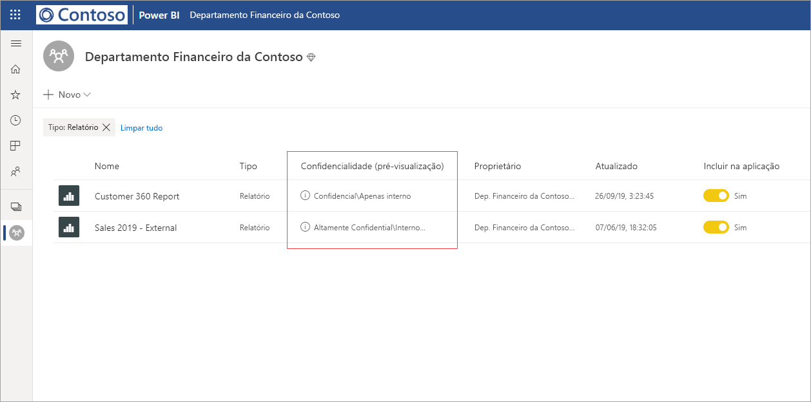
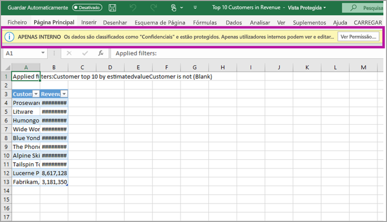

# Proteção de dados no Power BI (pré-visualização)

As empresas modernas têm regulamentos e requisitos empresariais rigorosos sobre como proteger e lidar com os dados confidenciais. O Power BI pode integrar-se no Microsoft Information Protection e o Microsoft Cloud App Security para fornecer maior controlo e visibilidade sobre os dados confidenciais no Power BI. 

Com a Proteção de dados para o Power BI, pode fazer o seguinte:

* Utilizar as etiquetas de confidencialidade da Microsoft para classificar e etiquetar conteúdos no serviço Power BI (dashboards, relatórios, conjuntos de dados e fluxos de dados), ao utilizar a mesma taxonomia utilizada para classificar e proteger ficheiros no Office 365. 

* Impor definições de proteção, como encriptação ou marcas d'água, ao exportar dados do serviço Power BI para ficheiros ao aplicar a etiqueta de confidencialidade e proteção de conteúdos (Excel, PowerPoint e PDF). 

  Por exemplo, os utilizadores podem aplicar uma etiqueta Confidencial a um relatório no Power BI. Em seguida, quando os dados são exportados para um ficheiro do Excel, o Power BI irá aplicar a etiqueta Confidencial ao ficheiro. A etiqueta pode encriptar o conteúdo e aplicar uma marca d'água Confidencial.

* Utilizar o Microsoft Cloud App Security para monitorizar atividades no Power BI, investigar problemas de segurança e proteger conteúdos no Power BI com o Controlo de Aplicações de Acesso Condicional do Microsoft Cloud App Security. 

## Etiquetas de confidencialidade no Power BI

As etiquetas de confidencialidade são criadas e geridas no [Centro de segurança do Microsoft 365](https://security.microsoft.com/) ou no [Centro de conformidade do Microsoft 365](https://compliance.microsoft.com/).

Para aceder às etiquetas de confidencialidade em qualquer um destes centros, navegue até **Classificação > Etiquetas de confidencialidade**. Estas etiquetas de confidencialidade podem ser utilizadas por múltiplos serviços da Microsoft, como o Azure Information Protection, aplicações do Office e serviços do Office 365.

> [!IMPORTANT]
> Os clientes do Azure Information Protection terão de migrar as etiquetas para um dos serviços listados anteriormente, para que as etiquetas de confidencialidade sejam utilizadas no Power BI. Além disso, as etiquetas de confidencialidade só são suportadas em clouds públicas e não são suportadas para inquilinos em clouds, como clouds soberanas.
>
> Saiba mais sobre a [migração de etiquetas de confidencialidade para o Microsoft Information Protection](https://docs.microsoft.com/azure/information-protection/configure-policy-migrate-labels).

## Como funcionam as etiquetas de confidencialidade

Aplicar uma etiqueta de confidencialidade a um dashboard, relatório, conjunto de dados ou fluxo de dados do Power BI, é semelhante a aplicar uma *etiqueta* a esse recurso, que traz os seguintes benefícios:
* **Personalizável** – pode criar categorias para diferentes níveis de conteúdo confidencial na sua organização, tal como Pessoal, Público, Geral, Confidencial e Altamente Confidencial.
* **Texto não encriptado** – uma vez que a etiqueta está em texto não encriptado, é fácil para os utilizadores entenderem como tratar o conteúdo de acordo com as diretrizes da etiqueta de confidencialidade.
* **Persistente** – depois de uma etiqueta de confidencialidade ser aplicada ao conteúdo, vai com esse conteúdo quando este é exportado para os seguintes tipos de ficheiro suportados: Excel, PowerPoint e PDF. 

  Isto significa que a etiqueta de confidencialidade segue o conteúdo, incluindo as suas definições de proteção, e se torna a base para aplicar e impor políticas. 

## Exemplo de etiqueta de confidencialidade 

Aqui está um exemplo rápido de como pode funcionar uma etiqueta de confidencialidade no Power BI.

1. No serviço Power BI, uma etiqueta de confidencialidade **Altamente Confidencial - Apenas Interno** é aplicada a um relatório.

   

2. Quando os dados são exportados para um ficheiro do Excel deste relatório, a etiqueta de confidencialidade e a proteção são aplicados ao ficheiro do Excel exportado.

   

Nas aplicações do Microsoft Office, uma etiqueta de confidencialidade aparece como uma etiqueta no e-mail ou no documento, semelhante à imagem acima.

Pode também atribuir uma classificação ao conteúdo (como um autocolante) que persiste e é enviado com o conteúdo conforme é utilizado e partilhado. Pode utilizar esta classificação para gerar relatórios de utilização e ver dados de atividade dos seus conteúdos confidenciais. Com base nestas informações, pode sempre escolher aplicar as definições de proteção mais tarde.

## Utilizar etiquetas de confidencialidade no Power BI

Antes que as etiquetas de confidencialidade possam ser ativadas no Power BI, tem de começar por cumprir os seguintes pré-requisitos: 

* Certifique-se de que as etiquetas de confidencialidade foram definidas no [Centro de segurança do Microsoft 365](https://security.microsoft.com/) ou no [Centro de conformidade do Microsoft 365](https://compliance.microsoft.com/). 
* [Ative as etiquetas de confidencialidade](service-security-enable-data-sensitivity-labels.md) (Pré-visualização) no Power BI.
* Certifique-se de que os utilizadores têm a licença adequada.
  * Para aplicar ou ver etiquetas no Power BI, os utilizadores têm de ter uma licença Premium P1 ou Premium P2 do Azure Information Protection. O Microsoft Azure Information Protection pode ser adquirido como produto autónomo ou como parte de um dos conjuntos de licenciamento da Microsoft. Para obter mais informações, veja [Preços do Azure Information Protection](https://azure.microsoft.com/pricing/details/information-protection/).
  * Para aplicar etiquetas aos recursos do Power BI, um utilizador tem de ter uma licença do Power BI Pro além de uma das licenças do Azure Information Protection mencionadas acima. 

## Proteção de conteúdos com o Microsoft Cloud App Security

Pode proteger os conteúdos no Power BI contra fugas ou falhas indesejadas com o Microsoft Cloud App Security. Uma vez definido e configurado o Microsoft Cloud App Security, os administradores de segurança podem monitorizar o acesso e a atividade dos utilizadores, executar a análise dos riscos em tempo real e definir controlos específicos de uma etiqueta.

Por exemplo, as organizações podem utilizar o Microsoft Cloud App Security para configurar uma política que impeça os utilizadores de transferirem dados confidenciais do Power BI para dispositivos não geridos. Esta configuração permite que os utilizadores permaneçam produtivos e se liguem ao Power BI em qualquer lugar, tirando ainda partido do Microsoft Cloud App Security para evitar comprometer as ações dos utilizadores, tudo em tempo real. 

### Requirements

Antes de as etiquetas de confidencialidade poderem utilizar o Microsoft Cloud App Security, têm de ser cumpridos os seguintes pré-requisitos: 

* O Cloud App Security e o Azure Information Protection [têm de estar ativados para o seu inquilino](https://docs.microsoft.com/cloud-app-security/azip-integration).
* A aplicação [tem de estar ligada ao Microsoft Cloud App Security](https://docs.microsoft.com/cloud-app-security/enable-instant-visibility-protection-and-governance-actions-for-your-apps).

## Considerações e limitações

A lista seguinte fornece algumas limitações de etiquetas de confidencialidade no Power BI:

* A aplicação e visualização de etiquetas de confidencialidade do Microsoft Information Protection no Power BI requerem uma licença Premium P1 ou Premium P2 do Azure Information Protection. O Microsoft Azure Information Protection pode ser adquirido como produto autónomo ou como parte de um dos conjuntos de licenciamento da Microsoft. Para obter mais informações, veja [Preços do Azure Information Protection](https://azure.microsoft.com/pricing/details/information-protection/).
* As etiquetas de confidencialidade só podem ser aplicadas em dashboards, relatórios, conjuntos de dados e fluxos de dados.
* A imposição de controlos de proteção e de etiquetas em ficheiros exportados só é suportada para ficheiros Excel, PowerPoint e PDF. As etiquetas e a proteção não são impostas quando os dados são exportados para ficheiros .CSV, quando subscrever e-mails, quando incorporar elementos visuais e quando imprimir.
* Um utilizador que exporte um ficheiro do Power BI tem permissões para aceder a e editar esse ficheiro de acordo com as definições das etiquetas de confidencialidade. Um utilizador que exporte os dados não obtém permissões de proprietário em relação ao ficheiro. 
* As etiquetas de confidencialidade não estão atualmente disponíveis para [relatórios paginados]( https://docs.microsoft.com/power-bi/paginated-reports-report-builder-power-bi) e livros. 
* De momento, não é possível eliminar uma etiqueta de um recurso do Power BI depois de esta ter sido aplicada.
* As etiquetas de confidencialidade em recursos do Power BI só estão visíveis nas vistas de lista de áreas de trabalho e de linhagem. Neste momento, as etiquetas não estão visíveis nas vistas Favoritos, Partilhado comigo, Recente ou Aplicações. No entanto, repare que uma etiqueta aplicada a um recurso do Power BI, mesmo que não esteja visível, persiste sempre nos dados exportados para ficheiros Excel, PowerPoint e PDF.
* A etiqueta de confidencialidade *definição de encriptação de ficheiro*, configurada no [Centro de Segurança do Microsoft 365](https://security.microsoft.com/) ou no [Centro de Conformidade do Microsoft 365](https://compliance.microsoft.com/), apenas se aplica aos ficheiros que são *exportados do* Power BI e não é imposta *no* Power BI.
* A [proteção do HYOK](https://docs.microsoft.com/azure/information-protection/configure-adrms-restrictions) não é suportada para etiquetas aplicadas no Power BI.
* A visualização e a aplicação de etiquetas em aplicações do Office estão sujeitas a [requisitos de licenciamento](https://docs.microsoft.com/microsoft-365/compliance/sensitivity-labels-office-apps#subscription-and-licensing-requirements-for-sensitivity-labels).
* As etiquetas de confidencialidade só são suportadas para inquilinos na cloud (pública) global. As etiquetas de confidencialidade não são suportadas para inquilinos noutras clouds.

## Próximos passos

Este artigo apresentou uma descrição geral da proteção de dados no Power BI. Os seguintes artigos fornecem mais detalhes sobre a proteção de dados no Power BI. 

* [Ativar etiquetas de confidencialidade de dados no Power BI](service-security-enable-data-sensitivity-labels.md)
* [Apply data sensitivity labels in Power BI](../designer/service-security-apply-data-sensitivity-labels.md) (Aplicar etiquetas de confidencialidade dos dados no Power BI)
* [Utilizar controlos do Microsoft Cloud App Security no Power BI](service-security-using-microsoft-cloud-app-security-controls.md)