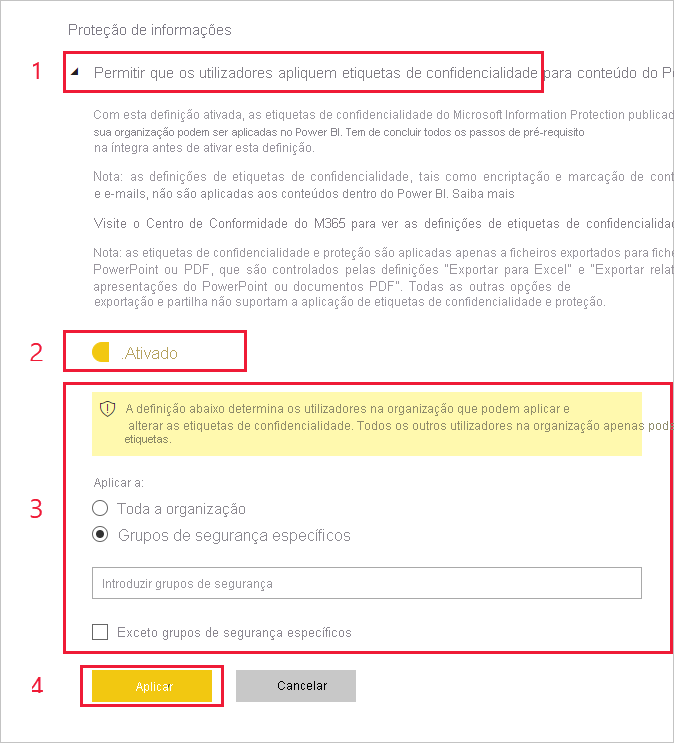

# Ative as etiquetas de confidencialidade no Power BI

Para poderem ser utilizadas no Power BI, as [Etiquetas de confidencialidade do Microsoft Information Protection](/microsoft-365/compliance/sensitivity-labels) têm de estar ativadas no inquilino. Este artigo explica aos administradores do Power BI como o fazer. Para obter uma descrição geral das etiquetas de confidencialidade no Power BI, veja [Etiquetas de confidencialidade no Power BI](service-security-sensitivity-label-overview.md). Para obter informações sobre a aplicação de etiquetas de confidencialidade no Power BI, veja [Aplicar etiquetas de confidencialidade](./service-security-apply-data-sensitivity-labels.md). 

Quando as etiquetas de confidencialidade estão ativadas:

* Os utilizadores e os grupos de segurança especificados na organização podem classificar e [aplicar etiquetas de confidencialidade](./service-security-apply-data-sensitivity-labels.md) ao conteúdo do Power BI. No serviço Power BI, refere-se aos relatórios, dashboards, conjuntos de dados e fluxos de dados. No Power BI Desktop, refere-se aos ficheiros .pbix.
* No serviço, todos os membros da organização poderão ver essas etiquetas. No Desktop, apenas os membros da organização com etiquetas publicadas poderão ver as etiquetas.

Ativar etiquetas de confidencialidade requer uma licença do Azure Information Protection. Veja [Licenciamento e requisitos](#licensing-and-requirements) para obter detalhes.

>[!NOTE]
>Durante as primeiras 48 horas após os utilizadores terem ativado a funcionalidade de pré-visualização do Information Protection, **é possível que se deparem com problemas com os ficheiros .pbix que têm etiquetas de confidencialidade aplicadas (por exemplo, ao publicar o .pbix no serviço, ao transferir o .pbix do serviço)** . Tais problemas são esperados e serão resolvidos automaticamente no prazo de 48 horas.

## Licenciamento e requisitos

* É necessária uma licença Premium P1 ou Premium P2 do Azure Information Protection para aplicar ou visualizar etiquetas de confidencialidade do Microsoft Azure Information Protection no Power BI. O Azure Information Protection pode ser adquirido como produto autónomo ou como parte de um dos conjuntos de licenciamento da Microsoft. Para obter mais informações, veja [Preços do Azure Information Protection](https://azure.microsoft.com/pricing/details/information-protection/).

    >[!NOTE]
    > Se a sua organização utilizar etiquetas de confidencialidade do Azure Information Protection, é preciso migrá-las para a plataforma de Etiquetagem Unificada do Microsoft Azure Information Protection para as poder utilizar no Power BI. [Saiba mais sobre como migrar etiquetas de confidencialidade](/azure/information-protection/configure-policy-migrate-labels).

* Para poderem aplicar etiquetas a ficheiros e conteúdos do Power BI, os utilizadores têm de ter uma licença do Power BI Pro, além de uma das licenças do Azure Information Protection mencionadas acima.

* As aplicações do Office têm os seus próprios [requisitos de licenciamento para visualizar e aplicar etiquetas de confidencialidade]( https://docs.microsoft.com/microsoft-365/compliance/get-started-with-sensitivity-labels#subscription-and-licensing-requirements-for-sensitivity-labels ).

* Antes de ativar as etiquetas de confidencialidade no seu inquilino, verifique se as mesmas foram definidas e publicadas para utilizadores e grupos relevantes. Veja [Criar e configurar etiquetas de confidencialidade e as políticas](/microsoft-365/compliance/create-sensitivity-labels) para obter detalhes.

* Utilizar etiquetas de confidencialidade no Desktop requer a versão do Desktop de dezembro de 2020 e posterior.

    >[!NOTE]
    > Se tentar abrir um ficheiro .pbix protegido com uma versão do Desktop anterior à versão de dezembro de 2020, a abertura falhará e ser-lhe-á pedido para atualizar a versão do Desktop.

## Ativar etiquetas de confidencialidade

As etiquetas de confidencialidade devem ser ativadas no inquilino para poderem ser utilizadas no serviço e no Desktop. Esta secção descreve como as ativar nas definições do inquilino. Para obter considerações adicionais relacionadas com o Desktop, veja [Desativar as etiquetas de confidencialidade no Desktop na organização](#disable-sensitivity-labels-in-desktop-across-your-org) abaixo. 

Para ativar as etiquetas de confidencialidade no inquilino, aceda ao **Portal de administração** do Power BI, abra o painel **Definições de inquilino** e localize a secção **Proteção de informações**.

Na secção **Proteção de Informações**, execute os seguintes passos:
1. Abra a opção **Permitir que os utilizadores apliquem etiquetas de confidencialidade para conteúdo do Power BI**.
1. Utilize o botão de alternar para ativar.
1. Defina quem pode aplicar e alterar etiquetas de confidencialidade em ativos do Power BI. Por predefinição, todas as pessoas na sua organização poderão aplicar etiquetas de confidencialidade. No entanto, pode optar por ativar a definição de etiquetas de confidencialidade apenas para utilizadores ou grupos de segurança específicos. Ao selecionar toda a organização ou grupos de segurança específicos, pode excluir determinados subconjuntos de utilizadores ou grupos de segurança.
   
   * Quando as etiquetas de confidencialidade são ativadas para toda a organização, normalmente as exceções são os grupos de segurança.
   * Quando as etiquetas de confidencialidade são ativadas apenas para utilizadores ou grupos de segurança específicos, normalmente as exceções são os utilizadores específicos.  
    Esta abordagem permite impedir que determinados utilizadores apliquem etiquetas de confidencialidade no Power BI, mesmo que pertençam a um grupo com permissões para o fazer.

1. Prima **Aplicar**.

> [!IMPORTANT]
> Apenas os utilizadores do Power BI Pro com as permissões de *criação* e *edição* do ativo e que fazem parte do grupo de segurança relevante definido nesta secção poderão definir e editar as etiquetas de confidencialidade. Os utilizadores que não fazem parte desse grupo não poderão definir ou editar a etiqueta.  

## Desativar as etiquetas de confidencialidade no Desktop na organização

Para organizações que queiram garantir que os ficheiros .pbix **não** funcionam com etiquetas de confidencialidade, o administrador do Power BI pode criar uma política de grupo que faça com que o Power BI impeça que os utilizadores classifiquem e protejam ficheiros .pbix ou abram ficheiros que já tenham a proteção aplicada. Para criar essa política:

1. Abra o [Editor de Registo](https://support.microsoft.com/windows/how-to-open-registry-editor-in-windows-10-deab38e6-91d6-e0aa-4b7c-8878d9e07b11).

1. Encontre a chave **HKEY_CURRENT_USER\SOFTWARE\Policies\Microsoft\Microsoft Power BI Desktop**.

1. Encontre o valueName **EnableInformationProtection** e defina-o como **false**.

Veja a [descrição geral das etiquetas de confidencialidade](./service-security-sensitivity-label-overview.md#limitations) para obter limitações e considerações adicionais relacionadas com a utilização de etiquetas de confidencialidade no Power BI Desktop.

## Resolução de problemas

O Power BI utiliza etiquetas de confidencialidade do Microsoft Information Protection. Como tal, se for apresentada uma mensagem de erro ao tentar ativar etiquetas de confidencialidade, isso poderá dever-se a um dos seguintes motivos:

* Não tem uma [licença](#licensing-and-requirements) do Azure Information Protection.
* As etiquetas de confidencialidade não foram [migradas](#enable-sensitivity-labels) para a versão do Microsoft Azure Information Protection suportada pelo Power BI.
* Nenhuma etiqueta de confidencialidade do Microsoft Azure Information Protection foi [definida na organização](#enable-sensitivity-labels).

## Considerações e limitações

Veja [Etiquetas de confidencialidade no Power BI](service-security-sensitivity-label-overview.md#limitations) para consultar a lista de limitações de etiquetas de confidencialidade no Power BI.

## Próximos passos

Este artigo descreveu como ativar etiquetas de confidencialidade no Power BI. Os seguintes artigos fornecem mais detalhes sobre a proteção de dados no Power BI. 

* [Descrição geral das etiquetas de confidencialidade no Power BI](service-security-sensitivity-label-overview.md)
* [Como aplicar etiquetas de confidencialidade no Power BI](./service-security-apply-data-sensitivity-labels.md)
* [Utilizar controlos do Microsoft Cloud App Security no Power BI](service-security-using-microsoft-cloud-app-security-controls.md)
* [Relatório de métricas de proteção](service-security-data-protection-metrics-report.md)