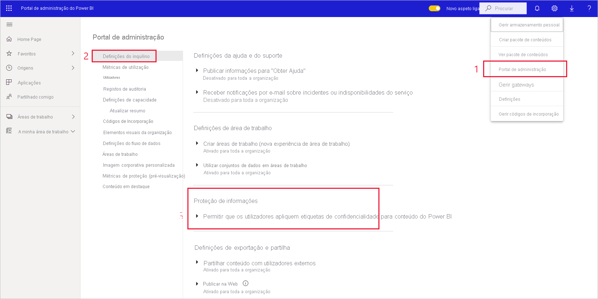

# Ative as etiquetas de confidencialidade no Power BI

Para poderem ser utilizadas no Power BI, as [Etiquetas de confidencialidade do Microsoft Information Protection](https://docs.microsoft.com/microsoft-365/compliance/sensitivity-labels) têm de estar ativadas no inquilino. Este artigo explica como os administradores de inquilinos do Power BI podem fazê-lo. Para obter uma descrição geral das etiquetas de confidencialidade no Power BI, veja [Etiquetas de confidencialidade no Power BI](service-security-sensitivity-label-overview.md). Para obter informações sobre a aplicação de etiquetas de confidencialidade no Power BI, veja [Aplicar etiquetas de confidencialidade](./service-security-apply-data-sensitivity-labels.md). 

Quando as etiquetas de confidencialidade estão ativadas:

* Os utilizadores e os grupos de segurança especificados na organização podem classificar e [aplicar etiquetas de confidencialidade](./service-security-apply-data-sensitivity-labels.md) aos seus relatórios, dashboards, conjuntos de dados e fluxos de dados do Power BI.
* Todos os membros da organização podem ver essas etiquetas.

Ativar etiquetas de confidencialidade requer uma licença do Azure Information Protection. Veja [Licenciamento](service-security-sensitivity-label-overview.md#licensing) para obter detalhes.

## Ativar etiquetas de confidencialidade

Aceda ao **Portal de administração** do Power BI, abra o painel **Definições de inquilino** e localize a secção **Proteção de informações**.

Na secção **Proteção de Informações**, execute os seguintes passos:
1. Abra a opção **Permitir que os utilizadores apliquem etiquetas de confidencialidade para conteúdo do Power BI**.
1. Utilize o botão de alternar para ativar.
1. Defina quem pode aplicar e alterar etiquetas de confidencialidade em ativos do Power BI. Por predefinição, todas as pessoas na sua organização poderão aplicar etiquetas de confidencialidade. No entanto, pode optar por ativar a definição de etiquetas de confidencialidade apenas para utilizadores ou grupos de segurança específicos. Ao selecionar toda a organização ou grupos de segurança específicos, pode excluir determinados subconjuntos de utilizadores ou grupos de segurança.
   
   * Quando as etiquetas de confidencialidade são ativadas para toda a organização, normalmente as exceções são os grupos de segurança.
   * Quando as etiquetas de confidencialidade são ativadas apenas para utilizadores ou grupos de segurança específicos, normalmente as exceções são os utilizadores específicos.  
    Esta abordagem permite impedir que determinados utilizadores apliquem etiquetas de confidencialidade no Power BI, mesmo que pertençam a um grupo com permissões para o fazer.

1. Prima **Aplicar**.

> [!IMPORTANT]
> Apenas os utilizadores do Power BI Pro com as permissões de *criação* e *edição* do ativo e que fazem parte do grupo de segurança relevante definido nesta secção poderão definir e editar as etiquetas de confidencialidade. Os utilizadores que não fazem parte desse grupo não poderão definir ou editar a etiqueta.  

## Resolução de problemas

O Power BI utiliza etiquetas de confidencialidade do Microsoft Information Protection. Como tal, se for apresentada uma mensagem de erro ao tentar ativar etiquetas de confidencialidade, isso poderá dever-se a um dos seguintes motivos:

* Não tem uma [licença](service-security-sensitivity-label-overview.md#licensing) do Azure Information Protection.
* As etiquetas de confidencialidade não foram migradas para a versão do Microsoft Information Protection suportada pelo Power BI. Saiba mais sobre como [migrar etiquetas de confidencialidade](https://docs.microsoft.com/azure/information-protection/configure-policy-migrate-labels).
* Nenhuma etiqueta de confidencialidade do Microsoft Information Protection foi definida na organização. Tenha em atenção que, para que possa utilizá-la, uma etiqueta tem de fazer parte de uma política publicada. [Saiba mais sobre etiquetas de confidencialidade](https://docs.microsoft.com/Office365/SecurityCompliance/sensitivity-labels) ou aceda ao [centro de segurança e conformidade da Microsoft](https://sip.protection.office.com/sensitivity?flight=EnableMIPLabels) para saber como definir etiquetas e publicar políticas para a sua organização.

## Considerações e limitações

Veja [Etiquetas de confidencialidade no Power BI](service-security-sensitivity-label-overview.md#limitations) para consultar a lista de limitações de etiquetas de confidencialidade no Power BI.

## Próximos passos

Este artigo descreveu como ativar etiquetas de confidencialidade no Power BI. Os seguintes artigos fornecem mais detalhes sobre a proteção de dados no Power BI. 

* [Descrição geral das etiquetas de confidencialidade no Power BI](service-security-sensitivity-label-overview.md)
* [Como aplicar etiquetas de confidencialidade no Power BI](../collaborate-share/service-security-apply-data-sensitivity-labels.md)
* [Utilizar controlos do Microsoft Cloud App Security no Power BI](service-security-using-microsoft-cloud-app-security-controls.md)
* [Relatório de métricas de proteção](service-security-data-protection-metrics-report.md)