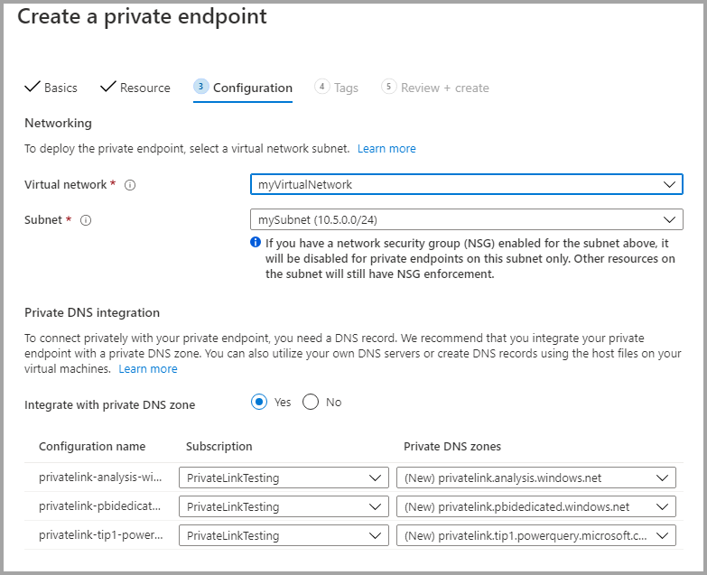

# <a name="private-links-for-accessing-power-bi"></a>Ligações privadas para aceder ao Power BI

A rede do Azure fornece a funcionalidade Ligações Privadas do Azure que permite ao Power BI fornecer acesso seguro através de pontos finais privados da Rede do Azure. Com as Ligações Privadas do Azure e os Pontos Finais Privados, o tráfego de dados é enviado de forma privada através da infraestrutura de rede principal da Microsoft e, desta forma, os dados não percorrem a Internet. 

As ligações privadas garantem que os utilizadores do Power BI utilizam a principal rede privada da Microsoft quando se acede aos recursos no serviço Power BI.

Pode obter mais informações sobre as [Ligações Privadas do Azure](https://azure.microsoft.com/services/private-link/).

## <a name="understanding-private-links"></a>Noções básicas sobre ligações privadas

As ligações privadas garantem que o tráfego que *entra* nos artefactos do Power BI da sua organização (como relatórios ou áreas de trabalho) seguem sempre o caminho de rede de ligações privadas configurado pela sua organização. O tráfego do utilizador nos seus artefactos do Power BI têm de ser provenientes da ligação privada estabelecida. O utilizador pode configurar o Power BI de modo a que este negue todos os pedidos que não sejam provenientes do caminho de rede configurado. 

As ligações privadas *não* garantem que o tráfego proveniente do Power BI para as suas origens de dados externas (quer seja na cloud ou no local) seja seguro. Em vez disso, o utilizador tem de configurar as regras da firewall que vão proteger ainda mais as suas origens de dados. 

### <a name="power-bi-and-private-links-integration"></a>Integração do Power BI e das ligações privadas

O Ponto Final Privado do Azure para o Power BI é uma interface de rede que o liga de forma privada e segura ao serviço Power BI, com tecnologia do Azure Private Link.   

A integração de Pontos Finais Privados permite que os serviços PaaS (Plataforma como Serviço) sejam implementados e acedidos de forma privada a partir de redes virtuais e no local do cliente, ao mesmo tempo que o serviço continua a ser executado fora da rede do cliente. Os Pontos Finais Privados são uma tecnologia única e direcional que permite aos clientes iniciarem ligações a um determinado serviço, mas não permite que o serviço inicie uma ligação na rede do cliente. Este padrão de integração de Ponto Final Privado fornece isolamento de gestão, uma vez que o serviço pode operar independentemente da configuração da política de rede do cliente. Em relação a serviços multi-inquilinos, este modelo de Ponto Final Privado fornece identificadores de ligação para impedir o acesso a outros recursos dos clientes alojados no mesmo serviço. Quando utiliza Pontos Finais Privados, apenas um conjunto limitados de outros recursos de serviço PaaS podem ser acedidos a partir de serviços que utilizam a integração.  

O serviço Power BI implementa Pontos Finais Privados e não Pontos Finais de Serviço.  

A utilização das Ligações Privadas com o Power BI proporciona os seguintes benefícios:

1. As Ligações Privadas garantem que o tráfego irá fluir da estrutura principal do Azure para um ponto final privado dos recursos do Azure com base na cloud. 

2. O isolamento do tráfego de rede de uma infraestrutura não baseada no Azure (como o acesso no local) exigiria que os clientes tivesse o ExpressRoute ou uma Rede Privada Virtual (VPN) configurada.  

## <a name="using-secure-private-links-to-access-power-bi"></a>Utilizar ligações privadas seguras para aceder ao Power BI

No Power BI, pode configurar e utilizar um ponto final que permita à sua organização aceder ao Power BI em privado. Para configurar as ligações privadas, tem de ser um administrador do Power BI no Azure para criar e configurar recursos, como Máquinas Virtuais (VMs) e Redes Virtuais (V-Net). 

Os passos que lhe permitem aceder ao Power BI em segurança a partir de ligações privadas são:

1. [Ativar as ligações privadas para o Power BI](#enable-private-links-for-power-bi)
2. [Criar um recurso do Power BI no portal do Azure](#create-a-power-bi-resource-in-the-azure-portal)
3. [Criar uma rede virtual](#create-a-virtual-network)
4. [Criar uma VM (máquina virtual)](#create-a-virtual-machine-vm)
5. [Criar um ponto final privado](#create-a-private-endpoint)
6. [Ligar a uma VM com o Ambiente de Trabalho Remoto (RDP)](#connect-to-a-vm-using-remote-desktop-rdp)
7. [Aceder ao Power BI em privado a partir da máquina virtual](#access-power-bi-privately-from-the-vm)
8. [Desativar o acesso público ao Power BI](#disable-public-access-for-power-bi)

As secções seguintes fornecem informações adicionais para cada passo.

## <a name="enable-private-links-for-power-bi"></a>Ativar as ligações privadas para o Power BI

Para começar, inicie sessão no Power BI em app.powerbi.com como administrador e navegue para o Portal de Administração. Selecione **Definições do inquilino** e desloque-se até à opção **Rede avançada**. Em seguida, clique no botão de opção para ativar a opção **Azure Private Link**, conforme apresentado na seguinte imagem. 

Demora aproximadamente 15 minutos para configurar uma ligação privada para o seu inquilino, o que inclui a configuração de um FQDN separado para o inquilino, de forma a comunicar em privado com os serviços do Power BI.


Após concluído, pode avançar para o passo seguinte.

## <a name="create-a-power-bi-resource-in-the-azure-portal"></a>Criar um recurso do Power BI no portal do Azure

Em seguida, inicie sessão no [portal do Azure](https://portal.azure.com) e crie um recurso do Power BI através de um **Modelo do Azure**. Substitua os parâmetros no exemplo do modelo do ARM, apresentado na seguinte tabela, para criar um recurso do Power BI.


|**Parâmetro**  |**Valor**  |
|---------|---------|
|```<resource-name>```    | myPowerBIResource         |
|```<tenant-object-id>```     | 52d40f65-ad6d-48c3-906f-1ccf598612d4         |

Criar um modelo do ARM 

```
{
  "$schema": "http://schema.management.azure.com/schemas/2015-01-01/deploymentTemplate.json#",
  "contentVersion": "1.0.0.0",
  "parameters": {},
  "resources": [
      {
          "type":"Microsoft.PowerBI/privateLinkServicesForPowerBI",
          "apiVersion": "2020-06-01",
          "name" : "<resource-name>",
          "location": "global",
          "properties" : 
          {
               "tenantId": "<tenant-object-id>"
          }
      }
  ]
}
```

Na caixa de diálogo que é apresentada, selecione a caixa de verificação para concordar com os termos e condições e, em seguida, selecione **Comprar**.


## <a name="create-a-virtual-network"></a>Criar uma rede virtual

O passo seguinte serve para criar uma rede virtual e sub-rede. Substitua os parâmetros da amostra na tabela abaixo pelos seus próprios para criar uma rede virtual e sub-rede.

| Parâmetro |   Valor| 
|---------|---------|
| ```<resource-group-name>```   | myResourceGroup |
| ```<virtual-network-name>```  | myVirtualNetwork |
| ```<region-name>```   | E.U.A. Central  |
| ```<IPv4-address-space>```    | 10.5.0.0/16 |
| ```<subnet-name>```   | mySubnet |
| ```<subnet-address-range>```  | 10.5.0.0/24 |

1. No canto superior esquerdo do ecrã, selecione **Criar um recurso > Redes > Rede virtual** ou procure **Rede virtual** na caixa de pesquisa.
2. Em **Criar a rede virtual**, introduza ou selecione as seguintes informações no separador **Básicas**:

    |Definições | Valor |
    |-------------------|---------|
    |**Detalhes do projeto**|
    |Subscrição | Selecione a sua subscrição do Azure |
    |Grupo de Recursos |   Selecione **Criar novo**, introduza ```<resource-group-name>``` e, em seguida, selecione **OK** ou selecione um ```<resource-group-name>``` existente com base nos parâmetros. |
    |**Detalhes da instância** |
    | Name  | Introduza ```<virtual-network-name>``` |
    |Region | Selecione ```<region-name>``` |
    
    A seguinte imagem mostra o separador **Básicas**.
    
    


3. Em seguida, selecione o separador **Endereços IP** ou selecione o botão **Seguinte: Endereços IP** na parte inferior do formulário. No separador Endereços IP, introduza as seguintes informações:

    |Definições | Valor |
    |-------------------|---------|
    |Espaço de endereço IPv4 |Introduza ```<IPv4-address-space>``` |
    
    
    

4. Em **Nome da sub-rede**, selecione a palavra *predefinição* e em **Editar sub-rede**, introduza as seguintes informações:

    |Definições | Valor |
    |-------------------|---------|
    | Nome da sub-rede |Introduza ```<subnet-name>``` |
    | Intervalo de endereços da sub-rede | Introduza ```<subnet-address-range>``` |
    
    
    

5. Em seguida, selecione **Guardar** e selecione o separador **Rever + criar** ou o botão **Rever + criar**. 

6. Em seguida, selecione **Criar**.

Após concluir estes passos, pode criar uma máquina virtual (VM), como descrito na secção seguinte.

## <a name="create-a-virtual-machine-vm"></a>Criar uma VM (máquina virtual)

O passo seguinte é criar a rede virtual e a sub-rede para alojar a máquina virtual (VM).

1. No canto superior esquerdo do ecrã no portal do Azure, selecione **Criar um recurso > Computação > Máquina Virtual**.

2. Em **Criar uma máquina virtual – Básicas**, introduza ou selecione as seguintes informações:

    |Definições | Valor |
    |-------------------|---------|
    |**Detalhes do projeto**||
    |Subscrição | Selecione a sua subscrição do Azure |
    |Grupo de Recursos |   Selecione **myResourceGroup** que criou na secção anterior. |
    |**Detalhes da instância** ||
    |Name | Introduza **myVm** |
    |Region | Selecione **E.U.A. Central** |
    |Opções de disponibilidade| Mantenha a predefinição **Não existem redundâncias de infraestruturas necessárias** |
    |Imagem | Selecione **Windows 10 Pro** |
    |Tamanho | Mantenha a predefinição **Standard DS1 v2** |
    |CONTA DE ADMINISTRADOR ||
    |Nome de utilizador |Introduza um nome de utilizador à sua escolha |
    |Palavra-passe | Introduza uma palavra-passe à sua escolha. A palavra-passe tem de ter pelo menos 12 carateres e cumprir os [requisitos de complexidade definidos](/azure/virtual-machines/windows/faq#what-are-the-password-requirements-when-creating-a-vm) |
    |Confirmar Palavra-passe | Reintroduza a palavra-passe |
    |REGRAS DA PORTA DE ENTRADA ||
    |Portas de entrada públicas | Mantenha a predefinição **Nenhuma** |
    |POUPE DINHEIRO ||
    |Já tem uma licença do Windows? |  Mantenha a predefinição **Não** |

3. Em seguida, selecione **Seguinte: Discos**
4. Em **Criar uma máquina virtual – Discos**, mantenha as predefinições e selecione **Seguinte: Redes**.
5. Em **Criar uma máquina virtual – Redes**, selecione as seguintes informações:

    |Definições | Valor |
    |-------------------|---------|
    |Rede virtual|   Mantenha a predefinição **MyVirtualNetwork**|
    |Espaço de endereços| Mantenha a predefinição **10.5.0.0/24**|
    |Sub-rede |Mantenha a predefinição **mySubnet (10.5.0.0/24)**|
    |IP público| Mantenha a predefinição **(novo) myVm-ip**|
    |Portas de entrada públicas|  Selecione **Permitir selecionadas**|
    |Selecione as portas de entrada|  Selecione **RDP**|

6. Selecione **Rever + criar**. Acedeu à página **Rever + criar**, onde o Azure valida a sua configuração.
7. Quando vir a mensagem **A validação passou**, selecione **Criar**.


## <a name="create-a-private-endpoint"></a>Criar um ponto final privado

O passo seguinte, que é descrito nesta secção, serve para criar um ponto final privado para o Power BI.

1. No canto superior esquerdo do ecrã do portal do Azure, selecione **Criar um recurso > Redes > Centro de Private Link (Pré-visualização)** .
2. Em **Private Link Center – Descrição Geral**, na opção para **Criar uma ligação privada a um serviço**, selecione **Criar ponto final privado**.
3. Em **Criar um ponto final privado (Pré-visualização) – Básicas** introduza ou selecione as seguintes informações:

    |Definições | Valor |
    |-------------------|---------|
    |**Detalhes do projeto** ||
    |Subscrição|  Selecione a sua subscrição do Azure|
    |Grupo de Recursos|    Selecione **myResourceGroup**. Criou isto na secção anterior|
    |**Detalhes da instância** ||
    |Name|  Introduza *myPrivateEndpoint*. Se este nome estiver ocupado, crie um nome exclusivo|
    |Region|    Selecione **E.U.A. Central**|
    
    A seguinte imagem mostra a janela **Criar um ponto final privado – Básicas**.
    
    

4. Após essas informações estarem completas, selecione **Seguinte: Recurso** e, na página **Criar um ponto final privado – Recurso**, introduza ou selecione as seguintes informações:

    |Definições | Valor |
    |-------------------|---------|
    |Método de ligação| Selecione Ligar a um recurso do Azure no meu diretório|
    |Subscrição|  Selecione a sua subscrição|
    |Tipo de recurso| Selecione **Microsoft.PowerBI/privateLinkServicesForPowerBI** |
    |Recurso|  myPowerBIResource|
    |Recurso secundário de destino|   Inquilino|
    
    A seguinte imagem mostra a janela **Criar um ponto final privado – Recurso**.
    
    

5. Depois de introduzir corretamente essas informações, selecione **Seguinte: Configuração** e, em **Criar um ponto final privado (Pré-visualização – Configuração**, introduza ou selecione as seguintes informações:

    |Definições | Valor |
    |-------------------|---------|
    |**REDES** ||
    |Rede virtual|   Selecione *myVirtualNetwork* |
    |Sub-rede |Selecione *mySubnet* |
    |**INTEGRAÇÃO DE DNS PRIVADO** ||
    |Integrar com zona DNS privada|   Selecione **Sim** |
    |Zona DNS Privada   |Selecione <br> *(New)privatelink.analysis.windows.net* <br> *(New)privatelink.pbidedicated.windows.net* <br> *(New)privatelink.tip1.powerquery.microsoft.com* |
    
    A seguinte imagem mostra a janela **Criar um ponto final privado – Configuração**.
    
    
    
    Em seguida, selecione **Rever + criar**, o que mostra a página **Rever + criar**, onde o Azure valida a sua configuração. Quando vir a mensagem **A validação passou**, selecione **Criar**.

## <a name="connect-to-a-vm-using-remote-desktop-rdp"></a>Ligar a uma VM com o Ambiente de Trabalho Remoto (RDP)

Após ter criado a sua máquina virtual chamada **myVM**, ligue-se à mesma a partir da Internet com os seguintes passos:

1. Na barra de pesquisa do portal, introduza *myVm*.
2. Selecione o botão **Ligar**. Após selecionar o botão **Ligar**, é aberta a janela **Ligar à máquina virtual**.
3. Selecione **Transferir Ficheiro RDP**. O Azure cria um ficheiro do Protocolo do Ambiente de Trabalho Remoto (.rdp) e transfere-o para o seu computador.
4. Abra o ficheiro .rdp transferido.
5. Se lhe for pedido, selecione **Ligar**.
6. Introduza o nome de utilizador e a palavra-passe que especificou ao criar a VM no passo anterior.
7. Selecione **OK**.
8. Poderá receber um aviso de certificado durante o processo de início de sessão. Se recebeu um aviso de certificado, selecione **Sim** ou **Continuar**.

## <a name="access-power-bi-privately-from-the-vm"></a>Aceder ao Power BI em privado a partir da VM

O próximo passo é aceder ao Power BI em privado, a partir da máquina virtual que criou no passo anterior, com os seguintes passos: 

1. No Ambiente de Trabalho Remoto de myVM, abra o PowerShell.
2. Introduza nslookup 52d40f65ad6d48c3906f1ccf598612d4-api.privatelink.analysis.windows.net.
3. Irá receber uma mensagem semelhante a esta:

    ```
    Server:  UnKnown
    Address:  168.63.129.16
    
    Non-authoritative answer:
    Name:    52d40f65ad6d48c3906f1ccf598612d4-api.privatelink.analysis.windows.net
    Address:  10.5.0.4
    ```

4. Abra o browser e aceda a app.powerbi.com para aceder ao Power BI em privado.

## <a name="disable-public-access-for-power-bi"></a>Desativar o acesso público ao Power BI

Por último, precisa de desativar o acesso público ao Power BI. 

Inicie sessão em app.powerbi.com como administrador e navegue para o **Portal de administração**. Selecione **Definições do inquilino** e desloque-se até à secção **Rede avançada**. Ative o botão de alternar na secção **Bloquear Acesso à Internet Pública**, como apresentado na imagem abaixo. Demora aproximadamente 15 minutos para que o sistema desative o acesso da sua organização ao Power BI a partir da Internet pública.

E é tudo. Após seguir estes passos, o Power BI da sua organização estará apenas acessível a partir de ligações privadas e não estará acessível a partir da Internet pública. 

## <a name="considerations-and-limitations"></a>Considerações e limitações

Estas são algumas considerações a ter enquanto trabalha com ligações privadas no Power BI:

* Qualquer utilização de temas ou imagens externas não está disponível ao utilizar um ambiente de ligação privada e poderá afetar os elementos visuais personalizados.
* Se o acesso à Internet estiver desativado e se o conjunto de dados ou fluxo de dados estiver a ligar-se a um conjunto de dados do Power BI ou fluxo de dados como uma origem de dados, a ligação falhará.
* As métricas de utilização *não* funcionam quando as Ligações Privadas estão ativadas.
* A opção Publicar na Web não é suportada (e fica indisponível) quando ativa a opção **Bloquear acesso à Internet Pública** no Power BI.


## <a name="next-steps"></a>Próximos passos

- [Administrar o Power BI na sua Organização](service-admin-administering-power-bi-in-your-organization.md)  
- [Compreender a função de administrador do Power BI](service-admin-role.md)  
- [Fazer a auditoria do Power BI na sua organização](service-admin-auditing.md)  

Mais perguntas? [Experimente perguntar à Comunidade do Power BI](https://community.powerbi.com/)
