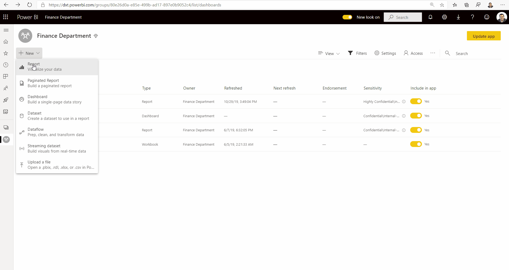

# Etiquetas de confidencialidade no Power BI

Este artigo descreve a funcionalidade Etiquetas de confidencialidade do Microsoft Information Protection no Power BI.

Para obter informações sobre a ativação da etiqueta de confidencialidade no inquilino, incluindo os pré-requisitos e requisitos de licenciamento, veja [Ativar as etiquetas de confidencialidade de dados no Power BI](service-security-enable-data-sensitivity-labels.md).

Para obter informações sobre como aplicar etiquetas de confidencialidade a relatórios do Power BI, dashboards, conjuntos de dados e fluxos de dados, veja [Como aplicar etiqueta de confidencialidade no Power BI](./service-security-apply-data-sensitivity-labels.md).

## Introdução

As etiquetas de confidencialidade da Microsoft Information Protection fornecem aos utilizadores uma forma simples de classificar conteúdos críticos no Power BI, sem comprometer a produtividade ou a capacidade de colaborar.

As etiquetas de confidencialidade podem ser aplicadas a conjuntos de dados, relatórios, dashboards e fluxos de dados. Quando os dados etiquetados saem do Power BI, através da exportação para ficheiros Excel, PowerPoint ou PDF ou através de outros cenários de exportação suportados, tal como Analisar no Excel ou Tabelas Dinâmicas no Excel de ligação em direto, o Power BI aplica automaticamente a etiqueta ao ficheiro exportado e protege-o de acordo com as definições de encriptação do ficheiro da etiqueta. Desta forma, os dados confidenciais permanecem protegidos, estejam onde estiverem.

As etiquetas de confidencialidade nos relatórios, dashboards, conjuntos de dados e fluxos de dados são visíveis em muitos locais no serviço Power BI. As etiquetas de confidencialidade em relatórios e dashboards são também visíveis nas aplicações móveis Power BI para iOS e Android e em elementos visuais incorporados.

Um [relatório de métricas de proteção](service-security-data-protection-metrics-report.md) disponível no portal de administração do Power BI fornece aos administradores do Power BI uma visibilidade total sobre os dados confidenciais no inquilino do Power BI. Além disso, os registos de auditoria do Power BI incluem informações de etiquetas de confidencialidade sobre atividades como a aplicação, remoção e alteração de etiquetas, bem como sobre atividades como relatórios de visualização, dashboards, entre outros, o que dá visibilidade ao Power BI e aos administradores de segurança sobre o consumo de dados confidenciais para efeitos de monitorização e investigação de alertas de segurança.

## Considerações importantes

A etiquetagem de confidencialidade **não** afeta o acesso aos conteúdos no Power BI, uma vez que esse acesso é gerido apenas pelas permissões do Power BI. Embora as etiquetas sejam visíveis, não são aplicadas definições de encriptação associadas (configuradas no [Centro de Segurança do Microsoft 365](https://security.microsoft.com/) ou no [Centro de Conformidade do Microsoft 365](https://compliance.microsoft.com/)). Estes são aplicados apenas a dados que saem do Power BI através da exportação para ficheiros Excel, PowerPoint ou PDF ou através de qualquer outro caminho de exportação suportado.

As etiquetas de confidencialidade e a encriptação de ficheiros **não são** aplicados em caminhos de exportação não suportados. O administrador do Power BI pode bloquear a exportação através de caminhos de exportação não suportados:

>[!NOTE]
> Os utilizadores a quem é concedido acesso a um relatório têm acesso a todo o conjunto de dados subjacente, a menos que [a segurança ao nível da linha (RLS)](./service-admin-rls.md) limite o acesso. Os autores do relatório podem classificar e etiquetar relatórios com as etiquetas de confidencialidade. Se a etiqueta de confidencialidade tiver definições de proteção, o Power BI aplicará estas definições de proteção quando exportar os dados do relatório para ficheiros do Excel, do PowerPoint ou PDF. Apenas os utilizadores autorizados podem abrir ficheiros protegidos.

## Caminhos de exportação suportados
Atualmente, a aplicação de etiquetas de confidencialidade e a proteção associada aos dados que saem do Power BI suporta os seguintes caminhos de exportação:
* Exportar para ficheiros Excel, PowerPoint e PDF.
* Analisar no Excel a partir do serviço do Power BI, que aciona a transferência de um ficheiro do Excel com uma ligação em direto a um conjunto de dados do Power BI.
* Tabela Dinâmica no Excel com uma ligação em direto ao conjunto de dados do Power BI, para utilizadores com o M365 E3 e superior. 

## Como funcionam as etiquetas de confidencialidade no Power BI

Aplicar uma etiqueta de confidencialidade a um dashboard, relatório, conjunto de dados ou fluxo de dados do Power BI é semelhante a aplicar uma etiqueta a esse recurso, o que tem os seguintes benefícios:
* **Personalizável** – pode criar categorias para diferentes níveis de conteúdo confidencial na sua organização, tal como Pessoal, Público, Geral, Confidencial e Altamente Confidencial.
* **Texto não encriptado** – uma vez que a etiqueta está em texto não encriptado, é fácil para os utilizadores entenderem como tratar os conteúdos de acordo com as diretrizes da etiqueta de confidencialidade.
* **Persistente** – após a aplicação de uma etiqueta de confidencialidade ao conteúdo, a mesma acompanha esse conteúdo quando este é exportado para ficheiros Excel, PowerPoint e PDF, e torna-se a base para aplicar e impor políticas.

Eis um exemplo rápido de como as etiquetas de confidencialidade funcionam no Power BI. A imagem abaixo mostra como uma etiqueta de confidencialidade é aplicada a um relatório no serviço Power BI, como os dados do relatório são depois exportados para um ficheiro do Excel e, por fim, como a etiqueta de confidencialidade e as suas proteções persistem no ficheiro exportado.

As etiquetas de confidencialidade que aplica ao conteúdo são mantidas e movidas com o conteúdo conforme é utilizado e partilhado no Power BI. Pode utilizar esta etiquetagem para gerar relatórios de utilização e para ver os dados de atividade dos conteúdos confidenciais.

## Herança de etiquetas de confidencialidade na criação de novos conteúdos

Quando novos relatórios e dashboards são criados no serviço Power BI, herdam automaticamente a etiqueta de confidencialidade anteriormente aplicada no conjunto de dados principal ou no relatório. Por exemplo, um novo relatório criado sobre um conjunto de dados que tenha uma etiqueta de confidencialidade "Altamente Confidencial" também receberá automaticamente a etiqueta "Altamente Confidencial".

A seguinte imagem mostra como a etiqueta de confidencialidade de um conjunto de dados é automaticamente aplicada a um novo relatório que é construído sobre o conjunto de dados.

>[!NOTE]
>Se, por qualquer motivo, a etiqueta de confidencialidade não puder ser aplicada ao novo relatório ou dashboard, o Power BI **não irá** bloquear a criação do novo item.

## Etiquetas de confidencialidade e proteção dos dados exportados

Quando os dados são exportados do Power BI para ficheiros do Excel, PowerPoint ou PDF, o Power BI aplica automaticamente uma etiqueta de confidencialidade ao ficheiro exportado e protege-o de acordo com as definições de encriptação do ficheiro da etiqueta. Desta forma, os seus dados confidenciais permanecem protegidos, estejam onde estiverem.

Um utilizador que exporta um ficheiro do Power BI tem permissão para aceder e editar esse ficheiro de acordo com as definições da etiqueta de confidencialidade, mas não obtém permissões de proprietário no ficheiro.

As etiquetas de confidencialidade e proteções não são aplicadas quando os dados são exportados para ficheiros .csv ou .pbix ou qualquer outro caminho de exportação.

Aplicar uma etiqueta de confidencialidade e proteção a um ficheiro exportado não adiciona marcação de conteúdos ao ficheiro. No entanto, se a etiqueta for configurada para aplicar marcações de conteúdos, estas são automaticamente aplicadas pelo cliente de etiquetagem unificada do Azure Information Protection, quando o ficheiro é aberto em aplicações de computador do Office. As marcações de conteúdo não são aplicadas automaticamente quando utiliza a etiquetagem incorporada para computadores, dispositivos móveis ou aplicações Web. Para obter mais detalhes, veja [When Office apps apply content marking and encryption](/microsoft-365/compliance/sensitivity-labels-office-apps#when-office-apps-apply-content-marking-and-encryption) (Quando é que as aplicações do Office aplicam marcação de conteúdo e encriptação).

A exportação falha se uma etiqueta não puder ser aplicada quando os dados são exportados para um ficheiro. Para verificar se a exportação falhou porque a etiqueta não podia ser aplicada, clique no nome do relatório ou do dashboard no centro da barra de título e verifique se é apresentada a indicação "Não é possível carregar a etiqueta de confidencialidade" no menu pendente informativo aberto. Isto pode acontecer se o administrador de segurança tiver eliminado ou anulado a publicação da etiqueta aplicada, ou em resultado de um problema temporário do sistema.

## Herança de etiquetas de confidencialidade em Analisar no Excel

Quando cria uma tabela dinâmica no Excel com uma ligação em direto a um conjunto de dados do Power BI (pode fazê-lo a partir do Power BI através de [Analisar no Excel](../collaborate-share/service-analyze-in-excel.md) ou a partir do [Excel](https://support.microsoft.com/office/create-a-pivottable-from-power-bi-datasets-31444a04-9c38-4dd7-9a45-22848c666884?ui=en-US&rs=en-US&ad=US)), a etiqueta de confidencialidade do conjunto de dados é herdada e aplicada ao ficheiro do Excel, juntamente com qualquer proteção associada. Se a etiqueta do conjunto de dados for posteriormente alterada para uma mais restritiva, a etiqueta aplicada ao ficheiro do Excel ligado será atualizada de forma automática ao atualizar os dados.

 
As etiquetas de confidencialidade no Excel que tenham sido definidas manualmente não são substituídas de forma automática pela etiqueta de confidencialidade do conjunto de dados. Em vez disso, uma faixa notifica-o de que o conjunto de dados tem uma etiqueta de confidencialidade e recomenda que a aplique.

>[!NOTE]
>Se a etiqueta de confidencialidade do conjunto de dados for menos restritiva do que a etiqueta de confidencialidade do ficheiro do Excel, não ocorre a herança nem a atualização de etiquetas. Um ficheiro do Excel nunca herda uma etiqueta de confidencialidade menos restritiva.

## Persistência da etiqueta de confidencialidade em relatórios e dashboards incorporados

Pode incorporar relatórios, dashboards e elementos visuais do Power BI em aplicações empresariais, como o Microsoft Teams e o SharePoint, ou no site de uma organização. Quando incorporar um elemento visual, relatório ou dashboard que tenha uma etiqueta de confidencialidade aplicada, a etiqueta de confidencialidade será visível na vista incorporada, e a etiqueta e a sua proteção irão persistir quando os dados forem exportados para o Excel.

São suportados os seguintes cenários de incorporação:
* [Incorporar para a sua organização](../developer/embedded/embed-sample-for-your-organization.md)
* Aplicações do Microsoft 365 (por exemplo, [Teams](../collaborate-share/service-embed-report-microsoft-teams.md) e [SharePoint](../collaborate-share/service-embed-report-spo.md))
* [Incorporação segura de URL](../collaborate-share/service-embed-secure.md) (incorporação a partir do serviço Power BI) 

## Etiqueta de confidencialidade nas aplicações móveis do Power BI

As etiquetas de confidencialidade podem ser vistas em relatórios e dashboards nas aplicações móveis do Power BI. Um ícone junto ao nome do relatório ou dashboard indica que tem uma etiqueta de confidencialidade, e o tipo de etiqueta e a sua descrição podem ser encontrados na caixa de informações do relatório ou do dashboard.

## Clouds suportadas
As etiquetas de confidencialidade só são suportadas para inquilinos em clouds globais (públicas) e não para inquilinos em clouds, como clouds nacionais.

## Licenciamento e requisitos

Veja [Licenciamento e requisitos](service-security-enable-data-sensitivity-labels.md#licensing-and-requirements).

## Criação e gestão de etiquetas de confidencialidade

As etiquetas de confidencialidade são criadas e geridas no [Centro de segurança do Microsoft 365](https://security.microsoft.com/) ou no [Centro de conformidade do Microsoft 365](https://compliance.microsoft.com/).

Para aceder às etiquetas de confidencialidade em qualquer um destes centros, navegue até **Classificação > Etiquetas de confidencialidade**. Estas etiquetas de confidencialidade podem ser utilizadas por múltiplos serviços da Microsoft, como o Azure Information Protection, aplicações do Office e serviços do Office 365.

>[!Important]
> Se a sua organização utilizar as etiquetas de confidencialidade do Azure Information Protection, terá de [migrá-las](/azure/information-protection/configure-policy-migrate-labels) para um dos serviços mencionados anteriormente, para que sejam utilizadas no Power BI.

## Limitações

A lista seguinte fornece algumas limitações de etiquetas de confidencialidade no Power BI:

* As etiquetas de confidencialidade só podem ser aplicadas em dashboards, relatórios, conjuntos de dados e fluxos de dados. Atualmente, não estão disponíveis para [relatórios paginados](../paginated-reports/report-builder-power-bi.md) e livros.
* As etiquetas de confidencialidade em recursos do Power BI estão visíveis nas vistas de lista de áreas de trabalho, linhagem, favoritos, recentes e aplicações. Atualmente, as etiquetas não estão visíveis na vista "Partilhado comigo". No entanto, repare que uma etiqueta aplicada a um recurso do Power BI, mesmo que não esteja visível, persiste sempre nos dados exportados para ficheiros Excel, PowerPoint e PDF.
* As etiquetas de confidencialidade de dados não são suportadas para aplicações de modelo. As etiquetas de confidencialidade definidas pelo criador de aplicações de modelo serão removidas quando a aplicação é extraída e instalada e as etiquetas de confidencialidade adicionadas a artefactos numa aplicação de modelo instalada pelo consumidor de aplicações serão perdidas (repostas a zero) quando a aplicação é atualizada.
* O Power BI não suporta etiquetas de confidencialidade dos tipos de proteção [Não Reencaminhar](/microsoft-365/compliance/encryption-sensitivity-labels#let-users-assign-permissions), [definido pelo utilizador](/microsoft-365/compliance/encryption-sensitivity-labels#let-users-assign-permissions) e [HYOK](/azure/information-protection/configure-adrms-restrictions). Os tipos de proteção Não Reencaminhar e definido pelo utilizador fazem referência a etiquetas definidas no [Centro de Segurança do Microsoft 365](https://security.microsoft.com/) ou no [Centro de Conformidade do Microsoft 365](https://compliance.microsoft.com/).
* Não é recomendável permitir que os utilizadores apliquem etiquetas principais dentro do Power BI (uma etiqueta será considerada como sendo uma etiqueta principal apenas se possuir subetiquetas). Se uma etiqueta principal for aplicada ao conteúdo, a exportação de dados desse conteúdo para um ficheiro (Excel, PowerPoint e PDF) irá falhar. Veja [Sublabels (grouping labels)](/microsoft-365/compliance/sensitivity-labels#sublabels-grouping-labels) (Subetiquetas [etiquetas do agrupamento]).

## Próximos passos

Este artigo apresentou uma descrição geral da proteção de dados no Power BI. Os seguintes artigos fornecem mais detalhes sobre a proteção de dados no Power BI. 

* [Ativar as etiquetas de confidencialidade no Power BI](service-security-enable-data-sensitivity-labels.md)
* [Como aplicar etiquetas de confidencialidade no Power BI](service-security-apply-data-sensitivity-labels.md)
* [Utilizar controlos do Microsoft Cloud App Security no Power BI](service-security-using-microsoft-cloud-app-security-controls.md)
* [Relatório de métricas de proteção](service-security-data-protection-metrics-report.md)