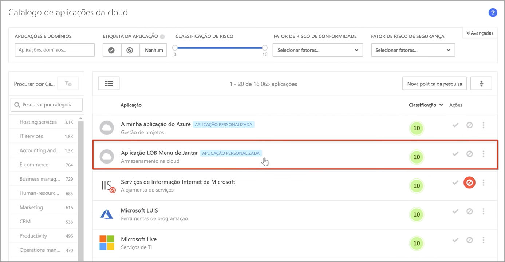
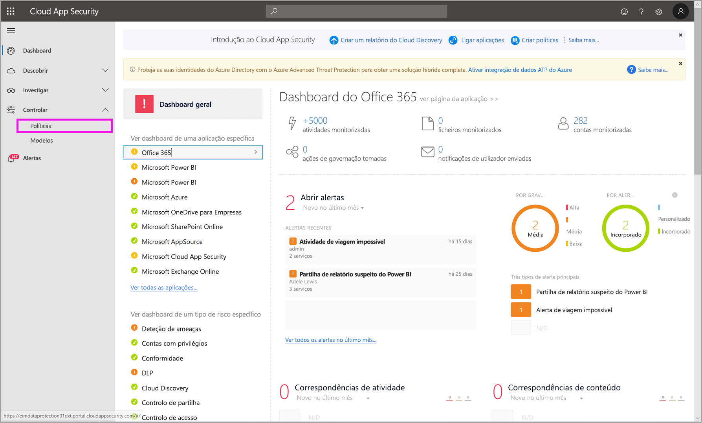
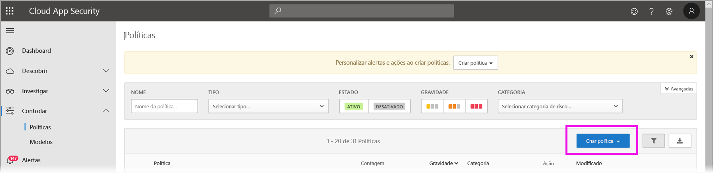
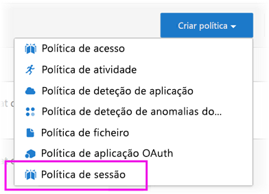
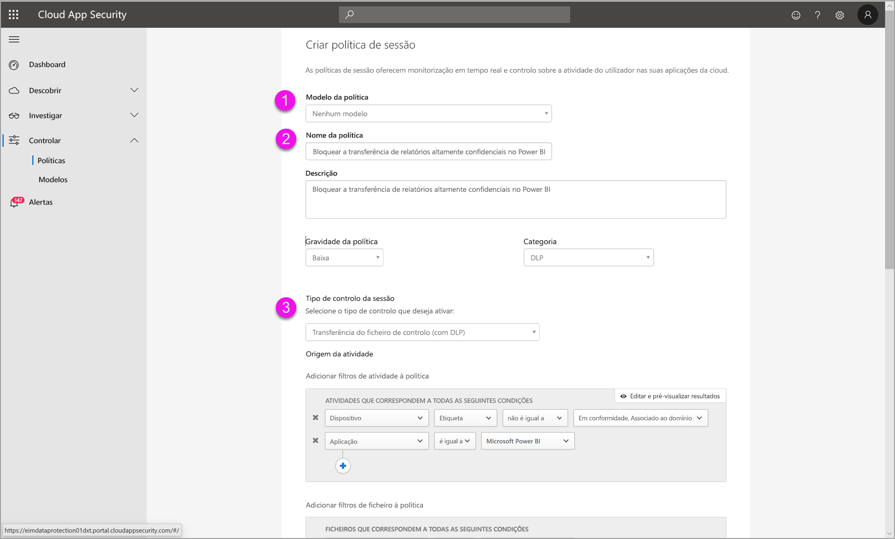
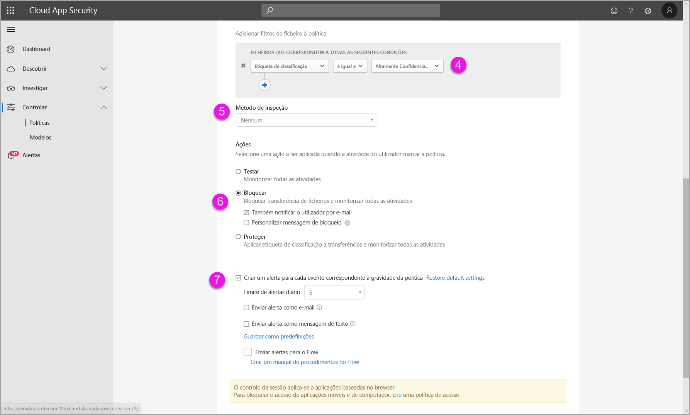
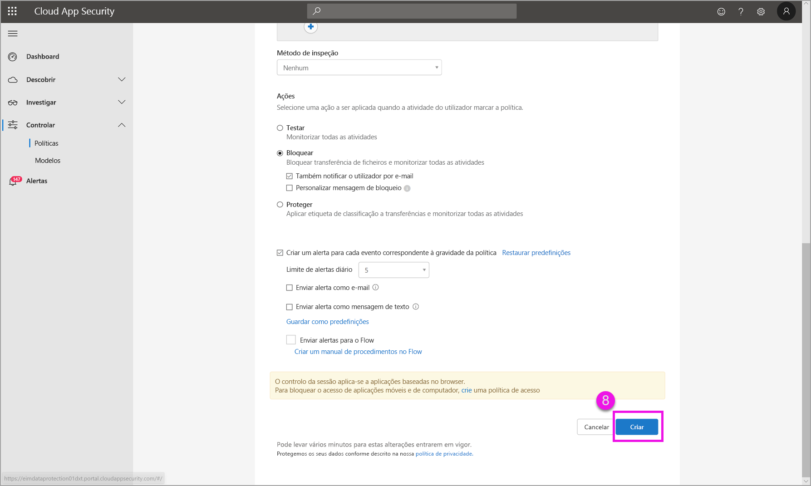

# Utilizar controlos do Microsoft Cloud App Security no Power BI

Ao utilizar o Cloud App Security com o Power BI, pode ajudar a proteger os seus relatórios, dados e serviços do Power BI contra fugas ou falhas indesejadas. Com o Cloud App Security, pode criar políticas de acesso condicional para os dados da sua organização ao utilizar controlos de sessão em tempo real no Azure Active Directory (Azure AD), que ajudam a garantir a segurança das suas análises do Power BI. Uma vez definidas estas políticas, os administradores podem monitorizar o acesso e a atividade dos utilizadores, executar a análise dos riscos em tempo real e definir controlos específicos de uma etiqueta. 

Pode configurar o Cloud App Security para todos os tipos de aplicações e serviços, e não apenas para o Power BI. Tem de configurar o Cloud App Security para funcionar com o Power BI, de modo a beneficiar das proteções do Cloud App Security para os seus dados e análises do Power BI. Para obter mais informações sobre o Cloud App Security, incluindo uma descrição geral de como funciona, do dashboard e das classificações de risco das aplicações, veja a documentação do [Cloud App Security](/cloud-app-security/).

## Utilizar o Cloud App Security com o Power BI

Para utilizar o Cloud App Security com o Power BI, tem de utilizar e configurar serviços de segurança relevantes da Microsoft, alguns dos quais são definidos fora do Power BI.

### Licenciamento do Cloud App Security

Para poder ter o Cloud App Security no seu inquilino, tem de ter uma das seguintes [licenças](https://query.prod.cms.rt.microsoft.com/cms/api/am/binary/RE2NXYO):
* Microsoft Cloud App Security: proporciona funcionalidades do Cloud App Security para todas as aplicações suportadas, fazendo parte dos pacotes EMS E5 e Microsoft 365 E5.
* Office 365 Cloud App Security: proporciona funcionalidades do Cloud App Security apenas para o Office 365, fazendo parte do pacote Office 365 E5.
* Azure Active Directory Premium P1, para beneficiar das principais funcionalidades do Cloud App Security.

As secções que se seguem descrevem os passos para utilizar o Cloud App Security no Power BI.

### Definir políticas de sessão no Azure AD (obrigatório)
Os passos necessários para definir controlos de sessão são executados nos portais do Azure AD e do Cloud App Security. No portal do Azure AD, pode criar uma política de acesso condicional para o Power BI e encaminhar as sessões utilizadas no Power BI pelo serviço Cloud App Security. 

O Cloud App Security funciona com uma arquitetura de proxy inverso e está integrado no acesso condicional do Azure AD para monitorizar a atividade dos utilizadores do Power BI em tempo real. Os passos que se seguem visam ajudá-lo a compreender o processo e os conteúdos ligados em cada um dos passos apresentam instruções passo a passo detalhadas. Também pode ler este [artigo do Cloud App Security](/cloud-app-security/proxy-deployment-aad) que descreve o processo na íntegra.

1.  [Create an Azure AD conditional access test policy](/cloud-app-security/proxy-deployment-aad#add-azure-ad) (Criar uma política de teste de acesso condicional do Azure AD)
2.  [Sign into each app using a user scoped to the policy](/cloud-app-security/proxy-deployment-aad#sign-in-scoped) (Iniciar sessão em cada aplicação ao utilizar um utilizador confinado à política)
3.  [Verify the apps are configured to use access and session controls](/cloud-app-security/proxy-deployment-aad#portal) (Verificar que as aplicações estão configuradas para utilizar controlos de acesso e de sessão)
4.  [Test the deployment](/cloud-app-security/proxy-deployment-aad#step-4-test-the-deployment) (Testar a implementação)

O processo de definição de políticas de sessão é descrito em detalhe no artigo [Políticas de sessão](/cloud-app-security/session-policy-aad). 

### Definir políticas de deteção de anomalias para monitorizar atividades no Power BI (recomendado)
Pode definir políticas de deteção de anomalias do Power BI que podem ser confinadas de forma independente, de modo a que se apliquem apenas aos utilizadores e grupos que pretenda incluir e excluir na política. [Saiba mais](/cloud-app-security/anomaly-detection-policy#scope-anomaly-detection-policies).

O Cloud App Security também tem duas deteções incorporadas dedicadas para o Power BI. [Para obter mais informações, veja a secção mais adiante neste documento](#built-in-cloud-app-security-detections-for-power-bi).

### Utilizar etiquetas de confidencialidade do Microsoft Information Protection (recomendado)

As etiquetas de confidencialidade permitem-lhe classificar e ajudar a proteger conteúdos confidenciais, de modo a que as pessoas da sua organização possam colaborar com parceiros fora da organização, mas tendo cuidado e estando atentas a conteúdos e dados confidenciais. 

Pode ler o artigo sobre [etiquetas de confidencialidade no Power BI](service-security-sensitivity-label-overview.md), que descreve em detalhe o processo de utilização de etiquetas de confidencialidade para o Power BI. Veja abaixo um [exemplo de uma política do Power BI baseada em etiquetas de confidencialidade](#example).

## Deteções incorporadas do Cloud App Security para o Power BI

As deteções do Cloud App Security permitem que os administradores monitorizem atividades específicas de uma aplicação monitorizada. Para o Power BI, existem atualmente duas deteções incorporadas e dedicadas do Cloud App Security: 

* **Partilha suspeita** – deteta quando um utilizador partilha um relatório confidencial com um e-mail desconhecido (externo à organização). Um relatório confidencial é um relatório cuja etiqueta de confidencialidade está definida como **APENAS INTERNA** ou superior. 

* **Partilha de relatórios em massa** – deteta quando um utilizador partilha um grande número de relatórios numa única sessão.

As definições para estas deteções são configuradas no portal do Cloud App Security. [Saiba mais](/cloud-app-security/anomaly-detection-policy#unusual-activities-by-user). 

## Função de administrador do Power BI no Cloud App Security

Foi criada uma nova função para administradores do Power BI ao utilizar o Cloud App Security com o Power BI. Quando iniciar sessão como administrador do Power BI no [portal do Cloud App Security](https://portal.cloudappsecurity.com/), tem acesso limitado a dados relevantes do Power BI, alertas, utilizadores em risco, registos de atividades e outras informações.

## Considerações e limitações 
A utilização do Cloud App Security com o Power BI foi concebida para ajudar a proteger os conteúdos e os dados da sua organização, com deteções que monitorizam as sessões de utilizadores e respetivas atividades. Ao utilizar o Cloud App Security com o Power BI, há algumas considerações e limitações que deve ter em mente:

* O Cloud App Security só funciona com ficheiros Excel, PowerPoint e PDF.
* Se quiser utilizar as funcionalidades de etiquetas de confidencialidade nas suas políticas de sessão para o Power BI, precisa de ter uma licença Premium P1 ou Premium P2 do Azure Information Protection. O Microsoft Azure Information Protection pode ser adquirido como produto autónomo ou como parte de um dos conjuntos de licenciamento da Microsoft. Para obter mais informações, veja [Preços do Azure Information Protection](https://azure.microsoft.com/pricing/details/information-protection/). Além disso, as etiquetas de confidencialidade devem ter sido aplicadas aos seus recursos do Power BI.
* O controlo de sessão está disponível para qualquer browser, em todas as principais plataformas e em qualquer sistema operativo. Recomendamos utilizar o Internet Explorer 11, o Microsoft Edge (mais recente), o Google Chrome (mais recente), o Mozilla Firefox (mais recente) ou o Apple Safari (mais recente). As chamadas à API pública do Power BI e outras sessões não baseadas no browser não são suportadas no âmbito do controlo de sessão do Cloud App Security. [Veja mais detalhes](/cloud-app-security/proxy-intro-aad#supported-apps-and-clients).

> [!CAUTION]
> * Na política de sessão, na parte "Ação", a funcionalidade de "proteger" só funciona se não existir qualquer etiqueta no item. Se já existir uma etiqueta, a ação "proteger" não se aplica; não é possível substituir uma etiqueta existente que já tenha sido aplicada a um item no Power BI.

## Exemplo

O seguinte exemplo mostra como criar uma nova política de sessão ao utilizar o Cloud App Security com o Power BI.

Primeiro, crie uma nova política de sessão. Selecione **Políticas** no menu à esquerda no portal do **Cloud App Security**.

Na janela apresentada, selecione a lista pendente **Criar política**.

Na lista de opções pendente, selecione **Política de sessão**.

Na janela que aparece, crie a política de sessão. Os passos enumerados descrevem as definições referentes à seguinte imagem.

  1. Na lista pendente **Modelo de política**, escolha *Nenhum modelo*.
  2. Para a caixa **Nome da política**, forneça um nome relevante para a política de sessão.
  3. Para **Tipo de controlo de sessão**, selecione *Ficheiro de controlo transferido (com DLP)* .

      Para a secção **Origem da atividade**, selecione as políticas de bloqueio relevantes. Recomendamos bloquear os dispositivos não geridos e em não conformidade. Opte por bloquear as transferências quando a sessão estiver no Power BI.

        

        Ao deslocar-se para baixo, verá mais opções. A imagem que se segue mostra essas opções, com mais exemplos. 

  4. Selecione a *Etiqueta de confidencialidade* como *Altamente Confidencial* ou o que for mais adequado à sua organização.
  5. Altere o **Método de inspeção** para *Nenhum*.
  6. Selecione a opção **Bloquear** que se adeque às suas necessidades.
  7. Certifique-se de cria um alerta para esta ação.

        

        

  8. Por fim, certifique-se de que seleciona o botão **Criar** para criar a política de sessão.

        

## Próximos passos
Este artigo descreveu como o Cloud App Security pode fornecer proteções de dados e conteúdos para o Power BI. Também poderá estar interessado nos seguintes artigos, que descrevem a Proteção de Dados para o Power BI e os conteúdos de apoio para os serviços do Azure que a permitem.

* [Descrição geral das etiquetas de confidencialidade no Power BI](service-security-sensitivity-label-overview.md)
* [Ativar as etiquetas de confidencialidade no Power BI](service-security-enable-data-sensitivity-labels.md)
* [Como aplicar etiquetas de confidencialidade no Power BI](service-security-apply-data-sensitivity-labels.md)

Poderá também estar interessado nos seguintes artigos sobre o Azure e a segurança:

* [Protect apps with Microsoft Cloud App Security Conditional Access App Control](/cloud-app-security/proxy-intro-aad) (Proteger aplicações com o Controlo de Aplicações de Acesso Condicional do Microsoft Cloud App Security)
* [Deploy Conditional Access App Control for featured apps](/cloud-app-security/proxy-deployment-aad) (Implementar o Controlo de Aplicações de Acesso Condicional para aplicações em destaque)
* [Políticas de sessão](/cloud-app-security/session-policy-aad)
* [Overview of sensitivity labels](/microsoft-365/compliance/sensitivity-labels) (Descrição geral das etiquetas de confidencialidade)
* [Data protection metrics report](service-security-data-protection-metrics-report.md) (Relatório de métricas de proteção de dados)