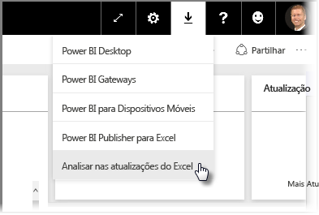
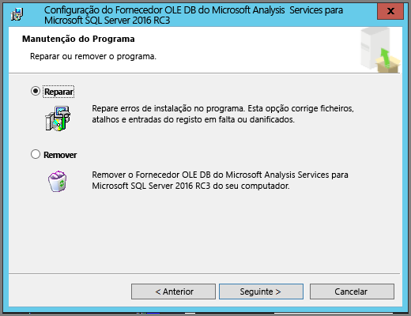
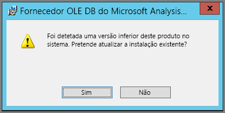

# Resolução de Problemas de Analyze Excel

Por vezes, quando utiliza a funcionalidade Analyze in Excel, esta poderá não funcionar conforme esperado ou pode devolver resultados inesperados. Esta página apresenta soluções para problemas comuns quando utiliza Analyze in Excel.

> [!NOTE]
> Existe uma página dedicada em separado para descrever e ativar a funcionalidade [Analyze in Excel](service-analyze-in-excel.md).
> 
> Se encontrar um cenário que não esteja listado abaixo, e que esteja a causar problemas, peça ajuda no [site da comunidade](https://community.powerbi.com/) ou crie um [pedido de suporte](https://powerbi.microsoft.com/support/).
> 
> 

Este artigo contém as seguintes secções de resolução de problemas:

* Atualizar bibliotecas do Excel para o fornecedor de OLE DB
* Determinar se é preciso atualizar as suas bibliotecas do Excel
* Erro de falha de ligação
* Erro de proibição
* Não existem modelos de dados
* Erro de token expirado
* Não pode aceder ao Analysis Services no local
* Não pode arrastar nada para a área de Valores de Tabela Dinâmica (sem medidas)

## Atualizar bibliotecas do Excel para o fornecedor de OLE DB
Para utilizar **Analyze in Excel**, o computador tem de ter um fornecedor de AS OLE DB atual instalado. Esta [publicação da comunidade](https://community.powerbi.com/t5/Service/Analyze-in-Excel-Initialization-of-the-data-source-failed/m-p/30837#M8081) é uma excelente origem para verificar a sua instalação do fornecedor de OLE DB ou para transferir uma versão recente.

As bibliotecas do Excel têm de corresponder à sua versão do Windows em termos do respetivo nível de bits. Se tiver o Windows de 64 bits instalado, terá de instalar o fornecedor de OLE DB de 64 bits.

Para transferir as bibliotecas mais recentes do Excel, visite o Power BI e selecione a **seta para baixo**, no canto superior direito do serviço Power BI, e selecione as **atualizações de Analyse in Excel**.

Na caixa de diálogo apresentada, selecione **Transferir (pré-visualização)** .

## Determinar se é preciso atualizar as suas bibliotecas do Excel
Pode transferir a versão mais recente das bibliotecas de fornecedor de Excel OLE DB a partir das ligações na secção anterior. Depois de transferir a biblioteca de fornecedor de OLE DB adequada e iniciar a instalação, são executadas verificações contra a sua versão atual instalada.

Se as bibliotecas de fornecedor de Excel OLE DB estiverem atualizadas, será apresentada uma caixa de diálogo semelhante à seguinte:

Em alternativa, se a nova versão que está a instalar for mais recente que a versão no seu computador, é apresentada a caixa de diálogo seguinte:

Se vir a caixa de diálogo a pedir-lhe para atualizar, deve continuar com a instalação para obter a versão mais recente do fornecedor de OLE DB instalado no seu computador.

## Erro de falha de ligação
A causa principal para um erro de *falha ao ligar* é as bibliotecas de cliente do fornecedor de OLE DB do seu computador não estarem atualizadas. Para obter informações sobre como determinar a atualização correta e para obter ligações de transferência, veja **Atualizar bibliotecas do Excel para o fornecedor de OLE DB)** , mencionadas anteriormente neste artigo.

## Erro de proibição
Alguns utilizadores têm mais do que uma conta do Power BI e, quando o Excel tenta ligar ao Power BI com credenciais existentes, pode utilizar as credenciais que não têm acesso ao conjunto de dados ou relatório que pretende aceder.

Se isto ocorrer, poderá receber um erro intitulado **Proibido**, que significa que pode ter sessão iniciada no Power BI com credenciais que não têm permissões para o conjunto de dados. Depois de encontrar o erro **proibido**, quando lhe for pedido para introduzir as suas credenciais, utilize as credenciais que têm permissão para aceder ao conjunto de dados que está a tentar utilizar.

Caso ainda se depare com erros, inicie sessão no Power BI com a conta que tem permissão e certifique-se de que pode ver e aceder ao conjunto de dados no Power BI que está a tentar aceder no Excel.

## Não existem modelos de dados
Se ocorrer um erro que indica **Não é possível encontrar o modelo de cubo do OLAP**, então o conjunto de dados que está a tentar aceder não tem nenhum modelo de dados e, por conseguinte, não pode ser analisado no Excel.

## Erro de token expirado
Se receber um erro de **token expirado**, significa que não utilizou recentemente a funcionalidade **Analyze no Excel** no computador que está a utilizar. Basta voltar a introduzir as credenciais ou reabrir o ficheiro e o erro deve desaparecer.

## Não pode aceder ao Analysis Services no local
Se estiver a tentar aceder a um conjunto de dados que tem ligações a dados do Analysis Services no local, poderá receber uma mensagem de erro. A funcionalidade **Analyze in Excel** suporta a ligação a conjuntos de dados e relatórios do **Analysis Services** no local com uma cadeia de ligação, desde que o seu computador esteja no mesmo domínio que o servidor do **Analysis Services** e a sua conta tenha acesso ao servidor do **Analysis Services**.

## Não pode arrastar nada para a área de Valores de Tabela Dinâmica (sem medidas)
Quando a funcionalidade **Analisar no Excel** se ligar a um modelo OLAP externo (que é a forma como o Excel se liga ao Power BI), a *Tabela Dinâmica* [precisará que as **medidas** sejam definidas no modelo externo](https://support.microsoft.com/kb/234700), uma vez que todos os cálculos são realizados no servidor. Isto é diferente de quando trabalha com uma origem de dados local (como tabelas no Excel ou quando está a trabalhar com conjuntos de dados no **Power BI Desktop** ou no **serviço Power BI**), caso em que o modelo tabular está disponível localmente, e [pode utilizar medidas implícitas](https://support.microsoft.com/en-us/office/measures-in-power-pivot-86484821-a324-4da3-803b-82fd2e5033f4), que são medidas que são geradas dinamicamente e não são armazenadas no modelo de dados. Nestes casos, o comportamento no Excel é diferente do comportamento no **Power BI Desktop** ou no **serviço Power BI**: poderão existir colunas nos dados que podem ser tratados como medidas no Power BI, mas não podem ser utilizadas como valores (medidas) no Excel.

Para resolver este problema, tem algumas opções:

1. Criar [medidas no seu modelo de dados no **Power BI Desktop**](../transform-model/desktop-tutorial-create-measures.md) e, em seguida, publicar o modelo de dados no **serviço Power BI** e aceder a esse conjunto de dados publicado a partir do Excel.
2. Criar [medidas no seu modelo de dados do Excel PowerPivot](https://support.office.com/article/Create-a-Measure-in-Power-Pivot-d3cc1495-b4e5-48e7-ba98-163022a71198).
3. Se importar dados a partir de um livro do Excel que tinha apenas tabelas (e nenhum modelo de dados), então pode [adicionar as tabelas ao modelo de dados](https://support.office.com/article/Add-worksheet-data-to-a-Data-Model-using-a-linked-table-d3665fc3-99b0-479d-ba09-a37640f5be42) e, em seguida, seguir os passos na opção 2, diretamente acima, para criar medidas no seu modelo de dados.

Assim que as medidas estiverem definidas no modelo do serviço Power BI, poderá utilizá-las na área **Valores** nas tabelas dinâmicas do Excel.

## Próximas etapas
[Analisar no Excel](service-analyze-in-excel.md)

[Tutorial: Create your own measures in Power BI Desktop](../transform-model/desktop-tutorial-create-measures.md) (Tutorial: criar as suas próprias medidas no Power BI Desktop)

[Medidas no PowerPivot](https://support.microsoft.com/en-us/office/measures-in-power-pivot-86484821-a324-4da3-803b-82fd2e5033f4)

[Crie uma Medida no PowerPivot](https://support.office.com/article/Create-a-Measure-in-Power-Pivot-d3cc1495-b4e5-48e7-ba98-163022a71198)

[Adicionar dados de folha de cálculo a um Modelo de Dados através de uma tabela ligada](https://support.office.com/article/Add-worksheet-data-to-a-Data-Model-using-a-linked-table-d3665fc3-99b0-479d-ba09-a37640f5be42)
