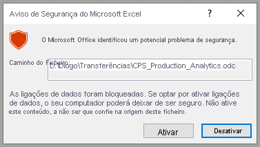

# Analisar no Excel
Com a opção **Analisar no Excel**, pode mover conjuntos de dados do Power BI para o Excel e, em seguida, visualizar e interagir com os mesmos com Tabelas Dinâmicas, gráficos, segmentações de dados, bem como outras funcionalidades do Excel. Para utilizar **Analisar no Excel**, deve primeiro transferir a funcionalidade do Power BI, instalá-la e, em seguida, selecionar um ou mais conjuntos de dados para utilizar no Excel. 

Este artigo mostra-lhe como instalar e utilizar Analisar no Excel, descreve as suas limitações e, em seguida, apresenta alguns passos seguintes. Ficará a saber o seguinte:

* [Instalar a opção Analisar no Excel](#install-analyze-in-excel)
* [Ligar aos dados do Power BI](#connect-to-power-bi-data)
* [Utilizar o Excel para analisar os dados](#use-excel-to-analyze-the-data)
* [Guardar e partilhar o livro](#saving-and-sharing-your-new-workbook)
* [Requisitos](#requirements)

Vamos começar e iniciar o processo de instalação.

## Instalar a opção Analisar no Excel

Tem de instalar a opção **Analisar no Excel** a partir das ligações disponibilizadas no serviço Power BI. O Power BI deteta a versão do Excel presente no computador e transfere automaticamente a versão apropriada (32 ou 64 bits). O serviço Power BI é executado num browser. Pode iniciar sessão no Power BI com a ligação seguinte:

* [Inicie sessão no Power BI](https://app.powerbi.com)

Depois de ter iniciado sessão e o serviço Power BI em execução no browser, selecione o item **Mais opções** (as ...) no canto superior direito e, em seguida, selecione **Transferir > Atualizações de Analisar no Excel**. Este item do menu aplica-se às novas instalações das atualizações de Analisar no Excel.

Em alternativa, pode navegar no serviço Power BI para um conjunto de dados que queira analisar e selecionar o item **Mais opções** para um conjunto de dados, relatório ou outro item do Power BI. No menu apresentado, selecione a opção **Analisar no Excel**, conforme mostrado na seguinte imagem.

De qualquer forma, o Power BI deteta se tem a opção Analisar no Excel instalada e, se não tiver, é-lhe pedido que a transfira. 

Quando seleciona a transferência, o Power BI deteta a versão do Excel que instalou e transfere a versão adequada do instalador de Analisar no Excel. Vê o estado da transferência na parte inferior do browser ou onde quer que o browser apresente o progresso da transferência. 

Quando a transferência estiver concluída, execute o instalador (.msi) para instalar Analisar no Excel. O nome do processo de instalação é diferente de Analisar no Excel; o nome será **Fornecedor OLE DB do Microsoft Analysis Services**, conforme mostrado na imagem seguinte, ou algo semelhante.

Depois de concluída, estará pronto para selecionar um relatório no serviço Power BI (ou outro elemento de dados do Power BI, como um conjunto de dados) e pata o analisar no Excel.

## Ligar aos dados do Power BI

No serviço Power BI, navegue para o conjunto de dados ou o relatório que quer analisar no Excel e selecione o menu **Mais opções** (as ...) para encontrar a opção de menu **Analisar no Excel**. A imagem seguinte mostra a seleção de um relatório.

Existem alguns passos para mover um conjunto de dados do serviço Power BI para o Excel:

1. Selecione o menu **Mais opções**.
2. Selecione **Analisar no Excel** nos itens de menu apresentados.

    Em seguida, o serviço Power BI cria um ficheiro do conjunto de dados concebido (e estruturado) para utilização com a opção **Analisar no Excel**, que possui a extensão de ficheiro .ODC. O ficheiro é criado e, em seguida, inicia automaticamente um processo de transferência no browser.
    
    
    
    O nome do ficheiro corresponde ao conjunto de dados (ou relatório ou outra origem de dados) a partir do qual foi derivado. Assim, se o relatório se chamar *Latest-Sales*, o ficheiro transferido será **Latest-Sales.ODC**.

3. Abra o ficheiro .ODC.

O ficheiro já está associado a **Analisar no Excel**. Assim, quando selecionar ou iniciar esse ficheiro .ODC, o Excel será iniciado e começará automaticamente o carregamento do ficheiro .ODC. No entanto, é provável que veja um aviso a alertar sobre uma ameaça externa da origem de dados:

Selecione **Ativar** para carregar o ficheiro .ODC para **Analisar no Excel** e o Excel carrega o ficheiro. 

## Utilizar o Excel para analisar os dados

Assim que permitir o carregamento do ficheiro .ODC ao selecionar **Ativar** no Aviso de Segurança, o Excel apresenta-lhe uma lista vazia de **Tabelas Dinâmicas** e **Campos** do conjunto de dados do Power BI, pronta a ser analisada.

O ficheiro .ODC tem uma cadeia de ligação MSOLAP que liga ao seu conjunto de dados no Power BI. Ao analisar ou trabalhar com os dados, o Excel consulta esse conjunto de dados no Power BI e devolve os resultados no Excel. Se esse conjunto de dados ligar a uma origem de dados dinâmicos com o DirectQuery, o Power BI consulta a origem de dados e devolve o resultado no Excel.

Com esta ligação aos dados no Power BI agora estabelecida, pode criar Tabelas Dinâmicas, gráficos e analisar esse conjunto de dados tal como faria com um conjunto de dados local no Excel.

**Analisar no Excel** é especialmente útil para conjuntos de dados e relatórios que se ligam às seguintes origens de dados:

* Bases de dados *Multidimensionais* ou em *Tabela do Analysis Services*
* Ficheiros do Power BI Desktop ou livros do Excel com modelos de dados com medidas de modelo criadas com a linguagem DAX (Data Analysis Expressions).

> [!IMPORTANT]
> Ao utilizar **Analisar no Excel**, expõe todos os dados detalhados a todos os utilizadores que tenham permissão para aceder ao conjunto de dados.

Há algumas coisas a ter em conta quando começar a utilizara opção Analisar no Excel, o que pode requerer um ou dois passos adicionais para fazer a reconciliação. Estas possibilidades são descritas nas secções seguintes. 

### Iniciar sessão no Power BI
Embora tenha sessão iniciada no Power BI no seu browser, a primeira vez que abre um novo ficheiro .ODC no Excel pode ser-lhe pedido que inicie sessão no Power BI com a sua conta do Power BI. Esta ação autentica a ligação do Excel ao Power BI.

### Utilizadores com várias contas do Power BI
Alguns utilizadores têm várias contas do Power BI. Se for o seu caso, poderá ter iniciado sessão no Power BI com uma conta, mas a outra conta tem acesso ao conjunto de dados que está a ser utilizado em Analisar no Excel. Neste caso, pode ver um erro **Proibido** ou uma falha no início de sessão quando tentar aceder a um conjunto de dados que está a ser utilizado num livro Analisar no Excel.

Se isso acontecer, terá a oportunidade de iniciar sessão novamente e, nesta altura, poderá iniciar sessão com a conta do Power BI que tem acesso ao conjunto de dados que está a ser acedido pela opção Analisar no Excel. Também pode selecionar o nome no friso superior no Excel, que identifica em que conta tem atualmente sessão iniciada. Termine a sessão volte a iniciar com a outra conta.

## Guardar e partilhar o novo livro

Pode **Guardar** o livro do Excel que cria com o conjunto de dados do Power BI, tal como qualquer outro livro. No entanto, não pode publicar ou importar o livro novamente para o Power BI porque apenas pode publicar ou importar livros para o Power BI que tenham dados em tabelas ou que tenham um modelo de dados. Uma vez que o novo livro tem apenas uma ligação para o conjunto de dados no Power BI, a publicação ou importação do mesmo para o Power BI entraria em círculo!

Quando o livro for guardado, pode partilhá-lo com outros utilizadores do Power BI na sua organização. 

Quando um utilizador com quem partilhou o livro o abrir, verá as Tabelas Dinâmicas e os dados tal como apareceram quando o livro foi guardado pela última vez, que poderá não ser a versão mais recente dos dados. Para obterem os dados mais recentes, os utilizadores terão de utilizar o botão **Atualizar** no friso de **Dados**. E, uma vez que o livro está a ligar a um conjunto de dados no Power BI, os utilizadores que tentarem atualizar o livro têm de iniciar sessão no Power BI e instalar as atualizações do Excel da primeira vez que tentarem atualizar com este método.

Como os utilizadores precisam de atualizar o conjunto de dados, e a atualização para ligações externas não é suportada no Excel Online, é recomendado que os utilizadores abram o livro na versão de ambiente de trabalho do Excel no computador.

> [!NOTE]
> Os administradores de inquilinos do Power BI podem utilizar o *Portal de Administração do Power BI* para desativar a utilização de **Analisar no Excel** com conjuntos de dados no local alojados em bases de dados dos Analysis Services (AS). Quando esta opção está desativada, a funcionalidade **Analisar no Excel** está desativada para bases de dados AS, mas continua a estar disponível para utilização com outros conjuntos de dados.

## Outras formas de aceder aos conjuntos de dados do Power BI a partir do Excel
Os utilizadores com SKUs do Office específicos também podem ligar-se aos conjuntos de dados do Power BI a partir do Excel com a funcionalidade **Obter Dados** no Excel. Se o SKU não suportar esta funcionalidade, a opção de menu **Obter Dados** não será apresentada.

No menu do friso **Dados**, selecione **Obter Dados > A partir do conjunto de dados do Power BI**, conforme mostrado na imagem seguinte.

Aparece um painel, no qual pode navegar pelos conjuntos de dados aos quais tem acesso, ver se os conjuntos de dados são certificados ou promovidos e determinar se as etiquetas de proteção de dados foram aplicadas a esses conjuntos de dados. 

Para obter mais informações sobre a obtenção de dados no Excel desta forma, veja [Criar uma Tabela Dinâmica a partir de conjuntos de dados do Power BI](https://support.office.com/article/31444a04-9c38-4dd7-9a45-22848c666884) na documentação do Excel.

Também pode aceder às **tabelas em destaque** no Excel, na galeria **Tipos de Dados**. Para saber mais sobre as tabelas em destaque e como aceder às mesmas, veja [Aceder às tabelas em destaque do Power BI no Excel (pré-visualização)](service-excel-featured-tables.md).

## Requirements
Existem alguns requisitos para utilizar a opção **Analisar no Excel**:

* A opção **Analisar no Excel** é suportada no Microsoft Excel 2010 SP1 e posterior.

* As Tabelas Dinâmicas do Excel não suportam a agregação do tipo "arrastar e largar" dos campos numéricos. O seu conjunto de dados no Power BI *tem de ter medidas predefinidas*. Saiba mais sobre a [criação de medidas](../transform-model/desktop-measures.md).
* Algumas empresas podem ter regras de Política de Grupo que impedem a instalação das atualizações necessárias da funcionalidade **Analisar no Excel** no Excel. Se não conseguir instalar as atualizações, consulte o seu administrador.
* A funcionalidade **Analisar no Excel** necessita que o conjunto de dados esteja no Power BI Premium ou que o utilizador tenha uma licença do Power BI Pro. Para saber mais acerca das diferenças de funcionalidade entre os tipos de licença, veja a secção _Comparação das funcionalidades do Power BI_ na página [Preços do Power BI](https://powerbi.microsoft.com/pricing/).
* Os utilizadores podem ligar a conjuntos de dados através da funcionalidade Analisar no Excel, caso tenham permissão para o conjunto de dados subjacente.  Um utilizador pode obter esta permissão de várias formas, por exemplo: ao ter a função de Membro na área de trabalho que contém o conjunto de dados, ao ter um relatório ou dashboard partilhado que utilize o conjunto de dados, ou ao ter uma permissão de Compilação para o conjunto de dados numa área de trabalho ou numa aplicação que contenha o conjunto de dados. Saiba mais sobre as [Permissões de compilação](../connect-data/service-datasets-build-permissions.md) para conjuntos de dados.
* Os utilizadores não podem utilizar **Analisar no Excel** para conjuntos de dados enviados (com origem) de outro inquilino. 
* **Analisar no Excel** é uma funcionalidade do serviço Power BI e não está disponível no Microsoft Power BI Report Server nem no Power BI Embedded. 
* A funcionalidade **Analisar no Excel** só é suportada em computadores com o Microsoft Windows.

Para os utilizadores que precisam de desinstalar a funcionalidade **Analisar no Excel**, podem fazê-lo com a definições do sistema **Adicionar ou remover programas** no computador Windows.

## Resolução de problemas
Por vezes, quando utiliza a funcionalidade Analyze in Excel, esta poderá não funcionar conforme esperado ou pode devolver resultados inesperados. [Esta página apresenta soluções para problemas comuns ao utilizar Analisar no Excel](desktop-troubleshooting-analyze-in-excel.md).

## Próximos passos

Poderá também estar interessado nos seguintes artigos:

* [Utilizar a pormenorização de relatório cruzado no Power BI Desktop](../create-reports/desktop-cross-report-drill-through.md)
* [Utilizar a segmentação de dados no Power BI Desktop](../visuals/power-bi-visualization-slicers.md)
* [Resolução de Problemas de Análise no Excel](desktop-troubleshooting-analyze-in-excel.md)
* [Aceder às tabelas em destaque do Power BI no Excel (pré-visualização)](service-excel-featured-tables.md).

