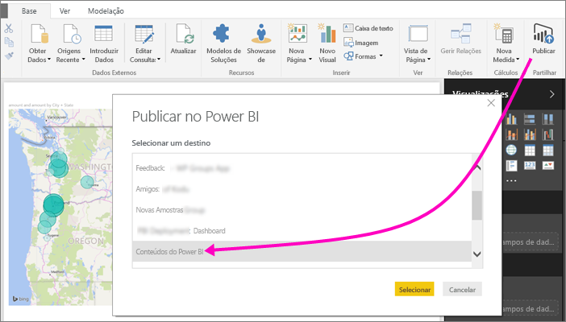
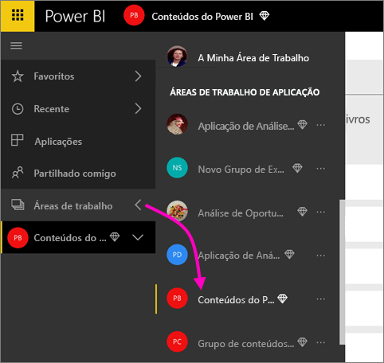
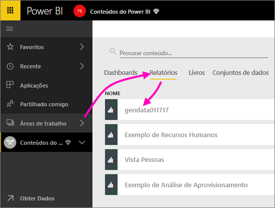
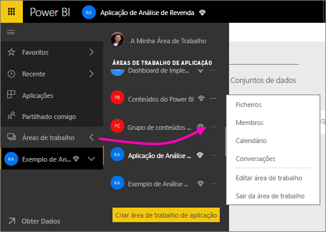
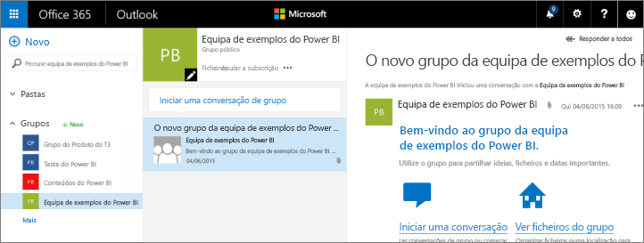
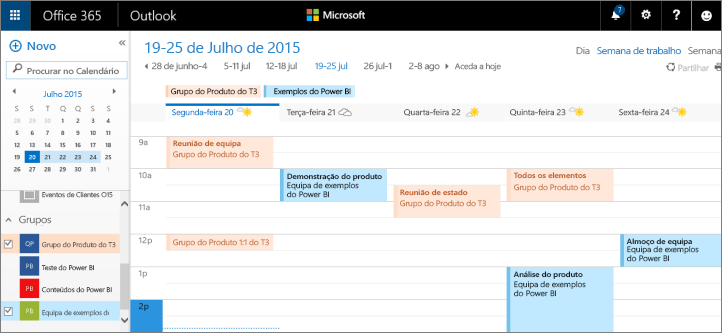

# Collaborate in a classic workspace (Colaborar numa área de trabalho clássica)
As áreas de trabalho do Power BI são locais excelentes para colaborar com os seus colegas em dashboards, relatórios e conjuntos de dados para criar *aplicações*. Este artigo é sobre as áreas de trabalho *clássicas* originais.  

A colaboração não termina com as áreas de trabalho no Power BI. Quando cria uma das áreas de trabalho clássicas no Power BI, também cria automaticamente um grupo do Office 365 em segundo plano. O Office 365 fornece serviços de grupo como a partilha de ficheiros no OneDrive para Empresas, conversações no Exchange, tarefas, calendários partilhados, entre outros. Saiba mais sobre os [grupos no Office 365](https://support.office.com/article/Create-a-group-in-Office-365-7124dc4c-1de9-40d4-b096-e8add19209e9).

> [!NOTE]
> A nova experiência de área de trabalho muda a relação entre as áreas de trabalho do Power BI e os grupos do Office 365. Quando cria uma das novas áreas de trabalho no Power BI, já não cria automaticamente um grupo do Office 365 em segundo plano. Para obter mais informações, veja [Criar as novas áreas de trabalho no Power BI](service-create-the-new-workspaces.md).

É necessária uma [licença do Power BI Pro](../fundamentals/service-features-license-type.md) para criar uma área de trabalho.

## Colaborar em ficheiros do Power BI Desktop numa área de trabalho
Após criar um ficheiro do Power BI Desktop, pode publicá-lo numa área de trabalho, para que todas as pessoas na mesma possam colaborar neste.

1. No Power BI Desktop, selecione **Publicar** no friso **Home Page** e, em seguida, selecione a área de trabalho na caixa **Selecionar um destino**.
   
    
2. No serviço Power BI, selecione a seta junto a **Áreas de trabalho** > selecione a área de trabalho.
   
    
3. Selecione o separador **Relatórios** e, em seguida, escolha o seu relatório.
   
    
   
    A partir daqui, funciona como qualquer outro relatório no Power BI. Tanto o utilizador como outras pessoas na área de trabalho podem modificar o relatório e guardar mosaicos num dashboard à escolha.

## Colaborar no Office 365
A colaboração no Office 365 começa a partir da área de trabalho clássica no Power BI.

1. No serviço Power BI, selecione a seta junto a **Áreas de trabalho** > selecione **Mais opções** (…) junto ao nome da sua área de trabalho. 
   
   
2. Neste menu, pode colaborar com o seu grupo de diversas formas: 
   
   * Tenha uma [conversa em grupo no Office 365](#have-a-group-conversation-in-office-365).
   * [Agendar um evento](#schedule-an-event-on-the-group-workspace-calendar) no calendário da área de trabalho de grupo.
   
   Da primeira vez que aceder à área de trabalho de grupo no Office 365, esta poderá demorar algum tempo a ser apresentada. Aguarde entre 15 a 30 minutos e, em seguida, atualize o browser.

## Ter uma conversa em grupo no Office 365
1. Selecione **Mais opções** (...) junto ao nome da sua área de trabalho \> **Conversações**. 
   
    
   
   O site de conversações e e-mails da área de trabalho de grupo é aberto no Outlook para Office 365.
   
   
2. Saiba mais sobre as [conversas de grupo no Outlook para Office 365](https://support.office.com/Article/Have-a-group-conversation-a0482e24-a769-4e39-a5ba-a7c56e828b22).

## Agendar um evento no calendário da área de trabalho de grupo
1. Selecione **Mais opções** (...) junto ao nome da área de trabalho \> **Calendário**. 
   
   
   
   O calendário da área de trabalho de grupo é aberto no Outlook para Office 365.
   
   
2. Leia mais sobre os [calendários de grupo no Outlook no Office 365](https://support.office.com/Article/Add-edit-and-subscribe-to-group-events-0cf1ad68-1034-4306-b367-d75e9818376a).

## Gerir uma área de trabalho clássica
Se for o proprietário ou administrador de uma área de trabalho, também pode remover ou adicionar membros à mesma. Leia mais sobre a [gestão de uma área de trabalho do Power BI](service-manage-app-workspace-in-power-bi-and-office-365.md).

## Próximos passos
* [Publique aplicações no Power BI](service-create-distribute-apps.md).
* Mais perguntas? [Experimente a Comunidade do Power BI](https://community.powerbi.com/).
* Comentários? Aceda a [Power BI Ideas](https://ideas.powerbi.com/forums/265200-power-bi).
